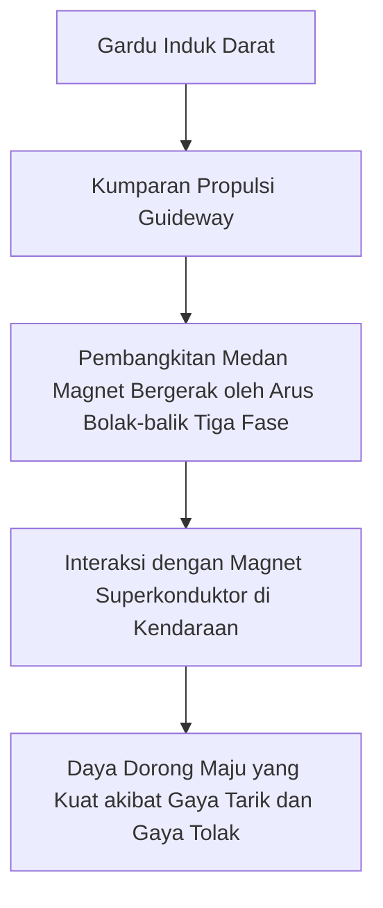
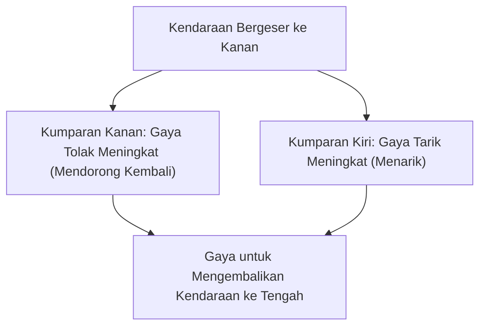

## Pengantar: Menuju Dunia Kecepatan 500 km/jam

Kereta linear motor (kereta levitasi magnetik, Maglev) adalah sistem transportasi generasi berikutnya yang secara fundamental berbeda dari teknologi perkeretaapian tradisional yang bergantung pada gesekan antara roda dan rel. Di Jepang, kereta ini dikenal sebagai "Superconducting Maglev" (Maglev Superkonduktor), dan melaju di atas tanah dengan kecepatan luar biasa yang mencapai lebih dari 500 km/jam. Kecepatan ini mungkin lebih tepat disebut "terbang rendah" daripada "berlari".

Artikel ini akan menjelaskan secara mendalam dan terperinci bagaimana kendaraan inovatif ini dapat mengambang dan melaju dengan kecepatan tinggi, serta mekanisme fisika dan rekayasa di baliknya.

## Superkonduktivitas dan Efek Meissner: Sumber Gaya Magnet yang Magis

Di jantung kereta Maglev terdapat "Magnet Superkonduktor" (Superconducting Magnet). Superkonduktivitas adalah fenomena di mana hambatan listrik menjadi benar-benar nol ketika logam atau paduan tertentu didinginkan hingga suhu yang sangat rendah (misalnya, minus 269 derajat Celcius menggunakan helium cair).

Hambatan listrik nol berarti bahwa setelah arus listrik dialirkan, ia akan memasuki keadaan "arus persisten" di mana arus terus mengalir tanpa batas bahkan tanpa pasokan energi dari luar. Hal ini memungkinkan terciptanya medan magnet yang jauh lebih kuat daripada elektromagnet konvensional, tanpa kehilangan energi akibat panas Joule.

Selain itu, karakteristik penting lainnya dari keadaan superkonduktor adalah "Efek Meissner" (Meissner effect). Ini adalah fenomena di mana garis-garis gaya magnet sepenuhnya ditolak dari dalam superkonduktor, sehingga superkonduktor menghasilkan gaya tolak yang kuat terhadap magnet. Untuk melayangkan kereta Maglev, terdapat metode yang menggunakan efek Meissner itu sendiri (seperti efek pemakuan) dan metode yang menggunakan gaya tolak induksi yang dihasilkan antara elektromagnet superkonduktor kuat dengan kumparan di tanah (metode Maglev Superkonduktor Jepang). Dalam metode Jepang, magnet superkonduktor dengan kepadatan fluks magnetik yang luar biasa memainkan peran yang sangat penting dalam levitasi, panduan, dan propulsi kendaraan.

## Mekanisme Propulsi: Linear Synchronous Motor (LSM)

Mekanisme yang membuat kereta Maglev bergerak maju berasal dari namanya, "Motor Linear" (motor listrik linear). Sementara motor konvensional menghasilkan gerak rotasi, motor linear memiliki struktur yang seperti memotong dan membuka gulungan motor menjadi garis lurus, sehingga menghasilkan gerak lurus langsung (daya dorong).

Maglev superkonduktor menggunakan metode yang disebut "Linear Synchronous Motor" (LSM).

Di dinding samping sisi tanah (guideway), "kumparan propulsi" dijejerkan berurutan. Ketika arus bolak-balik tiga fase dialirkan ke kumparan ini dari gardu induk di darat, dihasilkan "medan magnet bergerak" di mana kutub utara (U) dan kutub selatan (S) bergerak secara terus-menerus.

Di sisi lain, magnet superkonduktor yang kuat (yang selalu memiliki kutub U dan S yang konstan) dipasang pada kendaraan. Kutub U kendaraan ditarik oleh kutub S dari medan magnet bergerak di tanah, dan pada saat yang sama ditolak oleh kutub U yang berada di depannya. Dengan mengontrol kecepatan pergerakan medan magnet di tanah, kendaraan ditarik secara sinkron seolah-olah mengendarai gelombang medan magnet tersebut, mendapatkan daya dorong, dan bergerak maju.

Keuntungan terbesar dari sistem ini adalah bahwa bagian yang setara dengan "stator" motor berada di tanah, sedangkan kendaraan hanya memiliki magnet kuat yang setara dengan "rotor". Hal ini memungkinkan kendaraan menjadi sangat ringan, sehingga secara dramatis meningkatkan efisiensi energi dan kinerja akselerasi saat melaju pada kecepatan tinggi.

## Levitasi dan Panduan: Tolakan Induksi dan "Kumparan Angka 8"

Agar kereta Maglev dapat melaju dengan kecepatan 500 km/jam, ia harus mengangkat roda-rodanya yang merupakan penyebab utama gesekan. Maglev superkonduktor Jepang menggunakan "Electrodynamic Suspension (EDS)" yang memanfaatkan hukum induksi elektromagnetik (hukum Faraday dan hukum Lenz).

Di dinding samping guideway, selain kumparan propulsi, dipasang kumparan berbentuk "angka 8" unik yang disebut "kumparan levitasi dan panduan". Saat kendaraan berada pada kecepatan rendah, ia berjalan menggunakan ban karet, namun saat kecepatan meningkat, magnet superkonduktor kendaraan melewati kumparan angka 8 dengan kecepatan luar biasa.

Saat magnet mendekati dan melewati kumparan, fluks magnetik yang menembus kumparan berubah secara drastis. Melalui induksi elektromagnetik, arus induksi mengalir melalui kumparan ke arah yang menentang perubahan fluks magnetik (hukum Lenz). Arus induksi ini menciptakan medan magnet yang tolak-menolak dengan magnet superkonduktor pada kendaraan, sehingga menghasilkan "gaya angkat". Saat kecepatan mencapai sekitar 150 km/jam, gaya tolak ini melebihi berat kendaraan, dan kereta akan sepenuhnya mengambang dengan jarak bebas sekitar 10 cm.

### Alasan Tidak Menabrak Dinding Guideway (Prinsip Panduan)

Ada alasan penting mengapa kumparan levitasi dan panduan berbentuk "angka 8". Hal ini untuk menghasilkan "gaya panduan" (guidance force) yang menjaga kendaraan tetap berada di tengah guideway setiap saat.

Kumparan angka 8 memiliki loop atas dan loop bawah yang dihubungkan secara menyilang. Ketika kendaraan berjalan tepat di tengah guideway (posisi ideal dari segi vertikal dan horizontal), jumlah fluks magnetik yang menembus bagian atas dan bawah kumparan angka 8 adalah sama, sehingga arus induksi saling meniadakan dan menjadi nol (keadaan null-flux).

Namun, jika kendaraan bergeser ke kiri atau kanan, jarak ke kumparan di dinding samping kiri dan kanan akan berubah, sehingga mengganggu keseimbangan arus induksi. Gaya tolak (mendorong kembali) bekerja pada kumparan di sisi yang mendekat, dan gaya tarik (menarik ke arahnya) bekerja pada kumparan di sisi yang menjauh. Berkat gaya pemulih yang kuat ini, kereta Maglev dapat selalu "terbang" dengan stabil di tengah lintasan tanpa pernah menabrak dinding samping.

## Keuntungan "Nol Gesekan" karena Tidak Memiliki Roda

Fakta bahwa kereta Maglev tidak memiliki roda dan rel membawa banyak keuntungan inovatif yang lebih dari sekadar peningkatan kecepatan.

1.  **Performa Kecepatan Tinggi yang Luar Biasa**: Kereta api konvensional bergantung pada gaya adhesi (gesekan) antara roda dan rel untuk mempercepat dan memperlambat. Ini disebut "batas adhesi", dan secara fisik batasnya berada di sekitar kecepatan 300–350 km/jam. Kereta Maglev sepenuhnya terbebas dari kendala ini, sehingga dapat dengan mudah mencapai kecepatan lebih dari 500 km/jam.
2.  **Peningkatan Kenyamanan Berkendara serta Pengurangan Kebisingan dan Getaran**: Karena tidak ada kontak dengan rel, tidak ada getaran fisik atau suara putaran roda selama perjalanan (meskipun masih ada hambatan udara dan suara angin akibat kecepatan tinggi). Selain itu, tidak ada guncangan akibat ketidakrataan mikro pada rel, sehingga memberikan kenyamanan berkendara yang mulus layaknya pesawat terbang.
3.  **Kemampuan Menangani Tanjakan Curam**: Karena daya dorong tidak bergantung pada gesekan, kemampuannya untuk mendaki tanjakan sangat tinggi, sehingga memungkinkan desain rute dengan tanjakan curam yang tidak mungkin dilakukan pada kereta api konvensional. Hal ini memungkinkan pembuatan rute terowongan lurus yang menembus daerah pegunungan.
4.  **Pengurangan Perawatan yang Drastis**: Tidak ada bagian yang aus, seperti rel, roda, pantograf, dan kabel udara. Karena tidak ada keausan mekanis, frekuensi penggantian suku cadang dan pekerjaan perbaikan serta inspeksi infrastruktur berkurang secara signifikan, yang memberikan keuntungan dalam hal biaya operasional jangka panjang.

## Hambatan Teknis menuju Komersialisasi dan Tantangan di Masa Depan

Namun demikian, masih banyak hambatan teknis dan ekonomi yang harus diatasi untuk komersialisasi dan penyebaran kereta Maglev.

*   **Mempertahankan Pendinginan Kriogenik**: Saat menggunakan bahan superkonduktor seperti paduan niobium-titanium, ia harus didinginkan secara konstan hingga mendekati minus 269 derajat Celcius, dan kendaraan harus dilengkapi dengan helium cair yang mahal serta mesin pendingin canggih. Dalam beberapa tahun terakhir, penelitian mengenai penerapan bahan superkonduktor suhu tinggi yang menjadi superkonduktif pada suhu nitrogen cair (minus 196 derajat Celcius) telah mengalami kemajuan, namun penerapannya pada sistem skala besar yang praktis masih dalam pengembangan.
*   **Biaya Konstruksi Infrastruktur yang Sangat Besar**: Bertolak belakang dengan ringannya kendaraan, infrastruktur guideway di tanah memerlukan pemasangan kumparan propulsi serta kumparan levitasi dan panduan yang tak terhitung jumlahnya dengan presisi tinggi di sepanjang garis. Selain itu, fasilitas gardu induk juga diperlukan pada jarak yang dekat untuk mengontrol medan magnet yang kuat, dan biaya konstruksi infrastruktur awal diperkirakan mencapai beberapa kali lipat dari kereta api berkecepatan tinggi konvensional.
*   **Konsumsi Energi dan Hambatan Udara**: Di ranah kecepatan hipersonik 500 km/jam, hambatan udara meningkat drastis sebanding dengan kuadrat kecepatan. Meskipun tidak ada gesekan, konsumsi energi untuk menembus dinding udara sangatlah besar, dan mengurangi dampak lingkungan serta meningkatkan efisiensi energi merupakan tantangan utama.
*   **Tindakan Penanggulangan Kebocoran Medan Magnet**: Karena penggunaan magnet superkonduktor yang kuat, teknologi yang secara ketat melindungi dari kebocoran medan magnet ke dalam gerbong dan lingkungan sekitarnya sangatlah penting. Kendaraan dilengkapi dengan pelindung magnetik yang ketat untuk mencegah dampak terhadap alat kesehatan dan keselamatan penumpang.

## Kesimpulan: Bentuk Ultimate dari Mobilitas Generasi Berikutnya

Kereta Maglev adalah pencapaian monumental dari rekayasa manusia yang menerapkan fenomena mekanika kuantum, yakni superkonduktivitas, pada infrastruktur transportasi makro. Mekanismenya yang sederhana sekaligus paripurna, yaitu "mengambang dengan gaya magnet, maju dengan gaya magnet", telah menembus batas gesekan fisik dan menyajikan dimensi mobilitas yang sama sekali baru bagi kita.

Hambatan menuju komersialisasi, seperti biaya konstruksi dan masalah energi, tidaklah rendah. Namun, kecepatan dan potensi yang luar biasa ini memiliki kekuatan untuk mengubah secara mendasar bagaimana kota dan negara terhubung. Seiring dengan evolusi teknologi superkonduktor, kereta Maglev dengan mantap mengambil langkah maju dari sekadar kendaraan impian menjadi sarana transportasi harian di masa depan.
