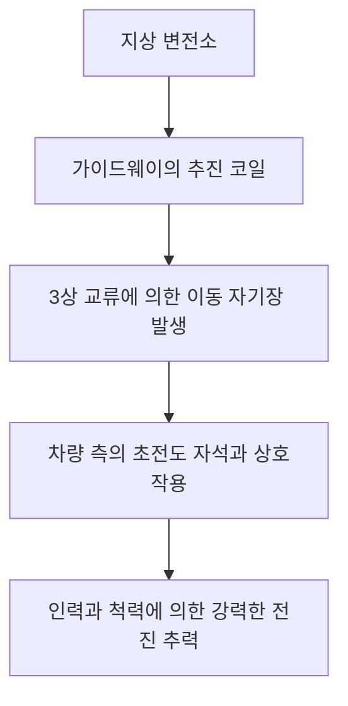
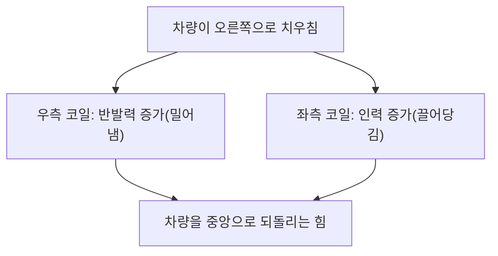

## 시작하며: 시속 500km의 세계로

자기부상열차(리니어 모터카, Maglev)는 기존의 바퀴와 레일 사이의 마찰에 의존하는 철도 기술과는 근본적으로 다른 차세대 교통 시스템입니다. 일본에서는 '초전도 리니어'로 알려져 있으며, 최고 시속 500km 이상이라는 경이적인 속도로 지상을 내달립니다. 이 속도는 이제 '달린다'기보다 '저공 비행한다'고 말하는 편이 더 정확할지도 모릅니다.

본 기사에서는 이 혁신적인 탈것이 어떻게 떠오르고, 또 어떻게 맹렬한 속도로 나아가는지 그 이면에 있는 물리학과 엔지니어링의 정수를 모은 메커니즘을 가능한 한 깊고 상세하게 해설해 나갈 것입니다.

## 초전도와 마이스너 효과: 마법 같은 자력의 원천

자기부상열차의 심장부에는 '초전도 자석(Superconducting Magnet)'이 탑재되어 있습니다. 초전도란 특정 금속이나 합금을 극저온(예를 들어, 액체 헬륨을 사용하여 영하 269도)까지 냉각하면 전기 저항이 완전히 0이 되는 현상을 말합니다.

전기 저항이 0이 된다는 것은 한 번 전류를 흘려보내면 외부에서 에너지를 공급하지 않아도 영구적으로 전류가 계속 흐르는 '영구 전류' 상태가 됨을 의미합니다. 이로 인해 기존의 전자석과는 비교가 안 될 정도로 강력한 자기장을 줄열(Joule heat)에 의한 에너지 손실 없이 발생시킬 수 있는 것입니다.

게다가 초전도 상태의 또 다른 중요한 특성이 '마이스너 효과(Meissner effect)'입니다. 이는 초전도체 내부에서 자기력선이 완전히 배제되는 현상으로, 이로 인해 초전도체는 자석에 대해 강력한 반발력을 만들어냅니다. 자기부상열차의 부상에는 이 마이스너 효과 자체를 이용하는 방식(핀닝 효과 등)과 강력한 초전도 전자석이 지상 코일과의 사이에서 만들어내는 유도 반발력을 이용하는 방식(일본의 초전도 리니어 방식)이 있습니다. 일본의 방식에서는 압도적인 자속 밀도를 가진 초전도 자석이 차량의 부상·안내·추진 모두에서 극히 중요한 역할을 담당하고 있습니다.

## 추진 메커니즘: 리니어 동기 모터(LSM)

자기부상열차가 전진하는 원리는 '리니어 모터(선형 전동기)'라는 이름에서 유래합니다. 기존의 모터가 회전 운동을 만들어내는 데 반해, 리니어 모터는 모터를 직선 모양으로 잘라 펼친 것과 같은 구조를 하고 있어 직접적인 직선 운동(추력)을 만들어냅니다.

초전도 리니어에서는 '리니어 동기 모터(Linear Synchronous Motor: LSM)'라는 방식이 채택되어 있습니다.

지상 측(가이드웨이)의 측벽에는 '추진 코일'이 길게 늘어서 있습니다. 이 코일에 지상의 변전소에서 3상 교류 전류를 흘리면, N극과 S극이 연속적으로 이동하는 '이동 자기장'이 발생합니다.

한편, 차량 측에는 강력한 초전도 자석(항상 일정한 N극과 S극을 가짐)이 탑재되어 있습니다. 차량의 N극은 지상의 이동 자기장의 S극에 끌리고, 동시에 전방의 N극으로부터 반발을 받습니다. 지상의 자기장 이동 속도를 조절함으로써 차량은 그 자기장의 파도를 타듯 동기화되어 끌어당겨지며, 추력을 얻어 전진하는 것입니다.

이 시스템의 가장 큰 장점은 모터의 '스테이터(고정자)'에 해당하는 부분이 지상 측에 있고, 차량 측은 '로터(회전자)'에 해당하는 강력한 자석만을 가지고 있다는 점입니다. 이를 통해 차량을 극도로 경량화하는 것이 가능해져, 고속 주행 시의 에너지 효율과 가속 성능이 비약적으로 향상됩니다.

## 부상과 안내: 유도 반발과 '8자형 코일'

자기부상열차가 시속 500km로 주행하기 위해서는 마찰의 큰 원인이 되는 바퀴를 띄워야만 합니다. 일본의 초전도 리니어에서는 전자기 유도의 법칙(패러데이의 법칙 및 렌츠의 법칙)을 이용한 '유도 반발 방식(EDS: Electrodynamic Suspension)'을 채택하고 있습니다.

가이드웨이의 측벽에는 추진 코일과는 별도로 '부상·안내 코일'이라 불리는 독특한 '8자형' 코일이 설치되어 있습니다. 차량이 저속일 때는 고무 타이어 등으로 주행하지만, 속도가 올라가면 차량 측의 초전도 자석이 맹렬한 속도로 8자형 코일 옆을 통과합니다.

자석이 코일에 접근하여 통과하면 코일을 관통하는 자속이 급격히 변화합니다. 전자기 유도에 의해 코일에는 그 자속의 변화를 방해하는 방향(렌츠의 법칙)으로 유도 전류가 흐릅니다. 이 유도 전류가 자기장을 만들어내어 차량 측의 초전도 자석과 서로 반발함으로써 '부상력'이 생깁니다. 속도가 약 150km/h에 달하면 이 반발력이 차량의 중량을 웃돌아 약 10cm의 틈을 두고 완전히 부상하게 됩니다.

### 가이드웨이의 벽에 충돌하지 않는 이유 (안내 원리)

부상·안내 코일이 '8자형'을 하고 있는 데에는 중요한 이유가 있습니다. 그것은 차량을 항상 가이드웨이의 중앙에 유지시키는 '안내력(가이던스력)'을 만들어내기 위함입니다.

8자형 코일은 상부 루프와 하부 루프가 교차하여 결선되어 있습니다. 차량이 가이드웨이의 한가운데(상하좌우의 이상적인 위치)를 달리고 있을 때, 8자형 코일의 상부와 하부를 관통하는 자속의 양은 같아져 유도 전류는 상쇄되어 0이 됩니다(널 플럭스 상태).

그러나 만약 차량이 좌우 어느 한쪽으로 치우칠 경우, 좌우 측벽에 있는 코일과의 거리가 달라지기 때문에 유도 전류의 균형이 무너집니다. 가까워진 쪽의 코일에는 반발력(밀어내는 힘)이 작용하고, 멀어진 쪽의 코일에는 인력(끌어당기는 힘)이 작용합니다. 이 강력한 복원력으로 인해 자기부상열차는 절대 측벽에 충돌하는 일 없이 항상 궤도의 중앙을 안정적으로 '비행'할 수 있는 것입니다.

## 바퀴가 없음으로 인한 '마찰 제로'의 이점

자기부상열차가 바퀴와 레일을 갖지 않는다는 것은 단순한 속도 향상 이상의 많은 혁신적인 이점을 가져다줍니다.

1.  **압도적인 고속 성능**: 기존 철도에서는 바퀴와 레일 사이의 점착력(마찰)에 의존하여 가속·감속을 수행합니다. 이를 '점착 한계'라 부르며, 시속 300~350km 부근이 물리적인 한계로 여겨집니다. 자기부상열차는 이 제약에서 완전히 해방되어 있기 때문에 시속 500km 이상의 영역에 쉽게 도달할 수 있습니다.
2.  **승차감과 소음·진동의 저감**: 레일과의 접촉이 없기 때문에 주행 중 물리적인 진동이나 바퀴의 구르는 소리가 발생하지 않습니다(단, 고속 주행에 의한 공기 저항과 풍절음은 존재합니다). 또한, 미세한 레일의 요철로 인한 흔들림도 없어 비행기와 같은 매끄러운 승차감을 실현합니다.
3.  **급경사 대응 능력**: 마찰에 의존하지 않는 추진력이기 때문에 등판 능력이 극히 높아, 기존 철도에서는 불가능한 급경사의 노선 설계가 가능합니다. 이를 통해 산악 지대를 직선으로 관통하는 터널 루트 등이 실현 가능해집니다.
4.  **유지보수의 극적인 경감**: 레일이나 바퀴, 팬터그래프나 가선과 같은 마모 부품이 존재하지 않습니다. 기계적인 마모가 없기 때문에 부품의 교체 빈도나 인프라의 보수 점검 작업이 대폭 감소하여 장기적인 운용 비용 면에서 이점이 있습니다.

## 실용화를 위한 기술적 장벽과 미래를 향한 과제

그럼에도 불구하고 자기부상열차의 실용화와 보급에는 아직 뛰어넘어야 할 많은 기술적·경제적 장벽이 존재합니다.

*   **극저온 냉각의 유지**: 니오븀티탄 합금 등의 초전도 재료를 사용할 경우, 항상 영하 269도 부근까지 계속 냉각해야 하며, 차량에는 고가의 액체 헬륨과 고도의 냉동기를 탑재해야만 합니다. 최근에는 액체 질소 온도(영하 196도)에서 초전도 상태가 되는 고온 초전도 재료의 적용 연구도 진행되고 있지만, 실용적인 대규모 시스템으로의 도입은 아직 개발 도중입니다.
*   **막대한 인프라 건설 비용**: 차량의 경량화와는 정반대로, 지상 측의 가이드웨이에는 전 구간에 걸쳐 무수한 추진 코일과 부상·안내 코일을 정밀하게 부설해야 합니다. 또한, 강력한 자기장을 제어하기 위한 변전 설비도 짧은 구간마다 필요해져, 초기의 인프라 건설 비용은 기존 고속철도의 수 배에 달한다고 합니다.
*   **에너지 소비와 공기 저항**: 시속 500km라는 극초음속 영역에서는 공기 저항이 속도의 제곱에 비례하여 급증합니다. 아무리 마찰이 제로라 해도 공기의 벽을 가르고 나아가기 위한 에너지 소비는 막대하며, 환경 부하의 저감과 에너지 효율의 향상이 큰 과제입니다.
*   **자기장 누출에 대한 대책**: 강력한 초전도 자석을 사용하기 때문에 차내나 주변 환경으로의 자기장 누출(자계의 누설)을 엄밀하게 차폐하는 기술이 필수적입니다. 승객의 안전이나 의료 기기에 미치는 영향을 방지하기 위해 차량에는 엄중한 자기 차폐가 적용되어 있습니다.

## 결론: 차세대 모빌리티의 궁극적인 형태

자기부상열차는 초전도라는 양자역학적인 현상을 거시적인 교통 인프라에 응용한 인류 엔지니어링의 금자탑입니다. '자력으로 뜨고, 자력으로 나아간다'는 그 단순하고 궁극적인 메커니즘은 물리적 마찰의 한계를 타파하고 우리에게 전혀 새로운 이동의 차원을 제시하고 있습니다.

건설 비용이나 에너지 과제 등 실용화를 향한 장애물은 결코 낮지 않습니다. 그러나 그 압도적인 속도와 잠재력은 국가나 도시의 연결 방식을 근본부터 바꿀 힘을 가지고 있습니다. 초전도 기술의 진화와 함께 자기부상열차는 단순한 꿈의 탈것에서 미래의 일상적인 발이 되기 위한 확실한 첫걸음을 내딛고 있는 것입니다.
