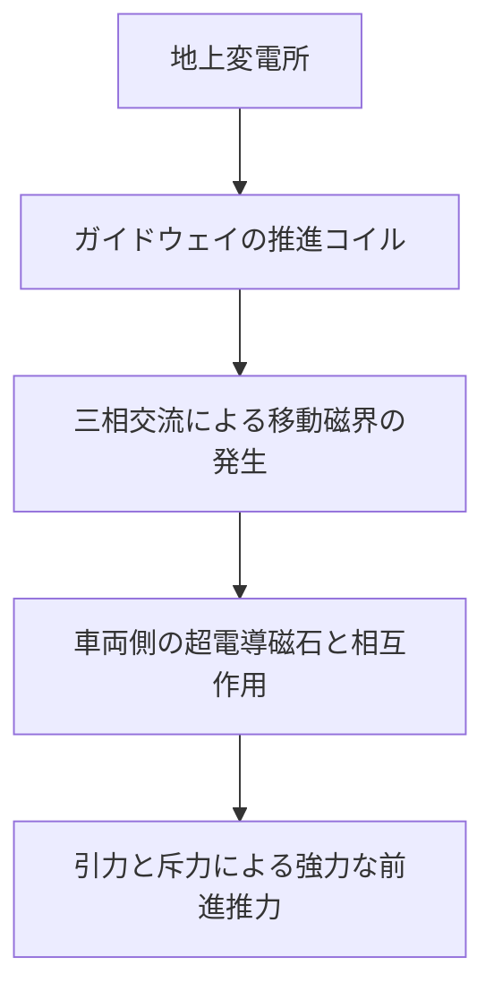
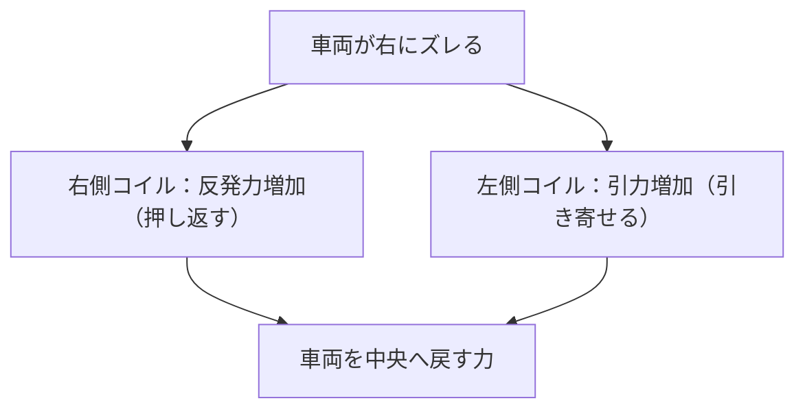

## はじめに：時速500kmの世界へ

リニアモーターカー（磁気浮上式鉄道、Maglev）は、従来の車輪とレールへの摩擦に依存する鉄道技術とは根本的に異なる、次世代の交通システムです。日本では「超電導リニア」として知られ、最高時速500km以上という驚異的なスピードで地上を駆け抜けます。この速度は、もはや「走る」というより「低空を飛ぶ」と言った方が正確かもしれません。

本記事では、この革新的な乗り物がどのようにして浮き上がり、そしてどのようにして猛スピードで進むのか、その背後にある物理学とエンジニアリングの粋を集めたメカニズムを、可能な限り深く、詳細に解説していきます。

## 超電導とマイスナー効果：魔法のような磁力の源

リニアモーターカーの心臓部には、「超電導磁石（Superconducting Magnet）」が搭載されています。超電導とは、特定の金属や合金を極低温（例えば、液体ヘリウムを用いてマイナス269度）まで冷却すると、電気抵抗が完全にゼロになる現象のことです。

電気抵抗がゼロになるということは、一度電流を流すと、外部からエネルギーを供給しなくても永久に電流が流れ続ける「永久電流」状態になることを意味します。これにより、従来の電磁石とは比較にならないほど強力な磁界を、ジュール熱によるエネルギー損失なしに発生させることができるのです。

さらに、超電導状態のもう一つの重要な特性が「マイスナー効果（Meissner effect）」です。これは、超電導体内から磁力線が完全に排除される現象であり、これによって超電導体は磁石に対して強力な反発力を生み出します。リニアモーターカーの浮上には、このマイスナー効果自体を利用する方式（ピン止め効果など）と、強力な超電導電磁石が地上コイルとの間で生み出す誘導反発力を利用する方式（日本の超電導リニア方式）があります。日本の方式では、圧倒的な磁束密度を持つ超電導磁石が、車両の浮上・案内・推進の全てにおいて極めて重要な役割を担っています。

## 推進メカニズム：リニアシンクロナスモーター（LSM）

リニアモーターカーが前進する仕組みは、「リニアモーター（線形電動機）」という名前に由来します。従来のモーターが回転運動を生み出すのに対し、リニアモーターはモーターを直線状に切り開いて展開したような構造をしており、直接的な直線運動（推力）を生み出します。

超電導リニアでは、「リニアシンクロナスモーター（Linear Synchronous Motor: LSM）」という方式が採用されています。

地上側（ガイドウェイ）の側壁には、「推進コイル」がずらりと並べられています。このコイルに地上の変電所から三相交流電流を流すと、Ｎ極とＳ極が連続的に移動する「移動磁界」が発生します。

一方、車両側には強力な超電導磁石（常に一定のＮ極とＳ極を持つ）が搭載されています。車両のＮ極は地上の移動磁界のＳ極に引かれ、同時に前方のＮ極から反発されます。地上の磁界の移動速度をコントロールすることで、車両はその磁界の波に乗るように同期して引っ張られ、推力を得て前進するのです。

このシステムの最大の利点は、モーターの「ステーター（固定子）」に相当する部分が地上側にあり、車両側は「ローター（回転子）」に相当する強力な磁石を持っているだけであるという点です。これにより、車両を極めて軽量化することが可能となり、高速走行時のエネルギー効率と加速性能が飛躍的に向上します。

## 浮上と案内：誘導反発と「8の字コイル」

リニアモーターカーが時速500kmで走行するためには、摩擦の大きな原因となる車輪を浮かせなければなりません。日本の超電導リニアでは、電磁誘導の法則（ファラデーの法則およびレンツの法則）を利用した「誘導反発方式（EDS: Electrodynamic Suspension）」を採用しています。

ガイドウェイの側壁には、推進コイルとは別に「浮上・案内コイル」と呼ばれる、独特の「8の字型」をしたコイルが設置されています。車両が低速のうちはゴムタイヤなどで走行しますが、速度が上がってくると、車両側の超電導磁石が猛スピードで8の字コイルの横を通過します。

磁石がコイルに近づき通過すると、コイルを貫く磁束が急激に変化します。電磁誘導により、コイルにはその磁束の変化を妨げる方向（レンツの法則）に誘導電流が流れます。この誘導電流が磁界を作り出し、車両側の超電導磁石と反発し合うことで、「浮上力」が生まれます。速度が約150km/hに達すると、この反発力が車両の重量を上回り、約10cmの隙間を空けて完全に浮上します。

### ガイドウェイの壁に衝突しない理由（案内原理）

浮上・案内コイルが「8の字」をしているのには重要な理由があります。それは、車両を常にガイドウェイの中央に保持する「案内力（ガイダンス力）」を生み出すためです。

8の字コイルは、上部のループと下部のループが交差して結線されています。車両がガイドウェイのど真ん中（上下左右の理想的な位置）を走っている時、8の字コイルの上部と下部を貫く磁束の量は等しくなり、誘導電流は相殺されてゼロになります（ヌルフラックス状態）。

しかし、もし車両が左右どちらかにズレた場合、左右の側壁にあるコイルとの距離が変わるため、誘導電流のバランスが崩れます。近づいた側のコイルには反発力（押し返す力）が働き、遠ざかった側のコイルには引力（引き寄せる力）が働きます。この強力な復元力により、リニアモーターカーは絶対に側壁に衝突することなく、常に軌道の中央を安定して「飛ぶ」ことができるのです。

## 車輪を持たないことによる「摩擦ゼロ」の利点

リニアモーターカーが車輪とレールを持たないことは、単なるスピードアップ以上の多くの革新的な利点をもたらします。

1.  **圧倒的な高速性能**：従来の鉄道では、車輪とレールの間の粘着力（摩擦）に依存して加速・減速を行います。これを「粘着限界」と呼び、時速300〜350km付近が物理的な限界とされています。リニアモーターカーはこの制約から完全に解放されているため、時速500km以上の領域に容易に到達できます。
2.  **乗り心地と騒音・振動の低減**：レールとの接触がないため、走行中の物理的な振動や車輪の転がり音が発生しません（ただし、高速走行による空気抵抗と風切り音は存在します）。また、微細なレールの凹凸による揺れもなく、飛行機のような滑らかな乗り心地を実現します。
3.  **急勾配への対応能力**：摩擦に頼らない推進力であるため、登坂能力が極めて高く、従来の鉄道では不可能な急勾配の路線設計が可能です。これにより、山岳地帯を直線的に貫くトンネルルートなどが実現可能となります。
4.  **メンテナンスの劇的な軽減**：レールや車輪、パンタグラフや架線といった摩耗部品が存在しません。機械的な摩耗がないため、部品の交換頻度やインフラの保守点検作業が大幅に削減され、長期的な運用コストの面でメリットがあります。

## 実用化への技術的障壁と未来への課題

しかしながら、リニアモーターカーの実用化と普及には、いまだ乗り越えるべき多くの技術的・経済的障壁が存在します。

*   **極低温冷却の維持**：ニオブチタン合金などの超電導材料を使用する場合、常にマイナス269度付近まで冷却し続ける必要があり、車両には高価な液体ヘリウムと高度な冷凍機を搭載しなければなりません。近年では、液体窒素温度（マイナス196度）で超電導状態になる高温超電導材料の適用研究も進んでいますが、実用的な大規模システムへの導入はまだ途上です。
*   **膨大なインフラ建設コスト**：車両の軽量化とは裏腹に、地上側のガイドウェイには全線にわたって無数の推進コイルと浮上・案内コイルを精密に敷設する必要があります。また、強力な磁界をコントロールするための変電設備も短区間ごとに必要となり、初期のインフラ建設費は従来の高速鉄道の数倍に達すると言われています。
*   **エネルギー消費と空気抵抗**：時速500kmという極超音速領域では、空気抵抗が速度の2乗に比例して急増します。いくら摩擦ゼロとはいえ、空気の壁を切り裂いて進むためのエネルギー消費は膨大であり、環境負荷の低減とエネルギー効率の向上が大きな課題です。
*   **磁場漏洩への対策**：強力な超電導磁石を使用するため、車内や周辺環境への磁場漏洩（磁界の漏れ）を厳密にシールドする技術が不可欠です。乗客の安全や医療機器への影響を防ぐため、車両には厳重な磁気シールドが施されています。

## 結論：次世代モビリティの究極形

リニアモーターカーは、超電導という量子力学的な現象をマクロな交通インフラに応用した、人類のエンジニアリングの金字塔です。「磁力で浮き、磁力で進む」というそのシンプルかつ究極のメカニズムは、物理的摩擦の限界を打ち破り、私たちに全く新しい移動の次元を提示しています。

建設コストやエネルギー課題など、実用化に向けたハードルは決して低くありません。しかし、その圧倒的なスピードとポテンシャルは、国や都市の繋がり方を根底から変える力を持っています。超電導技術の進化とともに、リニアモーターカーは単なる夢の乗り物から、未来の日常の足へと確実な一歩を踏み出しているのです。
