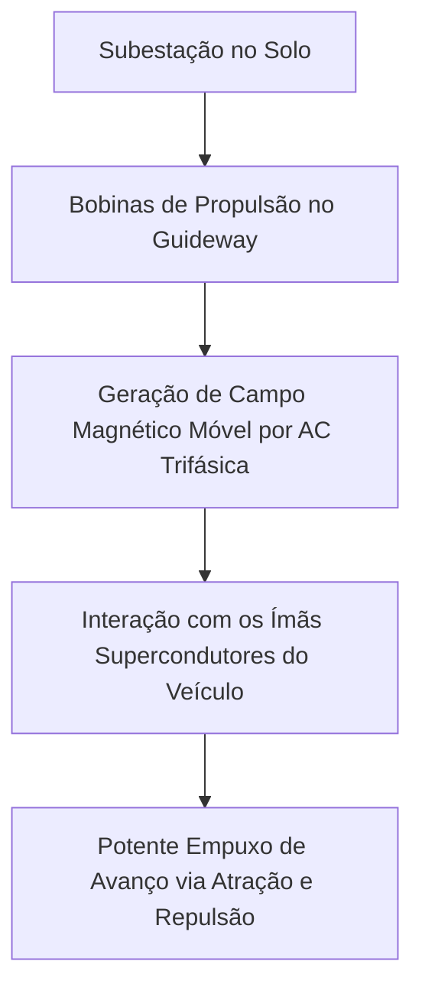
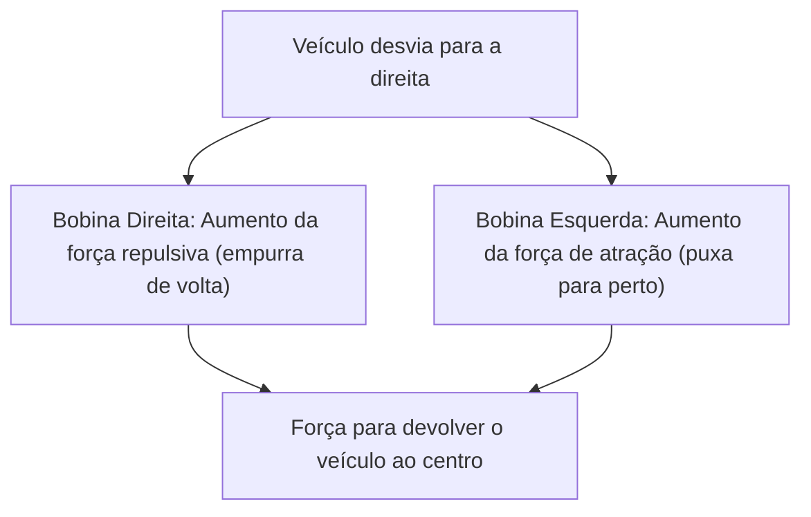

## Introdução: Rumo ao Mundo de 500 km/h

O carro a motor linear (trem de levitação magnética, Maglev) é um sistema de transporte de próxima geração fundamentalmente diferente da tecnologia ferroviária tradicional, que depende do atrito entre rodas e trilhos. Conhecido no Japão como "Maglev Supercondutor", ele corre sobre a terra a uma velocidade impressionante de mais de 500 km/h. Com essa velocidade, pode ser mais preciso dizer que ele "voa baixo" em vez de "corre".

Neste artigo, explicaremos da forma mais profunda e detalhada possível como esse veículo inovador levita e como avança a velocidades vertiginosas, explorando o mecanismo que reúne o melhor da física e da engenharia por trás dele.

## Supercondutividade e o Efeito Meissner: A Fonte de Força Magnética Mágica

No coração do trem de levitação magnética está instalado um "Ímã Supercondutor (Superconducting Magnet)". A supercondutividade é um fenômeno onde a resistência elétrica de certos metais ou ligas se torna completamente zero quando resfriados a temperaturas criogênicas (por exemplo, a menos 269 graus Celsius usando hélio líquido).

Resistência elétrica zero significa que, uma vez que uma corrente elétrica é aplicada, ela se torna uma "corrente persistente" que continua fluindo para sempre sem fornecimento de energia externa. Isso permite a geração de um campo magnético incomparavelmente mais forte do que os eletroímãs convencionais, sem qualquer perda de energia devido ao calor de Joule.

Além disso, outra propriedade importante do estado supercondutor é o "Efeito Meissner". Este é o fenômeno no qual as linhas de campo magnético são completamente expulsas do interior de um supercondutor, criando uma poderosa força de repulsão contra ímãs. Para a levitação dos trens maglev, existe um método que utiliza o próprio efeito Meissner (como o efeito de pinagem) e um método que utiliza a força repulsiva induzida entre poderosos eletroímãs supercondutores e bobinas no solo (o método maglev supercondutor japonês). No método japonês, os ímãs supercondutores com densidade de fluxo magnético avassaladora desempenham um papel crucial na levitação, orientação e propulsão do veículo.

## Mecanismo de Propulsão: Motor Síncrono Linear (LSM)

O mecanismo pelo qual o trem maglev avança deriva do nome "Motor Linear". Enquanto um motor convencional produz movimento rotativo, um motor linear tem uma estrutura semelhante a um motor cortado e desenrolado em linha reta, produzindo movimento linear direto (empuxo).

No maglev supercondutor, é adotado o sistema chamado "Motor Síncrono Linear (Linear Synchronous Motor: LSM)".

Nas paredes laterais do lado da via (guideway), "bobinas de propulsão" estão alinhadas. Quando uma corrente alternada trifásica das subestações no solo flui através dessas bobinas, é gerado um "campo magnético em movimento", onde os polos norte (N) e sul (S) se movem continuamente.

Por outro lado, o lado do veículo é equipado com potentes ímãs supercondutores (que sempre têm um polo N e um polo S constantes). O polo N do veículo é atraído pelo polo S do campo magnético em movimento no solo e, ao mesmo tempo, é repelido pelo polo N à sua frente. Ao controlar a velocidade de movimento do campo magnético no solo, o veículo é puxado em sincronia, como se estivesse surfando na onda desse campo magnético, obtendo empuxo e avançando.

A maior vantagem deste sistema é que a parte correspondente ao "estator" (parte fixa) do motor está no solo, enquanto o lado do veículo possui apenas ímãs potentes correspondentes ao "rotor" (parte rotativa). Isso possibilita uma redução extrema de peso do veículo, melhorando drasticamente a eficiência energética e o desempenho de aceleração durante viagens em alta velocidade.

## Levitação e Orientação: Repulsão Induzida e "Bobinas em Figura de Oito"

Para que o maglev viaje a 500 km/h, as rodas, que são uma grande fonte de atrito, devem ser levantadas do chão. O maglev supercondutor japonês usa o "Sistema de Suspensão Eletrodinâmica (EDS)", que utiliza as leis da indução eletromagnética (Lei de Faraday e Lei de Lenz).

Nas paredes laterais do guideway, além das bobinas de propulsão, estão instaladas bobinas exclusivas em formato de "figura de oito", chamadas de "bobinas de levitação e orientação". Enquanto o veículo está em baixa velocidade, ele corre sobre pneus de borracha, mas à medida que a velocidade aumenta, os ímãs supercondutores do veículo passam em altíssima velocidade pelas bobinas em figura de oito.

Quando o ímã se aproxima e passa pela bobina, o fluxo magnético que atravessa a bobina muda abruptamente. Devido à indução eletromagnética, uma corrente induzida flui através da bobina em uma direção que se opõe a essa mudança no fluxo magnético (Lei de Lenz). Essa corrente induzida cria um campo magnético que repele os ímãs supercondutores no veículo, gerando a "força de levitação". Quando a velocidade atinge cerca de 150 km/h, essa força repulsiva supera o peso do veículo, levitando-o completamente com uma folga de cerca de 10 cm.

### Razão para Não Colidir com as Paredes do Guideway (Princípio de Orientação)

Há uma razão importante para as bobinas de levitação e orientação terem formato de "oito". É para gerar uma "força de orientação (força de guia)" que mantém o veículo sempre no centro do guideway.

As bobinas em figura de oito são conectadas cruzando a volta superior e a volta inferior. Quando o veículo viaja bem no centro do guideway (a posição ideal nos eixos vertical e horizontal), a quantidade de fluxo magnético que atravessa as partes superior e inferior das bobinas em formato de oito torna-se igual, e as correntes induzidas se cancelam e tornam-se zero (estado de fluxo nulo).

No entanto, se o veículo desviar para a esquerda ou direita, a distância em relação às bobinas nas paredes laterais muda, desequilibrando as correntes induzidas. Uma força repulsiva (força de empurrão) age na bobina mais próxima, e uma força atrativa (força de atração) age na bobina mais distante. Por meio dessa poderosa força de restauração, o maglev nunca colidirá com a parede lateral e poderá sempre "voar" com estabilidade no centro da via.

## Benefícios do "Atrito Zero" por Não Ter Rodas

O fato de o trem maglev não ter rodas e trilhos traz muitas vantagens inovadoras que vão além de um simples aumento de velocidade.

1.  **Desempenho de Alta Velocidade Esmagador**: Nas ferrovias convencionais, a aceleração e a desaceleração dependem da força de adesão (atrito) entre as rodas e os trilhos. Isso é chamado de "limite de adesão", e velocidades em torno de 300 a 350 km/h são consideradas o limite físico. Como o maglev está completamente livre dessa restrição, ele pode atingir facilmente velocidades acima de 500 km/h.
2.  **Melhoria no Conforto e Redução de Ruído e Vibração**: Como não há contato com os trilhos, não ocorrem vibrações físicas em movimento ou ruído de rolamento das rodas (no entanto, existem resistência do ar e ruído aerodinâmico devido à alta velocidade). Além disso, não há oscilações causadas por pequenas irregularidades nos trilhos, proporcionando uma viagem suave semelhante à de um avião.
3.  **Capacidade de Lidar com Encostas Íngremes**: Como a propulsão não depende de atrito, a capacidade de subida é extremamente alta, permitindo o projeto de rotas com declives acentuados que são impossíveis para ferrovias convencionais. Isso torna possíveis túneis retos através de áreas montanhosas.
4.  **Redução Drástica na Manutenção**: Não existem peças de desgaste, como trilhos, rodas, pantógrafos ou catenárias. Como não há desgaste mecânico, a frequência de substituição de peças e o trabalho de inspeção e manutenção da infraestrutura são drasticamente reduzidos, proporcionando benefícios em termos de custos operacionais a longo prazo.

## Barreiras Técnicas para a Comercialização e Desafios Futuros

No entanto, ainda existem muitas barreiras técnicas e econômicas que precisam ser superadas para o uso prático e a popularização do trem maglev.

*   **Manutenção do Resfriamento Criogênico**: Ao usar materiais supercondutores, como ligas de nióbio-titânio, é necessário manter o resfriamento constante a cerca de menos 269 graus Celsius, exigindo que o veículo seja equipado com hélio líquido caro e refrigeradores sofisticados. Nos últimos anos, têm havido pesquisas sobre a aplicação de materiais supercondutores de alta temperatura que se tornam supercondutores na temperatura do nitrogênio líquido (menos 196 graus Celsius), mas sua introdução em sistemas práticos de larga escala ainda está em andamento.
*   **Enormes Custos de Construção da Infraestrutura**: Em contraste com a redução de peso do veículo, as inúmeras bobinas de propulsão e as bobinas de levitação e orientação devem ser assentadas com precisão ao longo de todo o guideway no solo. Além disso, equipamentos de subestação para controlar o poderoso campo magnético são necessários a intervalos curtos, e diz-se que o custo de construção inicial da infraestrutura chega a várias vezes o das ferrovias de alta velocidade convencionais.
*   **Consumo de Energia e Resistência do Ar**: Na faixa de velocidade hipersônica de 500 km/h, a resistência do ar aumenta rapidamente em proporção ao quadrado da velocidade. Mesmo sem atrito, o consumo de energia para romper a parede de ar é enorme, e reduzir o impacto ambiental e melhorar a eficiência energética são grandes desafios.
*   **Contramedidas contra Vazamento de Campo Magnético**: Como ímãs supercondutores poderosos são usados, tecnologias para proteger rigorosamente o vazamento de campo magnético para o interior do trem e para o ambiente circundante são essenciais. Os veículos são equipados com blindagem magnética rígida para evitar efeitos sobre a segurança dos passageiros e sobre equipamentos médicos.

## Conclusão: A Forma Definitiva da Mobilidade da Próxima Geração

O carro a motor linear é um marco na engenharia humana, aplicando o fenômeno da mecânica quântica da supercondutividade a infraestruturas de transporte macroscópicas. Seu mecanismo simples e definitivo de "flutuar por força magnética e avançar por força magnética" rompe os limites do atrito físico, apresentando-nos uma dimensão de mobilidade totalmente nova.

Os obstáculos para o uso prático, como custos de construção e questões de energia, não são de forma alguma baixos. No entanto, sua velocidade e potencial avassaladores têm o poder de mudar fundamentalmente a maneira como países e cidades estão conectados. Juntamente com a evolução da tecnologia supercondutora, o trem de levitação magnética está dando um passo seguro de ser apenas um veículo de sonho para se tornar o meio de transporte diário do futuro.
