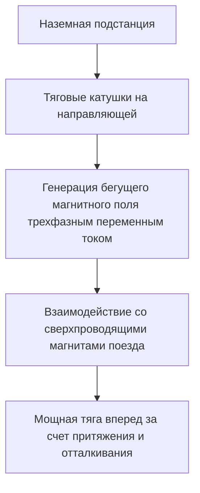
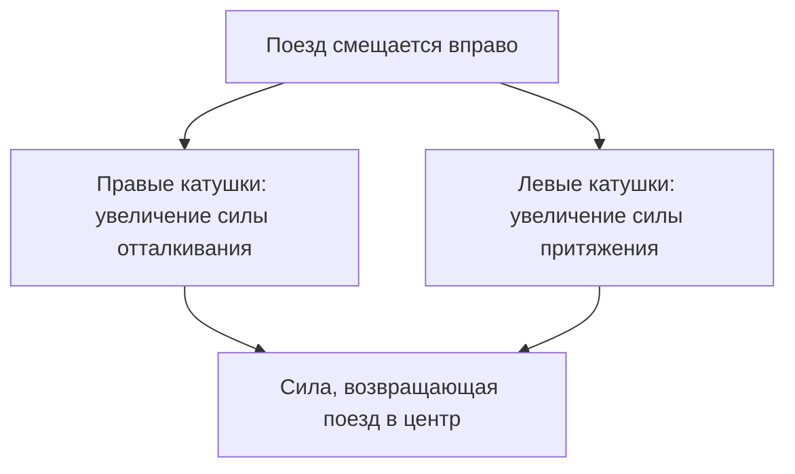

## Введение: В мир скорости 500 км/ч

Маглев (поезд на магнитной подушке, магнитоплан) — это транспортная система следующего поколения, в корне отличающаяся от традиционных железнодорожных технологий, зависящих от трения между колесами и рельсами. В Японии он известен как «сверхпроводящий маглев» (SCMaglev) и мчится над землей с поразительной максимальной скоростью более 500 км/ч. Эту скорость, возможно, точнее назвать не «ездой», а «низким полетом».

В этой статье мы максимально глубоко и подробно рассмотрим механизм, в котором сосредоточено лучшее от физики и инженерии, и узнаем, как этот инновационный транспорт поднимается в воздух и движется на огромной скорости.

## Сверхпроводимость и эффект Мейснера: Магический источник магнитной силы

В сердце маглева находятся «сверхпроводящие магниты» (Superconducting Magnet). Сверхпроводимость — это явление, при котором электрическое сопротивление определенных металлов или сплавов падает до абсолютного нуля при охлаждении до криогенных температур (например, минус 269 градусов с использованием жидкого гелия).

Нулевое электрическое сопротивление означает, что если пустить ток один раз, он будет течь бесконечно без подачи энергии извне. Это состояние называется «незатухающим током». Благодаря этому можно генерировать магнитные поля невероятной мощности, несравнимые с обычными электромагнитами, без потери энергии на джоулево тепло.

Кроме того, еще одним важным свойством сверхпроводящего состояния является «эффект Мейснера» (Meissner effect). Это явление полного вытеснения линий магнитного поля из сверхпроводника, благодаря которому сверхпроводник создает мощную силу отталкивания по отношению к магниту. Существуют системы левитации маглевов, использующие непосредственно эффект Мейснера (например, эффект пиннинга), и системы (как японский SCMaglev), использующие индуктивную силу отталкивания, возникающую между мощными сверхпроводящими электромагнитами и путевыми катушками. В японской системе сверхпроводящие магниты с подавляющей плотностью магнитного потока играют важнейшую роль во всем: левитации, направлении и тяге поезда.

## Механизм тяги: Линейный синхронный двигатель (LSM)

Название «линейный двигатель» (Linear Motor), благодаря которому поезд движется вперед, происходит от его принципа работы. Если обычные двигатели создают вращательное движение, то линейный двигатель представляет собой структуру, похожую на развернутый в прямую линию обычный мотор, создающий прямое линейное движение (тягу).

В сверхпроводящем маглеве используется система под названием «линейный синхронный двигатель» (Linear Synchronous Motor: LSM).

На боковых стенках пути (направляющей, guideway) в ряд установлены «тяговые катушки». Когда на эти катушки с наземной подстанции подается трехфазный переменный ток, возникает «бегущее магнитное поле», в котором непрерывно перемещаются северный (N) и южный (S) полюса.

С другой стороны, на поезде установлены мощные сверхпроводящие магниты (имеющие постоянные N и S полюса). N-полюс поезда притягивается к S-полюсу наземного бегущего магнитного поля и одновременно отталкивается от N-полюса, находящегося спереди. Управляя скоростью перемещения наземного магнитного поля, поезд тянет вперед синхронно, словно он ловит волну этого магнитного поля, получая тягу для движения.

Главное преимущество этой системы заключается в том, что часть, соответствующая «статору» (неподвижной части) двигателя, находится на земле, а поезд оснащен лишь мощными магнитами, соответствующими «ротору» (вращающейся части). Это позволяет сделать поезд чрезвычайно легким, что значительно повышает энергоэффективность и характеристики ускорения на высоких скоростях.

## Левитация и направление: Индуктивное отталкивание и «катушки в форме восьмерки»

Для того чтобы маглев мог двигаться со скоростью 500 км/ч, необходимо поднять колеса, которые являются основным источником трения. Японский сверхпроводящий маглев использует систему «электродинамического подвеса» (EDS: Electrodynamic Suspension), основанную на законах электромагнитной индукции (законы Фарадея и Ленца).

На боковых стенках направляющей, отдельно от тяговых катушек, установлены так называемые «катушки левитации и направления», имеющие уникальную форму «восьмерки». Пока поезд движется на низкой скорости, он использует резиновые шины, но по мере набора скорости сверхпроводящие магниты поезда проносятся мимо катушек в форме восьмерки на огромной скорости.

Когда магнит приближается и проходит мимо катушки, магнитный поток, пронизывающий катушку, резко меняется. В результате электромагнитной индукции в катушке возникает индукционный ток в направлении, препятствующем изменению этого магнитного потока (закон Ленца). Этот индукционный ток создает магнитное поле, которое отталкивается от сверхпроводящих магнитов поезда, порождая «силу левитации». Когда скорость достигает примерно 150 км/ч, эта сила отталкивания превышает вес поезда, и он полностью поднимается в воздух с зазором около 10 см.

### Почему поезд не сталкивается со стенами направляющей (принцип направления)

Существует важная причина, по которой катушки левитации и направления имеют форму восьмерки. Она заключается в создании «направляющей силы» (Guidance force), которая удерживает поезд строго по центру пути.

Верхняя и нижняя петли катушки-восьмерки соединены накрест. Когда поезд движется точно по центру направляющей (в идеальном положении по вертикали и горизонтали), количество магнитного потока, проходящего через верхнюю и нижнюю части катушки-восьмерки, становится равным, и индукционные токи взаимно компенсируются, становясь равными нулю (состояние нулевого потока).

Однако если поезд смещается влево или вправо, расстояние до катушек на боковых стенах меняется, что нарушает баланс индукционных токов. На катушках со стороны, к которой приблизился поезд, возникает сила отталкивания, а на катушках с удалившейся стороны — сила притяжения. Благодаря этой мощной восстанавливающей силе маглев никогда не сталкивается с боковыми стенами и может стабильно «лететь» строго по центру пути.

## Преимущества «нулевого трения» благодаря отсутствию колес

Тот факт, что маглев не имеет колес и рельсов, дает множество инновационных преимуществ, выходящих за рамки простого увеличения скорости.

1.  **Потрясающие скоростные характеристики**: В традиционных железных дорогах ускорение и торможение зависят от силы сцепления (трения) между колесами и рельсами. Это называется «пределом сцепления», и физическим пределом считается скорость около 300–350 км/ч. Маглев полностью свободен от этого ограничения, поэтому он легко может достигать скорости более 500 км/ч.
2.  **Комфорт езды и снижение шума/вибрации**: Поскольку нет контакта с рельсами, во время движения не возникает физических вибраций и шума качения колес (однако присутствует аэродинамическое сопротивление и шум ветра на высоких скоростях). Кроме того, отсутствует тряска из-за микроскопических неровностей рельсов, обеспечивая плавность хода, сопоставимую с полетом в самолете.
3.  **Способность преодолевать крутые подъемы**: Так как тяга не зависит от трения, способность преодолевать подъемы чрезвычайно высока. Это позволяет проектировать маршруты с крутыми уклонами, невозможными для обычных поездов. Это делает возможным, например, прокладку прямых туннелей через горные массивы.
4.  **Кардинальное снижение потребности в обслуживании**: Отсутствуют изнашиваемые детали, такие как рельсы, колеса, пантографы или контактные сети. Из-за отсутствия механического износа частота замены деталей и работ по техническому обслуживанию инфраструктуры значительно снижается, что дает большие преимущества в долгосрочных эксплуатационных расходах.

## Технические барьеры на пути к практическому применению и задачи на будущее

Тем не менее, для практического применения и массового распространения маглевов все еще существует множество технических и экономических барьеров, которые необходимо преодолеть.

*   **Поддержание криогенного охлаждения**: При использовании таких сверхпроводящих материалов, как ниобий-титановый сплав, необходимо постоянно поддерживать температуру охлаждения около минус 269 градусов. Для этого поезд должен быть оснащен дорогим жидким гелием и сложными криоохладителями. В последние годы ведутся исследования по применению высокотемпературных сверхпроводящих материалов, переходящих в сверхпроводящее состояние при температуре жидкого азота (минус 196 градусов), но их внедрение в масштабные практические системы все еще находится в стадии разработки.
*   **Огромные затраты на инфраструктуру**: В отличие от легкости самого поезда, направляющие на земле требуют точной прокладки бесчисленного множества тяговых катушек, а также катушек левитации и направления на протяжении всего маршрута. Кроме того, на коротких участках необходимо устанавливать подстанции для управления мощным магнитным полем. Говорят, что первоначальные затраты на строительство инфраструктуры в несколько раз превышают стоимость традиционных высокоскоростных железных дорог.
*   **Потребление энергии и аэродинамическое сопротивление**: В гиперзвуковом диапазоне скорости 500 км/ч аэродинамическое сопротивление резко возрастает пропорционально квадрату скорости. Несмотря на нулевое трение, энергопотребление на преодоление стены воздуха огромно. Снижение воздействия на окружающую среду и повышение энергоэффективности являются серьезными проблемами.
*   **Защита от утечки магнитных полей**: Из-за использования мощных сверхпроводящих магнитов технология строгого экранирования утечки магнитного поля в салон и окружающую среду абсолютно необходима. Для предотвращения воздействия на пассажиров и медицинское оборудование поезда оснащены серьезной магнитной защитой.

## Заключение: Идеальная форма мобильности будущего

Маглев — это шедевр человеческой инженерии, применяющий квантово-механическое явление сверхпроводимости к макроскопической транспортной инфраструктуре. Его простой и совершенный механизм — «левитация и движение за счет магнитной силы» — преодолевает пределы физического трения и открывает перед нами совершенно новое измерение мобильности.

Барьеры на пути к практической реализации, такие как затраты на строительство и энергетические проблемы, отнюдь не низки. Однако его подавляющая скорость и потенциал способны в корне изменить способы связи стран и городов. Вместе с развитием технологий сверхпроводимости маглев делает уверенный шаг от транспорта мечты к повседневному транспорту будущего.
