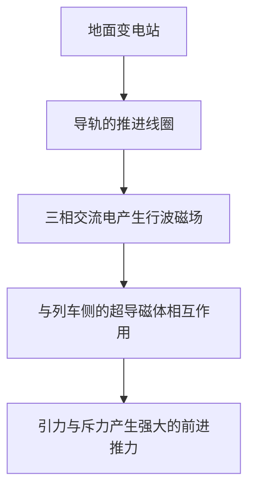
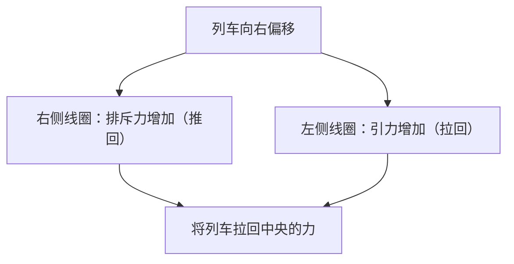

## 引言：进入时速500公里的世界

磁悬浮列车（Maglev）是一种根本上不同于传统依赖车轮与轨道摩擦的铁路技术的下一代交通系统。在日本，它被称为“超导磁悬浮”，以超过时速500公里的惊人速度在地面上疾驰。这种速度，与其说是“行驶”，不如说是“低空飞行”更为准确。

本文将尽可能深入、详细地解析这种革命性的交通工具是如何悬浮起来，又是如何以极速前进的，以及其背后汇集了物理学与工程学精华的机制。

## 超导与迈斯纳效应：如魔法般的磁力源泉

磁悬浮列车的核心部位搭载了“超导磁体（Superconducting Magnet）”。所谓超导，是指当某些特定的金属或合金被冷却到极低温（例如，使用液氦冷却到零下269度）时，电阻完全变为零的现象。

电阻变为零意味着，一旦通入电流，即使不从外部提供能量，电流也会永远持续流动，进入“持久电流”状态。借此，能够产生传统电磁铁无法比拟的强大磁场，且不会因焦耳热产生能量损耗。

此外，超导状态的另一个重要特性是“迈斯纳效应（Meissner effect）”。这是一种磁力线被完全排斥出超导体外部的现象，超导体借此会对磁铁产生强大的排斥力。磁悬浮列车的悬浮方式，有直接利用这种迈斯纳效应的（如钉扎效应等），也有利用强大的超导电磁铁与地面线圈之间产生的感应排斥力的（如日本的超导磁悬浮方式）。在日本的系统中，拥有压倒性磁通密度的超导磁体在列车的悬浮、导向和推进的各个方面都发挥着极其重要的作用。

## 推进机制：直线同步电机（LSM）

磁悬浮列车向前行进的机制，源自其名称中的“直线电机（线性电动机）”。传统的电机产生的是旋转运动，而直线电机则像是将电机直线展开后的结构，直接产生直线运动（推力）。

在超导磁悬浮中，采用了“直线同步电机（Linear Synchronous Motor: LSM）”的方式。

在地面侧（导轨）的侧壁上，密密麻麻地排列着“推进线圈”。当从地面的变电站向这些线圈通入三相交流电时，就会产生N极和S极连续移动的“行波磁场”。

另一方面，列车侧搭载着强大的超导磁体（始终保持固定的N极和S极）。列车的N极被地面的行波磁场的S极吸引，同时被前方的N极排斥。通过控制地面磁场的移动速度，列车就像乘着磁场的波浪一样被同步拉动，获得推力而前进。

这个系统最大的优点在于，相当于电机“定子（Stator）”的部分位于地面侧，而列车侧仅带有相当于“转子（Rotor）”的强大磁体。这使得列车能够实现极度轻量化，从而飞跃性地提升高速行驶时的能源效率和加速性能。

## 悬浮与导向：感应排斥与“8字型线圈”

为了让磁悬浮列车以时速500公里行驶，必须让作为巨大摩擦源的车轮悬浮起来。日本的超导磁悬浮采用了利用电磁感应定律（法拉第定律和楞次定律）的“感应排斥方式（EDS: Electrodynamic Suspension）”。

在导轨的侧壁上，除了推进线圈外，还安装了独特的“8字型”线圈，被称为“悬浮·导向线圈”。当列车处于低速时，依靠橡胶轮胎等行驶，但当速度提高后，列车侧的超导磁体会以极高的速度从8字型线圈旁通过。

当磁体靠近并穿过线圈时，穿过线圈的磁通量会发生急剧变化。由于电磁感应，线圈中会产生阻碍该磁通量变化方向（楞次定律）的感应电流。这种感应电流会产生磁场，与列车侧的超导磁体相互排斥，从而产生“悬浮力”。当速度达到约150km/h时，这种排斥力就会超过列车的重量，使其完全悬浮在约10厘米的空中。

### 不会撞上导轨壁的原因（导向原理）

悬浮·导向线圈呈“8字型”有一个重要的原因。那就是为了产生将列车始终保持在导轨中央的“导向力（Guidance force）”。

8字型线圈的上方回路与下方回路交叉连接。当列车行驶在导轨正中央（上下左右的理想位置）时，穿过8字型线圈上方和下方的磁通量相等，感应电流相互抵消变为零（零磁通状态）。

然而，如果列车向左或向右偏移，与左右侧壁上线圈的距离就会发生变化，感应电流的平衡就会被打破。靠近一侧的线圈会产生排斥力（推回的力），而远离一侧的线圈会产生引力（拉回的力）。凭借这种强大的恢复力，磁悬浮列车绝对不会撞上侧壁，能够始终稳定地在轨道中央“飞行”。

## 无车轮带来的“零摩擦”优势

磁悬浮列车没有车轮和钢轨，带来了远不止提升速度的诸多革命性优势。

1.  **压倒性的高速性能**：传统铁路依靠车轮与钢轨之间的粘着力（摩擦）进行加速和减速。这被称为“粘着极限”，物理极限大约在时速300至350公里左右。磁悬浮列车完全摆脱了这一限制，因此可以轻松达到时速500公里以上的领域。
2.  **乘坐舒适度与噪音振动的降低**：由于与钢轨没有接触，不会产生行驶中的物理振动和车轮滚动的噪音（不过，高速行驶带来的空气阻力和风切声仍然存在）。此外，也没有因钢轨微小凹凸引起的颠簸，实现了犹如飞机般平滑的乘坐体验。
3.  **应对陡坡的能力**：由于是不依赖摩擦的推进力，爬坡能力极强，可以实现传统铁路无法做到的陡坡路线设计。这使得直线贯穿山区的隧道线路等成为可能。
4.  **维护的大幅减少**：不存在钢轨、车轮、受电弓和架空线等易损耗部件。因为没有机械磨损，部件的更换频率和基础设施的维护检查工作大幅减少，在长期运营成本方面具有优势。

## 实用化的技术障碍与未来的挑战

然而，磁悬浮列车的实用化和普及仍存在许多需要克服的技术和经济障碍。

*   **极低温冷却的维持**：如果使用铌钛合金等超导材料，必须始终保持在零下269度左右的冷却状态，列车上必须搭载昂贵的液氦和先进的制冷机。近年来，能在液氮温度（零下196度）下进入超导状态的高温超导材料的应用研究也在推进中，但引入实际的大规模系统仍在发展中。
*   **庞大的基础设施建设成本**：与列车的轻量化相反，地面侧的导轨全线必须精确铺设无数的推进线圈和悬浮·导向线圈。此外，控制强磁场的变电设施也需要在很短的区间内设置，据说初期的基础设施建设费用是传统高速铁路的数倍。
*   **能源消耗与空气阻力**：在时速500公里的极高音速领域，空气阻力与速度的平方成正比急剧增加。尽管摩擦为零，但为了划破空气墙壁前进的能源消耗是巨大的，降低环境负荷和提高能源效率是重大课题。
*   **磁场泄漏的对策**：由于使用了强大的超导磁体，严格屏蔽车内及周边环境的磁场泄漏（磁场外泄）技术是不可或缺的。为了确保乘客安全和防止对医疗设备的影响，列车上施加了严密的磁屏蔽。

## 结论：下一代出行的终极形态

磁悬浮列车是将超导这一量子力学现象应用于宏观交通基础设施的人类工程学金字塔。“磁力悬浮，磁力推进”这种极其简单而终极的机制，打破了物理摩擦的极限，为我们呈现了一个全新的出行维度。

建设成本、能源问题等迈向实用化的门槛绝不算低。但是，其压倒性的速度和潜力，拥有从根本上改变国家和城市连接方式的力量。随着超导技术的不断进步，磁悬浮列车正切实地迈出从单纯的梦想交通工具走向未来日常出行的坚实一步。
