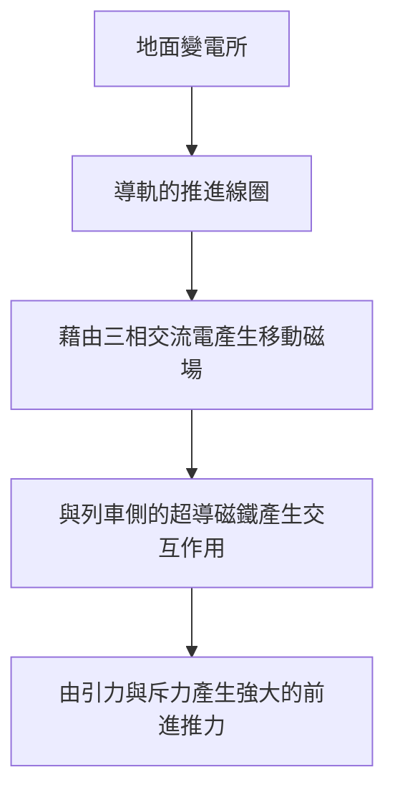
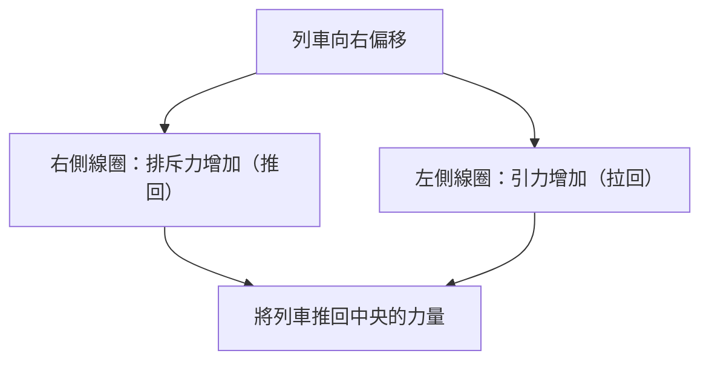

## 前言：邁向時速 500 公里的世界

磁浮列車（Maglev）是一種與傳統依賴車輪和鐵軌摩擦力的鐵路技術截然不同的次世代交通系統。在日本被稱為「超導磁浮」，它以最高時速 500 公里以上的驚人速度在地面上奔馳。這個速度與其說是「行駛」，或許說它是「低空飛行」會更為貼切。

本篇文章將盡可能深入且詳細地解說這項創新的交通工具是如何懸浮起來，又是如何以極速前進的，探討其背後匯聚了物理學與工程學精華的機制。

## 超導與邁斯納效應：如魔法般的磁力來源

磁浮列車的核心部位搭載了「超導磁鐵（Superconducting Magnet）」。超導現象是指將特定的金屬或合金冷卻至極低溫（例如使用液態氦降至攝氏零下 269 度）時，電阻會完全降為零的現象。

電阻降為零意味著，一旦通入電流，即使沒有外部提供能量，電流也會永遠持續流動，成為「永久電流」狀態。藉由這種狀態，能夠在不產生焦耳熱造成能量損失的情況下，產生傳統電磁鐵無法比擬的強大磁場。

此外，超導狀態的另一個重要特性是「邁斯納效應（Meissner effect）」。這是一種超導體內部磁力線被完全排斥的現象，超導體藉此會對磁鐵產生強大的排斥力。磁浮列車的懸浮方式，有直接利用這種邁斯納效應的設計（如釘扎效應等），也有利用強大的超導電磁鐵與地面線圈之間產生的感應排斥力的設計（日本的超導磁浮系統）。在日本的系統中，具有壓倒性磁通密度的超導磁鐵，在列車的懸浮、導引和推進的各個環節都扮演著極為關鍵的角色。

## 推進機制：線性同步馬達（LSM）

磁浮列車之所以能前進，其原理源自於「線性馬達」這個名稱。傳統馬達產生的是旋轉運動，而線性馬達則是將馬達沿直線切開並展開的結構，可直接產生直線運動（推力）。

超導磁浮採用了「線性同步馬達（Linear Synchronous Motor: LSM）」的系統。

在地面側（導軌）的側壁上，排列著一連串的「推進線圈」。當從地面的變電所向這些線圈通入三相交流電時，就會產生 N 極和 S 極連續移動的「移動磁場」。

另一方面，列車側搭載了強大的超導磁鐵（始終保持固定的 N 極和 S 極）。列車的 N 極會被地面的移動磁場 S 極吸引，同時被前方的 N 極排斥。透過控制地面磁場的移動速度，列車就會像乘著磁場的波浪一樣同步被牽引，從而獲得推力向前邁進。

這套系統最大的優勢在於，相當於馬達「定子」的部分位於地面側，而列車側僅持有相當於「轉子」的強大磁鐵。這使得列車能夠極大幅度地減輕重量，從而使高速行駛時的能源效率和加速性能獲得飛躍性的提升。

## 懸浮與導引：感應排斥與「8字型線圈」

為使磁浮列車能以時速 500 公里行駛，必須將會產生巨大摩擦力的車輪懸浮起來。日本的超導磁浮採用了利用電磁感應定律（法拉第定律與冷次定律）的「感應懸浮系統（EDS: Electrodynamic Suspension）」。

在導軌的側壁上，除了推進線圈之外，還設置了形狀獨特的「8字型」線圈，稱為「懸浮・導引線圈」。列車在低速時依靠橡膠輪胎等行駛，但當速度提升後，列車側的超導磁鐵就會以極高的速度高速通過 8 字型線圈旁。

當磁鐵靠近並通過線圈時，穿過線圈的磁通量會發生劇烈變化。由於電磁感應，線圈內會產生阻礙該磁通量變化方向（冷次定律）的感應電流。這個感應電流會製造出磁場，與列車側的超導磁鐵互相排斥，進而產生「懸浮力」。當速度達到約 150km/h 時，這股排斥力就會超越列車的重量，使其浮起約 10 公分的間隙，達到完全懸浮。

### 不會撞上導軌側壁的原因（導引原理）

懸浮・導引線圈之所以設計成「8字型」有一個重要的原因。那是為了產生能讓列車始終保持在導軌中央的「導引力」。

8字型線圈是由上半部迴圈和下半部迴圈交叉連接而成。當列車行駛在導軌的正中央（上下左右的理想位置）時，穿過 8 字型線圈上半部和下半部的磁通量會相等，感應電流相互抵消而歸零（零磁通狀態）。

然而，如果列車向左或向右偏移，由於與左右側壁線圈的距離改變，感應電流的平衡就會被打破。靠近那一側的線圈會產生排斥力（推回的力量），而遠離那一側的線圈則會產生引力（拉回的力量）。憑藉這股強大的恢復力，磁浮列車絕對不會撞上側壁，始終能穩定地在軌道中央「飛行」。

## 無車輪帶來的「零摩擦」優勢

磁浮列車沒有車輪和鐵軌，這帶來了超越單純速度提升的許多革命性優勢。

1.  **壓倒性的高速性能**：傳統鐵路依賴車輪與鐵軌之間的黏著力（摩擦力）來進行加速與減速。這被稱為「黏著極限」，一般認為時速 300 至 350 公里左右就是其物理極限。磁浮列車完全擺脫了這個限制，因此能輕易達到時速 500 公里以上的領域。
2.  **提升乘坐舒適度與降低噪音・震動**：由於沒有與鐵軌接觸，因此行駛中不會產生物理性的震動或車輪滾動的噪音（不過，高速行駛帶來的空氣阻力和風切聲依然存在）。此外，也沒有因為鐵軌微小凹凸所造成的搖晃，實現了宛如乘坐飛機般平穩的舒適體驗。
3.  **應對陡坡的能力**：由於是依靠非摩擦的推力前進，其爬坡能力極強，能夠設計出傳統鐵路無法實現的陡坡路線。這使得筆直穿過山區的隧道等路線規劃成為可能。
4.  **大幅降低維護成本**：沒有鐵軌、車輪、集電弓和架空線等容易磨損的零件。因為沒有機械性的磨損，零件更換的頻率和基礎設施的保養檢查作業都大幅減少，在長期的營運成本方面具有優勢。

## 實用化的技術障礙與未來的挑戰

然而，磁浮列車的實用化與普及，至今仍存在許多需要克服的技術與經濟障礙。

*   **維持極低溫冷卻**：在使用鈮鈦合金等超導材料時，必須始終保持在攝氏零下 269 度左右的極低溫，列車上必須搭載昂貴的液態氦和先進的冷凍機。近年來，能在液態氮溫度（攝氏零下 196 度）達到超導狀態的高溫超導材料應用研究也在推進中，但將其導入實用的大規模系統仍在發展階段。
*   **龐大的基礎建設成本**：與列車輕量化相反，地面側的導軌必須在全線精密鋪設無數的推進線圈與懸浮・導引線圈。此外，為了控制強大的磁場，每隔一段短距離就需要設置變電設備，據說初期的基礎建設費用將達到傳統高速鐵路的數倍。
*   **能源消耗與空氣阻力**：在時速 500 公里的極音速領域，空氣阻力會與速度的平方成正比急劇增加。即使摩擦力為零，要切開空氣之牆前進所消耗的能源仍然非常龐大，降低環境負擔與提升能源效率是一大課題。
*   **磁場外洩的對策**：由於使用了強大的超導磁鐵，因此必須要有能嚴密屏蔽車內及周遭環境磁場外洩（磁場洩漏）的技術。為了保護乘客安全並防止影響醫療設備，車輛上都施加了嚴格的磁屏蔽。

## 結論：次世代交通工具的終極型態

磁浮列車是將量子力學中的超導現象應用於宏觀交通基礎設施中，人類工程學的金字塔。「靠磁力懸浮，靠磁力前進」這樣簡單卻極致的機制，打破了物理摩擦的極限，向我們展現了一個全新次元的移動方式。

建設成本和能源等課題，使得邁向實用化的門檻絕不算低。然而，其壓倒性的速度與潛力，擁有從根本改變國家與城市連結方式的力量。隨著超導技術的進化，磁浮列車正確實地邁出步伐，從單純的夢幻交通工具，成為未來的日常代步工具。
