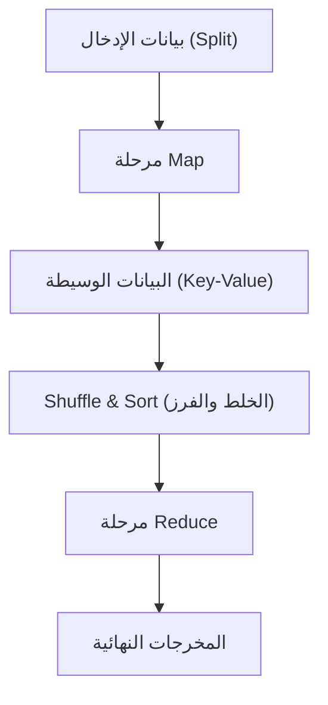

# فلسفة MapReduce: المعالجة الموزعة التي غيرت بها Google العالم

في المجتمع الرقمي الحديث، أصبح مصطلح "البيانات الضخمة" (Big Data) أمراً يومياً. ومع ذلك، فإن مشكلة كيفية معالجة هذه البيانات الهائلة بكفاءة وبتكلفة ووقت واقعيين، كانت لفترة طويلة واحدة من أكبر العقبات في علوم الحاسوب. ما حطم هذا الجدار ووضع الأساس للبنية التحتية الحديثة لمعالجة البيانات هي ورقة بحثية نُشرت في عام 2004 بواسطة جيفري دين (Jeffrey Dean) وسانجاي غيماوات (Sanjay Ghemawat) من Google تحت عنوان "MapReduce: Simplified Data Processing on Large Clusters".

في هذا المقال، سنستكشف لماذا غير نموذج البرمجة MapReduce العالم، الفلسفة الكامنة وراءه، التصميم الدقيق لمعماريته، وسلالة معالجة البيانات التي تمتد من Hadoop إلى Apache Spark الحديث، في رحلة تقنية عميقة.

## 1. الصدمة التي أحدثتها ورقة Google البحثية عام 2004

في أوائل العقد الأول من القرن الحادي والعشرين، كان حجم البيانات التي تواجهها Google - من فهرسة الويب سريع النمو، تحليل السجلات، ومعالجة بيانات الزحف - يتضخم إلى نطاق لا يمكن للأنظمة الحالية التعامل معه على الإطلاق. في أنظمة المعالجة الموزعة في ذلك الوقت، كان يتعين على المبرمجين كتابة تعليمات برمجية فردية لتقسيم البيانات، جدولة المهام، اتصال الشبكة، والأهم من ذلك "التعامل مع أعطال العقد" (Node Failures). أدى ذلك إلى تعقيد الشيفرة البرمجية وجعلها مرتعاً للأخطاء (Bugs).

قدمت MapReduce من Google نقلة نوعية ثورية (Paradigm Shift) من خلال إخفاء كل هذا التعقيد في النظام نفسه. فقط من خلال تعريف المبرمج لدالتين: "Map" (التعيين أو الخرائط) و "Reduce" (الاختزال أو التجميع)، أصبح من الممكن تنفيذ المعالجة المتوازية على آلاف الأجهزة.

## 2. التجريد المستوحى من اللغات الوظيفية: Map و Reduce

يكمن جمال MapReduce في اعتمادها المفاهيم الأساسية `map` و `reduce`، الموجودة في لغات البرمجة الوظيفية مثل Lisp، كنموذج تجريدي للمعالجة الموزعة.

- **دالة Map (Map Function)**: تأخذ زوجاً من (المفتاح والقيمة) كمدخل، وتولد أزواجاً من (المفتاح والقيمة) كبيانات وسيطة (Intermediate Data).
- **دالة Reduce (Reduce Function)**: تقوم بتجميع كافة القيم الوسيطة المرتبطة بنفس المفتاح لإنتاج النتيجة النهائية.

لا يحتاج المبرمجون إلى القلق بشأن مكان تخزين البيانات، أي العقد ستقوم بالحسابات، أو كيف سيتم الاتصال الشبكي. هذا الفصل الكامل بين "ماذا" (What: ماذا نحسب) و "كيف" (How: كيف ننفذ بشكل موزع) كان أعظم ابتكار في MapReduce.

## 3. الأجهزة السلعية (Commodity Hardware) وفلسفة تحمل الأخطاء (Fault Tolerance)

بدلاً من استخدام أجهزة مخصصة باهظة الثمن ذات معدل أعطال منخفض مثل أجهزة الكمبيوتر الخارقة (Supercomputers)، كانت استراتيجية Google الأساسية هي بناء قدرة حاسوبية ضخمة عن طريق تجميع عدد هائل من أجهزة الكمبيوتر التجارية الرخيصة (Commodity Hardware). ولكن عند تشغيل آلاف الحواسيب الشخصية، لا بد أن يحدث يومياً عطل في قرص صلب، أو خطأ في الذاكرة، أو انقطاع في الشبكة في عقدة ما.

تم تصميم MapReduce بناءً على فرضية أن "الأعطال ليست استثناءً بل هي القاعدة اليومية".
تقوم العقدة الرئيسية (Master Node) بمراقبة كل عقدة عاملة (Worker Node) بانتظام (Heartbeat)، وإذا لم يكن هناك استجابة، يتم فوراً إعادة تعيين المهام التي كانت تلك العقدة مسؤولة عنها إلى عقدة عاملة أخرى. ونظراً لأن البيانات يتم نسخها افتراضياً في ثلاث خوادم قطع (Chunk Servers) مختلفة بواسطة نظام ملفات Google (GFS)، فإنه حتى في حالة تعطل بعض العقد، لا تضيع البيانات، ويمكن مواصلة العمليات الحسابية.

## 4. أعماق المعمارية: التصميم البارع لـ Shuffle & Sort

المرحلة الأكثر أهمية وتعقيداً والتي تحدد أداء MapReduce هي "Shuffle & Sort" (الخلط والفرز).
بمجرد انتهاء مرحلة Map، يجب نقل الكمية الهائلة من البيانات الوسيطة المتولدة (أزواج Key-Value) عبر الشبكة بحيث يتم تجميع البيانات التي لها نفس المفتاح في نفس مهمة Reduce.

1. **التقسيم (Partitioning)**: تقوم مهام Map بتقسيم بيانات الإخراج لتتناسب مع عدد مهام Reduce (باستخدام دوال التجزئة - Hash Functions - وما إلى ذلك).
2. **الفرز المحلي (Local Sort)**: يتم أولاً فرز البيانات المقسمة على القرص المحلي بناءً على المفاتيح.
3. **نقل الشبكة (Shuffle)**: تقوم مهام Reduce بسحب (Pull) بيانات الأقسام المخصصة لها من جميع مهام Map عبر بروتوكول HTTP. يعد التحكم في النطاق الترددي لتجنب اختناقات إدخال/إخراج الشبكة أمراً بالغ الأهمية.
4. **الدمج (Merge)**: يتم دمج البيانات المجمعة من عدة مهام Map مرة أخرى بترتيب المفاتيح، وتُمرر إلى دالة Reduce.

كيفية تحسين حركة البيانات واسعة النطاق هذه عبر الشبكة (اتصال الجميع بالجميع - All-to-All) يمكن القول إنها الجوهر الحقيقي لإطار المعالجة الموزعة.

## 5. ولادة Hadoop وانفجار النظام البيئي بفضل المصادر المفتوحة

عندما نُشرت ورقة Google في عام 2004، قام دوج كاتينغ (Doug Cutting) وآخرون، الذين كانوا يعملون في ياهو! (Yahoo!) في ذلك الوقت، بتبني هذا المفهوم لحل مشاكل محرك البحث Nutch الذي كانوا يطورونه، وفي عام 2006 فصلوه ليصبح مشروعاً مفتوح المصدر تحت اسم "Hadoop".
وفر Hadoop نظام "HDFS (Hadoop Distributed File System)" الذي يعادل GFS، بالإضافة إلى تنفيذ لـ MapReduce، مما أتاح حتى للشركات التي لا تمتلك بنية تحتية عملاقة مثل Google معالجة البيانات الضخمة.

نتيجة لذلك، تشكل "نظام Hadoop البيئي" (Hadoop Ecosystem) بشكل متفجر، متضمناً Hive كمستودع بيانات (Data Warehouse)، و Pig لوصف تدفق البيانات، و Mahout كمكتبة للتعلم الآلي، و HBase كقاعدة بيانات NoSQL، مما أرسى مكانته كبنية تحتية لعصر البيانات الضخمة.

## 6. حدود MapReduce والتطور إلى Spark

مع تقدم الزمن، أصبحت القيود المعمارية لـ MapReduce واضحة.
كانت نقطة الضعف الكبرى هي التصميم الذي يتم فيه تمرير البيانات بين وظائف Map و Reduce دائماً عبر القرص (HDFS). وبسبب هذا، في العمليات التكرارية (Iterations) مثل خوارزميات التعلم الآلي، أو في معالجة التدفق (Stream Processing) التي تتطلب الاستجابة في الوقت الفعلي، أصبحت عمليات الإدخال/الإخراج للقرص (Disk I/O) عنق زجاجة قاتل.

للتغلب على هذا التحدي، وُلد Apache Spark في جامعة كاليفورنيا في بيركلي (UC Berkeley). قدم Spark تجريداً يسمى Resilient Distributed Dataset (RDD)، ومن خلال الاحتفاظ بالبيانات في الذاكرة (In-Memory Processing) قدر الإمكان، حقق سرعة تصل إلى 100 مرة مقارنة بـ MapReduce. مع ظهور Spark، بدأ إطار عمل MapReduce لمعالجة الدفعات (Batch Processing) يفقد دوره تدريجياً.

## 7. بحيرات البيانات الحديثة (Data Lakes) وإرث MapReduce

اليوم، نستخدم منصات بيانات سحابية أصلية مثل Snowflake و Databricks و Google BigQuery لمعالجة بيانات بحجم بيتابايت في ثوانٍ باستخدام SQL.
على الرغم من انخفاض الحاجة لكتابة إطارات عمل MapReduce بشكل مباشر، إلا أن المبدأ الأساسي للمعالجة الموزعة - "تقسيم البيانات عبر عقد متعددة (Map)، وتجميع النتائج المعالجة محلياً (Reduce)" - لا يزال ينبض بقوة كمعمارية أساسية (Core Architecture) لكل محركات البيانات الحديثة هذه.

## 8. الخاتمة: انتقال نماذج الحوسبة (Computing Paradigms)

لم تكن MapReduce التي أعلنتها Google في عام 2004 مجرد اقتراح لأداة، بل كانت تقديماً لفلسفة في علوم الحاسوب حول "كيفية حل المشاكل الضخمة ببساطة".
هذا النموذج (Paradigm)، الذي دمج بين التجريد الجميل للغات الوظيفية والمرونة القوية للأنظمة الموزعة ضد الأعطال، رفع كمية البيانات التي يمكن للبشرية التعامل معها من الجيجابايت إلى البيتابايت، وبنى أساس البيانات الذي يشكل اليوم القاعدة لثورة الذكاء الاصطناعي.

خلف الكواليس عندما نستخدم محركات البحث بشكل عفوي، أو نتلقى التوصيات، أو نتفاعل مع الذكاء الاصطناعي، لا يزال الحمض النووي (DNA) لـ MapReduce ينبض بقوة وإصرار.
