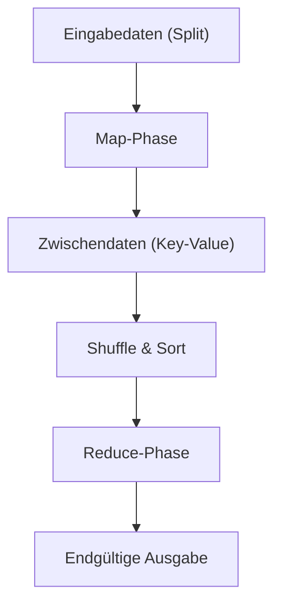

# Die Philosophie von MapReduce: Wie Googles verteilte Verarbeitung die Welt veränderte

In der modernen digitalen Gesellschaft ist das Wort "Big Data" alltäglich geworden. Wie man jedoch diese riesigen Datenmengen effizient, mit realistischen Kosten und in vernünftiger Zeit verarbeiten kann, war lange Zeit eine der größten Hürden in der Informatik. Die Grundlage der modernen Datenverarbeitungsinfrastruktur, die diese Hürde durchbrach, wurde 2004 mit dem von Jeffrey Dean und Sanjay Ghemawat (Google) veröffentlichten Papier "MapReduce: Simplified Data Processing on Large Clusters" gelegt.

In diesem Artikel begeben wir uns auf eine Reise in die Tiefe der Technologie. Wir untersuchen, warum das Programmiermodell MapReduce die Welt veränderte, welche Philosophie ihm zugrunde liegt, das ausgeklügelte Design seiner Architektur und die Abstammungslinie der Datenverarbeitung von Hadoop bis zum modernen Apache Spark.

## 1. Der Schock, den das Google-Papier von 2004 auslöste

In den frühen 2000er Jahren wuchs die Datenmenge, mit der Google konfrontiert war – aufgrund der rasant zunehmenden Web-Indexierung, der Log-Analyse und der Verarbeitung von Crawl-Daten –, auf eine Größe an, die mit bestehenden Systemen schlichtweg nicht mehr zu bewältigen war. In den damaligen verteilten Verarbeitungssystemen mussten die Programmierer selbst spezifisch für die Datenaufteilung, die Aufgabenplanung (Task-Scheduling), die Netzwerkkommunikation und vor allem für die Behandlung von "Knotenausfällen" (Node Failures) programmieren. Der Code wurde komplex und zu einem Nährboden für Bugs.

Das von Google vorgestellte MapReduce verbarg all diese Komplexität im System und führte zu einem revolutionären Paradigmenwechsel: Programmierer mussten nur noch zwei Funktionen, "Map" (Abbildung) und "Reduce" (Reduzierung), definieren, um parallele Verarbeitungen auf Tausenden von Maschinen ausführen zu können.

## 2. Eine von funktionalen Sprachen inspirierte Abstraktion: Map und Reduce

Die Schönheit von MapReduce liegt darin, dass es die Grundkonzepte `map` und `reduce`, die in funktionalen Programmiersprachen wie Lisp existieren, als Abstraktionsmodell für die verteilte Verarbeitung übernahm.

- **Map-Funktion**: Nimmt ein Schlüssel-Wert-Paar (Key-Value) als Eingabe und erzeugt ein intermediäres (zwischenzeitliches) Schlüssel-Wert-Paar.
- **Reduce-Funktion**: Aggregiert alle intermediären Werte, die demselben Schlüssel zugeordnet sind, und erzeugt das endgültige Ausgabeergebnis.

Programmierer müssen sich überhaupt nicht darum kümmern, wo die Daten gespeichert sind, welcher Knoten die Berechnung durchführt oder wie die Kommunikation abläuft. Diese vollständige Trennung von "What" (Was berechnet wird) und "How" (Wie es verteilt ausgeführt wird) war die größte Innovation von MapReduce.

## 3. Standard-Hardware und die Philosophie der Fehlertoleranz (Fault Tolerance)

Googles grundlegende Strategie bestand nicht darin, teure, dedizierte Hardware mit geringer Ausfallrate wie Supercomputer zu verwenden, sondern billige, handelsübliche PCs (Commodity Hardware) in großen Mengen zu bündeln, um eine enorme Rechenleistung zu erzielen. Wenn man jedoch Tausende von PCs betreibt, kommt es unweigerlich jeden Tag an irgendeinem Knoten zu Festplattenausfällen, Speicherfehlern oder Netzwerkunterbrechungen.

MapReduce wurde unter der Prämisse entwickelt, dass "Ausfälle nicht die Ausnahme, sondern der Alltag sind".
Der Master-Knoten überwacht regelmäßig jeden Worker-Knoten (Heartbeat). Wenn keine Antwort erfolgt, weist er die Aufgabe, für die dieser Worker zuständig war, sofort einem anderen Worker neu zu. Da die Daten standardmäßig vom Google File System (GFS) auf drei verschiedene Chunk-Server repliziert werden, gehen selbst beim Ausfall einiger Knoten keine Daten verloren und die Berechnung kann fortgesetzt werden.

## 4. Die Tiefen der Architektur: Das ausgeklügelte Design von Shuffle & Sort

Die wichtigste und komplexeste Phase, die die Leistung von MapReduce bestimmt, ist "Shuffle & Sort".
Nach Abschluss der Map-Phase müssen die riesigen Mengen der erzeugten Zwischendaten (Key-Value-Paare) über das Netzwerk übertragen werden, sodass Daten mit demselben Schlüssel bei demselben Reduce-Task gesammelt werden.

1. **Partitionierung**: Der Map-Task teilt die Ausgabedaten entsprechend der Anzahl der Reduce-Tasks auf (z. B. mithilfe einer Hash-Funktion).
2. **Lokales Sortieren**: Die partitionierten Daten werden zunächst auf der lokalen Festplatte anhand der Schlüssel sortiert.
3. **Netzwerkübertragung (Shuffle)**: Die Reduce-Tasks ziehen (pullen) die ihnen zugewiesenen Partitionsdaten via HTTP von allen Map-Tasks. Eine Bandbreitensteuerung ist hierbei extrem wichtig, um Netzwerk-I/O-Engpässe zu vermeiden.
4. **Zusammenführen (Merge)**: Die von mehreren Map-Tasks gesammelten Daten werden erneut nach Schlüsseln sortiert zusammengeführt und an die Reduce-Funktion übergeben.

Wie man diese massive Datenverschiebung (All-to-All-Kommunikation) über das Netzwerk optimiert, zeigt das wahre Können eines verteilten Verarbeitungs-Frameworks.

## 5. Die Geburt von Hadoop und die Explosion des Ökosystems durch Open Source

Als Googles Papier 2004 veröffentlicht wurde, griffen Doug Cutting und andere, die damals bei Yahoo! arbeiteten, dieses Konzept auf, um Probleme mit ihrer eigenen Suchmaschine Nutch zu lösen. 2006 koppelten sie es als Open-Source-Projekt "Hadoop" aus.
Hadoop bot mit "HDFS (Hadoop Distributed File System)" das Äquivalent zu GFS und eine Implementierung von MapReduce. Dadurch wurde Big-Data-Verarbeitung auch für Unternehmen möglich, die nicht über eine gigantische Infrastruktur wie Google verfügten.

Infolgedessen bildete sich explosionsartig ein riesiges "Hadoop-Ökosystem", darunter Hive als Data Warehouse, Pig zur Beschreibung von Datenflüssen, Mahout als Bibliothek für maschinelles Lernen und die NoSQL-Datenbank HBase. So etablierte es sich als Infrastruktur des Big-Data-Zeitalters.

## 6. Die Grenzen von MapReduce und die Entwicklung zu Spark

Mit fortschreitender Zeit wurden jedoch auch die architektonischen Grenzen von MapReduce deutlich.
Die größte Schwäche lag in dem Design, dass die Datenübergabe zwischen Map- und Reduce-Jobs immer über die Festplatte (HDFS) erfolgte. Dies machte Festplatten-I/O zu einem fatalen Flaschenhals bei iterativen Verarbeitungen, wie sie bei Algorithmen für maschinelles Lernen vorkommen, oder bei der Stream-Verarbeitung, die Echtzeitfähigkeit erfordert.

Um dieses Problem zu überwinden, wurde Apache Spark an der UC Berkeley entwickelt. Spark führte die Abstraktion des Resilient Distributed Dataset (RDD) ein und speichert Daten so weit wie möglich im Arbeitsspeicher (In-Memory-Verarbeitung), wodurch im Vergleich zu MapReduce eine bis zu 100-fache Beschleunigung erreicht wird. Mit dem Aufkommen von Spark verlor das MapReduce-Framework in der Batch-Verarbeitung allmählich seine Rolle.

## 7. Moderne Data Lakes und das Vermächtnis von MapReduce

Heute nutzen wir Cloud-native Datenplattformen wie Snowflake, Databricks oder Google BigQuery und verarbeiten Petabytes an Daten mit SQL in Sekundenschnelle.
Obwohl wir seltener Gelegenheiten haben, MapReduce-Frameworks direkt zu programmieren, pulsiert das zugrunde liegende Prinzip der verteilten Verarbeitung – "Daten auf mehrere Knoten aufteilen (Map) und die lokal verarbeiteten Ergebnisse aggregieren (Reduce)" – unbestreitbar als Kernarchitektur in all diesen modernen Daten-Engines.

## 8. Fazit: Der Wandel des Rechenparadigmas

Das von Google 2004 angekündigte MapReduce war nicht nur der Vorschlag eines Werkzeugs, sondern die Präsentation einer Philosophie in der Informatik: "Wie man gigantische Probleme einfach löst".
Dieses Paradigma, das die schöne Abstraktion funktionaler Sprachen mit der pragmatischen Fehlertoleranz verteilter Systeme verschmolz, steigerte die von der Menschheit verarbeitete Datenmenge von Gigabytes auf Petabytes und baute das Datenfundament, das die Basis für die heutige KI-Revolution bildet.

Hinter den Kulissen, wenn wir ganz selbstverständlich Suchmaschinen nutzen, Empfehlungen erhalten und mit KI interagieren, atmet die DNA von MapReduce auch heute noch kraftvoll weiter.
