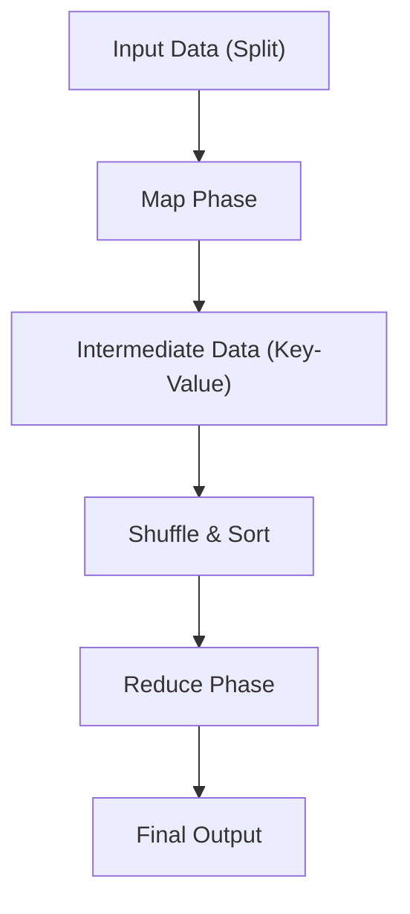

# The Philosophy of MapReduce: How Google's Distributed Processing Changed the World

In modern digital society, the term "big data" has become commonplace. However, how to process such enormous amounts of data efficiently and within realistic cost and time constraints was long one of the greatest barriers in computer science. The breakthrough that shattered this barrier and laid the foundation for modern data processing infrastructure was the paper "MapReduce: Simplified Data Processing on Large Clusters," published by Jeffrey Dean and Sanjay Ghemawat at Google in 2004.

In this article, let us embark on a journey into the depths of technology to explore why the programming model known as MapReduce changed the world, the philosophy underlying it, the intricate design of its architecture, and the lineage of data processing from Hadoop to modern-day Apache Spark.

## 1. The Impact Brought by the 2004 Google Paper

In the early 2000s, the amount of data Google faced—driven by the rapidly growing need for web indexing, log analysis, and processing crawl data—had ballooned to a scale that existing systems could absolutely not handle. In the distributed processing systems of that time, programmers had to individually write code for data partitioning, task scheduling, network communication, and above all, handling "node failures." This resulted in highly complex code that became a breeding ground for bugs.

The MapReduce model proposed by Google hid all this complexity behind the system. It brought about a revolutionary paradigm shift where programmers could execute parallel processing across thousands of machines simply by defining two functions: "Map" and "Reduce".

## 2. Abstraction Inspired by Functional Languages: Map and Reduce

The beauty of MapReduce lies in its adoption of the fundamental concepts of `map` and `reduce`—which exist in functional programming languages like Lisp—as an abstraction model for distributed processing.

- **Map Function**: Takes a key-value pair as input and generates intermediate key-value pairs.
- **Reduce Function**: Aggregates all intermediate values associated with the same key and generates the final output result.

Programmers do not need to worry at all about where the data is stored, which nodes perform the computations, or how communication takes place. This complete separation of "What (what to compute)" and "How (how to execute it in a distributed manner)" was the greatest innovation of MapReduce.

## 3. Commodity Hardware and the Philosophy of Fault Tolerance

Google's fundamental strategy was to build immense computational power by arraying a massive number of cheap, commercially available PCs (commodity hardware) rather than relying on expensive, dedicated hardware with low failure rates, such as supercomputers. However, when operating thousands of PCs, disk failures, memory errors, or network disconnections will inevitably occur on some nodes every single day.

MapReduce is designed on the premise that "failure is not an exception, but the norm."
The master node periodically monitors each worker node (heartbeat), and if there is no response, it immediately reassigns the tasks that the unresponsive worker was handling to another worker. Data is replicated across three different chunk servers by default using the Google File System (GFS), ensuring that even if some nodes go down, data is not lost and computation can continue.

## 4. The Depths of Architecture: The Ingenious Design of Shuffle & Sort

The most critical and complex phase that determines the performance of MapReduce is "Shuffle & Sort".
When the Map phase concludes, the massive amount of intermediate data (Key-Value pairs) generated must be transferred over the network so that data with the same key is gathered to the same Reduce task.

1. **Partitioning**: The Map tasks divide their output data according to the number of Reduce tasks (often utilizing hash functions).
2. **Local Sort**: The partitioned data is first sorted by key on the local disk.
3. **Network Transfer (Shuffle)**: The Reduce tasks pull the data of their assigned partitions from all Map tasks via HTTP. Bandwidth control is extremely crucial here to avoid network I/O bottlenecks.
4. **Merge**: The data gathered from multiple Map tasks is merged again in key order and passed to the Reduce function.

How to optimize this massive data movement over the network (All-to-All communication) is the true essence of a distributed processing framework.

## 5. The Birth of Hadoop and the Ecosystem Explosion via Open Source

Following the publication of the Google paper in 2004, Doug Cutting and others, who were at Yahoo! at the time, adopted this concept to solve the challenges of the search engine Nutch they were developing. In 2006, they spun it off as an open-source project named "Hadoop."
Hadoop provided "HDFS (Hadoop Distributed File System)," equivalent to GFS, and an implementation of MapReduce, enabling companies without massive infrastructures like Google to perform big data processing.

This led to the explosive formation of the immense "Hadoop Ecosystem," including Hive as a data warehouse, Pig for describing data flows, Mahout as a machine learning library, and HBase as a NoSQL database, thereby cementing its position as the infrastructure of the big data era.

## 6. The Limitations of MapReduce and the Evolution to Spark

However, as time progressed, the architectural limitations of MapReduce also became apparent.
Its biggest weakness was the design that required data transfer between Map and Reduce jobs to always pass through the disk (HDFS). As a result, disk I/O became a fatal bottleneck for iterative processing, such as in machine learning algorithms, and stream processing, which demands real-time performance.

To overcome this challenge, Apache Spark was born at UC Berkeley. Spark introduced an abstraction called the Resilient Distributed Dataset (RDD) and achieved processing speeds up to 100 times faster than MapReduce by keeping data in memory as much as possible (in-memory processing). With the advent of Spark, the MapReduce framework for batch processing gradually began to reach the end of its role.

## 7. Modern Data Lakes and the Legacy of MapReduce

Today, we use cloud-native data platforms like Snowflake, Databricks, and Google BigQuery to process petabytes of data with SQL in mere seconds.
While the opportunities to directly write MapReduce framework code have decreased, the fundamental principle of distributed processing at its core—"dividing data across multiple nodes (Map) and aggregating the results of local processing (Reduce)"—steadily pulses as the core architecture of all these modern data engines.

## 8. Conclusion: The Transition of the Computing Paradigm

MapReduce, announced by Google in 2004, was not merely a proposal for a tool, but the presentation of a philosophy in computer science on "how to solve gigantic problems simply."
This paradigm, which fused the beautiful abstraction of functional languages with the gritty fault tolerance of distributed systems, pushed the volume of data humanity handles from gigabytes to petabytes, building the data foundation that underpins the current AI revolution.

Behind our casual use of search engines, receiving recommendations, and interacting with AI, the DNA of MapReduce still breathes robustly to this day.
