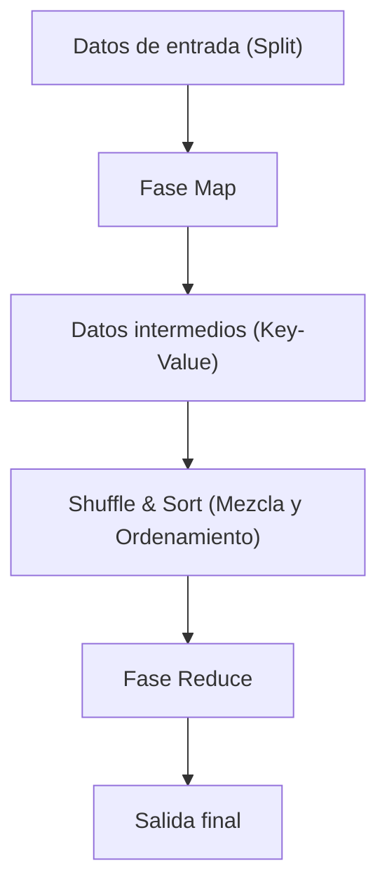

# La filosofía de MapReduce: el procesamiento distribuido con el que Google cambió el mundo

En la sociedad digital actual, la palabra "Big Data" se ha convertido en algo cotidiano. Sin embargo, cómo procesar esa enorme cantidad de datos de manera eficiente y con costos y tiempos realistas, fue durante mucho tiempo uno de los mayores obstáculos en las ciencias de la computación. Quien derribó este muro y sentó las bases de la infraestructura moderna de procesamiento de datos fue el artículo "MapReduce: Simplified Data Processing on Large Clusters", publicado en 2004 por Jeffrey Dean y Sanjay Ghemawat de Google.

En este artículo, emprenderemos un profundo viaje tecnológico para descubrir por qué el modelo de programación MapReduce cambió el mundo, la filosofía que subyace en él, el meticuloso diseño de su arquitectura y la genealogía del procesamiento de datos que va desde Hadoop hasta el actual Apache Spark.

## 1. El impacto causado por el artículo de Google en 2004

A principios de la década de 2000, el volumen de datos al que se enfrentaba Google, como la indexación de una web en rápido crecimiento, el análisis de registros y el procesamiento de datos de rastreo (crawling), había crecido a una escala que los sistemas existentes no podían manejar en absoluto. En los sistemas de procesamiento distribuido de aquella época, los propios programadores tenían que escribir de manera individual la división de datos, la programación de tareas (scheduling), la comunicación de red y, sobre todo, la respuesta a los "fallos de los nodos", lo que complicaba el código y lo convertía en un caldo de cultivo para errores (bugs).

MapReduce, presentado por Google, ocultó toda esta complejidad en el lado del sistema, trayendo consigo un cambio de paradigma revolucionario en el que el programador solo tenía que definir dos funciones: "Map" (mapeo) y "Reduce" (reducción), para poder ejecutar procesamiento en paralelo en miles de máquinas.

## 2. Abstracción inspirada en los lenguajes funcionales: Map y Reduce

La belleza de MapReduce radica en haber adoptado los conceptos básicos de `map` y `reduce` presentes en lenguajes de programación funcional como Lisp, como un modelo de abstracción para el procesamiento distribuido.

- **Función Map**: Recibe un par clave-valor como entrada y genera pares clave-valor de datos intermedios.
- **Función Reduce**: Agrega todos los valores intermedios asociados a la misma clave y genera el resultado final de salida.

El programador no tiene que preocuparse en absoluto por dónde se almacenan los datos, qué nodo realiza los cálculos o cómo se lleva a cabo la comunicación. Esta completa separación entre el "Qué" (qué calcular) y el "Cómo" (cómo distribuirlo y ejecutarlo) fue la mayor innovación de MapReduce.

## 3. Filosofía de hardware básico (commodity) y tolerancia a fallos

La estrategia básica de Google no consistía en utilizar hardware dedicado, costoso y con baja tasa de fallos, como las supercomputadoras, sino en construir una enorme capacidad de cálculo alineando una gran cantidad de PC comerciales económicos (hardware commodity). Sin embargo, si se operan miles de PC, inevitablemente ocurrirán fallos en los discos, errores de memoria y desconexiones de red en algún nodo todos los días.

MapReduce está diseñado bajo la premisa de que "los fallos no son la excepción, sino lo habitual".
El nodo maestro monitorea periódicamente (heartbeat) a cada nodo trabajador, y si no hay respuesta, reasigna inmediatamente la tarea que ese trabajador tenía a otro. Debido a que el Google File System (GFS) replica los datos por defecto en tres servidores de fragmentos (chunk servers) diferentes, incluso si algunos nodos se caen, los datos no se pierden y el cálculo puede continuar.

## 4. La profundidad de la arquitectura: el diseño ingenioso de Shuffle & Sort

La fase más importante y compleja que determina el rendimiento de MapReduce es el "Shuffle & Sort" (Mezcla y Ordenamiento).
Una vez que termina la fase Map, la enorme cantidad de datos intermedios generados (pares Key-Value) debe transferirse a través de la red de manera que los datos con la misma clave se reúnan en la misma tarea Reduce.

1. **Particionamiento**: La tarea Map divide los datos de salida de acuerdo al número de tareas Reduce (utilizando una función hash, etc.).
2. **Ordenamiento local (Local Sort)**: Los datos divididos se ordenan primero en base a la clave en el disco local.
3. **Transferencia de red (Shuffle)**: La tarea Reduce extrae (pull) los datos de la partición que se le ha asignado desde todas las tareas Map a través de HTTP. El control del ancho de banda es extremadamente importante para evitar cuellos de botella en la E/S de la red.
4. **Fusión (Merge)**: Los datos reunidos de múltiples tareas Map se fusionan de nuevo en orden de clave y se pasan a la función Reduce.

Se puede decir que optimizar este movimiento de datos a gran escala a través de la red (comunicación All-to-All) es la verdadera esencia de los marcos de procesamiento distribuido.

## 5. El nacimiento de Hadoop y la explosión del ecosistema gracias al código abierto

Cuando se publicó el artículo de Google en 2004, Doug Cutting y otros, que en ese momento estaban en Yahoo!, adoptaron este concepto para resolver los problemas del motor de búsqueda Nutch que estaban desarrollando, y en 2006 lo independizaron como el proyecto de código abierto "Hadoop".
Hadoop proporcionó "HDFS (Hadoop Distributed File System)", equivalente a GFS, y una implementación de MapReduce, lo que permitió el procesamiento de Big Data incluso para empresas que no tenían una infraestructura gigante como la de Google.

Como resultado, se formó explosivamente un enorme "Ecosistema Hadoop", que incluye a Hive como almacén de datos (data warehouse), Pig para describir flujos de datos, Mahout como biblioteca de aprendizaje automático, y HBase como base de datos NoSQL, estableciendo su posición como la infraestructura de la era del Big Data.

## 6. Los límites de MapReduce y la evolución hacia Spark

Sin embargo, a medida que avanzaba el tiempo, las limitaciones en la arquitectura de MapReduce se hicieron evidentes.
La mayor debilidad era su diseño, que obligaba a que la transferencia de datos entre los trabajos de Map y Reduce se hiciera siempre a través del disco (HDFS). Debido a esto, la E/S del disco se convirtió en un cuello de botella fatal en el procesamiento iterativo, como en los algoritmos de aprendizaje automático, y en el procesamiento de flujos (stream processing) que requieren tiempo real.

Apache Spark nació en la Universidad de Berkeley (UC Berkeley) para superar este problema. Spark introdujo una abstracción llamada Resilient Distributed Dataset (RDD) y mantuvo los datos en memoria tanto como fue posible (in-memory processing), logrando aceleraciones de hasta 100 veces en comparación con MapReduce. Con la aparición de Spark, el marco de trabajo MapReduce como procesamiento por lotes (batch processing) fue terminando gradualmente su papel.

## 7. Los lagos de datos modernos y el legado de MapReduce

Hoy en día, utilizamos plataformas de datos nativas de la nube como Snowflake, Databricks y Google BigQuery, procesando petabytes de datos en segundos utilizando SQL.
Aunque las oportunidades para escribir directamente en el marco de MapReduce han disminuido, el principio fundamental del procesamiento distribuido que subyace en él: "dividir los datos en múltiples nodos (Map) y agregar los resultados procesados localmente (Reduce)", sigue latiendo de manera segura como la arquitectura central de todos estos modernos motores de datos.

## 8. Conclusión: la transición del paradigma computacional

MapReduce, presentado por Google en 2004, no fue simplemente la propuesta de una herramienta, sino la presentación de una filosofía en las ciencias de la computación sobre "cómo resolver de manera simple problemas gigantescos".
Este paradigma, que fusionó la hermosa abstracción de los lenguajes funcionales con la robusta tolerancia a fallos de los sistemas distribuidos rudimentarios, impulsó la cantidad de datos que maneja la humanidad de gigabytes a petabytes, y construyó la base de datos que sustenta la actual revolución de la IA.

Detrás de nuestro uso casual de los motores de búsqueda, la recepción de recomendaciones y nuestras interacciones con la IA, el ADN de MapReduce sigue vivo y respirando con fuerza incluso ahora.
