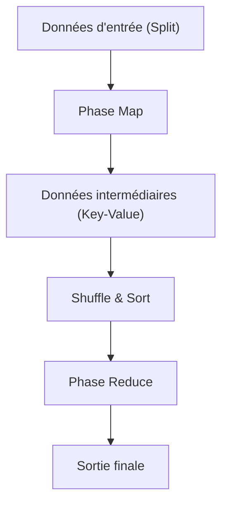

# La philosophie de MapReduce : Le traitement distribué de Google qui a changé le monde

Dans la société numérique moderne, le terme "Big Data" est devenu monnaie courante. Cependant, la question de savoir comment traiter efficacement cette quantité massive de données à un coût et dans un délai réalistes a longtemps été l'un des plus grands obstacles en informatique. C'est l'article "MapReduce: Simplified Data Processing on Large Clusters", publié en 2004 par Jeffrey Dean et Sanjay Ghemawat de Google, qui a brisé cet obstacle et jeté les bases de l'infrastructure moderne de traitement des données.

Dans cet article, nous allons entreprendre un voyage technique profond pour comprendre pourquoi le modèle de programmation MapReduce a changé le monde, la philosophie sous-jacente, la conception minutieuse de son architecture, et la généalogie du traitement des données, allant d'Hadoop jusqu'à l'Apache Spark d'aujourd'hui.

## 1. Le choc provoqué par l'article de Google en 2004

Au début des années 2000, avec la croissance rapide du Web, le volume de données auquel Google était confronté pour l'indexation, l'analyse des journaux (logs) et le traitement des données d'exploration (crawl) avait atteint une échelle que les systèmes existants ne pouvaient absolument pas gérer. Dans les systèmes de traitement distribué de l'époque, les programmeurs devaient écrire individuellement le code pour la partition des données, la planification des tâches, la communication réseau et, surtout, la gestion des "pannes de nœuds". Le code devenait ainsi complexe et constituait un terrain fertile pour les bugs.

Le MapReduce présenté par Google a masqué toute cette complexité du côté du système. Il a apporté un changement de paradigme révolutionnaire où le programmeur n'avait qu'à définir deux fonctions : "Map" (la mise en correspondance) et "Reduce" (la réduction), permettant ainsi d'exécuter des traitements parallèles sur des milliers de machines.

## 2. Une abstraction inspirée des langages fonctionnels : Map et Reduce

La beauté de MapReduce réside dans l'adoption des concepts fondamentaux de `map` et `reduce`, présents dans les langages de programmation fonctionnels comme Lisp, en tant que modèle d'abstraction pour le traitement distribué.

- **Fonction Map** : Elle prend en entrée une paire clé-valeur et génère des paires clé-valeur de données intermédiaires.
- **Fonction Reduce** : Elle agrège toutes les valeurs intermédiaires associées à une même clé et génère le résultat final de sortie.

Les programmeurs n'ont absolument pas besoin de se soucier de l'endroit où les données sont stockées, des nœuds qui effectuent les calculs ou de la manière dont la communication est réalisée. Cette séparation totale entre le "What" (ce qu'il faut calculer) et le "How" (comment l'exécuter de manière distribuée) a été la plus grande innovation de MapReduce.

## 3. La philosophie du matériel banalisé et de la tolérance aux pannes

La stratégie de base de Google ne consistait pas à utiliser du matériel dédié, coûteux et à faible taux de défaillance, tel que les superordinateurs, mais à aligner un grand nombre de PC commerciaux bon marché (matériel banalisé ou "commodity hardware") pour construire une capacité de calcul massive. Cependant, lorsque l'on fait fonctionner des milliers de PC, il est inévitable qu'une panne de disque, une erreur de mémoire ou une déconnexion réseau se produise chaque jour sur un nœud.

MapReduce a été conçu avec le principe que "les pannes ne sont pas des exceptions, mais le quotidien".
Le nœud maître surveille régulièrement (par des "heartbeats") chaque nœud travailleur (worker) et, s'il n'y a pas de réponse, il réaffecte immédiatement la tâche de ce travailleur à un autre. Étant donné que les données sont répliquées par défaut sur trois serveurs de fragments (chunk servers) différents par le Google File System (GFS), même si certains nœuds tombent en panne, les données ne sont pas perdues et le calcul peut se poursuivre.

## 4. Les profondeurs de l'architecture : La conception ingénieuse de Shuffle & Sort

La phase la plus importante et la plus complexe qui détermine les performances de MapReduce est le "Shuffle & Sort" (Brassage et Tri).
Une fois la phase Map terminée, l'énorme quantité de données intermédiaires générées (paires Key-Value) doit être transférée via le réseau afin que les données partageant la même clé soient rassemblées sur la même tâche Reduce.

1. **Partitionnement** : La tâche Map divise les données de sortie en fonction du nombre de tâches Reduce (en utilisant par exemple une fonction de hachage).
2. **Tri local** : Les données divisées sont d'abord triées sur le disque local en fonction de leur clé.
3. **Transfert réseau (Shuffle)** : La tâche Reduce extrait (pull) les données de la partition qui lui est assignée à partir de toutes les tâches Map via HTTP. Le contrôle de la bande passante est extrêmement important pour éviter les goulots d'étranglement des E/S réseau.
4. **Fusion (Merge)** : Les données collectées à partir de plusieurs tâches Map sont à nouveau fusionnées dans l'ordre des clés, puis transmises à la fonction Reduce.

On peut dire que l'optimisation de ce déplacement de données à grande échelle via le réseau (communication "All-to-All") est la véritable essence des frameworks de traitement distribué.

## 5. La naissance d'Hadoop et l'explosion de l'écosystème grâce à l'open source

À la suite de la publication de l'article de Google en 2004, Doug Cutting et d'autres personnes alors chez Yahoo!, ont adopté ce concept pour résoudre les problèmes de leur propre moteur de recherche en développement, Nutch, et l'ont rendu indépendant en 2006 sous la forme du projet open source "Hadoop".
Hadoop a fourni le système "HDFS (Hadoop Distributed File System)", équivalent à GFS, ainsi qu'une implémentation de MapReduce, permettant aux entreprises ne disposant pas d'une infrastructure massive comme celle de Google de réaliser des traitements Big Data.

Cela a conduit à la formation explosive d'un énorme "écosystème Hadoop", incluant Hive pour le data warehouse, Pig pour la description des flux de données, Mahout pour la bibliothèque de machine learning, et HBase pour la base de données NoSQL, établissant ainsi sa position en tant qu'infrastructure de l'ère du Big Data.

## 6. Les limites de MapReduce et l'évolution vers Spark

Cependant, avec le temps, les limites architecturales de MapReduce sont devenues apparentes.
Sa plus grande faiblesse était sa conception qui exigeait que le transfert de données entre les tâches Map et Reduce passe toujours par le disque (HDFS). Par conséquent, pour les traitements itératifs (comme les algorithmes de machine learning) ou les traitements de flux (stream processing) nécessitant du temps réel, les E/S sur disque constituaient un goulot d'étranglement fatal.

Pour surmonter ce problème, Apache Spark a été créé à l'UC Berkeley. Spark a introduit une abstraction appelée Resilient Distributed Dataset (RDD) et a conservé les données en mémoire autant que possible (traitement in-memory), atteignant des vitesses jusqu'à 100 fois plus rapides que MapReduce. Avec l'avènement de Spark, le framework MapReduce pour le traitement par lots a progressivement vu son rôle se terminer.

## 7. Les lacs de données modernes et l'héritage de MapReduce

Aujourd'hui, nous utilisons des plateformes de données cloud natives comme Snowflake, Databricks ou Google BigQuery pour traiter des pétaoctets de données avec SQL en quelques secondes.
Les occasions d'écrire directement avec le framework MapReduce ont diminué, mais le principe fondamental du traitement distribué sous-jacent — "diviser les données sur plusieurs nœuds (Map) et agréger les résultats des traitements locaux (Reduce)" — continue de battre fermement comme architecture de base de tous ces moteurs de données modernes.

## 8. Conclusion : L'évolution du paradigme de calcul

Le MapReduce publié par Google en 2004 n'était pas simplement la proposition d'un outil, mais la présentation d'une philosophie en informatique sur "la manière de résoudre simplement des problèmes gigantesques".
Ce paradigme, qui a fusionné la belle abstraction des langages fonctionnels avec la tolérance aux pannes indispensable des systèmes distribués bruts, a poussé la quantité de données gérées par l'humanité du gigaoctet au pétaoctet, et a construit la fondation des données qui est à la base de la révolution actuelle de l'IA.

Derrière notre utilisation quotidienne des moteurs de recherche, de la réception de recommandations et de nos interactions avec l'IA, l'ADN de MapReduce continue de vivre vigoureusement.
