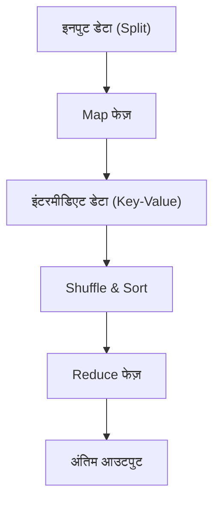

# MapReduce का दर्शन: Google का वह डिस्ट्रीब्यूटेड प्रोसेसिंग जिसने दुनिया बदल दी

आधुनिक डिजिटल समाज में, 'बिग डेटा' शब्द रोज़मर्रा की बात हो गया है। हालाँकि, उस विशाल डेटा को प्रभावी ढंग से, यथार्थवादी लागत और समय में कैसे प्रोसेस किया जाए, यह समस्या लंबे समय से कंप्यूटर विज्ञान की सबसे बड़ी बाधाओं में से एक थी। इस बाधा को तोड़ते हुए और आधुनिक डेटा प्रोसेसिंग इंफ्रास्ट्रक्चर की नींव रखते हुए, 2004 में Google के Jeffrey Dean और Sanjay Ghemawat ने "MapReduce: Simplified Data Processing on Large Clusters" नामक एक शोध पत्र प्रस्तुत किया।

इस लेख में, आइए एक गहन तकनीकी यात्रा पर चलें कि कैसे MapReduce नामक प्रोग्रामिंग मॉडल ने दुनिया को बदल दिया, इसके अंतर्निहित दर्शन, आर्किटेक्चर के सटीक डिज़ाइन, और Hadoop से आधुनिक Apache Spark तक डेटा प्रोसेसिंग की वंशावली को समझें।

## 1. 2004 के Google शोध पत्र का प्रभाव

2000 के दशक की शुरुआत में, तेज़ी से बढ़ते वेब की इंडेक्सिंग, लॉग विश्लेषण, और क्रॉल किए गए डेटा को प्रोसेस करने जैसी गतिविधियों के कारण, Google जिस डेटा की मात्रा का सामना कर रहा था, वह इतने बड़े पैमाने पर पहुँच गया था कि मौजूदा सिस्टम उसका मुकाबला नहीं कर सकते थे। उस समय के डिस्ट्रीब्यूटेड प्रोसेसिंग सिस्टम में, प्रोग्रामर को खुद ही डेटा विभाजन, टास्क शेड्यूलिंग, नेटवर्क कम्युनिकेशन और सबसे अहम 'नोड फेलियर' से निपटने के लिए अलग से कोड लिखना पड़ता था, जिससे कोड जटिल हो जाता था और बग्स पैदा होने की संभावना बढ़ जाती थी।

Google द्वारा प्रस्तुत MapReduce ने इन सभी जटिलताओं को सिस्टम की ओर छिपा दिया। इसने एक ऐसा क्रांतिकारी प्रतिमान (पैराडाइम शिफ्ट) पेश किया जहाँ प्रोग्रामर को केवल दो फंक्शन परिभाषित करने होते थे: 'Map (मैप)' और 'Reduce (रिड्यूस)', और इसके बल पर हज़ारों मशीनों पर समानांतर प्रोसेसिंग की जा सकती थी।

## 2. फंक्शनल लैंग्वेज से प्रेरित एब्स्ट्रैक्शन: Map और Reduce

MapReduce की सुंदरता इस बात में है कि इसने Lisp जैसी फंक्शनल प्रोग्रामिंग भाषाओं में मौजूद 'map' और 'reduce' जैसी मूल अवधारणाओं को डिस्ट्रीब्यूटेड प्रोसेसिंग के एब्स्ट्रैक्शन मॉडल के रूप में अपनाया।

- **Map फंक्शन**: यह इनपुट के रूप में एक की-वैल्यू (key-value) पेयर लेता है, और इंटरमीडिएट डेटा का की-वैल्यू पेयर उत्पन्न करता है।
- **Reduce फंक्शन**: यह एक ही की (key) से जुड़े सभी इंटरमीडिएट मूल्यों को एकत्र (aggregate) करता है, और अंतिम आउटपुट परिणाम उत्पन्न करता है।

प्रोग्रामर को इस बात की बिल्कुल चिंता करने की ज़रूरत नहीं है कि डेटा कहाँ सहेजा गया है, कौन सा नोड गणना करेगा, या संचार (communication) कैसे होगा। 'What (क्या गणना करनी है)' और 'How (इसे डिस्ट्रीब्यूटेड रूप से कैसे निष्पादित करना है)' का यह पूर्ण अलगाव ही MapReduce का सबसे बड़ा नवाचार था।

## 3. कमोडिटी हार्डवेयर और फॉल्ट टॉलरेंस का दर्शन

सुपर कंप्यूटर जैसे महंगे और कम विफलता दर वाले समर्पित हार्डवेयर के बजाय, सस्ते कमर्शियल पीसी (कमोडिटी हार्डवेयर) को बड़ी संख्या में एक साथ रखकर विशाल कंप्यूटिंग शक्ति का निर्माण करना Google की मूल रणनीति थी। हालाँकि, जब आप हज़ारों पीसी चलाते हैं, तो हर दिन अनिवार्य रूप से किसी न किसी नोड में डिस्क फेलियर, मेमोरी एरर या नेटवर्क डिस्कनेक्शन जैसी समस्याएं आती हैं।

MapReduce को इस आधार पर डिज़ाइन किया गया है कि "विफलता एक अपवाद नहीं, बल्कि रोज़मर्रा की बात है।"
मास्टर नोड नियमित रूप से प्रत्येक वर्कर नोड की निगरानी (हार्टबीट) करता है, और यदि कोई प्रतिक्रिया नहीं मिलती है, तो वह तुरंत उस टास्क को किसी अन्य वर्कर को फिर से सौंप देता है। डेटा को Google File System (GFS) द्वारा डिफ़ॉल्ट रूप से 3 अलग-अलग चंक सर्वरों पर दोहराया (replicate) जाता है, इसलिए भले ही कुछ नोड डाउन हो जाएं, डेटा नष्ट नहीं होता है, और गणना बिना किसी रुकावट के जारी रह सकती है।

## 4. आर्किटेक्चर की गहराई: Shuffle और Sort का चतुर डिज़ाइन

सबसे महत्वपूर्ण और जटिल फेज़ जो MapReduce के प्रदर्शन को निर्धारित करता है, वह "Shuffle & Sort (शफल और सॉर्ट)" है।
Map फेज़ पूरा होने के बाद, उत्पन्न विशाल इंटरमीडिएट डेटा (Key-Value पेयर) को नेटवर्क के माध्यम से इस तरह से स्थानांतरित किया जाना चाहिए कि समान की (key) वाले डेटा को एक ही Reduce टास्क में एकत्र किया जा सके।

1. **पार्टिशनिंग**: Map टास्क आउटपुट डेटा को Reduce टास्क की संख्या के अनुसार (हैश फंक्शन आदि का उपयोग करके) विभाजित करता है।
2. **लोकल सॉर्ट**: विभाजित डेटा को सबसे पहले लोकल डिस्क पर की (key) के आधार पर सॉर्ट किया जाता है।
3. **नेटवर्क ट्रांसफर (Shuffle)**: Reduce टास्क सभी Map टास्कों से अपने असाइन किए गए पार्टिशन का डेटा HTTP के माध्यम से पुल करता है। नेटवर्क I/O बॉटलनेक से बचने के लिए बैंडविड्थ नियंत्रण अत्यंत महत्वपूर्ण है।
4. **मर्ज**: कई Map टास्कों से एकत्र किए गए डेटा को फिर से की (key) क्रम में मर्ज किया जाता है, और Reduce फंक्शन को पास किया जाता है।

इस नेटवर्क के माध्यम से बड़े पैमाने पर डेटा मूवमेंट (All-to-All कम्युनिकेशन) को कैसे अनुकूलित (optimize) किया जाए, यही डिस्ट्रीब्यूटेड प्रोसेसिंग फ्रेमवर्क की असली चुनौती और खूबी है।

## 5. Hadoop का जन्म और ओपन-सोर्सिंग के माध्यम से इकोसिस्टम का विस्फोट

2004 में Google का शोध पत्र प्रकाशित होने के बाद, उस समय Yahoo! में काम कर रहे Doug Cutting और अन्य लोगों ने अपने द्वारा विकसित किए जा रहे सर्च इंजन Nutch की समस्याओं को हल करने के लिए इस अवधारणा को अपनाया, और 2006 में इसे एक ओपन-सोर्स प्रोजेक्ट "Hadoop" के रूप में स्वतंत्र कर दिया।
Hadoop ने GFS के समकक्ष "HDFS (Hadoop Distributed File System)" और MapReduce का कार्यान्वयन (implementation) प्रदान किया, जिससे Google जैसे विशाल बुनियादी ढांचे (इंफ्रास्ट्रक्चर) के बिना भी कंपनियों के लिए बिग डेटा प्रोसेसिंग संभव हो गया।

नतीजतन, डेटा वेयरहाउस के रूप में Hive, डेटा फ्लो का वर्णन करने के लिए Pig, मशीन लर्निंग लाइब्रेरी के रूप में Mahout, और NoSQL डेटाबेस के रूप में HBase सहित एक विशाल "Hadoop इकोसिस्टम" का विस्फोट हुआ। इसने बिग डेटा युग के इंफ्रास्ट्रक्चर के रूप में अपनी स्थिति मजबूत की।

## 6. MapReduce की सीमाएं और Spark की ओर विकास

हालाँकि, जैसे-जैसे समय बीता, MapReduce के आर्किटेक्चर की सीमाएं भी स्पष्ट होने लगीं।
इसकी सबसे बड़ी कमज़ोरी यह थी कि इसे हमेशा डिस्क (HDFS) के माध्यम से Map और Reduce जॉब्स के बीच डेटा पास करने के लिए डिज़ाइन किया गया था। इस वजह से, मशीन लर्निंग एल्गोरिदम जैसी इटरेशन (पुनरावृत्ति) प्रक्रियाओं या स्ट्रीम प्रोसेसिंग (जहाँ रीयल-टाइम प्रोसेसिंग की आवश्यकता होती है) में, डिस्क I/O एक बड़ी रुकावट (बॉटलनेक) बन गया।

इस चुनौती को दूर करने के लिए UC Berkeley में Apache Spark का जन्म हुआ। Spark ने Resilient Distributed Dataset (RDD) नामक एब्स्ट्रैक्शन पेश किया, जो जितना संभव हो सके डेटा को मेमोरी में रखकर (इन-मेमोरी प्रोसेसिंग) MapReduce की तुलना में 100 गुना तक तेज़ गति प्राप्त करता है। Spark के आगमन के साथ, बैच प्रोसेसिंग के लिए MapReduce फ्रेमवर्क की भूमिका धीरे-धीरे खत्म होने लगी।

## 7. आधुनिक डेटा लेक और MapReduce की विरासत

आज, हम Snowflake, Databricks और Google BigQuery जैसे क्लाउड-नेटिव डेटा प्लेटफ़ॉर्म का उपयोग करते हैं, और सेकंडों में SQL का उपयोग करके पेटाबाइट-स्केल डेटा को प्रोसेस कर सकते हैं।
हालाँकि MapReduce फ्रेमवर्क को सीधे लिखने के अवसर कम हो गए हैं, लेकिन इसके अंतर्निहित मूल सिद्धांत—"डेटा को कई नोड्स (Map) में विभाजित करना, और स्थानीय स्तर पर प्रोसेस किए गए परिणामों को एकत्रित करना (Reduce)"—अभी भी इन सभी आधुनिक डेटा इंजनों के कोर आर्किटेक्चर के रूप में दृढ़ता से मौजूद हैं।

## 8. निष्कर्ष: कंप्यूटिंग प्रतिमान (पैराडाइम) का विकास

2004 में Google द्वारा प्रस्तुत MapReduce केवल एक टूल का प्रस्ताव नहीं था, बल्कि कंप्यूटर विज्ञान में यह एक दर्शन की प्रस्तुति थी कि "विशाल समस्याओं को सरलता से कैसे हल किया जाए।"
इस प्रतिमान ने, जिसने फंक्शनल लैंग्वेज के सुंदर एब्स्ट्रैक्शन को डिस्ट्रीब्यूटेड सिस्टम के फॉल्ट-टॉलरेंस के साथ जोड़ दिया, मानवता द्वारा संभाले जाने वाले डेटा की मात्रा को गीगाबाइट से पेटाबाइट तक बढ़ा दिया, और उस डेटा इंफ्रास्ट्रक्चर का निर्माण किया जो वर्तमान AI क्रांति का आधार है।

जब हम सर्च इंजनों का उपयोग करते हैं, रिकमेन्डेशन प्राप्त करते हैं, और AI के साथ बातचीत পরবর্তते हैं, तो उन सबके पीछे आज भी MapReduce का DNA मजबूती से जीवित है और काम कर रहा है।
