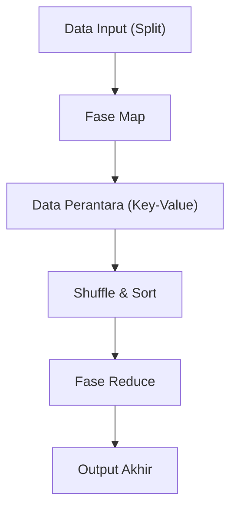

# Filosofi MapReduce: Pemrosesan Terdistribusi Google yang Mengubah Dunia

Di masyarakat digital modern, istilah "big data" telah menjadi sesuatu yang lazim setiap hari. Namun, bagaimana memproses data dalam jumlah yang sangat besar itu secara efisien, serta dengan biaya dan waktu yang realistis, telah lama menjadi salah satu rintangan terbesar dalam ilmu komputer. Yang mendobrak rintangan ini dan membangun fondasi infrastruktur pemrosesan data modern adalah makalah yang diterbitkan pada tahun 2004 oleh Jeffrey Dean dan Sanjay Ghemawat dari Google, "MapReduce: Simplified Data Processing on Large Clusters".

Dalam artikel ini, mari kita memulai perjalanan teknologi yang mendalam tentang mengapa model pemrograman MapReduce mengubah dunia, filosofi yang mendasarinya, desain arsitektur yang sangat teliti, dan silsilah pemrosesan data dari Hadoop hingga Apache Spark modern.

## 1. Kejutan yang Dihasilkan oleh Makalah Google Tahun 2004

Pada awal tahun 2000-an, pembuatan indeks web yang berkembang pesat, analisis log, dan pemrosesan data hasil crawl, serta jumlah data yang dihadapi Google telah membengkak ke skala yang tidak mungkin ditangani oleh sistem yang ada saat itu. Dalam sistem pemrosesan terdistribusi pada masa itu, pemrogram harus menulis sendiri secara individual pembagian data, penjadwalan tugas, komunikasi jaringan, dan yang terpenting, penanganan "kegagalan node", yang membuat kode menjadi rumit dan menjadi sarang bug.

MapReduce yang diperkenalkan Google menyembunyikan semua kerumitan ini di sisi sistem, dan membawa perubahan paradigma yang revolusioner dengan memungkinkan pemrogram menjalankan pemrosesan paralel pada ribuan mesin hanya dengan mendefinisikan dua fungsi: "Map" (Pemetaan) dan "Reduce" (Reduksi).

## 2. Abstraksi yang Terinspirasi dari Bahasa Fungsional: Map dan Reduce

Keindahan MapReduce terletak pada adopsi konsep dasar `map` dan `reduce`, yang ada dalam bahasa pemrograman fungsional seperti Lisp, sebagai model abstraksi untuk pemrosesan terdistribusi.

- **Fungsi Map**: Menerima pasangan kunci (key) dan nilai (value) sebagai input, dan menghasilkan pasangan kunci-nilai data perantara (intermediate).
- **Fungsi Reduce**: Menggabungkan semua nilai perantara yang terkait dengan kunci yang sama, dan menghasilkan hasil output akhir.

Pemrogram sama sekali tidak perlu memikirkan di mana data disimpan, node mana yang akan melakukan komputasi, atau bagaimana komunikasi akan dilakukan. Pemisahan yang sempurna antara "What" (apa yang harus dihitung) dan "How" (bagaimana mendistribusikan pelaksanaannya) ini adalah inovasi terbesar dari MapReduce.

## 3. Filosofi Perangkat Keras Komoditas dan Toleransi Kesalahan (Fault Tolerance)

Bukan perangkat keras khusus yang mahal dan tingkat kegagalannya rendah seperti superkomputer, strategi dasar Google adalah membangun kapasitas komputasi yang masif dengan menjejerkan PC komersial murah (perangkat keras komoditas) dalam jumlah besar. Namun, jika ribuan PC dioperasikan, setiap harinya pasti akan ada kerusakan disk, kesalahan memori, atau putusnya jaringan di suatu node.

MapReduce dirancang dengan premis bahwa "kegagalan bukanlah sebuah pengecualian, melainkan hal yang terjadi sehari-hari".
Node master secara berkala memantau setiap node pekerja (worker) dengan "heartbeat", dan jika tidak ada respons, tugas yang sebelumnya ditangani oleh pekerja tersebut akan segera dialokasikan kembali ke pekerja lain. Karena data secara default disalin ke tiga server chunk (potongan) berbeda oleh Google File System (GFS), komputasi dapat terus berlanjut dan data tidak akan hilang meskipun beberapa node mengalami down.

## 4. Kedalaman Arsitektur: Desain Shuffle & Sort yang Cerdik

Fase paling penting dan kompleks yang menentukan performa MapReduce adalah "Shuffle & Sort" (Pengocokan dan Pengurutan).
Setelah fase Map selesai, sejumlah besar data perantara (pasangan Key-Value) yang dihasilkan harus ditransfer melalui jaringan sedemikian rupa sehingga data dengan kunci yang sama dikumpulkan pada tugas Reduce yang sama.

1. **Partisi**: Tugas Map membagi data output sesuai dengan jumlah tugas Reduce (menggunakan fungsi hash, dll.).
2. **Pengurutan Lokal (Local Sort)**: Data yang telah dibagi mula-mula diurutkan berdasarkan kunci di disk lokal.
3. **Transfer Jaringan (Shuffle)**: Tugas Reduce menarik (pull) data partisi yang dialokasikan untuknya dari semua tugas Map melalui HTTP. Kontrol bandwidth (lebar pita) sangat penting di sini untuk menghindari bottleneck pada I/O jaringan.
4. **Penggabungan (Merge)**: Data yang dikumpulkan dari beberapa tugas Map kemudian digabungkan kembali berdasarkan urutan kunci, dan diteruskan ke fungsi Reduce.

Bagaimana mengoptimalkan perpindahan data berskala besar via jaringan ini (komunikasi All-to-All) bisa dikatakan sebagai esensi sejati dari kerangka kerja (framework) pemrosesan terdistribusi.

## 5. Kelahiran Hadoop dan Ledakan Ekosistem berkat Open Source

Ketika makalah Google diterbitkan pada tahun 2004, Doug Cutting dan rekannya yang saat itu bekerja di Yahoo!, mengadopsi konsep ini untuk memecahkan masalah pada mesin pencari Nutch yang sedang mereka kembangkan, dan kemudian merilisnya secara independen sebagai proyek sumber terbuka (open source) "Hadoop" pada tahun 2006.
Hadoop menyediakan "HDFS (Hadoop Distributed File System)" yang setara dengan GFS dan implementasi MapReduce, sehingga memungkinkan perusahaan yang tidak memiliki infrastruktur raksasa seperti Google untuk juga melakukan pemrosesan big data.

Hal ini memicu terbentuknya ledakan "Ekosistem Hadoop" raksasa, yang meliputi Hive sebagai gudang data (data warehouse), Pig untuk mendeskripsikan aliran data (data flow), Mahout sebagai pustaka pembelajaran mesin (machine learning), hingga HBase sebagai basis data NoSQL, yang pada akhirnya mengukuhkan posisinya sebagai infrastruktur di era big data.

## 6. Keterbatasan MapReduce dan Evolusi menuju Spark

Namun, seiring berjalannya waktu, keterbatasan arsitektur MapReduce mulai terlihat jelas.
Kelemahan terbesarnya adalah desain di mana transfer data antara pekerjaan Map dan Reduce selalu melalui disk (HDFS). Akibatnya, dalam pemrosesan berulang (iterasi) seperti pada algoritma pembelajaran mesin, atau pemrosesan aliran (stream processing) yang membutuhkan pemrosesan real-time, I/O disk menjadi bottleneck yang fatal.

Apache Spark lahir di UC Berkeley untuk mengatasi masalah ini. Spark memperkenalkan abstraksi yang disebut Resilient Distributed Dataset (RDD) dan menyimpan data di memori sebanyak mungkin (pemrosesan in-memory), yang berhasil mencapai peningkatan kecepatan hingga 100 kali lipat dibandingkan MapReduce. Dengan kemunculan Spark, kerangka kerja MapReduce sebagai pemrosesan batch perlahan-lahan mulai mengakhiri perannya.

## 7. Data Lake Modern dan Warisan MapReduce

Saat ini, kita menggunakan platform data cloud-native seperti Snowflake, Databricks, dan Google BigQuery untuk memproses data berukuran petabyte dengan SQL dalam hitungan detik.
Meskipun peluang untuk menulis kode secara langsung menggunakan kerangka kerja MapReduce itu sendiri sudah berkurang, prinsip dasar pemrosesan terdistribusinya yang "membagi data ke beberapa node (Map), kemudian menggabungkan hasil yang diproses secara lokal (Reduce)" dengan pasti terus berdetak sebagai arsitektur inti di semua mesin data modern ini.

## 8. Kesimpulan: Perubahan Paradigma Komputasi

MapReduce yang diumumkan Google pada tahun 2004 bukanlah sekadar usulan tentang sebuah alat (tool), melainkan sebuah presentasi filosofis dalam ilmu komputer tentang "bagaimana menyelesaikan masalah raksasa dengan cara yang sederhana".
Paradigma ini, yang menggabungkan abstraksi indah dari bahasa fungsional dengan toleransi kesalahan dari sistem terdistribusi yang kotor, telah mendorong jumlah data yang ditangani manusia dari skala gigabyte ke petabyte, dan membangun fondasi data yang menjadi landasan revolusi AI (Kecerdasan Buatan) saat ini.

Di balik penggunaan mesin pencari, penerimaan rekomendasi, dan interaksi dengan AI yang kita lakukan tanpa kita sadari setiap harinya, DNA MapReduce masih tetap hidup dan bernapas dengan kuat.
