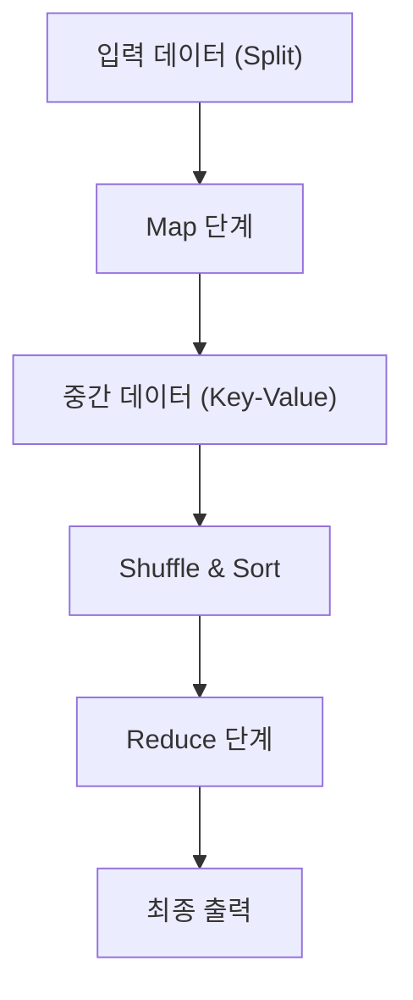

# MapReduce의 철학: Google이 세상을 바꾼 분산 처리

현대 디지털 사회에서 '빅데이터'라는 단어는 일상적인 것이 되었습니다. 하지만 그 방대한 데이터를 어떻게 효율적으로, 그리고 현실적인 비용과 시간 내에 처리할 것인가 하는 문제는 오랫동안 컴퓨터 과학에서 가장 큰 장벽 중 하나였습니다. 이 장벽을 허물고 현대 데이터 처리 인프라의 초석을 다진 것이 바로 2004년 Google의 Jeffrey Dean과 Sanjay Ghemawat가 발표한 논문 "MapReduce: Simplified Data Processing on Large Clusters"입니다.

본 문서에서는 MapReduce라는 프로그래밍 모델이 왜 세상을 바꾸었는지, 그 근저에 있는 철학, 아키텍처의 정교한 설계, 그리고 Hadoop에서 현대의 Apache Spark에 이르는 데이터 처리의 계보에 대해 심연의 기술 여행을 떠나보겠습니다.

## 1. 2004년 Google 논문이 가져온 충격

2000년대 초반, 급성장하는 웹의 인덱싱, 로그 분석, 크롤링 데이터 처리 등 Google이 직면했던 데이터 양은 기존 시스템으로는 도저히 감당할 수 없는 규모로 팽창하고 있었습니다. 당시의 분산 처리 시스템은 데이터 분할, 작업 스케줄링, 네트워크 통신, 그리고 무엇보다 '노드 장애'에 대한 대응을 프로그래머가 직접 개별적으로 작성해야 했기에 코드는 복잡해지고 버그의 온상이 되었습니다.

Google이 제시한 MapReduce는 이 모든 복잡성을 시스템 측에 은닉하고, 프로그래머가 'Map(사상)'과 'Reduce(축약)'라는 두 가지 함수만 정의하면 수천 대의 머신에서 병렬 처리를 실행할 수 있다는 획기적인 패러다임 전환을 가져왔습니다.

## 2. 함수형 언어에서 영감을 얻은 추상화: Map과 Reduce

MapReduce의 아름다움은 Lisp와 같은 함수형 프로그래밍 언어에 존재하는 `map`과 `reduce`라는 기본 개념을 분산 처리의 추상화 모델로 채택했다는 점에 있습니다.

- **Map 함수**: 입력으로 키와 값의 쌍을 받아 중간 데이터의 키와 값의 쌍을 생성합니다.
- **Reduce 함수**: 동일한 키에 연결된 모든 중간 값을 집계하여 최종 출력 결과를 생성합니다.

프로그래머는 데이터가 어디에 저장되어 있는지, 어떤 노드가 계산을 수행하는지, 통신이 어떻게 이루어지는지 전혀 신경 쓸 필요가 없습니다. 이러한 'What(무엇을 계산할 것인가)'과 'How(어떻게 분산 실행할 것인가)'의 완벽한 분리야말로 MapReduce의 가장 큰 혁신이었습니다.

## 3. 상용 하드웨어와 내결함성의 철학

슈퍼컴퓨터와 같이 비싸고 고장률이 낮은 전용 하드웨어가 아니라, 저렴한 시판 PC(상용 하드웨어)를 대량으로 배치하여 거대한 계산 능력을 구축하는 것이 Google의 기본 전략이었습니다. 하지만 수천 대의 PC를 가동하면 매일 반드시 어딘가의 노드에서 디스크 고장이나 메모리 에러, 네트워크 단절이 발생합니다.

MapReduce는 "장애는 예외가 아니라 일상이다"라는 전제 하에 설계되었습니다.
마스터 노드는 각 워커 노드를 주기적으로 모니터링(하트비트)하며, 응답이 없을 경우 즉시 해당 워커가 담당하던 작업을 다른 워커에게 재할당합니다. 데이터는 Google File System (GFS)에 의해 기본적으로 3개의 다른 청크 서버에 복제되어 있으므로 일부 노드가 다운되더라도 데이터가 손실되지 않고 계산을 계속할 수 있습니다.

## 4. 아키텍처의 심연: Shuffle & Sort의 교묘한 설계

MapReduce의 성능을 결정짓는 가장 중요하고 복잡한 단계가 'Shuffle & Sort(셔플 및 정렬)'입니다.
Map 단계가 종료되면 생성된 방대한 중간 데이터(Key-Value 쌍)는 동일한 키를 가진 데이터가 동일한 Reduce 작업에 모이도록 네트워크를 통해 전송되어야 합니다.

1. **파티셔닝**: Map 작업은 출력 데이터를 Reduce 작업의 수에 맞춰 분할(해시 함수 등 이용)합니다.
2. **로컬 정렬**: 분할된 데이터는 먼저 로컬 디스크에서 키를 기준으로 정렬됩니다.
3. **네트워크 전송 (Shuffle)**: Reduce 작업은 모든 Map 작업으로부터 자신에게 할당된 파티션의 데이터를 HTTP를 통해 가져옵니다(풀). 네트워크 I/O의 병목 현상을 피하기 위한 대역폭 제어가 매우 중요합니다.
4. **병합 (Merge)**: 여러 Map 작업에서 수집된 데이터는 다시 키 순서대로 병합되어 Reduce 함수로 전달됩니다.

이러한 네트워크를 통한 대규모 데이터의 이동(All-to-All 통신)을 어떻게 최적화하는지가 분산 처리 프레임워크의 진면목이라고 할 수 있습니다.

## 5. Hadoop의 탄생과 오픈소스화를 통한 에코시스템의 폭발

2004년에 Google의 논문이 발표되자 당시 Yahoo!에 재직 중이던 Doug Cutting 등은 자신들이 개발하던 검색 엔진 Nutch의 과제 해결을 위해 이 개념을 도입했고, 2006년에 오픈소스인 'Hadoop'으로 독립시켰습니다.
Hadoop은 GFS에 해당하는 'HDFS (Hadoop Distributed File System)'와 MapReduce의 구현을 제공하여, Google과 같은 거대한 인프라를 갖추지 못한 기업에서도 빅데이터 처리를 가능하게 했습니다.

이를 통해 데이터 웨어하우스로서의 Hive, 데이터 흐름을 기술하는 Pig, 기계 학습 라이브러리인 Mahout, NoSQL 데이터베이스인 HBase 등 거대한 'Hadoop 에코시스템'이 폭발적으로 형성되어 빅데이터 시대의 인프라로서 확고한 자리를 잡았습니다.

## 6. MapReduce의 한계와 Spark로의 진화

그러나 시대가 흐르면서 MapReduce 아키텍처 상의 한계도 뚜렷해졌습니다.
가장 큰 약점은 Map과 Reduce 작업 간의 데이터 전달을 항상 디스크(HDFS)를 거치도록 설계되었다는 점입니다. 이로 인해 기계 학습 알고리즘과 같은 반복 처리(이터레이션)나 실시간성이 요구되는 스트림 처리에서 디스크 I/O가 치명적인 병목이 되었습니다.

이러한 과제를 극복하기 위해 UC Berkeley에서 탄생한 것이 Apache Spark입니다. Spark는 Resilient Distributed Dataset (RDD)라는 추상화를 도입하고, 데이터를 가능한 한 메모리에 유지(인메모리 처리)함으로써 MapReduce 대비 최대 100배의 속도 향상을 실현했습니다. Spark의 등장으로 배치 처리로서의 MapReduce 프레임워크는 점차 그 역할을 다하게 됩니다.

## 7. 현대의 데이터 레이크와 MapReduce의 유산

오늘날 우리는 Snowflake나 Databricks, Google BigQuery와 같은 클라우드 네이티브 데이터 플랫폼을 사용하여 페타바이트급의 데이터를 SQL로 단 몇 초 만에 처리하고 있습니다.
MapReduce 프레임워크 자체를 직접 작성할 기회는 줄었지만, 그 근저에 있는 "데이터를 여러 노드로 분할하고(Map), 로컬에서 처리한 결과를 집계한다(Reduce)"는 분산 처리의 근본 원칙은 이 모든 모던 데이터 엔진의 핵심 아키텍처로 확실하게 맥동하고 있습니다.

## 8. 결어: 계산 패러다임의 변천

Google이 2004년에 발표한 MapReduce는 단순한 도구의 제안이 아니라, 컴퓨터 과학에 있어 "거대한 문제를 어떻게 단순하게 풀 것인가"라는 철학의 제시였습니다.
함수형 언어의 아름다운 추상화와 투박한 분산 시스템의 내결함성을 융합한 이 패러다임은 인류가 다루는 데이터 양을 기가바이트에서 페타바이트로 끌어올렸고, 현재 AI 혁명의 토대가 되는 데이터 기반을 구축했습니다.

우리가 무심코 검색 엔진을 이용하고, 추천을 받으며, AI와 대화하고 있는 그 이면에는 지금도 여전히 MapReduce의 DNA가 강력하게 살아 숨 쉬고 있는 것입니다.
