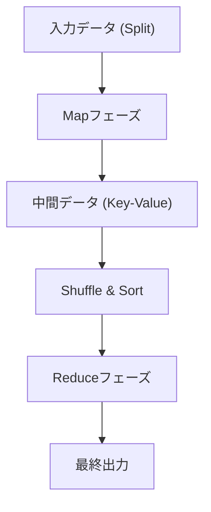

# MapReduceの哲学：Googleが世界を変えた分散処理

現代のデジタル社会において、「ビッグデータ」という言葉は日常的なものとなりました。しかし、その膨大なデータをいかにして効率的に、かつ現実的なコストと時間で処理するかという問題は、長らく計算機科学における最大の壁の一つでした。この壁を打ち破り、現代のデータ処理インフラの礎を築いたのが、2004年にGoogleのJeffrey DeanとSanjay Ghemawatによって発表された論文「MapReduce: Simplified Data Processing on Large Clusters」です。

本記事では、MapReduceというプログラミングモデルがなぜ世界を変えたのか、その根底にある哲学、アーキテクチャの精緻な設計、そしてHadoopから現代のApache Sparkへと至るデータ処理の系譜について、深淵なる技術の旅に出かけましょう。

## 1. 2004年のGoogle論文がもたらした衝撃

2000年代初頭、急成長するウェブのインデックス作成、ログ解析、クロールデータの処理など、Googleが直面していたデータ量は既存のシステムでは到底太刀打ちできない規模に膨れ上がっていました。当時の分散処理システムは、データの分割、タスクのスケジューリング、ネットワーク通信、そして何より「ノードの障害」に対する対応をプログラマ自身が個別に記述する必要があり、コードは複雑化し、バグの温床となっていました。

Googleが提示したMapReduceは、これらすべての複雑性をシステム側に隠蔽し、プログラマが「Map（写像）」と「Reduce（簡約）」という2つの関数を定義するだけで、何千台ものマシン上で並列処理を実行できるという画期的なパラダイムシフトをもたらしました。

## 2. 関数型言語から着想を得た抽象化：MapとReduce

MapReduceの美しさは、Lispなどの関数型プログラミング言語に存在する`map`と`reduce`という基本概念を、分散処理の抽象化モデルとして採用した点にあります。

- **Map関数**: 入力としてキーと値のペアを受け取り、中間データのキーと値のペアを生成します。
- **Reduce関数**: 同じキーに関連付けられたすべての中間値を集約し、最終的な出力結果を生成します。

プログラマは、データのどこに保存されているか、どのノードが計算を行うか、通信がどのように行われるかを一切気にする必要がありません。この「What（何を計算するか）」と「How（どのように分散実行するか）」の完全な分離こそが、MapReduceの最大のイノベーションでした。

## 3. コモディティハードウェアとフォールトトレランスの哲学

スーパーコンピュータのような高価で障害率の低い専用ハードウェアではなく、安価な市販のPC（コモディティハードウェア）を大量に並べて巨大な計算能力を構築するというのがGoogleの基本戦略でした。しかし、数千台のPCを稼働させれば、毎日必ずどこかのノードでディスクの故障やメモリのエラー、ネットワークの切断が発生します。

MapReduceは「障害は例外ではなく日常である」という前提のもとに設計されています。
マスターノードは各ワーカーノードを定期的に監視（ハートビート）し、応答がない場合は即座にそのワーカーが担当していたタスクを別のワーカーに再割り当てします。データはGoogle File System (GFS) によってデフォルトで3つの異なるチャンクサーバーに複製されているため、一部のノードがダウンしてもデータが失われることはなく、計算を継続できるのです。

## 4. アーキテクチャの深淵：Shuffle & Sortの巧妙な設計

MapReduceの性能を決定づける最も重要かつ複雑なフェーズが「Shuffle & Sort（シャッフルとソート）」です。
Mapフェーズが終了すると、生成された膨大な中間データ（Key-Valueペア）は、同じキーを持つデータが同じReduceタスクに集められるようにネットワークを介して転送されなければなりません。

1. **パーティショニング**: Mapタスクは出力データをReduceタスクの数に合わせて分割（ハッシュ関数などを利用）します。
2. **ローカルソート**: 分割されたデータはまずローカルディスク上でキーに基づいてソートされます。
3. **ネットワーク転送 (Shuffle)**: Reduceタスクは、すべてのMapタスクから自分に割り当てられたパーティションのデータをHTTP経由でプルします。ネットワークI/Oのボトルネックを避けるための帯域制御が極めて重要です。
4. **マージ**: 複数のMapタスクから集められたデータは、再度キー順にマージされ、Reduce関数へと渡されます。

このネットワークを介した大規模なデータの移動（All-to-All通信）をいかに最適化するかが、分散処理フレームワークの真骨頂と言えます。

## 5. Hadoopの誕生とオープンソース化によるエコシステムの爆発

2004年にGoogleの論文が発表されると、当時Yahoo!に在籍していたDoug Cuttingらは、自ら開発していた検索エンジンNutchの課題解決のためにこの概念を取り入れ、2006年にオープンソースの「Hadoop」として独立させました。
HadoopはGFSに相当する「HDFS (Hadoop Distributed File System)」と、MapReduceの実装を提供し、Googleのような巨大なインフラを持たない企業でもビッグデータ処理を可能にしました。

これにより、データウェアハウスとしてのHive、データフローを記述するPig、機械学習ライブラリのMahout、NoSQLデータベースのHBaseなど、巨大な「Hadoopエコシステム」が爆発的に形成され、ビッグデータ時代のインフラとしての地位を確立しました。

## 6. MapReduceの限界とSparkへの進化

しかし、時代が進むにつれ、MapReduceのアーキテクチャ上の限界も浮き彫りになってきました。
最大の弱点は、MapとReduceのジョブ間のデータ受け渡しを常にディスク（HDFS）を経由して行う設計になっていた点です。これにより、機械学習のアルゴリズムのような反復処理（イテレーション）や、リアルタイム性が求められるストリーム処理において、ディスクI/Oが致命的なボトルネックとなりました。

この課題を克服するためにUC Berkeleyで誕生したのがApache Sparkです。Sparkは、Resilient Distributed Dataset (RDD) という抽象化を導入し、データを可能な限りメモリ上に保持（インメモリ処理）することで、MapReduceと比較して最大100倍の高速化を実現しました。Sparkの登場により、バッチ処理としてのMapReduceフレームワークは徐々にその役割を終えていくことになります。

## 7. 現代のデータレイクとMapReduceの遺産

今日、私たちはSnowflakeやDatabricks、Google BigQueryといったクラウドネイティブなデータプラットフォームを使用し、ペタバイト級のデータをSQLで数秒で処理しています。
MapReduceのフレームワーク自体を直接記述する機会は減りましたが、その根底にある「データを複数のノードに分割し（Map）、ローカルで処理した結果を集約する（Reduce）」という分散処理の根本原則は、これらすべてのモダンなデータエンジンのコア・アーキテクチャとして確実に脈打っています。

## 8. 結語：計算パラダイムの変遷

Googleが2004年に発表したMapReduceは、単なるツールの提案ではなく、計算機科学における「巨大な問題をいかにしてシンプルに解くか」という哲学の提示でした。
関数型言語の美しい抽象化と、泥臭い分散システムの障害耐性を融合させたこのパラダイムは、人類が扱うデータ量をギガバイトからペタバイトへと押し上げ、現在のAI革命の土台となるデータ基盤を構築しました。

私たちが何気なく検索エンジンを利用し、レコメンデーションを受け取り、AIと対話している裏側には、今もなおMapReduceのDNAが力強く息づいているのです。
