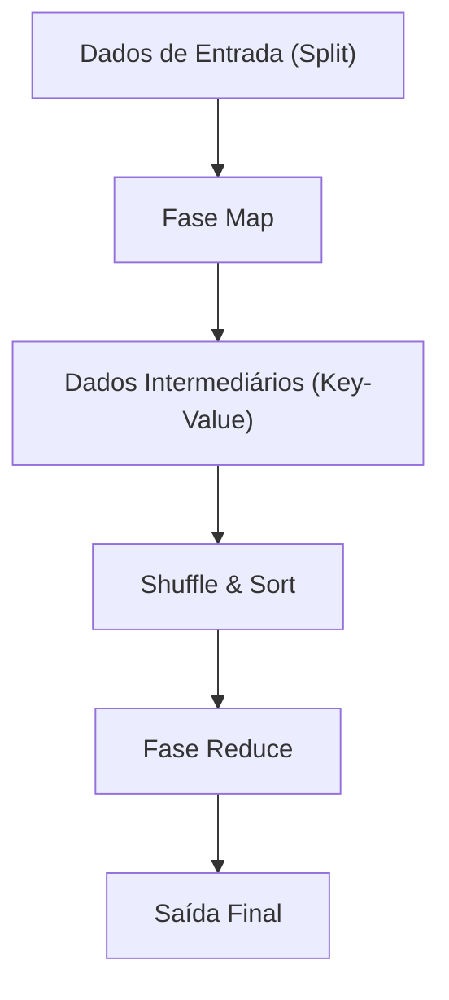

# A Filosofia do MapReduce: O Processamento Distribuído do Google que Mudou o Mundo

Na sociedade digital moderna, o termo "Big Data" tornou-se algo corriqueiro. No entanto, o problema de como processar essa enorme quantidade de dados de forma eficiente, com custo e tempo realistas, foi por muito tempo uma das maiores barreiras na ciência da computação. O que quebrou essa barreira e construiu a base da infraestrutura moderna de processamento de dados foi o artigo "MapReduce: Simplified Data Processing on Large Clusters", publicado em 2004 por Jeffrey Dean e Sanjay Ghemawat, do Google.

Neste artigo, vamos embarcar em uma jornada técnica profunda sobre o porquê do modelo de programação MapReduce ter mudado o mundo, a filosofia subjacente, o design preciso de sua arquitetura e a genealogia do processamento de dados que vai do Hadoop até o atual Apache Spark.

## 1. O Choque Causado pelo Artigo do Google de 2004

No início dos anos 2000, devido ao rápido crescimento da criação de índices da web, análise de logs e processamento de dados de rastreamento, o volume de dados que o Google enfrentava havia inflado para uma escala que os sistemas existentes simplesmente não conseguiam lidar. Nos sistemas de processamento distribuído da época, os próprios programadores precisavam escrever individualmente o código para divisão de dados, agendamento de tarefas, comunicação de rede e, acima de tudo, o tratamento de "falhas de nós". O código tornava-se complexo e um terreno fértil para bugs.

O MapReduce, apresentado pelo Google, trouxe uma mudança de paradigma revolucionária ao ocultar toda essa complexidade no lado do sistema. Permitindo que os programadores definissem apenas duas funções — "Map" (mapeamento) e "Reduce" (redução) —, tornou-se possível executar processamento paralelo em milhares de máquinas simultaneamente.

## 2. Abstração Inspirada em Linguagens Funcionais: Map e Reduce

A beleza do MapReduce reside no fato de ter adotado os conceitos fundamentais de `map` e `reduce`, presentes em linguagens de programação funcional como Lisp, como um modelo de abstração para o processamento distribuído.

- **Função Map**: Recebe um par de chave e valor como entrada e gera pares de chave e valor de dados intermediários.
- **Função Reduce**: Agrega todos os valores intermediários associados à mesma chave e gera o resultado final da saída.

Os programadores não precisam se preocupar de forma alguma com onde os dados estão armazenados, quais nós realizam os cálculos ou como a comunicação ocorre. Essa separação completa entre "O que calcular" (What) e "Como executar de forma distribuída" (How) foi a maior inovação do MapReduce.

## 3. Filosofia de Hardware de Commodity e Tolerância a Falhas

A estratégia básica do Google não era usar hardware dedicado, caro e com baixa taxa de falhas, como supercomputadores, mas sim construir uma enorme capacidade de computação alinhando um grande número de PCs comerciais baratos (hardware de commodity). No entanto, ao operar milhares de PCs, é inevitável que ocorram falhas de disco, erros de memória ou desconexões de rede em algum nó todos os dias.

O MapReduce foi projetado com a premissa de que "falhas não são exceções, mas sim rotina".
O nó mestre monitora regularmente cada nó de trabalho (worker node) através de pulsações (heartbeats) e, se não houver resposta, realoca imediatamente a tarefa da qual esse worker estava encarregado para outro worker. Como os dados são replicados por padrão em três servidores de fragmentos (chunk servers) diferentes pelo Google File System (GFS), mesmo que alguns nós caiam, os dados não são perdidos e a computação pode continuar.

## 4. O Abismo da Arquitetura: O Design Engenhoso do Shuffle & Sort

A fase mais importante e complexa que determina o desempenho do MapReduce é o "Shuffle & Sort" (Embaralhamento e Ordenação).
Quando a fase Map termina, a enorme quantidade de dados intermediários gerados (pares Key-Value) deve ser transferida pela rede para que os dados com a mesma chave sejam reunidos na mesma tarefa Reduce.

1. **Particionamento**: As tarefas Map dividem os dados de saída de acordo com o número de tarefas Reduce (usando funções de hash, etc.).
2. **Ordenação Local**: Os dados divididos são primeiro ordenados com base na chave no disco local.
3. **Transferência de Rede (Shuffle)**: As tarefas Reduce puxam (pull) os dados da partição atribuída a elas de todas as tarefas Map via HTTP. O controle de largura de banda para evitar gargalos de rede é extremamente importante.
4. **Mesclagem (Merge)**: Os dados coletados de múltiplas tarefas Map são mesclados novamente na ordem das chaves e passados para a função Reduce.

Como otimizar essa movimentação de dados em larga escala através da rede (comunicação All-to-All) pode ser considerado o verdadeiro valor de um framework de processamento distribuído.

## 5. O Nascimento do Hadoop e a Explosão do Ecossistema através do Código Aberto

Quando o artigo do Google foi publicado em 2004, Doug Cutting e outros, que na época estavam no Yahoo!, incorporaram esse conceito para resolver os problemas do mecanismo de busca Nutch que estavam desenvolvendo, e em 2006 o tornaram independente como o "Hadoop" de código aberto.
O Hadoop forneceu o "HDFS (Hadoop Distributed File System)", equivalente ao GFS, e uma implementação do MapReduce, possibilitando o processamento de Big Data mesmo para empresas que não possuíam uma infraestrutura gigante como a do Google.

Isso levou à formação explosiva de um enorme "Ecossistema Hadoop", incluindo o Hive como data warehouse, o Pig para descrever fluxos de dados, a biblioteca de aprendizado de máquina Mahout e o banco de dados NoSQL HBase, estabelecendo sua posição como a infraestrutura da era do Big Data.

## 6. As Limitações do MapReduce e a Evolução para o Spark

No entanto, com o passar do tempo, as limitações arquitetônicas do MapReduce também se tornaram evidentes.
A maior fraqueza era o design no qual a transferência de dados entre os jobs Map e Reduce sempre passava pelo disco (HDFS). Como resultado, em processamentos iterativos como algoritmos de aprendizado de máquina, e em processamentos de fluxo (stream processing) onde a natureza em tempo real é exigida, a E/S de disco tornou-se um gargalo fatal.

Para superar esse desafio, o Apache Spark nasceu na UC Berkeley. O Spark introduziu uma abstração chamada Resilient Distributed Dataset (RDD) e, ao manter os dados na memória o máximo possível (processamento in-memory), alcançou velocidades até 100 vezes mais rápidas em comparação com o MapReduce. Com o advento do Spark, o framework MapReduce como processamento em lote foi gradualmente cumprindo e encerrando seu papel.

## 7. Data Lakes Modernos e o Legado do MapReduce

Hoje, usamos plataformas de dados nativas da nuvem, como Snowflake, Databricks e Google BigQuery, processando petabytes de dados em segundos com SQL.
Embora a oportunidade de escrever diretamente para a estrutura MapReduce em si tenha diminuído, o princípio fundamental do processamento distribuído em sua essência — "dividir os dados em vários nós (Map) e agregar os resultados processados localmente (Reduce)" — continua a pulsar de forma confiável como a arquitetura central de todos esses mecanismos de dados modernos.

## 8. Conclusão: A Transição do Paradigma Computacional

O MapReduce anunciado pelo Google em 2004 não foi apenas a proposta de uma ferramenta, mas sim a apresentação de uma filosofia na ciência da computação sobre "como resolver problemas gigantes de forma simples".
Esse paradigma, que fundiu a bela abstração das linguagens funcionais com a tolerância a falhas robusta dos sistemas distribuídos, elevou a quantidade de dados manipulados pela humanidade de gigabytes para petabytes e construiu a base de dados que serve de alicerce para a atual revolução da IA.

Por trás do nosso uso casual de mecanismos de busca, do recebimento de recomendações e da interação com IA, o DNA do MapReduce continua a respirar fortemente até hoje.
