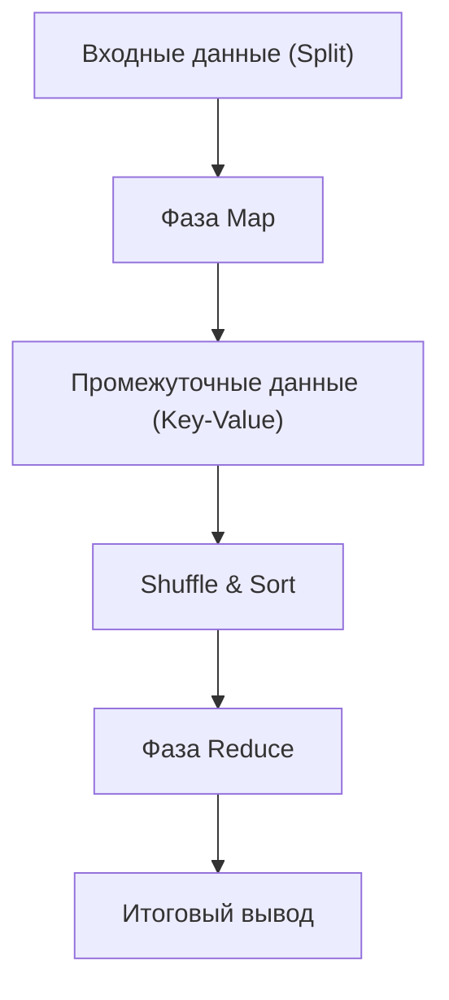

# Философия MapReduce: Распределенная обработка, с помощью которой Google изменил мир

В современном цифровом обществе термин «большие данные» стал обыденным. Однако проблема того, как эффективно обрабатывать эти колоссальные объемы данных при реалистичных затратах и за разумное время, долгое время оставалась одним из величайших барьеров в информатике. Прорывом, разрушившим этот барьер и заложившим основу современной инфраструктуры обработки данных, стала статья "MapReduce: Simplified Data Processing on Large Clusters", опубликованная в 2004 году Джеффри Дином (Jeffrey Dean) и Санджаем Гемаватом (Sanjay Ghemawat) из Google.

В этой статье мы отправимся в глубокое технологическое путешествие, чтобы понять, почему программная модель MapReduce изменила мир, изучим лежащую в ее основе философию, тонко продуманную архитектуру, а также генеалогию обработки данных от Hadoop до современного Apache Spark.

## 1. Шок, вызванный статьей Google в 2004 году

В начале 2000-х годов объемы данных, с которыми столкнулся Google — индексирование стремительно растущего интернета, анализ журналов (логов), обработка данных сканирования, — разрослись до таких масштабов, с которыми существующие системы были совершенно не в силах справиться. В распределенных системах того времени программистам приходилось самостоятельно описывать разделение данных, планирование задач, сетевую связь и, что важнее всего, реагирование на «сбои узлов». В результате код становился переусложненным и превращался в рассадник ошибок (багов).

Представленная Google модель MapReduce скрыла всю эту сложность на стороне системы и вызвала революционный сдвиг парадигмы, позволив программистам выполнять параллельную обработку на тысячах машин, просто определив две функции: «Map» (отображение) и «Reduce» (свертка).

## 2. Абстракция, вдохновленная функциональными языками: Map и Reduce

Красота MapReduce заключается в том, что базовые концепции `map` и `reduce`, существующие в таких языках функционального программирования, как Lisp, были приняты в качестве абстрактной модели для распределенной обработки.

- **Функция Map**: Принимает пару ключ-значение в качестве входных данных и генерирует промежуточные пары ключ-значение.
- **Функция Reduce**: Агрегирует все промежуточные значения, связанные с одним и тем же ключом, и генерирует окончательный результат вывода.

Программисту совершенно не нужно беспокоиться о том, где хранятся данные, какой узел выполняет вычисления или как осуществляется обмен данными. Именно это полное разделение «What» (что вычислять) и «How» (как это распределенно выполнять) стало величайшей инновацией MapReduce.

## 3. Философия аппаратного обеспечения широкого потребления и отказоустойчивости

Базовая стратегия Google заключалась в создании огромных вычислительных мощностей путем объединения большого количества дешевых, доступных на рынке ПК (товарного оборудования), а не использования дорогостоящего специализированного оборудования с низким уровнем отказов, такого как суперкомпьютеры. Однако, при работе тысяч ПК, каждый день неизбежно будут возникать сбои дисков, ошибки памяти или обрывы сетевых соединений на каких-либо узлах.

MapReduce спроектирован исходя из предпосылки, что «сбои — это не исключение, а повседневная рутина».
Главный узел регулярно отслеживает каждый рабочий узел с помощью сигналов сердцебиения, и в случае отсутствия ответа он немедленно переназначает задачу, за которую отвечал этот рабочий узел, другому. Поскольку данные по умолчанию реплицируются файловой системой Google (GFS) на три разных сервера фрагментов, даже если некоторые узлы выйдут из строя, данные не будут потеряны, и вычисления смогут продолжаться.

## 4. Глубины архитектуры: Искусный дизайн Shuffle & Sort

Самой важной и сложной фазой, определяющей производительность MapReduce, является «Shuffle & Sort» (Перемешивание и сортировка).
По завершении фазы Map, сгенерированные огромные объемы промежуточных данных (пары Key-Value) должны быть переданы по сети таким образом, чтобы данные с одинаковыми ключами собирались в одной и той же задаче Reduce.

1. **Партиционирование**: Задача Map разделяет выходные данные в соответствии с количеством задач Reduce (например, с использованием хэш-функции).
2. **Локальная сортировка**: Разделенные данные сначала сортируются на локальном диске по ключу.
3. **Сетевая передача (Shuffle)**: Задачи Reduce извлекают данные назначенного им раздела из всех задач Map через HTTP. Управление пропускной способностью имеет решающее значение во избежание узких мест сетевого ввода-вывода.
4. **Слияние**: Данные, собранные из множества задач Map, снова сливаются в порядке ключей и передаются в функцию Reduce.

То, как оптимизируется это крупномасштабное перемещение данных по сети (связь «все со всеми»), и есть истинное проявление мастерства фреймворка распределенной обработки.

## 5. Рождение Hadoop и взрыв экосистемы благодаря открытому исходному коду

Когда в 2004 году была опубликована статья Google, Дуг Каттинг и другие, работавшие в то время в Yahoo!, переняли эту концепцию для решения проблем поисковой системы Nutch, которую они разрабатывали. В 2006 году они выделили ее в независимый проект с открытым исходным кодом под названием «Hadoop».
Hadoop предоставил «HDFS» (Hadoop Distributed File System), аналог GFS, и реализацию MapReduce, позволив обрабатывать большие данные даже компаниям, не обладающим колоссальной инфраструктурой, подобной Google.

Благодаря этому стремительно сформировалась гигантская «Экосистема Hadoop», включающая в себя Hive в качестве хранилища данных, Pig для описания потоков данных, библиотеку машинного обучения Mahout, NoSQL базу данных HBase и многое другое, что утвердило ее статус инфраструктуры эпохи больших данных.

## 6. Ограничения MapReduce и эволюция к Spark

Однако, с течением времени также стали очевидны архитектурные ограничения MapReduce.
Главной слабостью было то, что он был спроектирован так, что передача данных между заданиями Map и Reduce всегда происходила через диск (HDFS). В результате, для итеративных процессов (например, алгоритмов машинного обучения) и потоковой обработки, требующей работы в реальном времени, дисковый ввод-вывод стал фатальным узким местом.

Для преодоления этой проблемы в Калифорнийском университете в Беркли был создан Apache Spark. Spark ввел абстракцию под названием Resilient Distributed Dataset (RDD) и за счет удержания данных в памяти, насколько это возможно (обработка in-memory), достиг ускорения до 100 раз по сравнению с MapReduce. С появлением Spark фреймворк MapReduce в качестве средства пакетной обработки стал постепенно завершать свою роль.

## 7. Современные озера данных и наследие MapReduce

Сегодня мы используем облачные платформы данных, такие как Snowflake, Databricks и Google BigQuery, и обрабатываем петабайтные объемы данных за считанные секунды с помощью SQL.
Возможностей напрямую писать код в самом фреймворке MapReduce стало меньше, но лежащий в его основе фундаментальный принцип распределенной обработки — «разделение данных на несколько узлов (Map) и агрегация результатов локальной обработки (Reduce)» — несомненно пульсирует в качестве основной архитектуры всех этих современных систем обработки данных.

## 8. Заключение: Смена вычислительных парадигм

MapReduce, представленный Google в 2004 году, был не просто предложением инструмента, а презентацией философии в информатике о том, «как просто решать гигантские проблемы».
Эта парадигма, объединившая в себе красивую абстракцию функциональных языков и приземленную отказоустойчивость распределенных систем, подняла объем данных, обрабатываемых человечеством, с гигабайт до петабайт, и создала основу данных, служащую фундаментом для нынешней революции искусственного интеллекта.

За кулисами того, как мы беззаботно используем поисковые системы, получаем рекомендации и общаемся с ИИ, до сих пор мощно дышит ДНК MapReduce.
