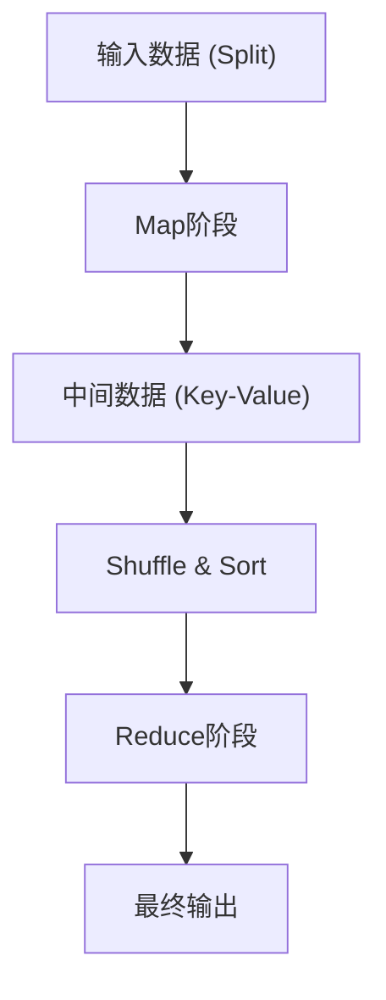

# MapReduce的哲学：Google改变世界的分布式处理

在现代数字社会中，“大数据”这个词已经变得司空见惯。然而，如何高效且以实际可行的成本和时间来处理这些海量数据，长期以来一直是计算机科学面临的最大壁垒之一。打破这一壁垒并奠定现代数据处理基础设施基石的，正是Google的Jeffrey Dean和Sanjay Ghemawat于2004年发表的论文《MapReduce: Simplified Data Processing on Large Clusters》（MapReduce：大型集群上的简化数据处理）。

在本文中，我们将深入探究MapReduce这种编程模型为何能够改变世界，其底层的哲学思想、精密的架构设计，以及从Hadoop到现代Apache Spark的数据处理发展谱系，开启一场深邃的技术之旅。

## 1. 2004年Google论文带来的冲击

2000年代初，随着互联网的快速增长，Google在网页索引创建、日志分析、抓取数据处理等方面面临的数据量已经膨胀到了现有系统完全无法应对的规模。当时的分布式处理系统要求程序员自己单独编写代码来处理数据分割、任务调度、网络通信，以及最关键的“节点故障”应对方案，导致代码变得异常复杂，成为了漏洞的温床。

Google提出的MapReduce将所有这些复杂性隐藏在系统内部，带来了一场划时代的范式转变：程序员只需定义“Map（映射）”和“Reduce（归约）”这两个函数，就可以在数千台机器上并发执行处理任务。

## 2. 从函数式语言中获得灵感的抽象化：Map与Reduce

MapReduce的美妙之处在于，它采用了Lisp等函数式编程语言中存在的`map`和`reduce`基本概念，将其作为分布式处理的抽象化模型。

- **Map函数**：接收键值对（Key-Value对）作为输入，生成中间数据的键值对。
- **Reduce函数**：将与相同键关联的所有中间值进行聚合，生成最终的输出结果。

程序员完全不需要关心数据存储在哪里、哪个节点执行计算、通信是如何进行的。这种“What（计算什么）”与“How（如何分布式执行）”的完全分离，正是MapReduce最核心的创新。

## 3. 商品化硬件与容错性哲学

Google的基本战略并不是使用像超级计算机那样昂贵且故障率极低的专用硬件，而是将大量廉价的市售PC（商品化硬件）并联起来，构建出巨大的计算能力。然而，如果运行数千台PC，每天必然会有某些节点发生磁盘故障、内存错误或网络断开。

MapReduce是建立在“故障不是例外，而是日常”这一前提下设计的。
主节点（Master Node）会定期监控（Heartbeat）各个工作节点（Worker Node），如果没有响应，会立即将该工作节点负责的任务重新分配给其他工作节点。数据通过Google文件系统（GFS）默认复制到3个不同的块服务器（Chunk Server）上，因此即使部分节点宕机，数据也不会丢失，计算可以继续进行。

## 4. 架构的深渊：Shuffle & Sort的巧妙设计

决定MapReduce性能的最重要且最复杂的阶段是“Shuffle & Sort（洗牌与排序）”。
Map阶段结束后，生成的海量中间数据（键值对）必须通过网络进行传输，以确保具有相同键的数据能够被集中到同一个Reduce任务中。

1. **分区 (Partitioning)**：Map任务会根据Reduce任务的数量对输出数据进行分割（通常使用哈希函数）。
2. **本地排序 (Local Sort)**：分割后的数据首先会在本地磁盘上根据键进行排序。
3. **网络传输 (Shuffle)**：Reduce任务通过HTTP从所有Map任务中拉取分配给自己分区的数据。为了避免网络I/O瓶颈，带宽控制变得极其重要。
4. **合并 (Merge)**：从多个Map任务收集来的数据会再次按键的顺序进行合并，然后传递给Reduce函数。

如何优化这种跨网络的大规模数据移动（All-to-All通信），可以说是分布式处理框架的精髓所在。

## 5. Hadoop的诞生与开源化带来的生态系统大爆发

2004年Google发表论文后，当时就职于Yahoo!的Doug Cutting等人为了解决其自身开发的搜索引擎Nutch所面临的问题，引入了这一概念，并于2006年将其作为开源项目“Hadoop”独立出来。
Hadoop提供了相当于GFS的“HDFS (Hadoop Distributed File System)”和MapReduce的实现，使得即使没有Google那样庞大基础设施的企业也能进行大数据处理。

由此，作为数据仓库的Hive、用于描述数据流的Pig、机器学习库Mahout、NoSQL数据库HBase等庞大的“Hadoop生态系统”呈爆发式形成，确立了其作为大数据时代基础设施的地位。

## 6. MapReduce的局限与向Spark的进化

然而，随着时代的进步，MapReduce在架构上的局限性也逐渐暴露出来。
其最大的弱点在于，Map和Reduce作业之间的数据传递总是被设计为必须通过磁盘（HDFS）进行。这使得在机器学习算法等迭代处理，以及要求实时性的流处理中，磁盘I/O成为了致命的瓶颈。

为了克服这一挑战，Apache Spark在加州大学伯克利分校（UC Berkeley）应运而生。Spark引入了弹性分布式数据集（Resilient Distributed Dataset, RDD）这一抽象概念，尽可能地将数据保存在内存中（内存计算），从而实现了比MapReduce快达100倍的速度提升。随着Spark的出现，作为批处理框架的MapReduce逐渐完成了它的历史使命。

## 7. 现代数据湖与MapReduce的遗产

今天，我们使用Snowflake、Databricks或Google BigQuery等云原生数据平台，通过SQL在几秒钟内就能处理PB级的数据。
虽然我们直接编写MapReduce框架代码的机会减少了，但其底层的“将数据分割到多个节点（Map），并将本地处理的结果进行聚合（Reduce）”这一分布式处理的基本原则，无疑仍作为所有这些现代数据引擎的核心架构在跳动。

## 8. 结语：计算范式的变迁

Google在2004年发布的MapReduce，不仅仅是一个工具的提案，更是计算机科学中“如何简单地解决巨大问题”这一哲学思想的展现。
这种将函数式语言的美妙抽象与泥土般朴实的分布式系统容错性相融合的范式，将人类处理的数据量从GB级别推向了PB级别，构建了支撑当前AI革命的数据基础。

当我们不经意地使用搜索引擎、接收推荐信息、与AI进行对话时，在这些操作的背后，MapReduce的DNA依然在强劲地呼吸着。
