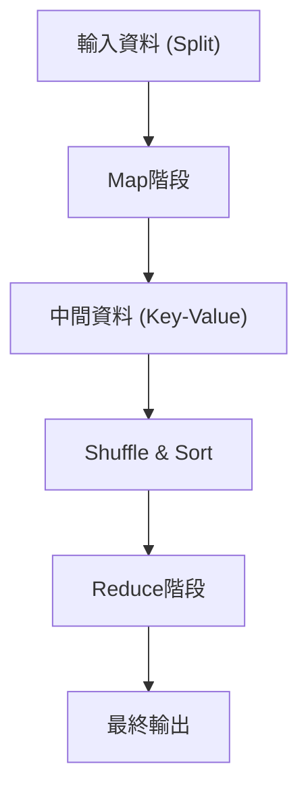

# MapReduce的哲學：Google改變世界的分散式處理

在現代數位社會中，「巨量資料（Big Data）」這個詞彙已經成為日常生活的一部分。然而，如何有效率且以符合現實的成本與時間來處理這些龐大的資料，長久以來一直是計算機科學中最大的障礙之一。打破這道高牆，並奠定現代資料處理基礎設施基石的，正是Google的Jeffrey Dean與Sanjay Ghemawat在2004年發表的論文《MapReduce: Simplified Data Processing on Large Clusters》。

在本文中，我們將深入探討MapReduce這個程式設計模型為何能改變世界，其根本的哲學、架構的精妙設計，以及從Hadoop到現代Apache Spark的資料處理發展系譜，展開一場深邃的技術之旅。

## 1. 2004年Google論文帶來的衝擊

在2000年代初期，面對快速成長的網頁索引建立、日誌分析、爬蟲資料處理等需求，Google所面臨的資料量已經膨脹到現有系統完全無法應付的規模。當時的分散式處理系統，舉凡資料的分割、任務的排程、網路通訊，以及最重要的「節點故障」應對，都必須由程式設計師自己個別編寫程式碼來處理，導致程式碼變得極度複雜，並成為臭蟲（bug）的溫床。

Google所提出的MapReduce，將所有這些複雜性都隱藏在系統後方，程式設計師只需要定義「Map（映射）」與「Reduce（歸納）」這兩個函式，就能在數千台機器上執行平行處理，這帶來了劃時代的典範轉移。

## 2. 從函數式語言獲得靈感的抽象化：Map與Reduce

MapReduce的美妙之處在於，它將Lisp等函數式程式設計語言中存在的`map`與`reduce`基本概念，採用為分散式處理的抽象化模型。

- **Map函式**：接收鍵與值的配對（Key-Value pair）作為輸入，並產生中間資料的鍵與值的配對。
- **Reduce函式**：將所有與相同鍵關聯的中間值進行彙整，並產生最終的輸出結果。

程式設計師完全不需要關心資料儲存在哪裡、由哪個節點執行計算、或是通訊是如何進行的。這種「What（要計算什麼）」與「How（要如何分散執行）」的徹底分離，正是MapReduce最大的創新。

## 3. 商用硬體與容錯機制的哲學

Google的基本戰略，並非使用如超級電腦般昂貴且故障率低的專用硬體，而是大量並列便宜的市售個人電腦（商用硬體，Commodity Hardware）來建構巨大的運算能力。然而，當運作數千台個人電腦時，每天必定會在某些節點上發生硬碟故障、記憶體錯誤或網路斷線。

MapReduce是建立在「故障不是例外，而是日常」的假設之上所設計的。
主節點（Master Node）會定期監控各個工作節點（Worker Node）（即心跳機制，Heartbeat），如果在規定時間內沒有回應，便會立即將該工作節點負責的任務重新分配給其他工作節點。由於資料透過Google檔案系統（Google File System, GFS）預設會複製到3個不同的區塊伺服器（Chunk Server）上，因此即使部分節點當機，資料也不會遺失，計算仍可繼續進行。

## 4. 架構的深淵：Shuffle & Sort的巧妙設計

決定MapReduce效能最重要且最複雜的階段，就是「Shuffle & Sort（洗牌與排序）」。
當Map階段結束後，所產生的龐大中間資料（Key-Value配對），必須透過網路進行傳輸，以便將擁有相同鍵的資料集中到同一個Reduce任務中。

1. **資料分區 (Partitioning)**：Map任務會根據Reduce任務的數量（利用雜湊函式等）來分割輸出資料。
2. **本地排序 (Local Sort)**：分割後的資料會先在本地硬碟上根據鍵進行排序。
3. **網路傳輸 (Shuffle)**：Reduce任務會透過HTTP從所有的Map任務中，拉取（Pull）分配給自己的分區資料。為了避免網路I/O成為瓶頸，頻寬控制顯得極為重要。
4. **合併 (Merge)**：從多個Map任務收集而來的資料，會再次按照鍵的順序進行合併，並傳遞給Reduce函式。

如何最佳化這種透過網路進行的大規模資料移動（All-to-All通訊），可以說是分散式處理框架的真正價值所在。

## 5. Hadoop的誕生與開源化帶來的生態系爆發

當2004年Google發表這篇論文時，當時任職於Yahoo!的Doug Cutting等人，為了為自己開發的搜尋引擎Nutch解決難題，引進了這個概念，並在2006年將其獨立為開源專案「Hadoop」。
Hadoop提供了相當於GFS的「HDFS (Hadoop Distributed File System)」以及MapReduce的實作，讓沒有像Google那樣龐大基礎設施的企業也能夠進行巨量資料處理。

這促成了龐大的「Hadoop生態系」爆發性地形成，包括作為資料倉儲的Hive、描述資料流的Pig、機器學習函式庫Mahout、以及NoSQL資料庫HBase等，確立了其作為巨量資料時代基礎設施的地位。

## 6. MapReduce的極限與向Spark的進化

然而，隨著時代推進，MapReduce在架構上的極限也逐漸浮現。
它最大的弱點在於，Map與Reduce的作業（Job）之間的資料傳遞，被設計成必須始終透過硬碟（HDFS）進行。這導致在處理如機器學習演算法這種反覆運算（Iteration）或是需要即時性的串流處理時，硬碟I/O成為了致命的瓶頸。

為了解決這個難題，在加州大學柏克萊分校（UC Berkeley）誕生了Apache Spark。Spark引入了彈性分散式資料集（Resilient Distributed Dataset, RDD）這種抽象化概念，透過盡可能將資料保留在記憶體中（記憶體內處理，In-memory Processing），實現了比MapReduce快達100倍的速度。隨著Spark的出現，作為批次處理的MapReduce框架便逐漸完成了它的歷史使命。

## 7. 現代資料湖與MapReduce的遺產

到了今天，我們使用諸如Snowflake、Databricks、Google BigQuery等雲端原生（Cloud-native）的資料平台，能在幾秒鐘內用SQL處理PB（Petabyte）等級的資料。
雖然直接編寫MapReduce框架本身的機會減少了，但其底層的「將資料分割至多個節點（Map），並將本地處理的結果進行彙整（Reduce）」這種分散式處理的根本原則，確實仍作為所有這些現代資料引擎的核心架構跳動著。

## 8. 結語：計算典範的變遷

Google在2004年發表的MapReduce，不僅僅是提出一個工具，更是提出了計算機科學中「如何簡單地解決巨大問題」的哲學。
這種將函數式語言優美的抽象化，與充滿泥濘的分散式系統容錯能力相融合的典範，將人類處理的資料量從GB推升至PB，並建構了成為當前AI革命基礎的資料平台。

當我們不經意地使用搜尋引擎、接收推薦內容、與AI進行對話時，在這些運作的背後，MapReduce的DNA至今依然強而有力地生生不息。
