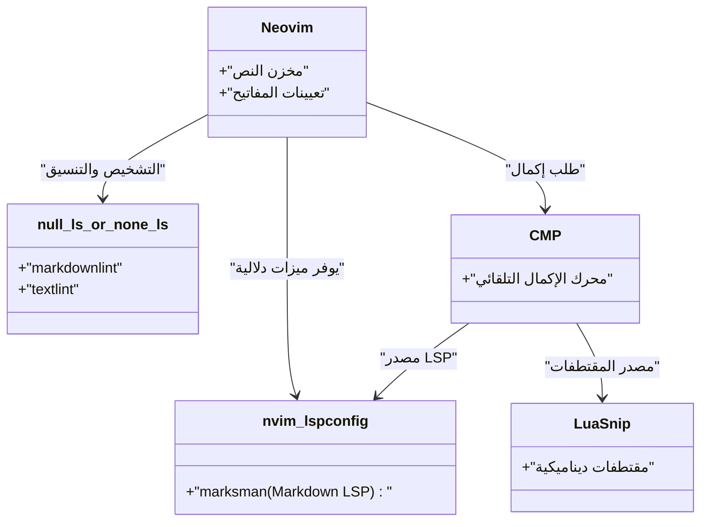
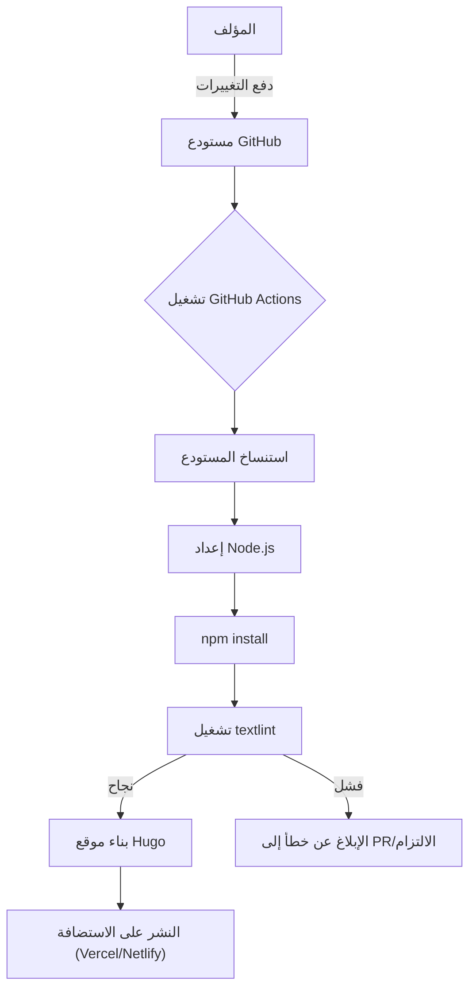

من أجل الاستمرار في كتابة مدونة تقنية، من الضروري تحسين بيئة الكتابة. في هذا المقال، سنتعمق في إعدادات المحرر المتقدمة لتحسين سرعة كتابة المدونات التقنية باستخدام Markdown بشكل كبير. سنشرح بشكل شامل التخصيص الأقصى لكل من Visual Studio Code (VS Code) و Neovim، واستخدام المقتطفات (snippets)، وإدخال أداة فحص القواعد textlint، وصولاً إلى الأتمتة باستخدام خطوط أنابيب CI/CD، وأحدث تقنيات الكتابة باستخدام النماذج اللغوية الكبيرة (LLMs) مثل GitHub Copilot.

## 1. النموذج الرياضي لتحسين سرعة الكتابة

لنفهم أولاً بوضع نموذج باستخدام معادلة بسيطة مدى تأثير تحسين إعدادات المحرر على وقت الكتابة. لنفترض أن إجمالي وقت الإدخال لكتابة مقال واحد في المدونة هو $T_{total}$.

$$
T_{total} = T_{think} + T_{type} + T_{format} + T_{review}
$$

هنا، $T_{think}$ هو وقت التفكير، و $T_{type}$ هو وقت الكتابة (الطباعة)، و $T_{format}$ هو وقت ضبط التنسيق مثل Markdown، و $T_{review}$ هو وقت المراجعة والتدقيق.

الوقت الذي يتم توفيره $T_{saved}$ من خلال تخصيص المحرر (مثل إدخال المقتطفات وإعدادات Linter) يمكن التعبير عنه بالمعادلة التالية باستخدام عدد مرات الظهور $N$ لنمط معين (على سبيل المثال، الرموز المختصرة لـ Hugo أو جداول Markdown)، والوقت المستغرق للإدخال اليدوي $t_{manual}$، والوقت المستغرق بواسطة الأتمتة مثل المقتطفات $t_{snippet}$.

$$
T_{saved} = \sum_{i=1}^{k} N_i \times (t_{manual, i} - t_{snippet, i}) + T_{review\_saved}
$$

علاوة على ذلك، من خلال إدخال منسقات تلقائية وأدوات Lint، سيتم تقليل وقت الفحص البصري البشري $T_{review}$ بشكل كبير. إن تحقيق أقصى قدر من $T_{saved}$ هو بالضبط الهدف من هذا المقال.

## 2. أفضل إعدادات لـ Visual Studio Code (VS Code)

يعد VS Code واحداً من أكثر المحررات استخداماً اليوم، ولديه نظام بيئي قوي من الإضافات لكتابة Markdown.

### الإضافات الموصى بها

لتسريع الكتابة، نوصي بشدة بتثبيت الإضافات التالية:

1. **Markdown All in One**: يحتوي على جميع الميزات الأساسية اللازمة لكتابة Markdown، مثل الخط العريض والمائل عبر اختصارات لوحة المفاتيح، والاستمرار التلقائي للقوائم، والإنشاء التلقائي لجدول المحتويات (TOC).
2. **markdownlint**: يحذرك في الوقت الفعلي من أخطاء بناء الجملة وانتهاكات النمط في Markdown.
3. **vscode-textlint**: يطبق مجموعة قواعد للنصوص التقنية، مما يمنع عدم اتساق التعبيرات والأخطاء النحوية.

### إعداد مقتطفات مخصصة لـ Hugo (`markdown.json`)

إذا كنت تستخدم مولد مواقع ثابتة مثل Hugo أو Docusaurus لمدونتك التقنية، فستحتاج بشكل متكرر إلى إدخال Frontmatter أو رموز مختصرة خاصة. باستخدام ميزة المقتطفات في VS Code، يمكنك نشر هذه الأشياء في لحظة.

من لوحة الأوامر، حدد `Preferences: Configure User Snippets`، وأضف الإعدادات التالية إلى `markdown.json`.

```json
{
  "Hugo Frontmatter": {
    "prefix": "frontmatter",
    "body": [
      "---",
      "title: \"${1:العنوان}\"",
      "slug: \"${2:اسم-الرابط}\"",
      "date: \"$CURRENT_YEAR-$CURRENT_MONTH-$CURRENT_DATE T$CURRENT_HOUR:$CURRENT_MINUTE:$CURRENT_SECOND+09:00\"",
      "image: \"img/eyecatch.jpg\"",
      "math: true",
      "mermaid: true",
      "categories: [\"${3:الفئة}\"]",
      "tags: [\"${4:وسم1}\", \"${5:وسم2}\"]",
      "---",
      "",
      "${0}"
    ],
    "description": "ينشر YAML Frontmatter لـ Hugo"
  },
  "Hugo Figure Shortcode": {
    "prefix": "hfig",
    "body": [
      "{{< figure src=\"${1:image.jpg}\" title=\"${2:عنوان الصورة}\" >}}"
    ],
    "description": "الرمز المختصر Figure لـ Hugo"
  },
  "Markdown Table": {
    "prefix": "mtable",
    "body": [
      "| ${1:رأس 1} | ${2:رأس 2} | ${3:رأس 3} |",
      "| :--- | :---: | ---: |",
      "| ${4:صف 1} | ${5:بيانات} | ${6:بيانات} |",
      "| ${7:صف 2} | ${8:بيانات} | ${9:بيانات} |",
      "$0"
    ],
    "description": "ينشئ جدول Markdown من 3 أعمدة"
  }
}
```

باستخدام هذا الإعداد، فقط بكتابة `frontmatter` والضغط على مفتاح Tab، سيتم نشر YAML Frontmatter الذي يتضمن الوقت الحالي على الفور، مما يزيد من السرعة الأولية للكتابة بشكل كبير.

### دعم الكتابة باستخدام GitHub Copilot

عند تفعيل GitHub Copilot في VS Code، فإن الإكمال بالذكاء الاصطناعي بناءً على السياق يعمل أيضاً في Markdown. خاصة في حالة المدونات التقنية، يتوقع الذكاء الاصطناعي مسبقاً "الهيكل الذي يجب شرحه تالياً" أو "كتل الأكواد ذات الصلة" ويقترحها لك، مما يسمح لك بتقليل وقت الطباعة $T_{type}$ بشكل كبير.

## 3. التخصيص الأقصى في Neovim

على الرغم من أن واجهة المستخدم الرسومية لـ VS Code ممتازة، إلا أنه بالنسبة لمحبي الطرفية ومستخدمي Vim، يعتبر Neovim الخيار الأقوى حيث يمكن إنجاز كل شيء دون رفع يديك عن لوحة المفاتيح.

### بنية Neovim LSP

بنية LSP (Language Server Protocol) و Linter لـ Neovim في بيئة Markdown هي كما يلي.



### النشر المتقدم للمقتطفات باستخدام LuaSnip

الأداة الأقوى من مقتطفات JSON في VS Code هي إضافة Neovim المسماة `LuaSnip`. باستخدام منطق Lua، يمكنك حساب ونشر محتوى المقتطفات ديناميكيًا.

فيما يلي مثال على إعداد LuaSnip الذي يجلب التاريخ والوقت الحاليين ديناميكيًا وينشر Frontmatter لـ Hugo.

```lua
local ls = require("luasnip")
local s = ls.snippet
local t = ls.text_node
local i = ls.insert_node
local f = ls.function_node

-- دالة للحصول على الوقت الحالي بتوقيت اليابان (JST)
local function get_current_date_jst()
    return os.date("!%Y-%m-%dT%H:%M:%S") .. "+09:00"
end

ls.add_snippets("markdown", {
    s("frontmatter", {
        t({"---", "title: \""}), i(1, "العنوان"), t({"\"", "slug: \""}), i(2, "اسم-الرابط"), t({"\"", "date: \""}),
        f(function() return {get_current_date_jst()} end, {}),
        t({"\"", "image: \"img/eyecatch.jpg\"", "math: true", "mermaid: true", "categories: [\""}), i(3, "الفئة"), t({"\"]", "tags: [\""}), i(4, "الوسم"), t({"\"]", "---", "", ""}),
        i(0)
    }),
    s("mtable", {
        t({"| "}), i(1, "رأس 1"), t({" | "}), i(2, "رأس 2"), t({" |", "|---|---|", "| "}), i(3, "خلية 1"), t({" | "}), i(4, "خلية 2"), t({" |"}),
    })
})
```

بهذه الطريقة، من خلال استعارة قوة لغة البرمجة (Lua)، من الممكن إنشاء مقتطفات معقدة لا تقوم فقط بإدراج سلاسل نصية ثابتة، بل تدمج القيم المعادة من الدوال، أو تزيد وتنقص عدد أعمدة الجدول ديناميكيًا بناءً على عدد الحروف المدخلة.

## 4. التحليل الثابت الذي يجمع بين جودة الكتابة والسرعة (textlint والتعبيرات النمطية)

لضمان جودة المدونة، من الضروري منع الأخطاء المطبعية وعدم الاتساق في التعبيرات. القيام بذلك يدويًا سيؤدي إلى زيادة هائلة في وقت المراجعة $T_{review}$، لذلك سنقوم بإدخال التحليل الثابت باستخدام `textlint`.

### تثبيت textlint ومجموعة قواعد اللغة

قم بتثبيت textlint ضمن بيئة Node.js.

```bash
npm install -D textlint textlint-rule-preset-ja-technical-writing textlint-rule-prh textlint-filter-rule-comments
```

قم بإنشاء `.textlintrc.json` في جذر المشروع، واضبطه كالتالي.

```json
{
  "filters": {
    "comments": true
  },
  "rules": {
    "preset-ja-technical-writing": {
      "ja-no-mixed-period": {
        "periodMark": "。"
      },
      "sentence-length": {
        "max": 100
      }
    },
    "prh": {
      "rulePaths": ["./prh.yml"]
    }
  }
}
```

قم بإنشاء `prh.yml` وحدد التناقضات في تعبيرات المصطلحات التقنية. على سبيل المثال، توحيد "سيرفر" مع "خادم"، و "Javascript" مع "JavaScript".

```yaml
version: 1
rules:
  - expected: "JavaScript"
    pattern:  "Javascript"
  - expected: "خادم"
    pattern: "سيرفر"
  - expected: "واجهة"
    pattern: "انترفيس"
```

بفضل هذا، في كل مرة تكتب فيها نصًا في المحرر، سيتم تحذيرك من التناقضات في التعبيرات في الوقت الفعلي، وسيصبح وقت التدقيق اللغوي صفرًا تقريبًا.

### الاستبدال الجماعي والأنماط الهيكلية باستخدام التعبيرات النمطية (Regular Expressions)

عند ترحيل المقالات الحالية إلى Markdown، أو عند جلب نصوص من الخارج، يكون الاستبدال الجماعي باستخدام التعبيرات النمطية مفيدًا.

على سبيل المثال، التعبير النمطي لتحويل وسم `<b>نص غامق</b>` الخاص بـ HTML إلى `**نص غامق**` الخاص بـ Markdown:

- **نمط البحث**: `<b>(.*?)</b>`
- **نمط الاستبدال**: `**$1**`

لدمج الأسطر الجديدة المتتالية غير الضرورية في سطر واحد:

- **نمط البحث**: `\n{3,}`
- **نمط الاستبدال**: `\n\n`

من خلال تنفيذ هذه العمليات باستخدام ميزة البحث والاستبدال في VS Code (في وضع التعبيرات النمطية) أو باستخدام الأمر `%s` في Neovim (مثل `:%s/<b>\(.*?\)<\/b>/**\1**/g`)، يمكنك توحيد التنسيق في لحظة.

### التحقق التلقائي من خلال خط أنابيب CI/CD

علاوة على ذلك، باستخدام GitHub Actions، يمكننا بناء خط أنابيب CI يقوم بتشغيل textlint تلقائيًا عند دفع (push) مقالات المدونة. يتيح لك هذا منع نشر المقالات التي تحتوي على انتهاكات للقواعد مسبقًا.



## 5. فن كتابة Markdown في عصر النماذج اللغوية الكبيرة (LLM)

في كتابة المدونات التقنية الحديثة، لا يمكن تجنب استخدام النماذج اللغوية الكبيرة (LLM). من خلال الاستفادة من أدوات الذكاء الاصطناعي المدمجة في المحرر، ستتضاعف سرعة الكتابة بشكل أكبر.

### هندسة الأوامر (Prompt Engineering) داخل المحرر

باستخدام GitHub Copilot Chat في VS Code، أو `ChatGPT.nvim` أو `Copilot.vim` في Neovim، يمكنك إرسال مطالبات (prompts) مثل التالية دون مغادرة المحرر.

> "قم بإنشاء مخطط تفصيلي للمبتدئين باستخدام البنية الهرمية لـ Markdown حول العناصر التقنية التالية: Docker, Kubernetes, CI/CD"

عندئذٍ، سيتم إنشاء عناوين Markdown وقوائم نقطية على الفور. كل ما علينا فعله هو إضافة التفاصيل إلى هذا الهيكل.

بالإضافة إلى ذلك، بالنسبة لكتابة مخططات Mermaid المعقدة أو المعادلات الرياضية (LaTeX)، فإن إعطاء تعليمات للذكاء الاصطناعي سيجعله يولد بناء الجملة الدقيق. على سبيل المثال، تم أيضاً تسريع إنشاء تخطيط المعادلات الرياضية والمخططات المدرجة في هذا المقال من خلال الكتابة المزدوجة مع LLM.

## 6. الخلاصة

شرحنا في هذا المقال إعدادات المحرر لمضاعفة سرعة الكتابة عند كتابة مدونات تقنية باستخدام Markdown.

1. **الوعي بالنموذج الرياضي**: القضاء على المهام المتكررة لزيادة $T_{saved}$ إلى أقصى حد.
2. **استخدام VS Code**: توفير وقت الإدخال عن طريق الإضافات ومقتطفات `markdown.json`.
3. **التخصيص الأقصى لـ Neovim**: استخدام المقتطفات الديناميكية مع `LuaSnip` والتشغيل الكامل من خلال لوحة المفاتيح.
4. **textlint والتحليل الثابت**: دمج Linter المحلي و CI/CD لتقليل وقت التدقيق والمراجعة ليقترب من الصفر.
5. **دمج LLM**: جعل الذكاء الاصطناعي يخرج بنية Markdown وأكواد المخططات مباشرة داخل المحرر.

من خلال تطبيق هذه الإعدادات في بيئتك الخاصة، سيختفي "العبء" المرتبط بالكتابة، ومن المفترض أن تتحسن كمية وجودة مخرجاتك التقنية بشكل كبير. لماذا لا تبدأ أولاً بتسجيل مقتطف واحد بسيط؟
