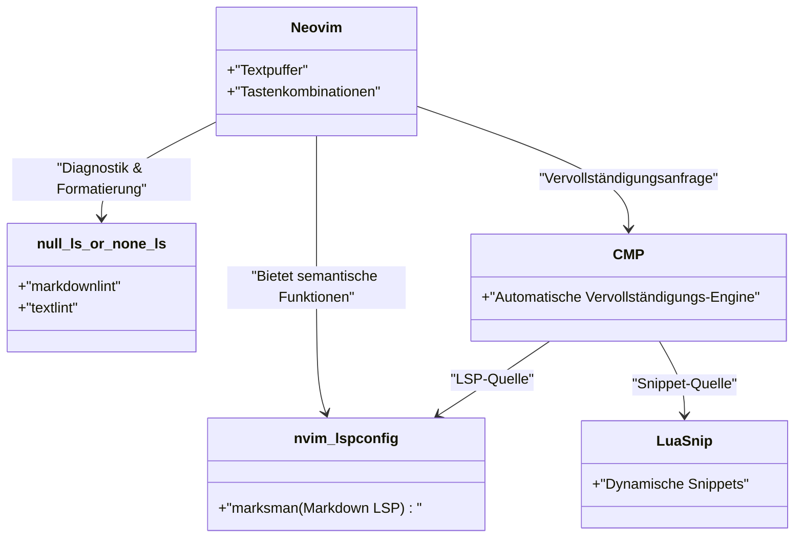
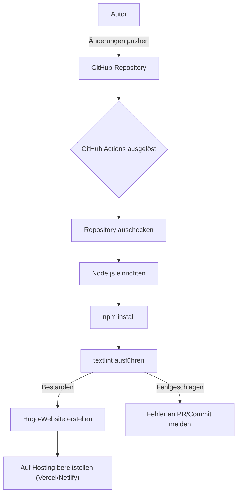

Um kontinuierlich einen Technik-Blog zu schreiben, ist die Optimierung der Schreibumgebung unerlässlich. In diesem Artikel gehen wir tief auf fortgeschrittene Editor-Einstellungen ein, um die Schreibgeschwindigkeit für Technik-Blogs mit Markdown drastisch zu erhöhen. Wir behandeln alles von extremen Anpassungen in Visual Studio Code (VS Code) und Neovim, der Nutzung von Snippets, der Einführung von textlint als Werkzeug zur Grammatikprüfung, bis hin zur Automatisierung in CI/CD-Pipelines und modernsten Schreibtechniken mithilfe von LLMs wie GitHub Copilot.

## 1. Das mathematische Modell der Schreibgeschwindigkeit

Lassen Sie uns zunächst mit einer einfachen Formel modellieren, wie sehr die Optimierung der Editor-Einstellungen die Schreibzeit beeinflusst. Die Gesamteingabezeit zum Schreiben eines Blogartikels sei $T_{total}$.

$$
T_{total} = T_{think} + T_{type} + T_{format} + T_{review}
$$

Hierbei ist $T_{think}$ die Denkzeit, $T_{type}$ die Tippzeit, $T_{format}$ die Zeit für Formatanpassungen wie Markdown und $T_{review}$ die Zeit für Überarbeitung und Korrekturlesen.

Die eingesparte Zeit $T_{saved}$ durch Editor-Anpassungen (wie die Einführung von Snippets oder Linter-Einstellungen) lässt sich wie folgt ausdrücken, wobei $N$ die Anzahl des Auftretens eines bestimmten Musters (z.B. Hugo-Shortcodes oder Markdown-Tabellen), $t_{manual}$ die Zeit für die manuelle Eingabe und $t_{snippet}$ die Zeit durch Automatisierung wie Snippets ist.

$$
T_{saved} = \sum_{i=1}^{k} N_i \times (t_{manual, i} - t_{snippet, i}) + T_{review\_saved}
$$

Darüber hinaus wird durch die Einführung von automatischen Formatierern und Lint-Tools die Zeit für die visuelle Überprüfung durch den Menschen $T_{review}$ erheblich reduziert. Die Maximierung dieser $T_{saved}$ ist genau das Ziel dieses Artikels.

## 2. Die ultimativen Einstellungen für Visual Studio Code (VS Code)

VS Code ist derzeit einer der am weitesten verbreiteten Editoren und verfügt über ein starkes Ökosystem an Erweiterungen, auch für das Schreiben in Markdown.

### Empfohlene Erweiterungen

Um das Schreiben zu beschleunigen, wird die Installation der folgenden Erweiterungen dringend empfohlen:

1. **Markdown All in One**: Bietet alle grundlegenden Funktionen, die für das Schreiben in Markdown erforderlich sind, wie z.B. Tastenkombinationen für Fett- und Kursivdruck, automatische Fortsetzung von Listen und automatische Generierung von Inhaltsverzeichnissen (TOC).
2. **markdownlint**: Warnt in Echtzeit vor Syntaxfehlern und Stilverstößen in Markdown.
3. **vscode-textlint**: Wendet Regelsätze für technische Dokumentationen an, um inkonsistente Schreibweisen und Grammatikfehler zu vermeiden.

### Eigene Snippet-Einstellungen für Hugo (`markdown.json`)

Wenn Sie statische Website-Generatoren wie Hugo oder Docusaurus für Ihren Technik-Blog verwenden, müssen Sie häufig Frontmatter oder eigene Shortcodes eingeben. Mit der Snippet-Funktion von VS Code können diese im Handumdrehen eingefügt werden.

Wählen Sie in der Befehlspalette `Preferences: Configure User Snippets` und fügen Sie der Datei `markdown.json` die folgenden Einstellungen hinzu:

```json
{
  "Hugo Frontmatter": {
    "prefix": "frontmatter",
    "body": [
      "---",
      "title: \"${1:Titel}\"",
      "slug: \"${2:slug-name}\"",
      "date: \"$CURRENT_YEAR-$CURRENT_MONTH-$CURRENT_DATE T$CURRENT_HOUR:$CURRENT_MINUTE:$CURRENT_SECOND+09:00\"",
      "image: \"img/eyecatch.jpg\"",
      "math: true",
      "mermaid: true",
      "categories: [\"${3:Kategorie}\"]",
      "tags: [\"${4:Tag1}\", \"${5:Tag2}\"]",
      "---",
      "",
      "${0}"
    ],
    "description": "Erweitert den YAML Frontmatter für Hugo"
  },
  "Hugo Figure Shortcode": {
    "prefix": "hfig",
    "body": [
      "{{< figure src=\"${1:image.jpg}\" title=\"${2:Bildtitel}\" >}}"
    ],
    "description": "Figure-Shortcode für Hugo"
  },
  "Markdown Table": {
    "prefix": "mtable",
    "body": [
      "| ${1:Header 1} | ${2:Header 2} | ${3:Header 3} |",
      "| :--- | :---: | ---: |",
      "| ${4:Row 1} | ${5:Data} | ${6:Data} |",
      "| ${7:Row 2} | ${8:Data} | ${9:Data} |",
      "$0"
    ],
    "description": "Erstellt eine 3-spaltige Markdown-Tabelle"
  }
}
```

Mit dieser Einstellung wird durch bloßes Eintippen von `frontmatter` und Drücken der Tab-Taste sofort ein YAML-Frontmatter einschließlich der aktuellen Uhrzeit eingefügt, was die Anfangsgeschwindigkeit beim Schreiben drastisch erhöht.

### Schreibunterstützung mit GitHub Copilot

Wenn GitHub Copilot in VS Code aktiviert ist, funktioniert die kontextbezogene KI-Vervollständigung auch in Markdown. Besonders bei Technik-Blogs liest die KI den "als nächstes zu erklärenden Aufbau" oder "relevante Codeblöcke" voraus und schlägt diese vor, wodurch die Tippzeit $T_{type}$ erheblich reduziert werden kann.

## 3. Extreme Anpassungen in Neovim

Während die GUI von VS Code ausgezeichnet ist, ist Neovim für Terminal-Liebhaber und Vimmer die ultimative Wahl, da man alles erledigen kann, ohne jemals die Hände von der Tastatur zu nehmen.

### Neovim LSP-Architektur

Die Architektur von LSP (Language Server Protocol) und Lintern in Neovim für die Markdown-Umgebung sieht wie folgt aus:



### Fortgeschrittene Snippet-Einfügung mit LuaSnip

Noch mächtiger als die JSON-Snippets in VS Code ist das Neovim-Plugin `LuaSnip`. Mithilfe der Lua-Logik lassen sich die Inhalte der Snippets dynamisch berechnen und einfügen.

Hier ist ein Konfigurationsbeispiel für LuaSnip, das das aktuelle Datum und die Uhrzeit dynamisch abruft und das Hugo-Frontmatter einfügt.

```lua
local ls = require("luasnip")
local s = ls.snippet
local t = ls.text_node
local i = ls.insert_node
local f = ls.function_node

-- Funktion zum Abrufen der aktuellen JST-Zeit
local function get_current_date_jst()
    return os.date("!%Y-%m-%dT%H:%M:%S") .. "+09:00"
end

ls.add_snippets("markdown", {
    s("frontmatter", {
        t({"---", "title: \""}), i(1, "Title"), t({"\"", "slug: \""}), i(2, "slug-name"), t({"\"", "date: \""}),
        f(function() return {get_current_date_jst()} end, {}),
        t({"\"", "image: \"img/eyecatch.jpg\"", "math: true", "mermaid: true", "categories: [\""}), i(3, "Kategorie"), t({"\"]", "tags: [\""}), i(4, "Tag"), t({"\"]", "---", "", ""}),
        i(0)
    }),
    s("mtable", {
        t({"| "}), i(1, "Header 1"), t({" | "}), i(2, "Header 2"), t({" |", "|---|---|", "| "}), i(3, "Cell 1"), t({" | "}), i(4, "Cell 2"), t({" |"}),
    })
})
```

Durch die Nutzung der Programmiersprache (Lua) ist es auf diese Weise möglich, nicht nur feste Zeichenfolgen, sondern auch Rückgabewerte von Funktionen einzubetten oder extrem komplexe Snippets zu erstellen, bei denen die Anzahl der Tabellenspalten dynamisch anhand der Anzahl der eingegebenen Zeichen erhöht oder verringert wird.

## 4. Statische Analyse für Qualität und Geschwindigkeit beim Schreiben (textlint und reguläre Ausdrücke)

Um die Qualität des Blogs zu gewährleisten, müssen Tippfehler und inkonsistente Schreibweisen vermieden werden. Wenn dies manuell durchgeführt wird, steigt $T_{review}$ explosionsartig an, weshalb die statische Analyse mit `textlint` eingeführt wird.

### Einführung von textlint und dem japanischen Regelsatz

Installieren Sie textlint in einer Node.js-Umgebung.

```bash
npm install -D textlint textlint-rule-preset-ja-technical-writing textlint-rule-prh textlint-filter-rule-comments
```

Erstellen Sie eine `.textlintrc.json` im Projektstammverzeichnis und konfigurieren Sie sie wie folgt:

```json
{
  "filters": {
    "comments": true
  },
  "rules": {
    "preset-ja-technical-writing": {
      "ja-no-mixed-period": {
        "periodMark": "。"
      },
      "sentence-length": {
        "max": 100
      }
    },
    "prh": {
      "rulePaths": ["./prh.yml"]
    }
  }
}
```

Erstellen Sie die `prh.yml` und definieren Sie inkonsistente Schreibweisen von Fachbegriffen. Zum Beispiel vereinheitlichen wir "E-Mail" und "Email", "Javascript" und "JavaScript" usw.

```yaml
version: 1
rules:
  - expected: "JavaScript"
    pattern:  "Javascript"
  - expected: "E-Mail"
    pattern: "Email"
  - expected: "Schnittstelle"
    pattern: "Interface"
```

Dadurch wird bei jedem Tastendruck im Editor in Echtzeit vor inkonsistenten Schreibweisen gewarnt, und die Zeit für das Korrekturlesen sinkt auf nahezu null.

### Massenersetzung und Strukturierungsmuster mit regulären Ausdrücken

Wenn Sie bestehende Artikel in Markdown migrieren oder Text von externen Quellen importieren, ist die Massenersetzung durch reguläre Ausdrücke sehr nützlich.

Zum Beispiel der reguläre Ausdruck zur Konvertierung von HTML-Tags `<b>Hervorhebung</b>` in Markdown `**Hervorhebung**`:

- **Suchmuster**: `<b>(.*?)</b>`
- **Ersetzungsmuster**: `**$1**`

Wenn Sie unnötige aufeinanderfolgende Zeilenumbrüche zu einem einzigen zusammenfassen möchten:

- **Suchmuster**: `\n{3,}`
- **Ersetzungsmuster**: `\n\n`

Indem Sie diese in der Such- und Ersetzungsfunktion von VS Code (Regulärer-Ausdruck-Modus) oder mit dem `%s`-Befehl in Neovim (`:%s/<b>\(.*?\)<\/b>/**\1**/g`) ausführen, können Sie das Format im Handumdrehen vereinheitlichen.

### Automatische Überprüfung durch CI/CD-Pipelines

Darüber hinaus verwenden wir GitHub Actions, um eine CI-Pipeline aufzubauen, bei der textlint automatisch beim Pushen von Blogartikeln ausgeführt wird. Dadurch kann die Bereitstellung von Artikeln mit Regelverstößen von vornherein verhindert werden.



## 5. Markdown-Schreibtechniken im Zeitalter der LLMs

Beim modernen Schreiben von Technik-Blogs ist die Nutzung von LLMs (Large Language Models) unumgänglich. Durch den Einsatz in Editoren integrierter KI-Tools wird die Schreibgeschwindigkeit weiter verdoppelt.

### Prompt Engineering im Editor

Mit GitHub Copilot Chat in VS Code oder `ChatGPT.nvim` und `Copilot.vim` in Neovim können Sie beispielsweise den folgenden Prompt absenden, ohne den Editor zu verlassen:

> "Erstelle für die folgenden technologischen Elemente einen Gliederungsentwurf in einer hierarchischen Markdown-Struktur für Anfänger: Docker, Kubernetes, CI/CD"

Sofort wird ein Markdown mit Überschriften und Aufzählungspunkten generiert. Wir müssen dieses Grundgerüst nur noch mit Inhalten füllen.

Darüber hinaus generiert die KI auch bei komplexen Mermaid-Diagrammen oder mathematischen Formeln (LaTeX) die genaue Syntax, wenn man ihr Anweisungen gibt. Beispielsweise wurde auch die Grundlage für das Layout der mathematischen Formeln und Diagramme in diesem Artikel durch Pair-Writing mit einem LLM beschleunigt.

## 6. Zusammenfassung

Wir haben die Editor-Einstellungen erläutert, die die Schreibgeschwindigkeit beim Verfassen von Technik-Blogs in Markdown verdoppeln.

1. **Bewusstsein für das mathematische Modell**: Wiederkehrende Aufgaben eliminieren, um $T_{saved}$ zu maximieren.
2. **Nutzung von VS Code**: Eingaben durch Erweiterungen und Snippets in `markdown.json` verkürzen.
3. **Extreme Anpassungen in Neovim**: Dynamische Snippets mit `LuaSnip` und vollständige Tastaturbedienung.
4. **textlint und statische Analyse**: Integration von CI/CD und lokalen Lintern, um die Korrekturzeit nahezu auf null zu reduzieren.
5. **Integration von LLMs**: Die KI direkt im Editor Markdown-Strukturen und Diagramm-Codes ausgeben lassen.

Indem Sie diese Einstellungen in Ihre eigene Umgebung übernehmen, verschwindet die "Lästigkeit" des Schreibens, und die Quantität und Qualität Ihres technischen Outputs wird sich drastisch verbessern. Warum fangen Sie nicht gleich mit der Registrierung eines einzigen kleinen Snippets an?
