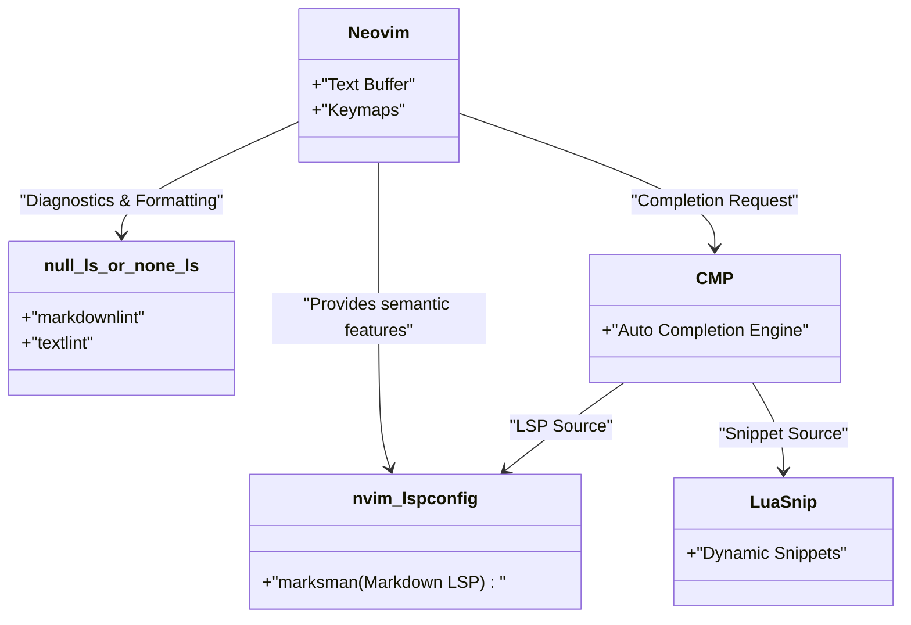
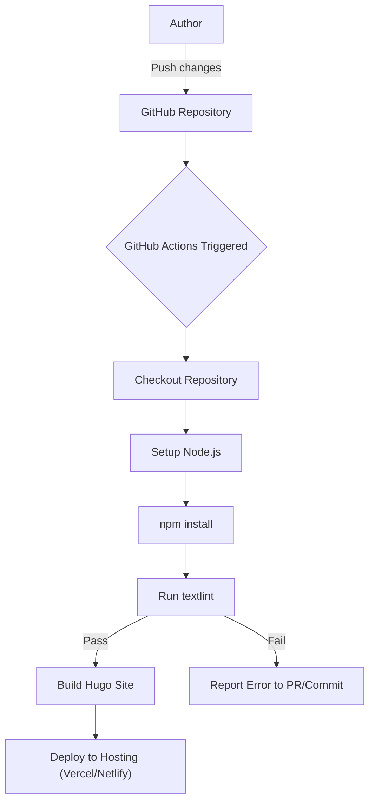

To consistently write tech blogs, optimizing your writing environment is essential. This article delves deeply into advanced editor settings designed to dramatically improve your Markdown tech blog writing speed. We will comprehensively cover everything from extreme customizations for Visual Studio Code (VS Code) and Neovim, utilizing snippets, and introducing the grammar checking tool textlint, to automation in CI/CD pipelines and cutting-edge writing techniques leveraging LLMs like GitHub Copilot.

## 1. A Mathematical Model for Improving Writing Speed

First, let's model how much editor setting optimization impacts writing time using a simple formula. Let $T_{total}$ be the total input time for writing a single blog post.

$$
T_{total} = T_{think} + T_{type} + T_{format} + T_{review}
$$

Here, $T_{think}$ is the thinking time, $T_{type}$ is the typing time, $T_{format}$ is the time spent adjusting formats like Markdown, and $T_{review}$ is the reviewing and proofreading time.

The time saved by customizing the editor (like introducing snippets and configuring linters), denoted as $T_{saved}$, can be expressed as follows, using the number of occurrences $N$ of a specific pattern (e.g., Hugo shortcodes or Markdown tables), the manual input time $t_{manual}$, and the automated snippet input time $t_{snippet}$:

$$
T_{saved} = \sum_{i=1}^{k} N_i \times (t_{manual, i} - t_{snippet, i}) + T_{review\_saved}
$$

Furthermore, introducing auto-formatters and linting tools significantly reduces the human visual inspection time $T_{review}$. Maximizing this $T_{saved}$ is precisely the goal of this article.

## 2. The Ultimate Visual Studio Code (VS Code) Setup

VS Code is currently one of the most popular editors and has a powerful ecosystem of extensions for writing Markdown.

### Recommended Extensions

To speed up your writing, we strongly recommend installing the following extensions:

1. **Markdown All in One**: It provides all the essential features for writing Markdown, including keyboard shortcuts for bold and italic text, auto-continuing lists, and automatic generation of tables of contents (TOC).
2. **markdownlint**: It provides real-time warnings for Markdown syntax errors and style violations.
3. **vscode-textlint**: It applies rule sets tailored for technical documents to prevent inconsistencies and grammar errors.

### Custom Snippet Settings for Hugo (`markdown.json`)

If you are using static site generators like Hugo or Docusaurus for your tech blog, you will frequently enter Frontmatter and custom shortcodes. Using VS Code's snippet feature, you can expand these in an instant.

Select `Preferences: Configure User Snippets` from the Command Palette, and add the following settings to `markdown.json`.

```json
{
  "Hugo Frontmatter": {
    "prefix": "frontmatter",
    "body": [
      "---",
      "title: \"${1:Title}\"",
      "slug: \"${2:slug-name}\"",
      "date: \"$CURRENT_YEAR-$CURRENT_MONTH-$CURRENT_DATE T$CURRENT_HOUR:$CURRENT_MINUTE:$CURRENT_SECOND+09:00\"",
      "image: \"img/eyecatch.jpg\"",
      "math: true",
      "mermaid: true",
      "categories: [\"${3:Category}\"]",
      "tags: [\"${4:Tag1}\", \"${5:Tag2}\"]",
      "---",
      "",
      "${0}"
    ],
    "description": "Expands YAML Frontmatter for Hugo"
  },
  "Hugo Figure Shortcode": {
    "prefix": "hfig",
    "body": [
      "{{< figure src=\"${1:image.jpg}\" title=\"${2:Image Title}\" >}}"
    ],
    "description": "Figure shortcode for Hugo"
  },
  "Markdown Table": {
    "prefix": "mtable",
    "body": [
      "| ${1:Header 1} | ${2:Header 2} | ${3:Header 3} |",
      "| :--- | :---: | ---: |",
      "| ${4:Row 1} | ${5:Data} | ${6:Data} |",
      "| ${7:Row 2} | ${8:Data} | ${9:Data} |",
      "$0"
    ],
    "description": "Generates a 3-column Markdown table"
  }
}
```

With this setting, simply typing `frontmatter` and pressing the Tab key will instantly expand the YAML Frontmatter containing the current time, dramatically increasing your initial writing speed.

### Writing Support Leveraging GitHub Copilot

If GitHub Copilot is enabled in VS Code, contextual AI completion also works in Markdown. Especially for tech blogs, the AI anticipates and suggests the "next structure to explain" or "related code blocks," allowing you to significantly reduce the typing time $T_{type}$.

## 3. Extreme Customization in Neovim

While VS Code's GUI is excellent, for terminal enthusiasts and Vimmers, Neovim is the ultimate choice, allowing everything to be completed without ever taking your hands off the keyboard.

### Neovim LSP Architecture

The architecture of Neovim's LSP (Language Server Protocol) and Linter in a Markdown environment is as follows.



### Advanced Snippet Expansion Using LuaSnip

Even more powerful than VS Code's JSON snippets is the Neovim plugin `LuaSnip`. Using Lua logic, you can dynamically calculate and expand snippet content.

Below is an example of LuaSnip configuration that dynamically retrieves the current date and time to expand the Hugo Frontmatter.

```lua
local ls = require("luasnip")
local s = ls.snippet
local t = ls.text_node
local i = ls.insert_node
local f = ls.function_node

-- Function to get the current JST time
local function get_current_date_jst()
    return os.date("!%Y-%m-%dT%H:%M:%S") .. "+09:00"
end

ls.add_snippets("markdown", {
    s("frontmatter", {
        t({"---", "title: \""}), i(1, "Title"), t({"\"", "slug: \""}), i(2, "slug-name"), t({"\"", "date: \""}),
        f(function() return {get_current_date_jst()} end, {}),
        t({"\"", "image: \"img/eyecatch.jpg\"", "math: true", "mermaid: true", "categories: [\""}), i(3, "Category"), t({"\"]", "tags: [\""}), i(4, "Tag"), t({"\"]", "---", "", ""}),
        i(0)
    }),
    s("mtable", {
        t({"| "}), i(1, "Header 1"), t({" | "}), i(2, "Header 2"), t({" |", "|---|---|", "| "}), i(3, "Cell 1"), t({" | "}), i(4, "Cell 2"), t({" |"}),
    })
})
```

In this way, by leveraging the power of a programming language (Lua), you can create insane snippets that not only embed fixed strings but also function return values, or dynamically increase/decrease the number of table columns based on the input character count.

## 4. Static Analysis Balancing Writing Quality and Speed (textlint and Regular Expressions)

To ensure the quality of your blog, it's necessary to prevent typos, omissions, and inconsistent spellings. Since doing this manually would cause $T_{review}$ to explode, we introduce static analysis using `textlint`.

### Introducing textlint and Japanese Rule Sets

Install textlint in a Node.js environment.

```bash
npm install -D textlint textlint-rule-preset-ja-technical-writing textlint-rule-prh textlint-filter-rule-comments
```

Create a `.textlintrc.json` in the project root and configure it as follows.

```json
{
  "filters": {
    "comments": true
  },
  "rules": {
    "preset-ja-technical-writing": {
      "ja-no-mixed-period": {
        "periodMark": "。"
      },
      "sentence-length": {
        "max": 100
      }
    },
    "prh": {
      "rulePaths": ["./prh.yml"]
    }
  }
}
```

Create `prh.yml` and define notation consistencies for technical terms. For example, standardizing "サーバー" (Server) and "サーバ", or "Javascript" and "JavaScript".

```yaml
version: 1
rules:
  - expected: "JavaScript"
    pattern:  "Javascript"
  - expected: "サーバー"
    pattern: "サーバ"
  - expected: "インターフェース"
    pattern: "インターフェイス"
```

With this, every time you type text in the editor, inconsistent spellings are warned about in real-time, reducing proofreading time to nearly zero.

### Batch Replacement and Structural Patterns Using Regular Expressions

When migrating existing articles to Markdown or importing text from external sources, batch replacement using regular expressions comes in handy.

For example, the regular expression to convert HTML `<b>bold</b>` tags to Markdown `**bold**`:

- **Search Pattern**: `<b>(.*?)</b>`
- **Replacement Pattern**: `**$1**`

To consolidate unnecessary consecutive line breaks into one:

- **Search Pattern**: `\n{3,}`
- **Replacement Pattern**: `\n\n`

By executing these via VS Code's search and replace feature (regular expression mode) or Neovim's `%s` command (`:%s/<b>\(.*?\)<\/b>/**\1**/g`), you can instantly unify formats.

### Automated Checking via CI/CD Pipelines

Furthermore, using GitHub Actions, you can build a CI pipeline that automatically runs textlint when you push a blog post. This prevents deploying articles that contain rule violations.



## 5. Markdown Writing Techniques in the LLM Era

In modern tech blog writing, leveraging LLMs (Large Language Models) is unavoidable. By utilizing built-in AI tools in your editor, your writing speed will double once again.

### Prompt Engineering Within the Editor

Using GitHub Copilot Chat in VS Code, or `ChatGPT.nvim` and `Copilot.vim` in Neovim, you can send prompts like the following without ever leaving the editor.

> "Create an outline in Markdown's hierarchical structure for beginners regarding the following technical elements: Docker, Kubernetes, CI/CD"

Instantly, Markdown headings and bullet points are generated. We then simply flesh out that skeleton.

Also, for complex Mermaid diagrams or mathematical formulas (LaTeX), giving instructions to the AI allows it to generate accurate syntax. For instance, the foundation for the layout of the mathematical formulas and charts in this article was also sped up through pair writing with an LLM.

## 6. Conclusion

We have explained the editor settings to double your writing speed when writing tech blogs in Markdown.

1. **Awareness of the Mathematical Model**: Eliminate repetitive tasks to maximize $T_{saved}$.
2. **Utilizing VS Code**: Save input time with extensions and `markdown.json` snippets.
3. **Extreme Customization in Neovim**: Dynamic snippets and full keyboard operation via `LuaSnip`.
4. **textlint and Static Analysis**: Integrate CI/CD and local linters to bring proofreading time close to zero.
5. **LLM Integration**: Have AI directly output Markdown structures and chart code within the editor.

By adopting these settings in your own environment, the "hassle" of writing will disappear, and the quantity and quality of your technical output should dramatically improve. Why not start by registering just a single small snippet?
