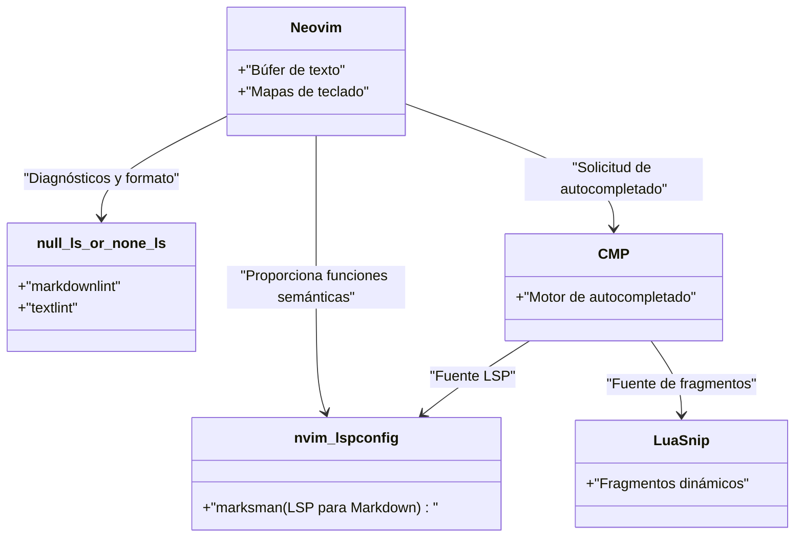
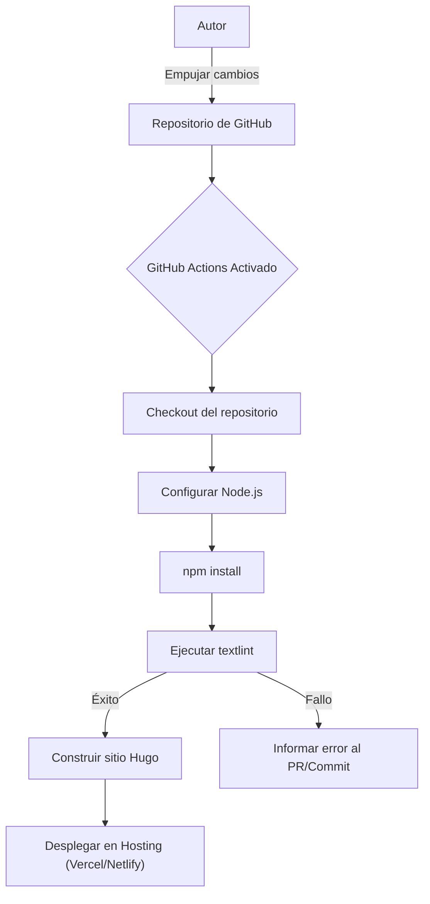

Para escribir continuamente un blog técnico, es indispensable optimizar el entorno de escritura. En este artículo, profundizaremos en configuraciones avanzadas del editor para mejorar drásticamente la velocidad de escritura de un blog técnico utilizando Markdown. Explicaremos exhaustivamente desde la personalización extrema de Visual Studio Code (VS Code) y Neovim, el uso de fragmentos (snippets), la introducción de textlint como herramienta de revisión gramatical, la automatización en canalizaciones CI/CD, hasta las técnicas de escritura más vanguardistas utilizando LLM como GitHub Copilot.

## 1. Modelo matemático para mejorar la velocidad de escritura

Veamos primero con un modelo matemático simple cuánto impacta la optimización de la configuración del editor en el tiempo de escritura. Supongamos que el tiempo total de entrada al escribir un artículo de blog es $T_{total}$.

$$
T_{total} = T_{think} + T_{type} + T_{format} + T_{review}
$$

Aquí, $T_{think}$ es el tiempo de pensamiento, $T_{type}$ es el tiempo de escritura (tipeo), $T_{format}$ es el tiempo de ajuste de formato como Markdown, y $T_{review}$ es el tiempo de revisión y corrección.

El tiempo ahorrado $T_{saved}$ mediante la personalización del editor (como la introducción de fragmentos y configuración de Linter) se puede expresar de la siguiente manera, utilizando el número de apariciones $N$ de un patrón específico (por ejemplo, shortcodes de Hugo o tablas de Markdown), el tiempo necesario para la entrada manual $t_{manual}$, y el tiempo necesario para la automatización mediante fragmentos, etc., $t_{snippet}$.

$$
T_{saved} = \sum_{i=1}^{k} N_i \times (t_{manual, i} - t_{snippet, i}) + T_{review\_saved}
$$

Además, al introducir herramientas de formateo automático o de Lint, el tiempo de confirmación visual humano $T_{review}$ se reduce considerablemente. Maximizar este $T_{saved}$ es precisamente el objetivo de este artículo.

## 2. La configuración definitiva para Visual Studio Code (VS Code)

VS Code es uno de los editores más populares actualmente y cuenta con un ecosistema de extensiones muy potente incluso para la escritura en Markdown.

### Extensiones recomendadas

Para acelerar la escritura, se recomienda encarecidamente instalar las siguientes extensiones.

1. **Markdown All in One**: Cuenta con todas las funciones básicas necesarias para escribir en Markdown, como poner en negrita o cursiva mediante atajos de teclado, continuación automática de listas y generación automática de la tabla de contenido (TOC).
2. **markdownlint**: Advierte en tiempo real sobre errores de sintaxis y violaciones de estilo en Markdown.
3. **vscode-textlint**: Aplica un conjunto de reglas orientado a documentos técnicos, previniendo inconsistencias y errores gramaticales.

### Configuración de fragmentos personalizados para Hugo (`markdown.json`)

Si estás utilizando generadores de sitios estáticos como Hugo o Docusaurus para tu blog técnico, es probable que ingreses Frontmatter o tus propios shortcodes con frecuencia. Usando la función de fragmentos (snippets) de VS Code, puedes desplegarlos en un instante.

Selecciona `Preferences: Configure User Snippets` desde la paleta de comandos y agrega la siguiente configuración en `markdown.json`.

```json
{
  "Hugo Frontmatter": {
    "prefix": "frontmatter",
    "body": [
      "---",
      "title: \"${1:Título}\"",
      "slug: \"${2:slug-name}\"",
      "date: \"$CURRENT_YEAR-$CURRENT_MONTH-$CURRENT_DATE T$CURRENT_HOUR:$CURRENT_MINUTE:$CURRENT_SECOND+09:00\"",
      "image: \"img/eyecatch.jpg\"",
      "math: true",
      "mermaid: true",
      "categories: [\"${3:Categoría}\"]",
      "tags: [\"${4:Etiqueta1}\", \"${5:Etiqueta2}\"]",
      "---",
      "",
      "${0}"
    ],
    "description": "Despliega el YAML Frontmatter para Hugo"
  },
  "Hugo Figure Shortcode": {
    "prefix": "hfig",
    "body": [
      "{{< figure src=\"${1:image.jpg}\" title=\"${2:Título de la imagen}\" >}}"
    ],
    "description": "Shortcode de Figure de Hugo"
  },
  "Markdown Table": {
    "prefix": "mtable",
    "body": [
      "| ${1:Header 1} | ${2:Header 2} | ${3:Header 3} |",
      "| :--- | :---: | ---: |",
      "| ${4:Row 1} | ${5:Data} | ${6:Data} |",
      "| ${7:Row 2} | ${8:Data} | ${9:Data} |",
      "$0"
    ],
    "description": "Genera una tabla Markdown de 3 columnas"
  }
}
```

Con esta configuración, con solo escribir `frontmatter` y presionar la tecla Tabulador, el YAML Frontmatter que incluye la hora actual se desplegará instantáneamente, aumentando drásticamente la velocidad inicial de escritura.

### Asistencia de escritura con GitHub Copilot

Cuando habilitas GitHub Copilot en VS Code, la autocompletación de IA sensible al contexto también funciona en Markdown. Especialmente en el caso de blogs técnicos, la IA predice y propone "la siguiente estructura a explicar" o "bloques de código relacionados", lo que permite reducir significativamente el tiempo de escritura $T_{type}$.

## 3. Personalización extrema en Neovim

Aunque la interfaz gráfica (GUI) de VS Code es excelente, para los entusiastas de la terminal y los usuarios de Vim, Neovim es la opción más poderosa, ya que permite hacer todo sin soltar las manos del teclado.

### Arquitectura LSP de Neovim

La arquitectura de LSP (Language Server Protocol) y Linter de Neovim en un entorno Markdown es la siguiente.



### Despliegue avanzado de fragmentos usando LuaSnip

Más potente que los fragmentos JSON de VS Code es el plugin para Neovim `LuaSnip`. Utilizando la lógica de Lua, permite calcular y desplegar dinámicamente el contenido de los fragmentos.

A continuación se muestra un ejemplo de configuración de LuaSnip que obtiene la fecha y hora actuales dinámicamente y despliega el Frontmatter de Hugo.

```lua
local ls = require("luasnip")
local s = ls.snippet
local t = ls.text_node
local i = ls.insert_node
local f = ls.function_node

-- Función para obtener la hora actual JST
local function get_current_date_jst()
    return os.date("!%Y-%m-%dT%H:%M:%S") .. "+09:00"
end

ls.add_snippets("markdown", {
    s("frontmatter", {
        t({"---", "title: \""}), i(1, "Título"), t({"\"", "slug: \""}), i(2, "slug-name"), t({"\"", "date: \""}),
        f(function() return {get_current_date_jst()} end, {}),
        t({"\"", "image: \"img/eyecatch.jpg\"", "math: true", "mermaid: true", "categories: [\""}), i(3, "Categoría"), t({"\"]", "tags: [\""}), i(4, "Etiqueta"), t({"\"]", "---", "", ""}),
        i(0)
    }),
    s("mtable", {
        t({"| "}), i(1, "Encabezado 1"), t({" | "}), i(2, "Encabezado 2"), t({" |", "|---|---|", "| "}), i(3, "Celda 1"), t({" | "}), i(4, "Celda 2"), t({" |"}),
    })
})
```

De esta manera, aprovechando el poder del lenguaje de programación (Lua), es posible crear fragmentos asombrosos que no solo contienen cadenas fijas, sino que también incrustan los valores de retorno de funciones, o aumentan y disminuyen dinámicamente el número de columnas de una tabla según la cantidad de caracteres ingresados.

## 4. Análisis estático para equilibrar calidad y velocidad de escritura (textlint y expresiones regulares)

Para asegurar la calidad del blog, es necesario prevenir errores tipográficos e inconsistencias. Si esto se hace manualmente, $T_{review}$ aumentaría de manera explosiva, por lo que introduciremos el análisis estático usando `textlint`.

### Introducción a textlint y el conjunto de reglas para japonés

Instalaremos textlint en un entorno de Node.js.

```bash
npm install -D textlint textlint-rule-preset-ja-technical-writing textlint-rule-prh textlint-filter-rule-comments
```

Crea un archivo `.textlintrc.json` en la raíz del proyecto y configúralo de la siguiente manera.

```json
{
  "filters": {
    "comments": true
  },
  "rules": {
    "preset-ja-technical-writing": {
      "ja-no-mixed-period": {
        "periodMark": "。"
      },
      "sentence-length": {
        "max": 100
      }
    },
    "prh": {
      "rulePaths": ["./prh.yml"]
    }
  }
}
```

Crea `prh.yml` y define la inconsistencia de los términos técnicos. Por ejemplo, unifica "サーバー" (servidor) y "サーバ", o "Javascript" y "JavaScript".

```yaml
version: 1
rules:
  - expected: "JavaScript"
    pattern:  "Javascript"
  - expected: "サーバー"
    pattern: "サーバ"
  - expected: "インターフェース"
    pattern: "インターフェイス"
```

Gracias a esto, cada vez que escribas en el editor, se te advertirá en tiempo real sobre las inconsistencias en la escritura, reduciendo el tiempo de corrección a casi cero.

### Patrones estructurados y reemplazo masivo utilizando expresiones regulares

Cuando migras artículos existentes a Markdown o traes texto de fuentes externas, el reemplazo masivo usando expresiones regulares resulta muy útil.

Por ejemplo, la expresión regular para convertir la etiqueta HTML `<b>énfasis</b>` a `**énfasis**` en Markdown:

- **Patrón de búsqueda**: `<b>(.*?)</b>`
- **Patrón de reemplazo**: `**$1**`

Para combinar saltos de línea consecutivos innecesarios en uno solo:

- **Patrón de búsqueda**: `\n{3,}`
- **Patrón de reemplazo**: `\n\n`

Al ejecutar esto con la función de búsqueda y reemplazo de VS Code (modo de expresiones regulares) o el comando `%s` de Neovim (`:%s/<b>\(.*?\)<\/b>/**\1**/g`), puedes unificar el formato al instante.

### Comprobación automática mediante el canal (pipeline) CI/CD

Además, usando GitHub Actions, puedes construir una canalización CI que ejecute automáticamente textlint cuando subas (push) artículos al blog. Esto evita proactivamente el despliegue de artículos que infrinjan las reglas.



## 5. Técnicas de escritura en Markdown en la era de los LLM

En la redacción moderna de blogs técnicos, el uso de LLM (Grandes Modelos de Lenguaje) es inevitable. Al aprovechar las herramientas de IA integradas en el editor, la velocidad de escritura se duplica aún más.

### Ingeniería de prompts dentro del editor

Usando GitHub Copilot Chat en VS Code, o plugins como `ChatGPT.nvim` o `Copilot.vim` en Neovim, puedes lanzar prompts como los siguientes sin salir del editor.

> "Crea un esquema en estructura jerárquica de Markdown para principiantes sobre los siguientes elementos técnicos: Docker, Kubernetes, CI/CD"

De este modo, se generarán instantáneamente los encabezados y listas en Markdown. Solo tenemos que desarrollar y añadir contenido a esa estructura.

Además, al darle instrucciones a la IA, también puede generar una sintaxis precisa para diagramas complejos de Mermaid y fórmulas matemáticas (LaTeX). Por ejemplo, la base de las fórmulas matemáticas y los diseños de diagramas de este artículo también se aceleró gracias a la escritura colaborativa (pair writing) con un LLM.

## 6. Conclusión

En este artículo explicamos configuraciones del editor que duplicarán tu velocidad de escritura al crear un blog técnico en Markdown.

1. **Conciencia del modelo matemático**: Erradicar el trabajo repetitivo para maximizar $T_{saved}$.
2. **Aprovechar VS Code**: Omitir la entrada manual utilizando extensiones y fragmentos en `markdown.json`.
3. **Personalización extrema de Neovim**: Fragmentos dinámicos a través de `LuaSnip` y control total mediante el teclado.
4. **textlint y análisis estático**: Integración de CI/CD y Linters locales para acercar el tiempo de revisión a cero.
5. **Integración de LLM**: Hacer que la IA genere directamente la estructura del Markdown y el código de diagramas o tablas dentro del editor.

Al incorporar estas configuraciones a tu propio entorno, desaparecerá lo "tedioso" de la escritura y, con seguridad, la cantidad y calidad de tus publicaciones técnicas mejorarán drásticamente. ¿Por qué no empezar hoy mismo registrando al menos un pequeño fragmento (snippet)?
