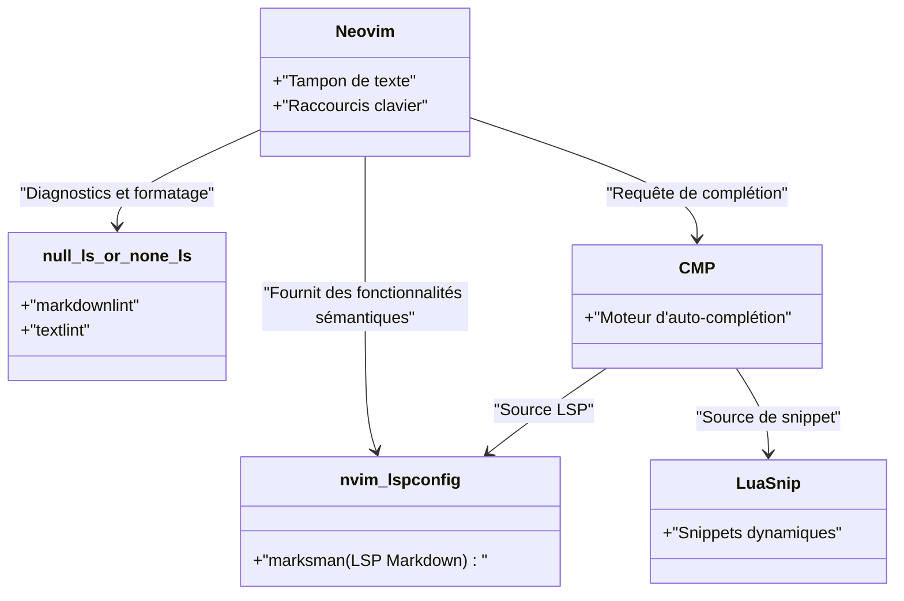
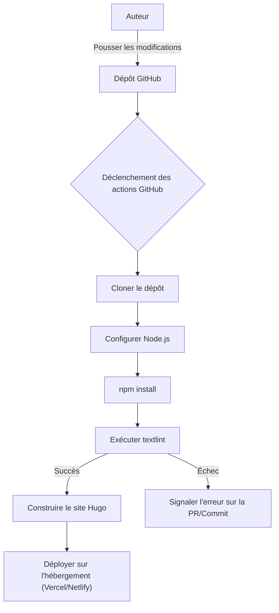

Pour écrire continuellement sur un blog technique, il est essentiel d'optimiser l'environnement de rédaction. Dans cet article, nous allons explorer en profondeur les paramètres d'éditeur avancés qui permettront d'améliorer de façon spectaculaire votre vitesse de rédaction de blogs techniques à l'aide de Markdown. Nous couvrirons tout de manière exhaustive : la personnalisation extrême de Visual Studio Code (VS Code) et Neovim, l'utilisation de snippets, l'introduction de textlint (un outil de vérification grammaticale), l'automatisation dans le pipeline CI/CD, et enfin les techniques de rédaction de pointe utilisant des LLM comme GitHub Copilot.

## 1. Modèle mathématique de l'amélioration de la vitesse de rédaction

Commençons par modéliser l'impact de l'optimisation des paramètres de l'éditeur sur le temps de rédaction avec une formule mathématique simple. Soit $T_{total}$ le temps de saisie total pour écrire un article de blog.

$$
T_{total} = T_{think} + T_{type} + T_{format} + T_{review}
$$

Ici, $T_{think}$ est le temps de réflexion, $T_{type}$ est le temps de frappe, $T_{format}$ est le temps de formatage (pour Markdown, etc.), et $T_{review}$ est le temps de relecture et de correction.

Le temps économisé $T_{saved}$ grâce à la personnalisation de l'éditeur (comme l'introduction de snippets ou la configuration de Linter) peut être exprimé comme suit, en utilisant le nombre d'occurrences $N$ d'un modèle spécifique (par exemple, un shortcode Hugo ou un tableau Markdown), le temps requis pour une saisie manuelle $t_{manual}$, et le temps pris par l'automatisation via des snippets $t_{snippet}$.

$$
T_{saved} = \sum_{i=1}^{k} N_i \times (t_{manual, i} - t_{snippet, i}) + T_{review\_saved}
$$

De plus, l'introduction d'outils de formatage automatique et de Linting réduit considérablement le temps de vérification visuelle humaine $T_{review}$. La maximisation de ce $T_{saved}$ est le but même de cet article.

## 2. La meilleure configuration pour Visual Studio Code (VS Code)

VS Code est actuellement l'un des éditeurs les plus populaires et dispose d'un puissant écosystème d'extensions pour l'écriture en Markdown.

### Extensions recommandées

Pour accélérer la rédaction, nous recommandons fortement d'installer les extensions suivantes.

1. **Markdown All in One** : Il dispose de toutes les fonctionnalités de base nécessaires à la rédaction en Markdown, telles que le gras/italique avec des raccourcis clavier, la continuation automatique des listes, et la génération automatique d'une table des matières (TOC).
2. **markdownlint** : Il vous avertit en temps réel des erreurs de syntaxe Markdown et des violations de style.
3. **vscode-textlint** : Il applique un ensemble de règles destinées aux documents techniques pour éviter les incohérences de notation et les erreurs grammaticales.

### Configuration de snippets personnalisés pour Hugo (`markdown.json`)

Si vous utilisez un générateur de site statique comme Hugo ou Docusaurus pour votre blog technique, vous devrez fréquemment saisir le Frontmatter ou des shortcodes spécifiques. En utilisant la fonctionnalité de snippet de VS Code, vous pouvez les développer instantanément.

Sélectionnez `Preferences: Configure User Snippets` dans la palette de commandes et ajoutez la configuration suivante à `markdown.json`.

```json
{
  "Hugo Frontmatter": {
    "prefix": "frontmatter",
    "body": [
      "---",
      "title: \"${1:Titre}\"",
      "slug: \"${2:slug-name}\"",
      "date: \"$CURRENT_YEAR-$CURRENT_MONTH-$CURRENT_DATE T$CURRENT_HOUR:$CURRENT_MINUTE:$CURRENT_SECOND+09:00\"",
      "image: \"img/eyecatch.jpg\"",
      "math: true",
      "mermaid: true",
      "categories: [\"${3:Catégorie}\"]",
      "tags: [\"${4:Tag1}\", \"${5:Tag2}\"]",
      "---",
      "",
      "${0}"
    ],
    "description": "Développe le YAML Frontmatter pour Hugo"
  },
  "Hugo Figure Shortcode": {
    "prefix": "hfig",
    "body": [
      "{{< figure src=\"${1:image.jpg}\" title=\"${2:Titre de l'image}\" >}}"
    ],
    "description": "Shortcode Figure de Hugo"
  },
  "Markdown Table": {
    "prefix": "mtable",
    "body": [
      "| ${1:En-tête 1} | ${2:En-tête 2} | ${3:En-tête 3} |",
      "| :--- | :---: | ---: |",
      "| ${4:Ligne 1} | ${5:Données} | ${6:Données} |",
      "| ${7:Ligne 2} | ${8:Données} | ${9:Données} |",
      "$0"
    ],
    "description": "Génère un tableau Markdown à 3 colonnes"
  }
}
```

Avec cette configuration, il suffit de taper `frontmatter` et d'appuyer sur la touche Tab pour déployer instantanément le YAML Frontmatter incluant l'heure actuelle, augmentant ainsi considérablement la vitesse initiale de rédaction.

### Assistance à la rédaction grâce à GitHub Copilot

Lorsque GitHub Copilot est activé dans VS Code, la complétion par l'IA basée sur le contexte fonctionne également en Markdown. Particulièrement pour les blogs techniques, l'IA anticipe et suggère "la prochaine structure à expliquer" ou "les blocs de code associés", ce qui permet de réduire considérablement le temps de frappe $T_{type}$.

## 3. Personnalisation extrême dans Neovim

L'interface graphique de VS Code est excellente, mais pour les amateurs de terminal et les Vimmers, Neovim est le choix ultime pour tout accomplir sans jamais retirer les mains du clavier.

### Architecture LSP de Neovim

L'architecture du LSP (Language Server Protocol) et du Linter de Neovim dans un environnement Markdown est la suivante.



### Développement de snippets avancés avec LuaSnip

Plus puissant encore que les snippets JSON de VS Code, il y a le plugin Neovim `LuaSnip`. En utilisant la logique de Lua, vous pouvez calculer et déployer dynamiquement le contenu des snippets.

Voici un exemple de configuration LuaSnip qui récupère dynamiquement la date et l'heure actuelles (JST) et développe le Frontmatter de Hugo.

```lua
local ls = require("luasnip")
local s = ls.snippet
local t = ls.text_node
local i = ls.insert_node
local f = ls.function_node

-- Fonction pour obtenir l'heure actuelle JST
local function get_current_date_jst()
    return os.date("!%Y-%m-%dT%H:%M:%S") .. "+09:00"
end

ls.add_snippets("markdown", {
    s("frontmatter", {
        t({"---", "title: \""}), i(1, "Titre"), t({"\"", "slug: \""}), i(2, "nom-du-slug"), t({"\"", "date: \""}),
        f(function() return {get_current_date_jst()} end, {}),
        t({"\"", "image: \"img/eyecatch.jpg\"", "math: true", "mermaid: true", "categories: [\""}), i(3, "Catégorie"), t({"\"]", "tags: [\""}), i(4, "Tag"), t({"\"]", "---", "", ""}),
        i(0)
    }),
    s("mtable", {
        t({"| "}), i(1, "En-tête 1"), t({" | "}), i(2, "En-tête 2"), t({" |", "|---|---|", "| "}), i(3, "Cellule 1"), t({" | "}), i(4, "Cellule 2"), t({" |"}),
    })
})
```

Ainsi, en exploitant la puissance d'un langage de programmation (Lua), vous pouvez créer des snippets complexes qui ne se contentent pas de chaînes de caractères fixes, mais intègrent des valeurs de retour de fonctions ou ajustent dynamiquement le nombre de colonnes d'un tableau en fonction du nombre de caractères saisis.

## 4. Analyse statique (textlint et expressions régulières) pour allier qualité et rapidité de rédaction

Pour garantir la qualité de votre blog, vous devez éviter les fautes de frappe et les incohérences de notation. Faire cela manuellement augmenterait de façon exponentielle $T_{review}$, c'est pourquoi nous introduisons l'analyse statique avec `textlint`.

### Introduction de textlint et de l'ensemble de règles

Installez textlint dans l'environnement Node.js.

```bash
npm install -D textlint textlint-rule-preset-ja-technical-writing textlint-rule-prh textlint-filter-rule-comments
```

Créez un fichier `.textlintrc.json` à la racine de votre projet et configurez-le comme suit.

```json
{
  "filters": {
    "comments": true
  },
  "rules": {
    "preset-ja-technical-writing": {
      "ja-no-mixed-period": {
        "periodMark": "。"
      },
      "sentence-length": {
        "max": 100
      }
    },
    "prh": {
      "rulePaths": ["./prh.yml"]
    }
  }
}
```

Créez un fichier `prh.yml` pour définir les incohérences de notation des termes techniques. Par exemple, uniformisez "serveur" et "Serveur", ou "Javascript" et "JavaScript".

```yaml
version: 1
rules:
  - expected: "JavaScript"
    pattern:  "Javascript"
  - expected: "serveur"
    pattern: "Serveur"
  - expected: "interface"
    pattern: "Interface"
```

Grâce à cela, chaque fois que vous tapez du texte dans l'éditeur, vous êtes averti en temps réel des incohérences de notation, ce qui réduit le temps de correction à presque zéro.

### Remplacement par lots et modèles structurés à l'aide d'expressions régulières

Lors de la migration d'articles existants vers Markdown ou de l'importation de texte depuis l'extérieur, le remplacement par lots avec des expressions régulières est très pratique.

Par exemple, l'expression régulière pour convertir la balise HTML `<b>gras</b>` en Markdown `**gras**` :

- **Modèle de recherche** : `<b>(.*?)</b>`
- **Modèle de remplacement** : `**$1**`

Pour regrouper les sauts de ligne consécutifs inutiles en un seul :

- **Modèle de recherche** : `\n{3,}`
- **Modèle de remplacement** : `\n\n`

En exécutant ces commandes via la fonction de recherche et de remplacement de VS Code (en mode expression régulière) ou la commande `%s` de Neovim (`:%s/<b>\(.*?\)<\/b>/**\1**/g`), vous pouvez unifier le formatage en un instant.

### Vérification automatique par pipeline CI/CD

De plus, en utilisant GitHub Actions, nous pouvons construire un pipeline CI qui exécute automatiquement textlint lors du push d'un article de blog. Cela permet d'empêcher à l'avance le déploiement d'articles violant les règles.



## 5. L'art d'écrire en Markdown à l'ère des LLM

Dans la rédaction de blogs techniques modernes, l'utilisation de LLM (Large Language Models) est incontournable. En exploitant les outils d'IA intégrés à l'éditeur, la vitesse de rédaction peut être encore doublée.

### Ingénierie des prompts (Prompt Engineering) dans l'éditeur

En utilisant GitHub Copilot Chat dans VS Code, ou `ChatGPT.nvim` et `Copilot.vim` dans Neovim, vous pouvez lancer des prompts comme celui-ci sans quitter votre éditeur :

> "Crée un plan structuré en Markdown pour les débutants concernant les technologies suivantes : Docker, Kubernetes, CI/CD"

Immédiatement, une structure Markdown avec des titres et des puces sera générée. Il ne nous reste plus qu'à étoffer cette structure.

De plus, pour la rédaction de diagrammes Mermaid complexes ou de formules mathématiques (LaTeX), donner des instructions à l'IA permet de générer une syntaxe précise. Par exemple, la base de la mise en page des formules et diagrammes de cet article a également été accélérée grâce au pair-writing avec un LLM.

## 6. Conclusion

Nous avons expliqué les paramètres d'éditeur qui permettent de doubler la vitesse d'écriture lors de la rédaction d'un blog technique en Markdown.

1. **Prise de conscience du modèle mathématique** : Éliminer les tâches répétitives pour maximiser $T_{saved}$.
2. **Utilisation de VS Code** : Gagner du temps de saisie avec les extensions et les snippets de `markdown.json`.
3. **Personnalisation extrême de Neovim** : Snippets dynamiques avec `LuaSnip` et utilisation exclusive du clavier.
4. **textlint et analyse statique** : Intégration d'un Linter local et du CI/CD pour réduire le temps de correction à presque zéro.
5. **Intégration des LLM** : Laisser l'IA générer la structure Markdown et le code des diagrammes directement dans l'éditeur.

En intégrant ces paramètres à votre propre environnement, la "corvée" de l'écriture disparaîtra, et le volume ainsi que la qualité de votre production technique s'amélioreront de manière spectaculaire. Pourquoi ne pas commencer par enregistrer un simple petit snippet dès aujourd'hui ?
