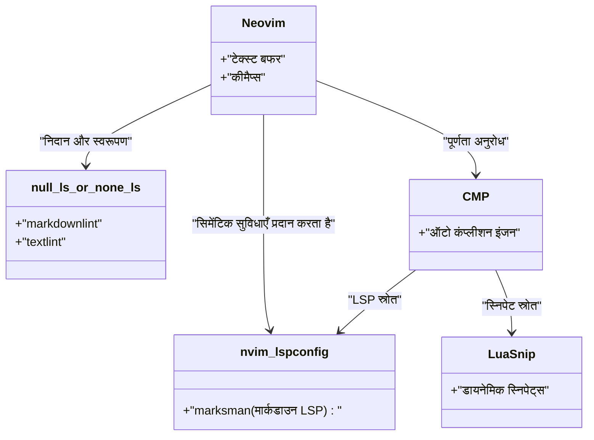
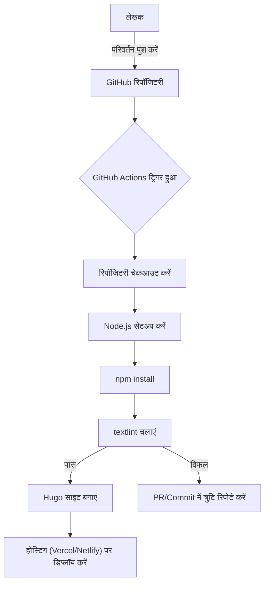

तकनीकी ब्लॉग लिखना जारी रखने के लिए, लेखन वातावरण का अनुकूलन आवश्यक है। इस लेख में, हम मार्कडाउन का उपयोग करके तकनीकी ब्लॉगों की लेखन गति को नाटकीय रूप से बेहतर बनाने के लिए उन्नत संपादक सेटिंग्स में गहराई से उतरेंगे। विज़ुअल स्टूडियो कोड (VS Code) और Neovim के अत्यधिक अनुकूलन, स्निपेट्स के उपयोग, जापानी व्याकरण जांच उपकरण textlint की शुरुआत से लेकर CI/CD पाइपलाइन में स्वचालन, और GitHub Copilot जैसे LLM का लाभ उठाने वाली अत्याधुनिक लेखन तकनीकों तक, हम व्यापक रूप से सब कुछ कवर करेंगे।

## 1. लेखन गति में सुधार के लिए गणितीय मॉडल

संपादक सेटिंग्स का अनुकूलन लेखन समय को कैसे प्रभावित करता है, आइए पहले इसे एक सरल सूत्र के साथ मॉडल करें। मान लें कि एक ब्लॉग पोस्ट लिखने के लिए कुल इनपुट समय $T_{total}$ है।

$$
T_{total} = T_{think} + T_{type} + T_{format} + T_{review}
$$

यहाँ, $T_{think}$ सोचने का समय है, $T_{type}$ टाइपिंग का समय है, $T_{format}$ मार्कडाउन जैसे प्रारूप समायोजन का समय है, और $T_{review}$ संपादन और प्रूफरीडिंग का समय है।

संपादक अनुकूलन (जैसे स्निपेट्स और लिंटर सेटिंग्स का परिचय) द्वारा बचाए गए समय $T_{saved}$ को, एक विशिष्ट पैटर्न (उदाहरण के लिए, ह्यूगो (Hugo) शॉर्टकोड या मार्कडाउन टेबल) की घटनाओं की संख्या $N$, मैन्युअल इनपुट के लिए लगने वाले समय $t_{manual}$, और स्निपेट्स आदि के माध्यम से स्वचालन द्वारा लगने वाले समय $t_{snippet}$ का उपयोग करके निम्नानुसार व्यक्त किया जा सकता है:

$$
T_{saved} = \sum_{i=1}^{k} N_i \times (t_{manual, i} - t_{snippet, i}) + T_{review\_saved}
$$

इसके अतिरिक्त, स्वचालित स्वरूपण (auto-formatter) और लिंट टूल पेश करने से, मानवीय दृश्य निरीक्षण समय $T_{review}$ काफी कम हो जाता है। इस $T_{saved}$ को अधिकतम करना इस लेख का उद्देश्य है।

## 2. विज़ुअल स्टूडियो कोड (VS Code) की सर्वश्रेष्ठ सेटिंग्स

VS Code वर्तमान में सबसे लोकप्रिय संपादकों में से एक है, और इसमें मार्कडाउन लिखने के लिए एक्सटेंशन का एक मजबूत इकोसिस्टम है।

### अनुशंसित एक्सटेंशन

लेखन में तेजी लाने के लिए, निम्नलिखित एक्सटेंशन इंस्टॉल करने की दृढ़ता से अनुशंसा की जाती है।

1. **Markdown All in One**: इसमें मार्कडाउन लिखने के लिए आवश्यक सभी बुनियादी सुविधाएँ हैं, जैसे शॉर्टकट कुंजियों के साथ बोल्ड और इटैलिक करना, सूचियों की स्वचालित निरंतरता, और सामग्री की तालिका (TOC) का स्वत: निर्माण।
2. **markdownlint**: यह वास्तविक समय में मार्कडाउन सिंटैक्स त्रुटियों और शैली उल्लंघनों की चेतावनी देता है।
3. **vscode-textlint**: यह जापानी तकनीकी दस्तावेजों के लिए नियमों का एक सेट लागू करता है, जो असंगतताओं और व्याकरणिक त्रुटियों को रोकता है।

### ह्यूगो (Hugo) के लिए कस्टम स्निपेट सेटिंग्स (`markdown.json`)

यदि आप तकनीकी ब्लॉग के लिए Hugo या Docusaurus जैसे स्थिर साइट जनरेटर (Static Site Generator) का उपयोग कर रहे हैं, तो आप अक्सर Frontmatter या कस्टम शॉर्टकोड दर्ज करेंगे। VS Code की स्निपेट सुविधा का उपयोग करके, उन्हें पलक झपकते ही विस्तारित किया जा सकता है।

कमांड पैलेट से `Preferences: Configure User Snippets` चुनें, और `markdown.json` में निम्नलिखित सेटिंग्स जोड़ें।

```json
{
  "Hugo Frontmatter": {
    "prefix": "frontmatter",
    "body": [
      "---",
      "title: \"${1:शीर्षक}\"",
      "slug: \"${2:slug-name}\"",
      "date: \"$CURRENT_YEAR-$CURRENT_MONTH-$CURRENT_DATE T$CURRENT_HOUR:$CURRENT_MINUTE:$CURRENT_SECOND+09:00\"",
      "image: \"img/eyecatch.jpg\"",
      "math: true",
      "mermaid: true",
      "categories: [\"${3:Category}\"]",
      "tags: [\"${4:Tag1}\", \"${5:Tag2}\"]",
      "---",
      "",
      "${0}"
    ],
    "description": "ह्यूगो (Hugo) के लिए YAML Frontmatter का विस्तार करता है"
  },
  "Hugo Figure Shortcode": {
    "prefix": "hfig",
    "body": [
      "{{< figure src=\"${1:image.jpg}\" title=\"${2:छवि का शीर्षक}\" >}}"
    ],
    "description": "ह्यूगो (Hugo) का Figure शॉर्टकोड"
  },
  "Markdown Table": {
    "prefix": "mtable",
    "body": [
      "| ${1:Header 1} | ${2:Header 2} | ${3:Header 3} |",
      "| :--- | :---: | ---: |",
      "| ${4:Row 1} | ${5:Data} | ${6:Data} |",
      "| ${7:Row 2} | ${8:Data} | ${9:Data} |",
      "$0"
    ],
    "description": "3-कॉलम वाली मार्कडाउन टेबल उत्पन्न करता है"
  }
}
```

इस सेटिंग के साथ, बस `frontmatter` टाइप करने और टैब कुंजी दबाने से, वर्तमान समय सहित YAML Frontmatter तुरंत विस्तृत हो जाएगा, जिससे आपकी प्रारंभिक लेखन गति नाटकीय रूप से बढ़ जाएगी।

### GitHub Copilot का उपयोग करके लेखन सहायता

VS Code में GitHub Copilot को सक्षम करने से, प्रासंगिक AI पूर्णता (AI completion) मार्कडाउन में भी काम करती है। विशेष रूप से तकनीकी ब्लॉगों के लिए, AI अनुमान लगा सकता है और "आगे क्या समझाया जाना चाहिए" या "संबंधित कोड ब्लॉक" सुझा सकता है, जो टाइपिंग समय $T_{type}$ को काफी कम कर सकता है।

## 3. Neovim में अत्यधिक अनुकूलन

VS Code का GUI बेहतरीन है, लेकिन टर्मिनल प्रेमियों और Vimmer के लिए, Neovim सबसे अच्छा विकल्प है, जहाँ आप कीबोर्ड से हाथ हटाए बिना सब कुछ पूरा कर सकते हैं।

### Neovim LSP आर्किटेक्चर

मार्कडाउन वातावरण में Neovim के LSP (Language Server Protocol) और Linter का आर्किटेक्चर निम्नानुसार है।



### LuaSnip का उपयोग करके उन्नत स्निपेट विस्तार

VS Code के JSON स्निपेट से भी अधिक शक्तिशाली Neovim का प्लगइन `LuaSnip` है। आप Lua के तर्क (logic) का उपयोग करके गतिशील रूप से स्निपेट की सामग्री की गणना और विस्तार कर सकते हैं।

नीचे एक LuaSnip कॉन्फ़िगरेशन का उदाहरण दिया गया है जो गतिशील रूप से वर्तमान दिनांक और समय प्राप्त करता है और Hugo के Frontmatter का विस्तार करता है।

```lua
local ls = require("luasnip")
local s = ls.snippet
local t = ls.text_node
local i = ls.insert_node
local f = ls.function_node

-- वर्तमान JST समय प्राप्त करने का फ़ंक्शन
local function get_current_date_jst()
    return os.date("!%Y-%m-%dT%H:%M:%S") .. "+09:00"
end

ls.add_snippets("markdown", {
    s("frontmatter", {
        t({"---", "title: \""}), i(1, "Title"), t({"\"", "slug: \""}), i(2, "slug-name"), t({"\"", "date: \""}),
        f(function() return {get_current_date_jst()} end, {}),
        t({"\"", "image: \"img/eyecatch.jpg\"", "math: true", "mermaid: true", "categories: [\""}), i(3, "Category"), t({"\"]", "tags: [\""}), i(4, "Tag"), t({"\"]", "---", "", ""}),
        i(0)
    }),
    s("mtable", {
        t({"| "}), i(1, "Header 1"), t({" | "}), i(2, "Header 2"), t({" |", "|---|---|", "| "}), i(3, "Cell 1"), t({" | "}), i(4, "Cell 2"), t({" |"}),
    })
})
```

इस प्रकार, प्रोग्रामिंग भाषा (Lua) की शक्ति को उधार लेकर, न केवल निश्चित स्ट्रिंग बनाना संभव है, बल्कि कार्यों के रिटर्न मान को एम्बेड करना भी संभव है, या यहां तक कि उन्नत स्निपेट भी बनाए जा सकते हैं जो इनपुट वर्णों की संख्या के अनुसार तालिका में कॉलम की संख्या को गतिशील रूप से बढ़ाते या घटाते हैं।

## 4. लेखन की गुणवत्ता और गति को संतुलित करने के लिए स्थैतिक विश्लेषण (textlint और रेगुलर एक्सप्रेशन)

ब्लॉग की गुणवत्ता सुनिश्चित करने के लिए, आपको टाइपिंग संबंधी त्रुटियों (typos) और वर्तनी की विसंगतियों को रोकना होगा। यदि इसे मैन्युअल रूप से किया जाए, तो $T_{review}$ बहुत बढ़ जाता है, इसलिए हम `textlint` के माध्यम से स्थैतिक विश्लेषण (static analysis) पेश करेंगे।

### textlint का परिचय और जापानी नियम सेट

Node.js वातावरण के अंतर्गत textlint इंस्टॉल करें।

```bash
npm install -D textlint textlint-rule-preset-ja-technical-writing textlint-rule-prh textlint-filter-rule-comments
```

प्रोजेक्ट के रूट में `.textlintrc.json` बनाएँ और इसे निम्नानुसार कॉन्फ़िगर करें।

```json
{
  "filters": {
    "comments": true
  },
  "rules": {
    "preset-ja-technical-writing": {
      "ja-no-mixed-period": {
        "periodMark": "。"
      },
      "sentence-length": {
        "max": 100
      }
    },
    "prh": {
      "rulePaths": ["./prh.yml"]
    }
  }
}
```

तकनीकी शब्दों के वर्तनी भेदों को परिभाषित करने के लिए `prh.yml` बनाएँ। उदाहरण के लिए, "सर्वर (サーバー)" और "सर्वर (サーバ)", या "Javascript" और "JavaScript" को एकीकृत करें।

```yaml
version: 1
rules:
  - expected: "JavaScript"
    pattern:  "Javascript"
  - expected: "サーバー"
    pattern: "サーバ"
  - expected: "インターフェース"
    pattern: "インターフェイス"
```

परिणामस्वरूप, हर बार जब आप संपादक में टाइप करेंगे, आपको रीयल-टाइम में वर्तनी की विसंगतियों के बारे में चेतावनी दी जाएगी, जिससे प्रूफरीडिंग का समय लगभग शून्य हो जाएगा।

### रेगुलर एक्सप्रेशन का उपयोग करके बैच रिप्लेसमेंट और स्ट्रक्चर्ड पैटर्न

जब आप किसी मौजूदा लेख को मार्कडाउन में ले जाते हैं expanded या बाहर से टेक्स्ट लाते हैं, तो रेगुलर एक्सप्रेशन का उपयोग करके बैच रिप्लेसमेंट काम आता है।

उदाहरण के लिए, HTML के `<b>जोर</b>` टैग को मार्कडाउन के `**जोर**` में बदलने के लिए रेगुलर एक्सप्रेशन:

- **खोज पैटर्न**: `<b>(.*?)</b>`
- **प्रतिस्थापन पैटर्न**: `**$1**`

अनावश्यक लगातार लाइन ब्रेक को एक में समेकित करते समय:

- **खोज पैटर्न**: `\n{3,}`
- **प्रतिस्थापन पैटर्न**: `\n\n`

आप VS Code की खोज और प्रतिस्थापन सुविधा (रेगुलर एक्सप्रेशन मोड) या Neovim की `%s` कमांड (`:%s/<b>\(.*?\)<\/b>/**\1**/g`) का उपयोग करके इन्हें चलाकर, तुरंत स्वरूपण को एकीकृत कर सकते हैं।

### CI/CD पाइपलाइन के साथ स्वचालित जाँच

इसके अतिरिक्त, हम एक CI पाइपलाइन बनाने के लिए GitHub Actions का उपयोग करते हैं जो ब्लॉग पोस्ट को पुश करते समय स्वचालित रूप से textlint चलाता है। यह आपको नियम-उल्लंघन करने वाले लेखों को डिप्लॉय होने से रोकने की अनुमति देता है।



## 5. LLM युग में मार्कडाउन लेखन तकनीक

आधुनिक तकनीकी ब्लॉग लेखन में, LLM (लार्ज लैंग्वेज मॉडल) का उपयोग अपरिहार्य है। संपादक में अंतर्निहित AI टूल का उपयोग करके, लेखन गति को और भी दोगुना किया जा सकता है।

### संपादक के भीतर प्रॉम्प्ट इंजीनियरिंग (Prompt Engineering)

VS Code के GitHub Copilot Chat, या Neovim के `ChatGPT.nvim` और `Copilot.vim` का उपयोग करके, आप संपादक को छोड़े बिना निम्नलिखित जैसे प्रॉम्प्ट दे सकते हैं:

> "कृपया शुरुआती लोगों के लिए मार्कडाउन पदानुक्रम (hierarchy) संरचना में निम्नलिखित तकनीकी तत्वों की रूपरेखा तैयार करें: Docker, Kubernetes, CI/CD"

ऐसा करने से, तुरंत हेडिंग और बुलेट पॉइंट मार्कडाउन उत्पन्न हो जाता है। हमें बस उस ढांचे को विस्तृत करने की आवश्यकता है।

इसके अलावा, जटिल Mermaid आरेख (diagrams) और गणितीय सूत्र (LaTeX) लिखते समय, AI को निर्देश देने से सटीक सिंटैक्स उत्पन्न होगा। उदाहरण के लिए, इस लेख में प्रस्तुत सूत्रों और आरेखों के लेआउट की नींव भी LLM के साथ जोड़ी-लेखन (pair writing) के माध्यम से तेज की गई है।

## 6. निष्कर्ष

हमने संपादक सेटिंग्स के बारे में बताया है जो मार्कडाउन में तकनीकी ब्लॉग लिखते समय आपकी लेखन गति को दोगुना कर देंगी।

1. **गणितीय मॉडल के प्रति जागरूकता**: $T_{saved}$ को अधिकतम करने के लिए दोहराए जाने वाले कार्यों को खत्म करें।
2. **VS Code का लाभ उठाना**: एक्सटेंशन और `markdown.json` स्निपेट्स के साथ टाइपिंग कम करें।
3. **Neovim का अत्यधिक अनुकूलन**: `LuaSnip` के माध्यम से गतिशील स्निपेट्स और पूर्ण कीबोर्ड नियंत्रण।
4. **textlint और स्थैतिक विश्लेषण**: प्रूफरीडिंग समय को शून्य के करीब लाने के लिए CI/CD और स्थानीय लिंटर का एकीकरण।
5. **LLM का एकीकरण**: AI को संपादक के भीतर सीधे मार्कडाउन संरचनाओं और आरेख कोड आउटपुट करने का निर्देश दें।

इन सेटिंग्स को अपने स्वयं के वातावरण में शामिल करके, लेखन की "परेशानी" दूर हो जाएगी, और आपके तकनीकी आउटपुट की मात्रा और गुणवत्ता में नाटकीय रूप से सुधार होना चाहिए। क्यों न सिर्फ एक छोटे स्निपेट को पंजीकृत करके शुरुआत करें?
