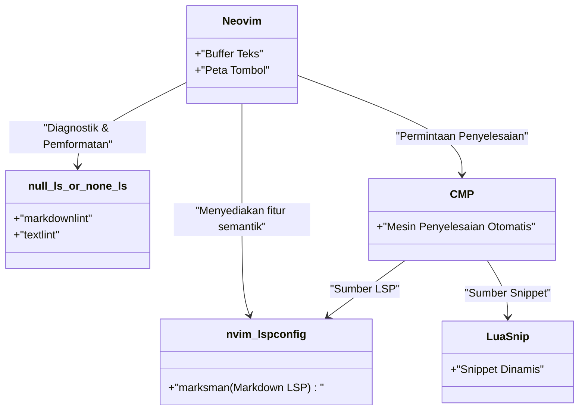
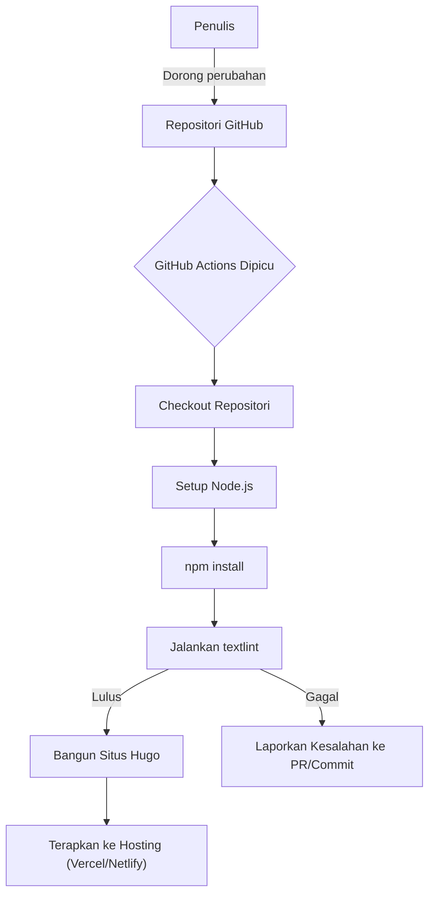

Untuk terus menulis blog teknologi, pengoptimalan lingkungan penulisan sangatlah penting. Artikel ini akan membahas secara mendalam pengaturan editor tingkat lanjut yang dapat meningkatkan kecepatan penulisan blog teknologi menggunakan Markdown secara drastis. Kita akan membahas secara komprehensif mulai dari penyesuaian ekstrem Visual Studio Code (VS Code) dan Neovim, pemanfaatan snippet, pengenalan textlint sebagai alat pemeriksa tata bahasa hingga otomatisasi dalam pipeline CI/CD, dan teknik penulisan mutakhir memanfaatkan LLM seperti GitHub Copilot.

## 1. Model Matematis Peningkatan Kecepatan Menulis

Mari kita buat model dengan rumus sederhana untuk melihat seberapa besar pengaruh pengoptimalan pengaturan editor terhadap waktu penulisan. Misalkan total waktu pengetikan saat menulis satu artikel blog adalah $T_{total}$.

$$
T_{total} = T_{think} + T_{type} + T_{format} + T_{review}
$$

Di sini, $T_{think}$ adalah waktu berpikir, $T_{type}$ adalah waktu mengetik, $T_{format}$ adalah waktu penyesuaian format seperti Markdown, dan $T_{review}$ adalah waktu revisi dan koreksi.

Waktu yang dihemat $T_{saved}$ melalui penyesuaian editor (seperti penggunaan snippet dan pengaturan Linter) dapat diekspresikan sebagai berikut, menggunakan jumlah kemunculan $N$ dari pola tertentu (misalnya, shortcode Hugo atau tabel Markdown), waktu yang dibutuhkan untuk pengetikan manual $t_{manual}$, dan waktu yang dibutuhkan jika diotomatisasi dengan snippet $t_{snippet}$.

$$
T_{saved} = \sum_{i=1}^{k} N_i \times (t_{manual, i} - t_{snippet, i}) + T_{review\_saved}
$$

Selanjutnya, dengan memperkenalkan pemformat otomatis dan alat Lint, waktu pemeriksaan visual oleh manusia $T_{review}$ berkurang secara signifikan. Memaksimalkan $T_{saved}$ inilah yang menjadi tujuan dari artikel ini.

## 2. Pengaturan Terkuat Visual Studio Code (VS Code)

VS Code saat ini adalah salah satu editor yang paling banyak digunakan dan memiliki ekosistem ekstensi yang kuat untuk penulisan Markdown.

### Ekstensi yang Direkomendasikan

Untuk mempercepat penulisan, sangat disarankan untuk menginstal ekstensi berikut:

1. **Markdown All in One**: Menyediakan semua fitur dasar yang diperlukan untuk penulisan Markdown, seperti cetak tebal/miring dengan tombol pintasan, kelanjutan daftar otomatis, dan pembuatan daftar isi (TOC) otomatis.
2. **markdownlint**: Memperingatkan kesalahan sintaks dan pelanggaran gaya Markdown secara real-time.
3. **vscode-textlint**: Menerapkan set aturan untuk dokumen teknis guna mencegah ketidakkonsistenan ejaan dan kesalahan tata bahasa.

### Pengaturan Snippet Khusus untuk Hugo (`markdown.json`)

Jika Anda menggunakan generator situs statis seperti Hugo atau Docusaurus untuk blog teknologi, Anda akan sering memasukkan Frontmatter atau shortcode kustom. Menggunakan fitur snippet VS Code, ini dapat dikembangkan dalam sekejap.

Pilih `Preferences: Configure User Snippets` dari Command Palette dan tambahkan pengaturan berikut ke `markdown.json`.

```json
{
  "Hugo Frontmatter": {
    "prefix": "frontmatter",
    "body": [
      "---",
      "title: \"${1:Judul}\"",
      "slug: \"${2:slug-name}\"",
      "date: \"$CURRENT_YEAR-$CURRENT_MONTH-$CURRENT_DATE T$CURRENT_HOUR:$CURRENT_MINUTE:$CURRENT_SECOND+09:00\"",
      "image: \"img/eyecatch.jpg\"",
      "math: true",
      "mermaid: true",
      "categories: [\"${3:Category}\"]",
      "tags: [\"${4:Tag1}\", \"${5:Tag2}\"]",
      "---",
      "",
      "${0}"
    ],
    "description": "Mengembangkan YAML Frontmatter untuk Hugo"
  },
  "Hugo Figure Shortcode": {
    "prefix": "hfig",
    "body": [
      "{{< figure src=\"${1:image.jpg}\" title=\"${2:Judul Gambar}\" >}}"
    ],
    "description": "Shortcode Figure Hugo"
  },
  "Markdown Table": {
    "prefix": "mtable",
    "body": [
      "| ${1:Header 1} | ${2:Header 2} | ${3:Header 3} |",
      "| :--- | :---: | ---: |",
      "| ${4:Row 1} | ${5:Data} | ${6:Data} |",
      "| ${7:Row 2} | ${8:Data} | ${9:Data} |",
      "$0"
    ],
    "description": "Menghasilkan tabel Markdown 3 kolom"
  }
}
```

Dengan pengaturan ini, hanya dengan mengetik `frontmatter` dan menekan tombol Tab, YAML Frontmatter termasuk waktu saat ini akan langsung dikembangkan, dan kecepatan awal penulisan akan meningkat drastis.

### Bantuan Penulisan Memanfaatkan GitHub Copilot

Jika GitHub Copilot diaktifkan di VS Code, penyelesaian AI berdasarkan konteks juga berfungsi dalam Markdown. Khususnya untuk blog teknologi, AI dapat mengantisipasi dan menyarankan "struktur selanjutnya yang harus dijelaskan" atau "blok kode terkait", sehingga waktu mengetik $T_{type}$ dapat dikurangi secara signifikan.

## 3. Penyesuaian Ekstrem di Neovim

Meskipun GUI VS Code sangat bagus, bagi penggemar terminal dan Vimmer, Neovim adalah pilihan terkuat yang memungkinkan semuanya diselesaikan tanpa melepaskan tangan dari keyboard sama sekali.

### Arsitektur LSP Neovim

Arsitektur LSP (Language Server Protocol) dan Linter untuk Neovim di lingkungan Markdown adalah sebagai berikut.



### Ekspansi Snippet Tingkat Lanjut Menggunakan LuaSnip

Lebih kuat dari snippet JSON VS Code adalah plugin Neovim yaitu `LuaSnip`. Menggunakan logika Lua, Anda dapat menghitung dan mengembangkan konten snippet secara dinamis.

Berikut adalah contoh pengaturan LuaSnip yang mengambil tanggal dan waktu saat ini secara dinamis dan mengembangkan Frontmatter Hugo.

```lua
local ls = require("luasnip")
local s = ls.snippet
local t = ls.text_node
local i = ls.insert_node
local f = ls.function_node

-- Fungsi untuk mendapatkan waktu JST saat ini
local function get_current_date_jst()
    return os.date("!%Y-%m-%dT%H:%M:%S") .. "+09:00"
end

ls.add_snippets("markdown", {
    s("frontmatter", {
        t({"---", "title: \""}), i(1, "Judul"), t({"\"", "slug: \""}), i(2, "slug-name"), t({"\"", "date: \""}),
        f(function() return {get_current_date_jst()} end, {}),
        t({"\"", "image: \"img/eyecatch.jpg\"", "math: true", "mermaid: true", "categories: [\""}), i(3, "Category"), t({"\"]", "tags: [\""}), i(4, "Tag"), t({"\"]", "---", "", ""}),
        i(0)
    }),
    s("mtable", {
        t({"| "}), i(1, "Header 1"), t({" | "}), i(2, "Header 2"), t({" |", "|---|---|", "| "}), i(3, "Cell 1"), t({" | "}), i(4, "Cell 2"), t({" |"}),
    })
})
```

Dengan cara ini, dengan meminjam kekuatan bahasa pemrograman (Lua), dimungkinkan untuk membuat snippet kompleks yang tidak hanya menyisipkan string tetap, tetapi juga menyematkan nilai kembalian fungsi atau mengubah jumlah kolom tabel secara dinamis sesuai dengan input.

## 4. Analisis Statis yang Menyeimbangkan Kualitas dan Kecepatan Penulisan (textlint dan Ekspresi Reguler)

Untuk menjamin kualitas blog, perlu untuk mencegah kesalahan ketik dan ketidakkonsistenan ejaan. Melakukan ini secara manual akan menyebabkan $T_{review}$ meningkat tajam, jadi kita akan memperkenalkan analisis statis menggunakan `textlint`.

### Pengenalan textlint dan Set Aturan

Instal textlint di lingkungan Node.js.

```bash
npm install -D textlint textlint-rule-preset-ja-technical-writing textlint-rule-prh textlint-filter-rule-comments
```

Buat `.textlintrc.json` di root proyek dan atur seperti berikut.

```json
{
  "filters": {
    "comments": true
  },
  "rules": {
    "preset-ja-technical-writing": {
      "ja-no-mixed-period": {
        "periodMark": "."
      },
      "sentence-length": {
        "max": 100
      }
    },
    "prh": {
      "rulePaths": ["./prh.yml"]
    }
  }
}
```

Buat `prh.yml` dan definisikan ketidakkonsistenan ejaan istilah teknis. Misalnya, menyatukan "Server" dan "Peladen", "Javascript" dan "JavaScript", dll.

```yaml
version: 1
rules:
  - expected: "JavaScript"
    pattern:  "Javascript"
  - expected: "Server"
    pattern: "Peladen"
  - expected: "Antarmuka"
    pattern: "Antar muka"
```

Dengan ini, setiap kali Anda mengetik di editor, ketidakkonsistenan ejaan akan diperingatkan secara real-time, dan waktu koreksi akan menjadi hampir nol.

### Penggantian Massal dengan Ekspresi Reguler dan Pola Terstruktur

Saat memigrasi artikel yang ada ke Markdown atau menempelkan teks dari luar, penggantian massal dengan ekspresi reguler sangat berguna.

Misalnya, ekspresi reguler untuk mengubah tag `<b>tebal</b>` HTML menjadi `**tebal**` Markdown:

- **Pola pencarian**: `<b>(.*?)</b>`
- **Pola penggantian**: `**$1**`

Saat menggabungkan baris baru berturut-turut yang tidak perlu menjadi satu:

- **Pola pencarian**: `\n{3,}`
- **Pola penggantian**: `\n\n`

Dengan menjalankan ini melalui fitur cari & ganti (mode ekspresi reguler) VS Code atau perintah `%s` Neovim (`:%s/<b>\(.*?\)<\/b>/**\1**/g`), Anda dapat menyatukan format dalam sekejap.

### Pemeriksaan Otomatis oleh Pipeline CI/CD

Selain itu, menggunakan GitHub Actions, kami membangun pipeline CI di mana textlint berjalan secara otomatis saat Anda melakukan push artikel blog. Hal ini dapat mencegah publikasi artikel yang memiliki pelanggaran aturan.



## 5. Teknik Penulisan Markdown di Era LLM

Dalam penulisan blog teknologi modern, pemanfaatan LLM (Large Language Model) tidak bisa dihindari. Dengan memanfaatkan alat AI bawaan editor, kecepatan penulisan akan berlipat ganda.

### Rekayasa Prompt di Dalam Editor

Menggunakan GitHub Copilot Chat di VS Code atau `ChatGPT.nvim` dan `Copilot.vim` di Neovim, Anda dapat memberikan prompt seperti berikut tanpa meninggalkan editor.

> "Buatkan kerangka struktur hierarki Markdown untuk pemula tentang elemen teknologi berikut: Docker, Kubernetes, CI/CD"

Kemudian, Markdown untuk judul dan poin-poin akan dihasilkan seketika. Kita hanya perlu menambahkan detail ke dalam kerangka kerja tersebut.

Selain itu, untuk pembuatan diagram Mermaid yang kompleks dan rumus matematika (LaTeX), memberikan instruksi kepada AI akan menghasilkan sintaks yang akurat. Misalnya, tata letak rumus matematika dan diagram yang ditampilkan dalam artikel ini juga dipercepat melalui penulisan berpasangan (pair writing) dengan LLM.

## 6. Kesimpulan

Kami telah menjelaskan pengaturan editor yang dapat menggandakan kecepatan penulisan saat menulis blog teknologi dengan Markdown.

1. **Kesadaran akan model matematis**: Membasmi tugas berulang untuk memaksimalkan $T_{saved}$.
2. **Pemanfaatan VS Code**: Menghemat input dengan ekstensi dan snippet `markdown.json`.
3. **Penyesuaian ekstrem Neovim**: Snippet dinamis oleh `LuaSnip` dan operasi keyboard penuh.
4. **textlint dan analisis statis**: Integrasi CI/CD dan Linter lokal untuk mendekati waktu koreksi ke nol.
5. **Integrasi LLM**: Membuat AI secara langsung menghasilkan struktur Markdown dan kode diagram di dalam editor.

Dengan memasukkan pengaturan ini ke dalam lingkungan Anda sendiri, "kerepotan" menulis akan hilang, dan kuantitas serta kualitas output teknis akan meningkat secara dramatis. Bagaimana kalau memulainya bahkan dari satu pendaftaran snippet kecil?
