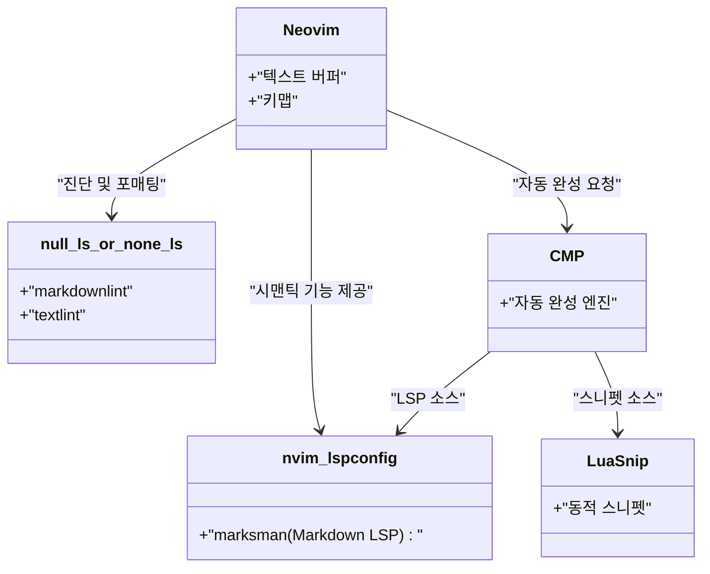
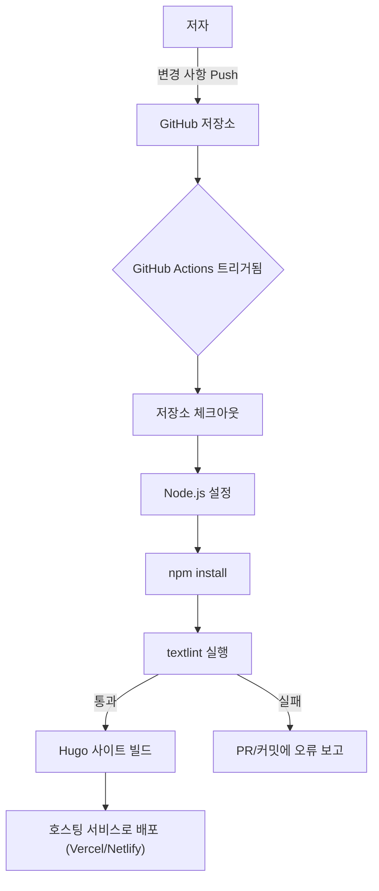

기술 블로그를 지속적으로 집필하기 위해서는 집필 환경의 최적화가 필수불가결합니다. 본 기사에서는 Markdown을 사용한 기술 블로그의 집필 속도를 극적으로 향상시키기 위한 고급 에디터 설정에 대해 깊이 파헤쳐 봅니다. Visual Studio Code (VS Code)나 Neovim의 극한의 커스터마이징, 스니펫 활용, 문법 체크 툴인 textlint의 도입부터 CI/CD 파이프라인에서의 자동화, 그리고 GitHub Copilot 등 LLM을 활용한 최첨단 집필술까지 망라하여 해설합니다.

## 1. 집필 속도 향상의 수리 모델

에디터 설정의 최적화가 집필 시간에 얼마나 영향을 미치는지, 우선 간단한 수식으로 모델화해 보겠습니다. 블로그 기사 1편을 집필할 때의 총 입력 시간을 $T_{total}$이라고 합니다.

$$
T_{total} = T_{think} + T_{type} + T_{format} + T_{review}
$$

여기서 $T_{think}$는 사고 시간, $T_{type}$은 타이핑 시간, $T_{format}$은 Markdown 등의 포맷 조정 시간, $T_{review}$는 퇴고 및 교정 시간입니다.

에디터 커스터마이징(스니펫 도입이나 Linter 설정 등)을 통해 단축되는 시간 $T_{saved}$는, 특정 패턴(예를 들어 Hugo의 숏코드나 Markdown 표)의 출현 횟수 $N$과 수동 입력에 걸리는 시간 $t_{manual}$, 스니펫 등의 자동화로 걸리는 시간 $t_{snippet}$을 사용하여 다음과 같이 나타낼 수 있습니다.

$$
T_{saved} = \sum_{i=1}^{k} N_i \times (t_{manual, i} - t_{snippet, i}) + T_{review\_saved}
$$

나아가 자동 포매터나 Lint 툴을 도입함으로써 사람의 육안 확인 시간 $T_{review}$가 대폭 단축됩니다. 이 $T_{saved}$의 극대화야말로 본 기사의 목적입니다.

## 2. Visual Studio Code (VS Code)의 최강 설정

VS Code는 현재 가장 널리 보급된 에디터 중 하나이며, Markdown 집필에 있어서도 강력한 확장 기능 생태계를 가지고 있습니다.

### 권장 확장 기능

집필을 고속화하기 위해 다음 확장 기능을 도입할 것을 강력히 권장합니다.

1. **Markdown All in One**: 단축키를 통한 굵게・기울임꼴 지정, 목록 자동 이어가기, 목차(TOC) 자동 생성 등 Markdown 집필에 필요한 기본 기능이 모두 갖추어져 있습니다.
2. **markdownlint**: Markdown의 구문 오류나 스타일 위반을 실시간으로 경고해 줍니다.
3. **vscode-textlint**: 기술 문서용 룰셋을 적용하여 표기 통일성 결여나 문법 오류를 방지합니다.

### Hugo용 독자 스니펫 설정 (`markdown.json`)

기술 블로그로 Hugo나 Docusaurus 등의 정적 사이트 생성기를 이용하는 경우, Frontmatter나 독자적인 숏코드를 빈번하게 입력하게 됩니다. VS Code의 스니펫 기능을 사용하면 이를 순식간에 전개할 수 있습니다.

명령 팔레트에서 `Preferences: Configure User Snippets`를 선택하고, `markdown.json`에 다음 설정을 추가합니다.

```json
{
  "Hugo Frontmatter": {
    "prefix": "frontmatter",
    "body": [
      "---",
      "title: \"${1:제목}\"",
      "slug: \"${2:slug-name}\"",
      "date: \"$CURRENT_YEAR-$CURRENT_MONTH-$CURRENT_DATE T$CURRENT_HOUR:$CURRENT_MINUTE:$CURRENT_SECOND+09:00\"",
      "image: \"img/eyecatch.jpg\"",
      "math: true",
      "mermaid: true",
      "categories: [\"${3:Category}\"]",
      "tags: [\"${4:Tag1}\", \"${5:Tag2}\"]",
      "---",
      "",
      "${0}"
    ],
    "description": "Hugo용 YAML Frontmatter를 전개합니다"
  },
  "Hugo Figure Shortcode": {
    "prefix": "hfig",
    "body": [
      "{{< figure src=\"${1:image.jpg}\" title=\"${2:이미지 제목}\" >}}"
    ],
    "description": "Hugo의 Figure 숏코드"
  },
  "Markdown Table": {
    "prefix": "mtable",
    "body": [
      "| ${1:Header 1} | ${2:Header 2} | ${3:Header 3} |",
      "| :--- | :---: | ---: |",
      "| ${4:Row 1} | ${5:Data} | ${6:Data} |",
      "| ${7:Row 2} | ${8:Data} | ${9:Data} |",
      "$0"
    ],
    "description": "3열 Markdown 테이블을 생성"
  }
}
```

이 설정으로 `frontmatter`라고 입력하고 탭 키를 누르기만 하면 현재 시각이 포함된 YAML Frontmatter가 순식간에 전개되어 집필 초기 속도가 비약적으로 상승합니다.

### GitHub Copilot을 활용한 집필 지원

VS Code 상에서 GitHub Copilot을 활성화해 두면, 문맥에 맞는 AI 자동 완성이 Markdown에서도 작동합니다. 특히 기술 블로그의 경우 "다음에 설명해야 할 구성"이나 "관련 코드 블록"을 AI가 예측하여 제안해 주기 때문에 타이핑 시간 $T_{type}$을 대폭 단축할 수 있습니다.

## 3. Neovim에서의 극한 커스터마이징

VS Code의 GUI도 훌륭하지만, 터미널 애호가나 Vimmer에게는 키보드에서 손을 떼지 않고 모든 것을 완결할 수 있는 Neovim이 최강의 선택지가 됩니다.

### Neovim LSP 아키텍처

Markdown 환경에서의 Neovim의 LSP(Language Server Protocol) 및 Linter 아키텍처는 다음과 같습니다.



### LuaSnip을 이용한 고급 스니펫 전개

VS Code의 JSON 스니펫보다 강력한 것이 Neovim의 플러그인인 `LuaSnip`입니다. Lua의 로직을 사용하여 동적으로 스니펫의 내용을 계산하고 전개할 수 있습니다.

아래는 현재 일시를 동적으로 가져와 Hugo의 Frontmatter를 전개하는 LuaSnip 설정 예시입니다.

```lua
local ls = require("luasnip")
local s = ls.snippet
local t = ls.text_node
local i = ls.insert_node
local f = ls.function_node

-- 현재의 JST 시각을 가져오는 함수
local function get_current_date_jst()
    return os.date("!%Y-%m-%dT%H:%M:%S") .. "+09:00"
end

ls.add_snippets("markdown", {
    s("frontmatter", {
        t({"---", "title: \""}), i(1, "Title"), t({"\"", "slug: \""}), i(2, "slug-name"), t({"\"", "date: \""}),
        f(function() return {get_current_date_jst()} end, {}),
        t({"\"", "image: \"img/eyecatch.jpg\"", "math: true", "mermaid: true", "categories: [\""}), i(3, "Category"), t({"\"]", "tags: [\""}), i(4, "Tag"), t({"\"]", "---", "", ""}),
        i(0)
    }),
    s("mtable", {
        t({"| "}), i(1, "Header 1"), t({" | "}), i(2, "Header 2"), t({" |", "|---|---|", "| "}), i(3, "Cell 1"), t({" | "}), i(4, "Cell 2"), t({" |"}),
    })
})
```

이처럼 프로그래밍 언어(Lua)의 힘을 빌림으로써, 고정된 문자열뿐만 아니라 함수의 반환값을 삽입하거나 입력 글자 수에 따라 동적으로 테이블의 열 수를 늘리고 줄이는 등 기상천외한 스니펫을 작성하는 것도 가능합니다.

## 4. 집필 품질과 속도를 양립하는 정적 분석 (textlint와 정규 표현식)

블로그의 품질을 담보하기 위해서는 오탈자나 표기 통일성 결여를 방지해야 합니다. 이를 수동으로 하면 $T_{review}$가 폭발적으로 증가하기 때문에 `textlint`를 통한 정적 분석을 도입합니다.

### textlint 도입과 룰셋

Node.js 환경에서 textlint를 설치합니다.

```bash
npm install -D textlint textlint-rule-preset-ja-technical-writing textlint-rule-prh textlint-filter-rule-comments
```

프로젝트 루트에 `.textlintrc.json`을 생성하고 다음과 같이 설정합니다.

```json
{
  "filters": {
    "comments": true
  },
  "rules": {
    "preset-ja-technical-writing": {
      "ja-no-mixed-period": {
        "periodMark": "。"
      },
      "sentence-length": {
        "max": 100
      }
    },
    "prh": {
      "rulePaths": ["./prh.yml"]
    }
  }
}
```

`prh.yml`을 생성하고 기술 용어의 표기 통일성 규칙을 정의합니다. 예를 들어 "서버"와 "써버", "Javascript"와 "JavaScript" 등을 통일합니다.

```yaml
version: 1
rules:
  - expected: "JavaScript"
    pattern:  "Javascript"
  - expected: "서버"
    pattern: "써버"
  - expected: "메시지"
    pattern: "메세지"
```

이로 인해 에디터 상에서 문자를 입력할 때마다 표기 오류가 실시간 경고되어 교정 시간이 거의 제로가 됩니다.

### 정규 표현식을 이용한 일괄 치환 및 구조화 패턴

기존 기사를 마크다운으로 마이그레이션하거나 외부에서 텍스트를 가져온 경우, 정규 표현식을 통한 일괄 치환이 편리합니다.

예를 들어, HTML의 `<b>강조</b>` 태그를 Markdown의 `**강조**`로 변환할 경우의 정규 표현식:

- **검색 패턴**: `<b>(.*?)</b>`
- **치환 패턴**: `**$1**`

불필요한 연속 줄바꿈을 하나로 통합할 경우:

- **검색 패턴**: `\n{3,}`
- **치환 패턴**: `\n\n`

이들을 VS Code의 검색 및 치환 기능(정규 표현식 모드)이나 Neovim의 `%s` 명령 (`:%s/<b>\(.*?\)<\/b>/**\1**/g`)으로 실행함으로써 순식간에 포맷을 통일할 수 있습니다.

### CI/CD 파이프라인을 통한 자동 체크

나아가 GitHub Actions를 사용하여 블로그 기사를 push했을 때 자동으로 textlint가 실행되는 CI 파이프라인을 구축합니다. 이를 통해 규칙 위반이 있는 기사의 배포를 미연에 방지할 수 있습니다.



## 5. LLM 시대의 마크다운 집필술

현대의 기술 블로그 집필에 있어 LLM(Large Language Model)의 활용은 피할 수 없습니다. 에디터 내장 AI 툴을 활용함으로써 집필 속도는 한층 더 배가됩니다.

### 에디터 내에서의 프롬프트 엔지니어링

VS Code의 GitHub Copilot Chat이나 Neovim의 `ChatGPT.nvim`, `Copilot.vim` 등을 사용하여 에디터를 벗어나지 않고 다음과 같은 프롬프트를 던집니다.

> "다음 기술 요소에 대해 초보자를 위한 마크다운 계층 구조로 개요를 작성해 줘: Docker, Kubernetes, CI/CD"

그러면 즉시 제목이나 글머리 기호 형태의 마크다운이 생성됩니다. 우리는 그 뼈대에 살을 붙여 나가기만 하면 됩니다.

또한 복잡한 Mermaid 다이어그램이나 수식(LaTeX) 작성도 AI에게 지시를 내림으로써 정확한 구문을 생성해 줍니다. 예를 들어 본 기사에 게재된 수식이나 도표 레이아웃의 기초도 LLM과의 페어 라이팅을 통해 고속화되었습니다.

## 6. 요약

Markdown으로 기술 블로그를 작성할 때의 집필 속도를 배가시키는 에디터 설정에 대해 알아보았습니다.

1. **수리 모델의 인식**: $T_{saved}$를 극대화하기 위해 반복 작업을 근절한다.
2. **VS Code의 활용**: 확장 기능과 `markdown.json` 스니펫으로 입력을 생략.
3. **Neovim의 극한 커스터마이징**: `LuaSnip`을 통한 동적 스니펫과 완벽한 키보드 조작.
4. **textlint와 정적 분석**: 교정 시간을 제로에 가깝게 만들기 위한 CI/CD와 로컬 Linter의 통합.
5. **LLM의 통합**: 에디터 내에서 직접 AI에게 마크다운 구성이나 도표 코드를 출력하게 한다.

이러한 설정들을 자신의 환경에 도입함으로써 집필의 "귀찮음"이 사라지고, 기술적 아웃풋의 양과 질이 극적으로 향상될 것입니다. 우선 작은 스니펫 등록 하나부터라도 시작해 보는 것은 어떨까요?
