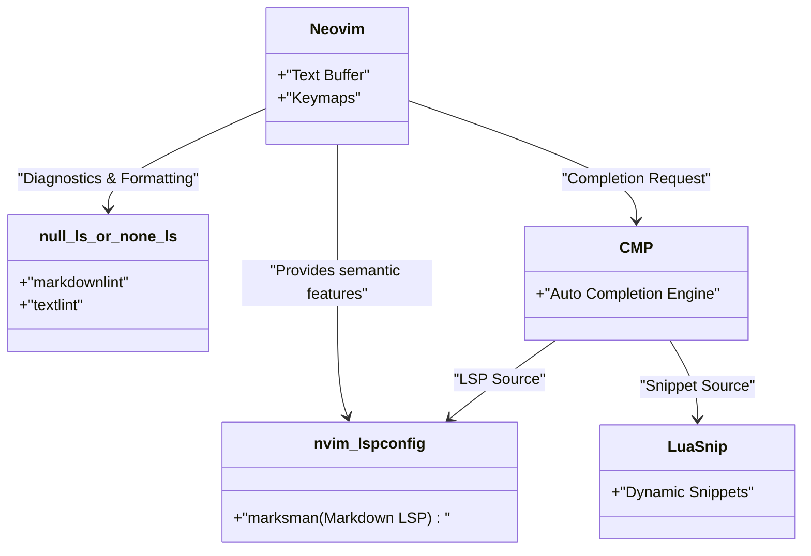
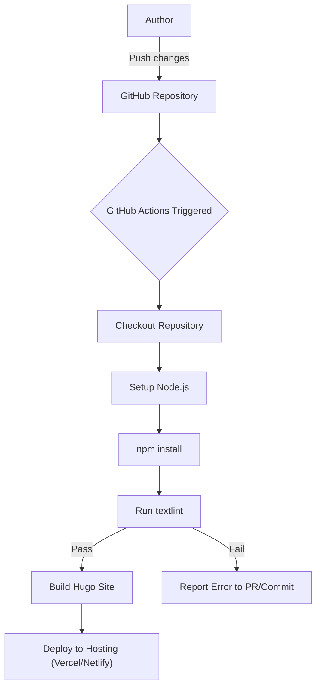

技術ブログを継続して執筆するためには、執筆環境の最適化が必要不可欠です。本記事では、Markdownを用いた技術ブログの執筆スピードを劇的に向上させるための、高度なエディタ設定について深く掘り下げます。Visual Studio Code (VS Code) や Neovim の極限までのカスタマイズ、スニペットの活用、日本語の文法チェックツールである textlint の導入から CI/CD パイプラインでの自動化、そして GitHub Copilot などの LLM を活用した最先端の執筆術まで、網羅的に解説します。

## 1. 執筆スピード向上の数理モデル

エディタ設定の最適化がどれほど執筆時間に影響を与えるのか、まずは簡単な数式でモデル化してみましょう。ブログ記事を1本執筆する際の総入力時間を $T_{total}$ とします。

$$
T_{total} = T_{think} + T_{type} + T_{format} + T_{review}
$$

ここで、$T_{think}$ は思考時間、$T_{type}$ はタイピング時間、$T_{format}$ はMarkdownなどのフォーマット調整時間、$T_{review}$ は推敲・校正時間です。

エディタのカスタマイズ（スニペット導入やLinter設定など）によって削減される時間 $T_{saved}$ は、ある特定のパターン（例えばHugoのショートコードやMarkdownの表）の出現回数 $N$ と、手動入力にかかる時間 $t_{manual}$、スニペット等の自動化によってかかる時間 $t_{snippet}$ を用いて次のように表せます。

$$
T_{saved} = \sum_{i=1}^{k} N_i \times (t_{manual, i} - t_{snippet, i}) + T_{review\_saved}
$$

さらに、自動フォーマッタやLintツールを導入することで、人間の目視による確認時間 $T_{review}$ が大幅に削減されます。この $T_{saved}$ の最大化こそが、本記事の目的です。

## 2. Visual Studio Code (VS Code) の最強設定

VS Codeは、現在最も普及しているエディタの一つであり、Markdown執筆においても強力な拡張機能エコシステムを持っています。

### 推奨拡張機能

執筆を高速化するために、以下の拡張機能を導入することを強く推奨します。

1. **Markdown All in One**: ショートカットキーでの太字・イタリック化、リストの自動継続、目次 (TOC) の自動生成など、Markdown執筆に必要な基本機能がすべて揃っています。
2. **markdownlint**: Markdownの構文エラーやスタイル違反をリアルタイムで警告してくれます。
3. **vscode-textlint**: 日本語の技術文書向けルールセットを適用し、表記揺れや文法エラーを防ぎます。

### Hugo向け独自スニペットの設定 (`markdown.json`)

技術ブログとして Hugo や Docusaurus などの静的サイトジェネレータを利用している場合、Frontmatter や独自のショートコードを頻繁に入力することになります。VS Code のスニペット機能を使えば、これらを一瞬で展開可能です。

コマンドパレットから `Preferences: Configure User Snippets` を選択し、`markdown.json` に以下の設定を追加します。

```json
{
  "Hugo Frontmatter": {
    "prefix": "frontmatter",
    "body": [
      "---",
      "title: \"${1:タイトル}\"",
      "slug: \"${2:slug-name}\"",
      "date: \"$CURRENT_YEAR-$CURRENT_MONTH-$CURRENT_DATE T$CURRENT_HOUR:$CURRENT_MINUTE:$CURRENT_SECOND+09:00\"",
      "image: \"img/eyecatch.jpg\"",
      "math: true",
      "mermaid: true",
      "categories: [\"${3:Category}\"]",
      "tags: [\"${4:Tag1}\", \"${5:Tag2}\"]",
      "---",
      "",
      "${0}"
    ],
    "description": "Hugo用のYAML Frontmatterを展開します"
  },
  "Hugo Figure Shortcode": {
    "prefix": "hfig",
    "body": [
      "{{< figure src=\"${1:image.jpg}\" title=\"${2:画像タイトル}\" >}}"
    ],
    "description": "HugoのFigureショートコード"
  },
  "Markdown Table": {
    "prefix": "mtable",
    "body": [
      "| ${1:Header 1} | ${2:Header 2} | ${3:Header 3} |",
      "| :--- | :---: | ---: |",
      "| ${4:Row 1} | ${5:Data} | ${6:Data} |",
      "| ${7:Row 2} | ${8:Data} | ${9:Data} |",
      "$0"
    ],
    "description": "3列のMarkdownテーブルを生成"
  }
}
```

この設定により、`frontmatter` と打ち込んでタブキーを押すだけで、現在時刻を含んだ YAML Frontmatter が瞬時に展開され、執筆の初速が劇的に上がります。

### GitHub Copilotを活用した執筆支援

VS Code上で GitHub Copilot を有効にしていると、文脈に応じたAI補完がMarkdownでも機能します。特に技術ブログの場合、「次に説明すべき構成」や「関連するコードブロック」をAIが先読みして提案してくれるため、タイピング時間 $T_{type}$ を大幅に削減可能です。

## 3. Neovimでの極限カスタマイズ

VS CodeのGUIも優れていますが、ターミナル愛好家やVimmerにとっては、キーボードから一切手を離さずにすべてを完結できる Neovim が最強の選択肢となります。

### Neovim LSPアーキテクチャ

Markdown環境における Neovim の LSP (Language Server Protocol) および Linter のアーキテクチャは以下のようになります。



### LuaSnipを用いた高度なスニペット展開

VS CodeのJSONスニペットよりも強力なのが、Neovimのプラグインである `LuaSnip` です。Luaのロジックを用いて、動的にスニペットの中身を計算・展開できます。

以下は、現在日時を動的に取得し、HugoのFrontmatterを展開するLuaSnipの設定例です。

```lua
local ls = require("luasnip")
local s = ls.snippet
local t = ls.text_node
local i = ls.insert_node
local f = ls.function_node

-- 現在のJST時刻を取得する関数
local function get_current_date_jst()
    return os.date("!%Y-%m-%dT%H:%M:%S") .. "+09:00"
end

ls.add_snippets("markdown", {
    s("frontmatter", {
        t({"---", "title: \""}), i(1, "Title"), t({"\"", "slug: \""}), i(2, "slug-name"), t({"\"", "date: \""}),
        f(function() return {get_current_date_jst()} end, {}),
        t({"\"", "image: \"img/eyecatch.jpg\"", "math: true", "mermaid: true", "categories: [\""}), i(3, "Category"), t({"\"]", "tags: [\""}), i(4, "Tag"), t({"\"]", "---", "", ""}),
        i(0)
    }),
    s("mtable", {
        t({"| "}), i(1, "Header 1"), t({" | "}), i(2, "Header 2"), t({" |", "|---|---|", "| "}), i(3, "Cell 1"), t({" | "}), i(4, "Cell 2"), t({" |"}),
    })
})
```

このように、プログラミング言語(Lua)のパワーを借りることで、固定の文字列だけでなく、関数の戻り値を埋め込んだり、入力文字数に応じて動的にテーブルの列数を増減させるような変態的なスニペットを作成することも可能です。

## 4. 執筆品質と速度を両立する静的解析 (textlintと正規表現)

ブログの品質を担保するためには、誤字脱字や表記揺れを防ぐ必要があります。これを手動で行うと $T_{review}$ が爆発的に増加するため、`textlint` による静的解析を導入します。

### textlint の導入と日本語ルールセット

Node.js環境下でtextlintをインストールします。

```bash
npm install -D textlint textlint-rule-preset-ja-technical-writing textlint-rule-prh textlint-filter-rule-comments
```

プロジェクトルートに `.textlintrc.json` を作成し、以下のように設定します。

```json
{
  "filters": {
    "comments": true
  },
  "rules": {
    "preset-ja-technical-writing": {
      "ja-no-mixed-period": {
        "periodMark": "。"
      },
      "sentence-length": {
        "max": 100
      }
    },
    "prh": {
      "rulePaths": ["./prh.yml"]
    }
  }
}
```

`prh.yml` を作成し、技術用語の表記揺れを定義します。例えば、「サーバー」と「サーバ」、「Javascript」と「JavaScript」などを統一します。

```yaml
version: 1
rules:
  - expected: "JavaScript"
    pattern:  "Javascript"
  - expected: "サーバー"
    pattern: "サーバ"
  - expected: "インターフェース"
    pattern: "インターフェイス"
```

これにより、エディタ上で文字を打つたびに、表記揺れがリアルタイムで警告されるようになり、校正の時間がほぼゼロになります。

### 正規表現を用いた一括置換・構造化パターン

既存の記事をマークダウンに移行したり、外部からテキストを持ってきた場合、正規表現による一括置換が便利です。

例えば、HTMLの `<b>強調</b>` タグを Markdown の `**強調**` に変換する場合の正規表現：

- **検索パターン**: `<b>(.*?)</b>`
- **置換パターン**: `**$1**`

不要な連続改行を一つにまとめる場合：

- **検索パターン**: `\n{3,}`
- **置換パターン**: `\n\n`

これらをVS Codeの検索・置換機能（正規表現モード）やNeovimの `%s` コマンド (`:%s/<b>\(.*?\)<\/b>/**\1**/g`) で実行することで、一瞬でフォーマットを統一できます。

### CI/CDパイプラインによる自動チェック

さらに、GitHub Actions を用いて、ブログ記事を push した際に自動で textlint が走る CI パイプラインを構築します。これにより、ルール違反がある記事のデプロイを未然に防ぐことができます。



## 5. LLM時代のマークダウン執筆術

現代の技術ブログ執筆において、LLM (Large Language Model) の活用は避けて通れません。エディタ内蔵のAIツールを活用することで、執筆速度はさらに倍増します。

### エディタ内でのプロンプトエンジニアリング

VS Code の GitHub Copilot Chat や、Neovim の `ChatGPT.nvim` や `Copilot.vim` などを使い、エディタを離れることなく以下のようなプロンプトを投げます。

> 「以下の技術要素について、初学者向けにMarkdownの階層構造でアウトラインを作成して：Docker, Kubernetes, CI/CD」

すると、即座に見出しや箇条書きのマークダウンが生成されます。私たちはその骨組みに肉付けをしていくだけで済みます。

また、複雑な Mermaid の図や数式 (LaTeX) の記述も、AIに指示を出すことで正確な構文を生成してくれます。例えば、本記事に掲載している数式や図表のレイアウトの基礎も、LLMとのペアライティングによって高速化されています。

## 6. まとめ

Markdownで技術ブログを書く際の執筆スピードを倍増させるエディタ設定について解説しました。

1. **数理モデルの意識**: $T_{saved}$ を最大化するために、繰り返しの作業を撲滅する。
2. **VS Codeの活用**: 拡張機能と `markdown.json` のスニペットで入力を省略。
3. **Neovimの極限カスタマイズ**: `LuaSnip` による動的スニペットと完全なキーボード操作。
4. **textlintと静的解析**: 校正時間をゼロに近づけるための CI/CD とローカル Linter の統合。
5. **LLMの統合**: エディタ内で直接 AI にマークダウンの構成や図表のコードを出力させる。

これらの設定を自身の環境に取り入れることで、執筆の「面倒くささ」がなくなり、技術的なアウトプットの量と質が劇的に向上するはずです。まずは小さなスニペット登録一つからでも始めてみてはいかがでしょうか。
