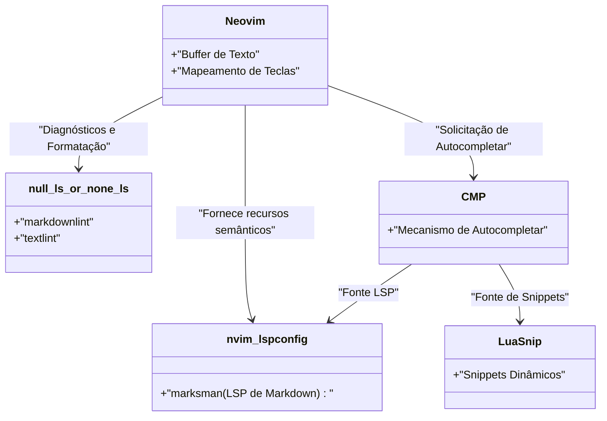
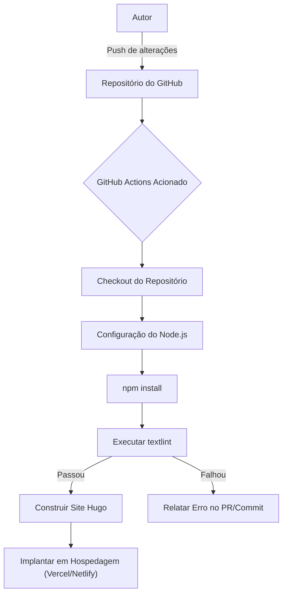

Para continuar escrevendo um blog técnico, a otimização do ambiente de escrita é essencial. Neste artigo, vamos nos aprofundar nas configurações avançadas de editor para melhorar drasticamente a velocidade de escrita de blogs técnicos usando Markdown. Explicaremos tudo de forma abrangente, desde a customização extrema do Visual Studio Code (VS Code) e do Neovim, o uso de snippets, a introdução do textlint (uma ferramenta de verificação gramatical) e a automação através de pipelines de CI/CD, até as técnicas de escrita mais avançadas utilizando LLMs, como o GitHub Copilot.

## 1. Modelo matemático para aumento da velocidade de escrita

Vamos primeiro modelar com uma fórmula simples o quanto a otimização das configurações do editor afeta o tempo de escrita. Seja $T_{total}$ o tempo total de digitação para escrever um artigo de blog.

$$
T_{total} = T_{think} + T_{type} + T_{format} + T_{review}
$$

Aqui, $T_{think}$ é o tempo de pensamento, $T_{type}$ é o tempo de digitação, $T_{format}$ é o tempo de ajuste de formatação (como Markdown) e $T_{review}$ é o tempo de revisão e correção.

O tempo $T_{saved}$ reduzido pela customização do editor (como a introdução de snippets e configurações de Linter) pode ser expresso da seguinte forma, usando o número de ocorrências $N$ de um determinado padrão (por exemplo, shortcodes do Hugo ou tabelas em Markdown), o tempo necessário para entrada manual $t_{manual}$ e o tempo necessário com automação, como snippets, $t_{snippet}$.

$$
T_{saved} = \sum_{i=1}^{k} N_i \times (t_{manual, i} - t_{snippet, i}) + T_{review\_saved}
$$

Além disso, ao introduzir formatadores automáticos e ferramentas de Lint, o tempo de verificação visual humana $T_{review}$ é consideravelmente reduzido. Maximizar este $T_{saved}$ é exatamente o objetivo deste artigo.

## 2. Configuração definitiva do Visual Studio Code (VS Code)

O VS Code é um dos editores mais populares atualmente e possui um ecossistema de extensões poderoso para escrever em Markdown.

### Extensões recomendadas

Para acelerar a escrita, recomendamos fortemente a instalação das seguintes extensões.

1. **Markdown All in One**: Possui todos os recursos básicos necessários para escrever em Markdown, como atalhos para negrito e itálico, continuação automática de listas e geração automática de índice (TOC).
2. **markdownlint**: Alerta em tempo real sobre erros de sintaxe ou violações de estilo no Markdown.
3. **vscode-textlint**: Aplica um conjunto de regras para documentos técnicos, prevenindo inconsistências ortográficas e erros gramaticais.

### Configuração de snippets personalizados para o Hugo (`markdown.json`)

Se você estiver usando um gerador de sites estáticos como Hugo ou Docusaurus para o seu blog técnico, precisará digitar frequentemente o Frontmatter e shortcodes personalizados. Com o recurso de snippets do VS Code, é possível expandi-los instantaneamente.

Selecione `Preferences: Configure User Snippets` na Command Palette e adicione as seguintes configurações ao `markdown.json`.

```json
{
  "Hugo Frontmatter": {
    "prefix": "frontmatter",
    "body": [
      "---",
      "title: \"${1:Título}\"",
      "slug: \"${2:slug-name}\"",
      "date: \"$CURRENT_YEAR-$CURRENT_MONTH-$CURRENT_DATE T$CURRENT_HOUR:$CURRENT_MINUTE:$CURRENT_SECOND+09:00\"",
      "image: \"img/eyecatch.jpg\"",
      "math: true",
      "mermaid: true",
      "categories: [\"${3:Category}\"]",
      "tags: [\"${4:Tag1}\", \"${5:Tag2}\"]",
      "---",
      "",
      "${0}"
    ],
    "description": "Expande o YAML Frontmatter para o Hugo"
  },
  "Hugo Figure Shortcode": {
    "prefix": "hfig",
    "body": [
      "{{< figure src=\"${1:image.jpg}\" title=\"${2:Título da imagem}\" >}}"
    ],
    "description": "Shortcode Figure do Hugo"
  },
  "Markdown Table": {
    "prefix": "mtable",
    "body": [
      "| ${1:Header 1} | ${2:Header 2} | ${3:Header 3} |",
      "| :--- | :---: | ---: |",
      "| ${4:Row 1} | ${5:Data} | ${6:Data} |",
      "| ${7:Row 2} | ${8:Data} | ${9:Data} |",
      "$0"
    ],
    "description": "Gera uma tabela Markdown de 3 colunas"
  }
}
```

Com essa configuração, basta digitar `frontmatter` e pressionar a tecla Tab para que o YAML Frontmatter, incluindo a hora atual, seja instantaneamente expandido, acelerando drasticamente o início da escrita.

### Assistência de escrita utilizando o GitHub Copilot

Se você tiver o GitHub Copilot ativado no VS Code, o preenchimento de IA baseado no contexto também funcionará no Markdown. Especialmente no caso de blogs técnicos, a IA pode antecipar e sugerir "a estrutura a ser explicada a seguir" ou "blocos de código relacionados", reduzindo consideravelmente o tempo de digitação $T_{type}$.

## 3. Customização extrema no Neovim

Embora a interface gráfica do VS Code seja excelente, para os entusiastas de terminal e Vimmers, o Neovim é a escolha definitiva, pois permite concluir tudo sem tirar as mãos do teclado.

### Arquitetura LSP do Neovim

A arquitetura do LSP (Language Server Protocol) e do Linter no Neovim para o ambiente Markdown é a seguinte.



### Expansão avançada de snippets usando o LuaSnip

Ainda mais poderoso que os snippets em JSON do VS Code é o plugin `LuaSnip` do Neovim. Você pode calcular e expandir o conteúdo do snippet de forma dinâmica usando a lógica do Lua.

Abaixo está um exemplo de configuração do LuaSnip que obtém dinamicamente a data e hora atuais para expandir o Frontmatter do Hugo.

```lua
local ls = require("luasnip")
local s = ls.snippet
local t = ls.text_node
local i = ls.insert_node
local f = ls.function_node

-- Função para obter a hora atual em JST
local function get_current_date_jst()
    return os.date("!%Y-%m-%dT%H:%M:%S") .. "+09:00"
end

ls.add_snippets("markdown", {
    s("frontmatter", {
        t({"---", "title: \""}), i(1, "Title"), t({"\"", "slug: \""}), i(2, "slug-name"), t({"\"", "date: \""}),
        f(function() return {get_current_date_jst()} end, {}),
        t({"\"", "image: \"img/eyecatch.jpg\"", "math: true", "mermaid: true", "categories: [\""}), i(3, "Category"), t({"\"]", "tags: [\""}), i(4, "Tag"), t({"\"]", "---", "", ""}),
        i(0)
    }),
    s("mtable", {
        t({"| "}), i(1, "Header 1"), t({" | "}), i(2, "Header 2"), t({" |", "|---|---|", "| "}), i(3, "Cell 1"), t({" | "}), i(4, "Cell 2"), t({" |"}),
    })
})
```

Dessa forma, aproveitando o poder de uma linguagem de programação (Lua), é possível criar snippets insanos que não apenas inserem strings fixas, mas também incorporam valores de retorno de funções ou aumentam/diminuem dinamicamente o número de colunas de uma tabela com base na quantidade de caracteres inseridos.

## 4. Análise estática equilibrando qualidade e velocidade de escrita (textlint e expressões regulares)

Para garantir a qualidade do blog, é necessário prevenir erros de digitação, omissões e inconsistências ortográficas. Fazer isso manualmente faria o $T_{review}$ aumentar explosivamente, portanto, vamos introduzir a análise estática com o `textlint`.

### Introdução do textlint e conjuntos de regras

Instale o textlint em um ambiente Node.js.

```bash
npm install -D textlint textlint-rule-preset-ja-technical-writing textlint-rule-prh textlint-filter-rule-comments
```

Crie um arquivo `.textlintrc.json` na raiz do projeto e configure da seguinte maneira.

```json
{
  "filters": {
    "comments": true
  },
  "rules": {
    "preset-ja-technical-writing": {
      "ja-no-mixed-period": {
        "periodMark": "。"
      },
      "sentence-length": {
        "max": 100
      }
    },
    "prh": {
      "rulePaths": ["./prh.yml"]
    }
  }
}
```

Crie um arquivo `prh.yml` para definir inconsistências na grafia de termos técnicos. Por exemplo, unifique "Javascript" e "JavaScript".

```yaml
version: 1
rules:
  - expected: "JavaScript"
    pattern:  "Javascript"
  - expected: "サーバー"
    pattern: "サーバ"
  - expected: "インターフェース"
    pattern: "インターフェイス"
```

Com isso, inconsistências ortográficas serão alertadas em tempo real sempre que você digitar texto no editor, reduzindo o tempo de revisão a quase zero.

### Substituição em lote e padrões estruturados usando expressões regulares

A substituição em lote com expressões regulares é útil ao migrar artigos existentes para Markdown ou ao trazer textos de fontes externas.

Por exemplo, a expressão regular para converter a tag HTML `<b>negrito</b>` para Markdown `**negrito**`:

- **Padrão de pesquisa**: `<b>(.*?)</b>`
- **Padrão de substituição**: `**$1**`

Para consolidar quebras de linha consecutivas desnecessárias em apenas uma:

- **Padrão de pesquisa**: `\n{3,}`
- **Padrão de substituição**: `\n\n`

Ao executar esses padrões utilizando o recurso de pesquisa e substituição do VS Code (modo de expressão regular) ou o comando `%s` do Neovim (`:%s/<b>\(.*?\)<\/b>/**\1**/g`), é possível unificar a formatação em um instante.

### Verificação automática através de pipelines de CI/CD

Além disso, criaremos um pipeline de CI usando o GitHub Actions, para que o textlint seja executado automaticamente sempre que fizermos push de um artigo do blog. Isso previne preventivamente a implantação de artigos que violem as regras.



## 5. Técnicas de escrita em Markdown na era dos LLMs

Na escrita de blogs técnicos de hoje, o uso de LLMs (Large Language Models) é inevitável. Ao aproveitar ferramentas de IA integradas ao editor, a velocidade de escrita dobra ainda mais.

### Engenharia de prompt dentro do editor

Você pode enviar os seguintes tipos de prompts sem sair do editor, utilizando o GitHub Copilot Chat no VS Code, ou o `ChatGPT.nvim` e `Copilot.vim` no Neovim.

> "Crie um esboço em estrutura hierárquica Markdown, voltado para iniciantes, sobre os seguintes elementos técnicos: Docker, Kubernetes, CI/CD"

Em seguida, os cabeçalhos e marcadores em Markdown são gerados instantaneamente. Precisamos apenas adicionar conteúdo a essa estrutura.

Além disso, descrições complexas de diagramas Mermaid ou fórmulas (LaTeX) também podem ter sua sintaxe precisa gerada dando instruções à IA. Por exemplo, a base dos layouts das fórmulas e diagramas deste artigo também foi acelerada pela escrita em par com um LLM.

## 6. Conclusão

Explicamos sobre as configurações de editor que dobram a velocidade de escrita ao escrever blogs técnicos em Markdown.

1. **Conscientização do modelo matemático**: Erradicar tarefas repetitivas para maximizar o $T_{saved}$.
2. **Utilização do VS Code**: Omitir a digitação manual com extensões e snippets no `markdown.json`.
3. **Customização extrema no Neovim**: Snippets dinâmicos com o `LuaSnip` e uso completo do teclado.
4. **textlint e análise estática**: Integração do Linter local e CI/CD para reduzir o tempo de correção para perto de zero.
5. **Integração de LLMs**: Fazer a IA gerar a estrutura do Markdown e o código de diagramas diretamente dentro do editor.

Ao incorporar essas configurações no seu próprio ambiente, o "tédio" de escrever deve desaparecer, e a quantidade e qualidade da sua produção técnica melhorarão drasticamente. Que tal começar registrando apenas um pequeno snippet?
