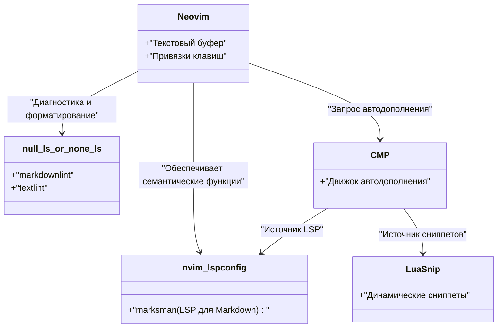
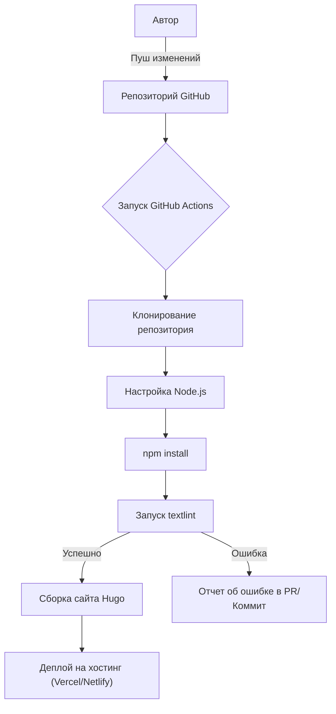

Для постоянного ведения технического блога оптимизация среды для написания является абсолютно необходимой. В этой статье мы подробно рассмотрим расширенные настройки редактора, которые радикально повысят скорость написания технических статей с использованием Markdown. Мы всесторонне обсудим максимальную кастомизацию Visual Studio Code (VS Code) и Neovim, использование сниппетов, внедрение инструмента проверки грамматики `textlint`, автоматизацию через CI/CD-пайплайны, а также передовые методы написания с применением LLM, таких как GitHub Copilot.

## 1. Математическая модель повышения скорости написания

Давайте сначала смоделируем с помощью простой математической формулы, насколько оптимизация настроек редактора влияет на время написания. Пусть общее время ввода для написания одной статьи в блоге будет $T_{total}$.

$$
T_{total} = T_{think} + T_{type} + T_{format} + T_{review}
$$

Где $T_{think}$ — это время на обдумывание, $T_{type}$ — время на набор текста, $T_{format}$ — время на форматирование (например, Markdown), а $T_{review}$ — время на редактирование и вычитку.

Сэкономленное время $T_{saved}$ за счет кастомизации редактора (например, внедрения сниппетов или настроек Linter'а) можно выразить следующим образом, используя количество появлений определенного паттерна $N$ (например, шорткодов Hugo или таблиц Markdown), время ручного ввода $t_{manual}$ и время при автоматизации через сниппеты $t_{snippet}$:

$$
T_{saved} = \sum_{i=1}^{k} N_i \times (t_{manual, i} - t_{snippet, i}) + T_{review\_saved}
$$

Кроме того, благодаря внедрению автоматических форматеров и инструментов Lint'инга, время, затрачиваемое на визуальную проверку человеком $T_{review}$, значительно сокращается. Максимизация этого значения $T_{saved}$ и является целью данной статьи.

## 2. Ультимативные настройки Visual Studio Code (VS Code)

VS Code — один из самых популярных редакторов на сегодняшний день, обладающий мощной экосистемой расширений для написания в Markdown.

### Рекомендуемые расширения

Для ускорения процесса написания мы настоятельно рекомендуем установить следующие расширения:

1. **Markdown All in One**: Предоставляет все основные функции, необходимые для написания в Markdown, такие как выделение жирным/курсивом с помощью горячих клавиш, автоматическое продолжение списков и автоматическая генерация оглавления (TOC).
2. **markdownlint**: В реальном времени предупреждает о синтаксических ошибках и нарушениях стиля в Markdown.
3. **vscode-textlint**: Применяет набор правил для японской технической документации, предотвращая несоответствия в терминологии и грамматические ошибки.

### Настройка пользовательских сниппетов для Hugo (`markdown.json`)

Если для технического блога вы используете генераторы статических сайтов, такие как Hugo или Docusaurus, вам придется часто вводить Frontmatter или собственные шорткоды. Функция сниппетов в VS Code позволяет развернуть их в одно мгновение.

Из палитры команд выберите `Preferences: Configure User Snippets` и добавьте следующие настройки в `markdown.json`.

```json
{
  "Hugo Frontmatter": {
    "prefix": "frontmatter",
    "body": [
      "---",
      "title: \"${1:Заголовок}\"",
      "slug: \"${2:slug-name}\"",
      "date: \"$CURRENT_YEAR-$CURRENT_MONTH-$CURRENT_DATE T$CURRENT_HOUR:$CURRENT_MINUTE:$CURRENT_SECOND+09:00\"",
      "image: \"img/eyecatch.jpg\"",
      "math: true",
      "mermaid: true",
      "categories: [\"${3:Category}\"]",
      "tags: [\"${4:Tag1}\", \"${5:Tag2}\"]",
      "---",
      "",
      "${0}"
    ],
    "description": "Разворачивает YAML Frontmatter для Hugo"
  },
  "Hugo Figure Shortcode": {
    "prefix": "hfig",
    "body": [
      "{{< figure src=\"${1:image.jpg}\" title=\"${2:Заголовок изображения}\" >}}"
    ],
    "description": "Шорткод Figure для Hugo"
  },
  "Markdown Table": {
    "prefix": "mtable",
    "body": [
      "| ${1:Header 1} | ${2:Header 2} | ${3:Header 3} |",
      "| :--- | :---: | ---: |",
      "| ${4:Row 1} | ${5:Data} | ${6:Data} |",
      "| ${7:Row 2} | ${8:Data} | ${9:Data} |",
      "$0"
    ],
    "description": "Создает Markdown таблицу на 3 колонки"
  }
}
```

Благодаря этой настройке, достаточно ввести `frontmatter` и нажать клавишу Tab, чтобы мгновенно развернуть YAML Frontmatter с текущим временем, что значительно увеличит начальную скорость написания.

### Поддержка написания с использованием GitHub Copilot

Если в VS Code включен GitHub Copilot, автодополнение AI с учетом контекста работает и в Markdown. В частности, для технического блога AI может предвидеть и предлагать «структуру, которую следует объяснить далее» или «связанные блоки кода», что позволяет существенно сократить время на набор текста $T_{type}$.

## 3. Экстремальная кастомизация в Neovim

Графический интерфейс VS Code отличный, но для любителей терминалов и виммеров (Vim-пользователей) Neovim, позволяющий делать всё без отрыва рук от клавиатуры, является наиболее мощным выбором.

### Архитектура LSP в Neovim

Архитектура LSP (Language Server Protocol) и Linter в Neovim для среды Markdown выглядит следующим образом:



### Продвинутое развертывание сниппетов с помощью LuaSnip

Гораздо мощнее JSON-сниппетов VS Code является плагин для Neovim — `LuaSnip`. Используя логику языка Lua, можно динамически вычислять и разворачивать содержимое сниппетов.

Ниже приведен пример настройки LuaSnip, которая динамически получает текущую дату и время и разворачивает Frontmatter для Hugo.

```lua
local ls = require("luasnip")
local s = ls.snippet
local t = ls.text_node
local i = ls.insert_node
local f = ls.function_node

-- Функция для получения текущего времени JST
local function get_current_date_jst()
    return os.date("!%Y-%m-%dT%H:%M:%S") .. "+09:00"
end

ls.add_snippets("markdown", {
    s("frontmatter", {
        t({"---", "title: \""}), i(1, "Title"), t({"\"", "slug: \""}), i(2, "slug-name"), t({"\"", "date: \""}),
        f(function() return {get_current_date_jst()} end, {}),
        t({"\"", "image: \"img/eyecatch.jpg\"", "math: true", "mermaid: true", "categories: [\""}), i(3, "Category"), t({"\"]", "tags: [\""}), i(4, "Tag"), t({"\"]", "---", "", ""}),
        i(0)
    }),
    s("mtable", {
        t({"| "}), i(1, "Header 1"), t({" | "}), i(2, "Header 2"), t({" |", "|---|---|", "| "}), i(3, "Cell 1"), t({" | "}), i(4, "Cell 2"), t({" |"}),
    })
})
```

Таким образом, опираясь на мощь языка программирования (Lua), можно создавать невероятные сниппеты, которые вставляют не просто фиксированные строки, но и возвращаемые значения функций, или динамически увеличивают/уменьшают количество колонок в таблице в зависимости от количества введенных символов.

## 4. Статический анализ для совмещения качества и скорости написания (textlint и регулярные выражения)

Для обеспечения качества блога необходимо предотвращать опечатки и несоответствия в терминологии. Если делать это вручную, время $T_{review}$ катастрофически возрастает, поэтому мы внедряем статический анализ с помощью `textlint`.

### Внедрение textlint и наборы правил для японского языка

Установите textlint в среде Node.js.

```bash
npm install -D textlint textlint-rule-preset-ja-technical-writing textlint-rule-prh textlint-filter-rule-comments
```

Создайте `.textlintrc.json` в корне проекта и настройте его следующим образом:

```json
{
  "filters": {
    "comments": true
  },
  "rules": {
    "preset-ja-technical-writing": {
      "ja-no-mixed-period": {
        "periodMark": "。"
      },
      "sentence-length": {
        "max": 100
      }
    },
    "prh": {
      "rulePaths": ["./prh.yml"]
    }
  }
}
```

Создайте `prh.yml` и определите несоответствия в технических терминах. Например, можно стандартизировать написание «サーバー» (сервер) и «サーバ», «Javascript» и «JavaScript».

```yaml
version: 1
rules:
  - expected: "JavaScript"
    pattern:  "Javascript"
  - expected: "サーバー"
    pattern: "サーバ"
  - expected: "インターフェース"
    pattern: "インターフェイス"
```

Благодаря этому при каждом наборе текста в редакторе будут выдаваться предупреждения о несоответствиях в реальном времени, что сведет время на вычитку почти к нулю.

### Пакетная замена и структурные паттерны с использованием регулярных выражений

При переносе существующих статей в Markdown или копировании текста из внешних источников очень удобна пакетная замена с помощью регулярных выражений.

Например, регулярное выражение для преобразования HTML-тегов `<b>выделение</b>` в Markdown `**выделение**`:

- **Шаблон поиска**: `<b>(.*?)</b>`
- **Шаблон замены**: `**$1**`

Если нужно объединить лишние переносы строк в один:

- **Шаблон поиска**: `\n{3,}`
- **Шаблон замены**: `\n\n`

Выполнив их с помощью функции поиска и замены VS Code (в режиме регулярных выражений) или команды `%s` в Neovim (`:%s/<b>\(.*?\)<\/b>/**\1**/g`), вы сможете мгновенно унифицировать формат.

### Автоматическая проверка с помощью CI/CD пайплайна

Кроме того, используя GitHub Actions, мы построим CI пайплайн, в котором `textlint` будет автоматически запускаться при отправке (push) статей в блог. Это позволит предотвратить деплой статей, нарушающих правила.



## 5. Искусство написания Markdown в эпоху LLM

В современном написании технических блогов невозможно обойтись без использования LLM (Large Language Model). Использование встроенных в редактор инструментов ИИ еще больше удваивает скорость написания.

### Инженерия промптов внутри редактора

Используя GitHub Copilot Chat в VS Code или `ChatGPT.nvim` и `Copilot.vim` в Neovim, не покидая редактор, можно отправлять следующие промпты:

> «Создай структуру в виде иерархии Markdown для начинающих по следующим технологиям: Docker, Kubernetes, CI/CD»

После этого мгновенно генерируется разметка Markdown с заголовками и маркированными списками. Нам остается лишь добавить содержание на этот каркас.

Кроме того, написание сложных диаграмм Mermaid или математических формул (LaTeX) также можно доверить ИИ, который сгенерирует точный синтаксис по вашим указаниям. Например, основы верстки формул и диаграмм в этой статье также были ускорены за счет совместного написания с LLM.

## 6. Заключение

В этой статье мы рассмотрели настройки редактора, которые удваивают скорость написания технических блогов на Markdown.

1. **Осознание математической модели**: Устранение повторяющихся задач для максимизации $T_{saved}$.
2. **Использование VS Code**: Сокращение ввода с помощью расширений и сниппетов в `markdown.json`.
3. **Экстремальная кастомизация Neovim**: Динамические сниппеты с помощью `LuaSnip` и полностью клавиатурное управление.
4. **textlint и статический анализ**: Интеграция CI/CD и локального Linter'а для сведения времени вычитки к нулю.
5. **Интеграция LLM**: Вывод структуры Markdown и кода для диаграмм непосредственно ИИ внутри редактора.

Внедрив эти настройки в свою рабочую среду, вы избавитесь от «рутины» при написании, а количество и качество ваших технических публикаций кардинально возрастут. Почему бы не начать с малого — например, с регистрации одного простого сниппета?
