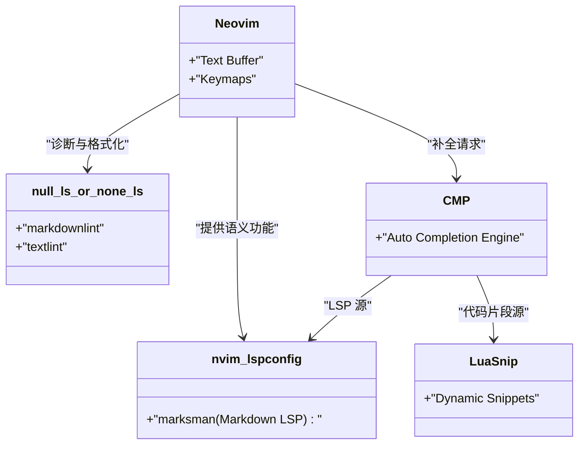
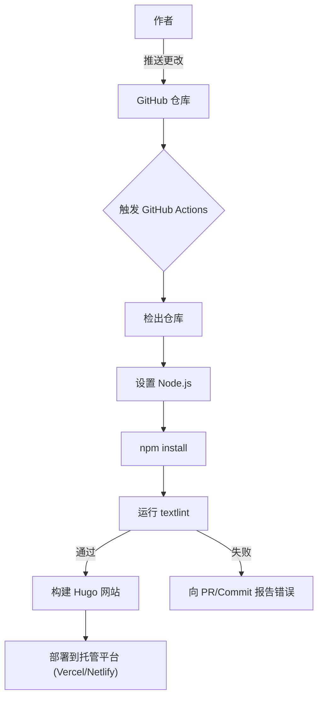

为了能够持续撰写技术博客，优化写作环境是必不可少的。本文将深入探讨如何通过高级编辑器设置，在使用 Markdown 撰写技术博客时使写作速度得到飞跃性的提升。我们将全面介绍 Visual Studio Code (VS Code) 和 Neovim 的极限自定义、代码片段的运用、引入日语（中文）语法检查工具 textlint 以及在 CI/CD 流水线中实现自动化，最后还会介绍利用 GitHub Copilot 等 LLM 的最前沿写作技巧。

## 1. 提高写作速度的数学模型

编辑器设置的优化到底能在多大程度上影响写作时间呢？首先让我们用简单的数学公式来进行建模。假设撰写一篇博客文章的总输入时间为 $T_{total}$。

$$
T_{total} = T_{think} + T_{type} + T_{format} + T_{review}
$$

这里，$T_{think}$ 是思考时间，$T_{type}$ 是打字时间，$T_{format}$ 是调整 Markdown 等格式的时间，$T_{review}$ 是推敲和校对时间。

通过编辑器的自定义（例如引入代码片段或 Linter 设置等）所节省的时间 $T_{saved}$，可以用某个特定模式（例如 Hugo 的短代码或 Markdown 表格）的出现次数 $N$，手动输入所需时间 $t_{manual}$，以及通过代码片段等自动化手段所需时间 $t_{snippet}$，来表示如下：

$$
T_{saved} = \sum_{i=1}^{k} N_i \times (t_{manual, i} - t_{snippet, i}) + T_{review\_saved}
$$

此外，通过引入自动格式化和 Lint 工具，能够大幅减少人工目视检查的时间 $T_{review}$。将这个 $T_{saved}$ 最大化，正是本文的目的。

## 2. Visual Studio Code (VS Code) 的最强设置

VS Code 是目前最普及的编辑器之一，在 Markdown 写作方面也拥有强大的扩展插件生态系统。

### 推荐扩展插件

为了加快写作速度，强烈建议安装以下扩展插件：

1. **Markdown All in One**：提供通过快捷键实现加粗、斜体、自动延续列表、自动生成目录 (TOC) 等 Markdown 写作所需的所有基本功能。
2. **markdownlint**：实时警告 Markdown 语法错误或样式违规。
3. **vscode-textlint**：应用面向技术文档的规则集，防止出现表达不一致或语法错误。

### Hugo 专属代码片段设置 (`markdown.json`)

如果你使用 Hugo 或 Docusaurus 等静态网站生成器作为技术博客，就会频繁输入 Frontmatter 或专属的短代码。使用 VS Code 的代码片段功能，可以一键展开这些内容。

从命令面板中选择 `Preferences: Configure User Snippets`，并在 `markdown.json` 中添加以下设置：

```json
{
  "Hugo Frontmatter": {
    "prefix": "frontmatter",
    "body": [
      "---",
      "title: \"${1:标题}\"",
      "slug: \"${2:slug-name}\"",
      "date: \"$CURRENT_YEAR-$CURRENT_MONTH-$CURRENT_DATE T$CURRENT_HOUR:$CURRENT_MINUTE:$CURRENT_SECOND+09:00\"",
      "image: \"img/eyecatch.jpg\"",
      "math: true",
      "mermaid: true",
      "categories: [\"${3:Category}\"]",
      "tags: [\"${4:Tag1}\", \"${5:Tag2}\"]",
      "---",
      "",
      "${0}"
    ],
    "description": "展开用于 Hugo 的 YAML Frontmatter"
  },
  "Hugo Figure Shortcode": {
    "prefix": "hfig",
    "body": [
      "{{< figure src=\"${1:image.jpg}\" title=\"${2:图片标题}\" >}}"
    ],
    "description": "Hugo 的 Figure 短代码"
  },
  "Markdown Table": {
    "prefix": "mtable",
    "body": [
      "| ${1:Header 1} | ${2:Header 2} | ${3:Header 3} |",
      "| :--- | :---: | ---: |",
      "| ${4:Row 1} | ${5:Data} | ${6:Data} |",
      "| ${7:Row 2} | ${8:Data} | ${9:Data} |",
      "$0"
    ],
    "description": "生成 3 列的 Markdown 表格"
  }
}
```

通过此设置，只需输入 `frontmatter` 然后按下 Tab 键，包含当前时间的 YAML Frontmatter 就会瞬间展开，极大提升了写作的初始速度。

### 利用 GitHub Copilot 辅助写作

在 VS Code 中启用 GitHub Copilot 后，根据上下文的 AI 补全功能同样适用于 Markdown。特别是在技术博客中，AI 会预判并建议“接下来应该说明的结构”或“相关的代码块”，因此可以大幅减少打字时间 $T_{type}$。

## 3. Neovim 的极限自定义

虽然 VS Code 的 GUI 非常优秀，但对于终端爱好者和 Vimmer 来说，双手完全不离开键盘即可完成所有操作的 Neovim 才是最强的选择。

### Neovim LSP 架构

在 Markdown 环境下，Neovim 的 LSP (Language Server Protocol) 及 Linter 架构如下所示：



### 使用 LuaSnip 实现高级代码片段展开

比 VS Code 的 JSON 代码片段更强大的是 Neovim 的插件 `LuaSnip`。它可以利用 Lua 的逻辑，动态地计算和展开代码片段的内容。

以下是动态获取当前时间并展开 Hugo Frontmatter 的 LuaSnip 设置示例：

```lua
local ls = require("luasnip")
local s = ls.snippet
local t = ls.text_node
local i = ls.insert_node
local f = ls.function_node

-- 获取当前 JST 时间的函数
local function get_current_date_jst()
    return os.date("!%Y-%m-%dT%H:%M:%S") .. "+09:00"
end

ls.add_snippets("markdown", {
    s("frontmatter", {
        t({"---", "title: \""}), i(1, "Title"), t({"\"", "slug: \""}), i(2, "slug-name"), t({"\"", "date: \""}),
        f(function() return {get_current_date_jst()} end, {}),
        t({"\"", "image: \"img/eyecatch.jpg\"", "math: true", "mermaid: true", "categories: [\""}), i(3, "Category"), t({"\"]", "tags: [\""}), i(4, "Tag"), t({"\"]", "---", "", ""}),
        i(0)
    }),
    s("mtable", {
        t({"| "}), i(1, "Header 1"), t({" | "}), i(2, "Header 2"), t({" |", "|---|---|", "| "}), i(3, "Cell 1"), t({" | "}), i(4, "Cell 2"), t({" |"}),
    })
})
```

像这样，借助于编程语言 (Lua) 的力量，我们不仅可以插入固定的字符串，还可以嵌入函数的返回值，或者根据输入的字符数动态增减表格的列数，创建这种极其灵活变态的代码片段。

## 4. 兼顾写作质量与速度的静态分析 (textlint 与正则表达式)

为了保证博客的质量，必须防止出现错别字、漏字或表达不一致的情况。如果手动进行这项工作，将会导致 $T_{review}$ 爆炸式增长，因此我们需要引入 `textlint` 进行静态分析。

### textlint 的引入与规则集

在 Node.js 环境下安装 textlint：

```bash
npm install -D textlint textlint-rule-preset-ja-technical-writing textlint-rule-prh textlint-filter-rule-comments
```

在项目根目录下创建 `.textlintrc.json`，并进行如下设置：

```json
{
  "filters": {
    "comments": true
  },
  "rules": {
    "preset-ja-technical-writing": {
      "ja-no-mixed-period": {
        "periodMark": "。"
      },
      "sentence-length": {
        "max": 100
      }
    },
    "prh": {
      "rulePaths": ["./prh.yml"]
    }
  }
}
```

创建 `prh.yml`，定义技术术语的统一表达方式。例如，统一“服务器”与“伺服器”、“Javascript”与“JavaScript”等。

```yaml
version: 1
rules:
  - expected: "JavaScript"
    pattern:  "Javascript"
  - expected: "服务器"
    pattern: "伺服器"
  - expected: "接口"
    pattern: "介面"
```

这样一来，每次在编辑器中输入文字时，都会实时警告表达不一致的情况，使得校对时间几乎降至为零。

### 使用正则表达式进行批量替换与结构化模式

将现有文章迁移到 Markdown 或从外部引入文本时，使用正则表达式进行批量替换会非常方便。

例如，将 HTML 的 `<b>强调</b>` 标签转换为 Markdown 的 `**强调**` 的正则表达式：

- **搜索模式**：`<b>(.*?)</b>`
- **替换模式**：`**$1**`

将多余的连续换行合并为一个：

- **搜索模式**：`\n{3,}`
- **替换模式**：`\n\n`

通过在 VS Code 的搜索替换功能（正则表达式模式）或 Neovim 的 `%s` 命令（`:%s/<b>\(.*?\)<\/b>/**\1**/g`）中执行这些操作，可以瞬间统一格式。

### 通过 CI/CD 流水线进行自动检查

此外，利用 GitHub Actions 构建 CI 流水线，在 push 博客文章时自动运行 textlint。这样可以防患于未然，避免部署存在违规的文章。



## 5. LLM 时代的 Markdown 写作技巧

在现代技术博客的写作中，LLM (Large Language Model) 的运用是不可避免的。通过利用编辑器内置的 AI 工具，写作速度将进一步成倍增长。

### 编辑器内的提示词工程

使用 VS Code 的 GitHub Copilot Chat，或者 Neovim 的 `ChatGPT.nvim` 和 `Copilot.vim` 等工具，无需离开编辑器即可发出如下提示词：

> “请针对以下技术要素，为初学者以 Markdown 的层级结构编写大纲：Docker, Kubernetes, CI/CD”

这样，AI 会立即生成带有标题和项目符号的 Markdown。我们只需要在这些骨架上填充血肉即可。

此外，对于复杂的 Mermaid 图表或数学公式 (LaTeX) 的编写，通过向 AI 下达指令，它也能生成准确的语法。例如，本文中展示的数学公式和图表布局的基础，也是通过与 LLM 结对写作而加速完成的。

## 6. 总结

本文介绍了在使用 Markdown 撰写技术博客时，能使写作速度翻倍的编辑器设置。

1. **建立数学模型的意识**：为了将 $T_{saved}$ 最大化，消除所有重复性工作。
2. **活用 VS Code**：通过扩展插件和 `markdown.json` 中的代码片段来省略输入。
3. **Neovim 的极限自定义**：利用 `LuaSnip` 实现动态代码片段和纯键盘操作。
4. **textlint 与静态分析**：整合本地 Linter 与 CI/CD，将校对时间逼近于零。
5. **整合 LLM**：直接在编辑器中让 AI 输出 Markdown 的结构和图表代码。

将这些设置引入到自己的环境中，就能消除写作的“麻烦感”，极大提高技术输出的数量与质量。不妨从注册一个小小的代码片段开始尝试一下吧。
