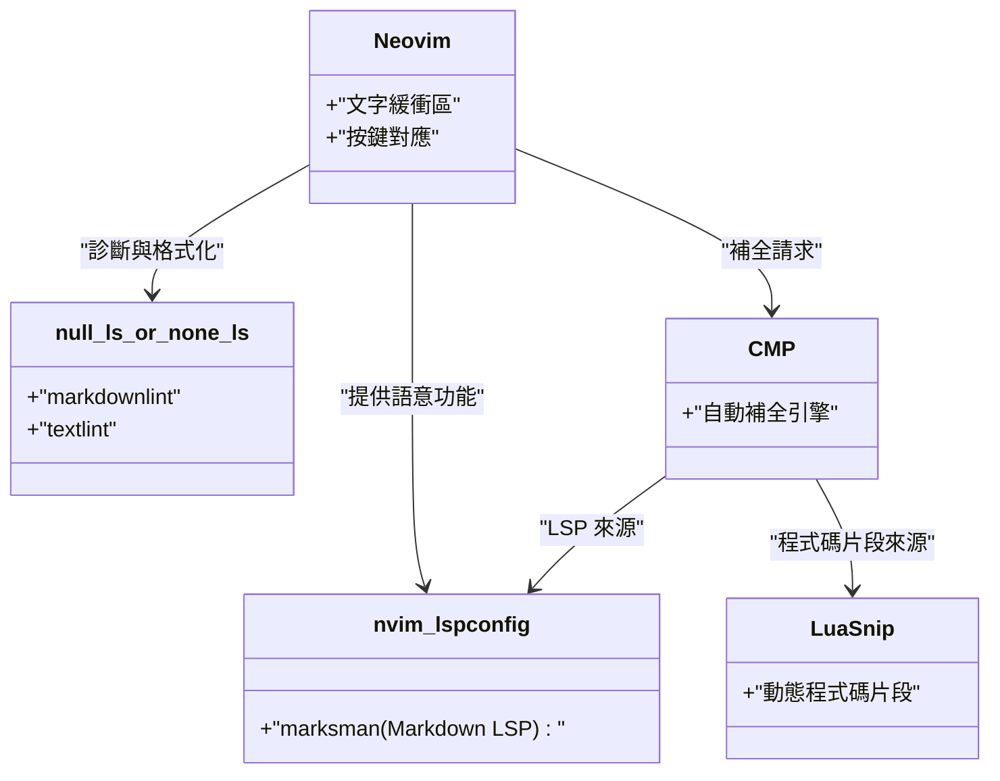
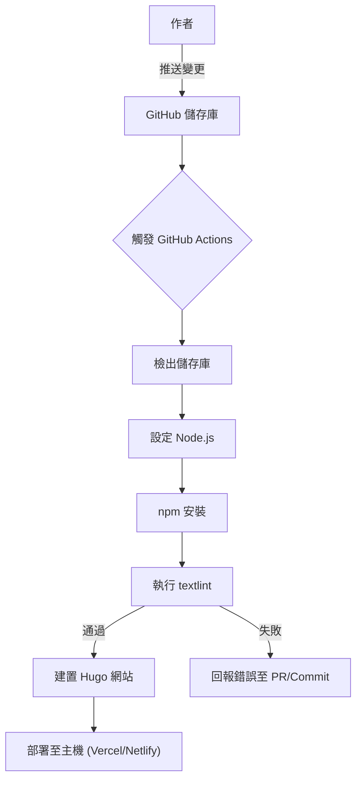

為了能夠持續撰寫技術部落格，將寫作環境最佳化是不可缺少的。本篇文章將深入探討如何透過進階的編輯器設定，大幅提升使用 Markdown 撰寫技術部落格的速度。從 Visual Studio Code (VS Code) 與 Neovim 的極致客製化、程式碼片段（Snippet）的應用、導入日文文法檢查工具 textlint、到利用 CI/CD 管線進行自動化，以及運用 GitHub Copilot 等 LLM 的最先進寫作技巧，我們將進行全面性的解說。

## 1. 提升寫作速度的數學模型

首先，讓我們用簡單的數學公式來建立模型，看看編輯器設定的最佳化會對寫作時間產生多大的影響。假設撰寫一篇部落格文章的總輸入時間為 $T_{total}$。

$$
T_{total} = T_{think} + T_{type} + T_{format} + T_{review}
$$

在這裡，$T_{think}$ 是思考時間，$T_{type}$ 是打字時間，$T_{format}$ 是調整 Markdown 等格式的時間，而 $T_{review}$ 則是推敲與校對的時間。

透過客製化編輯器（例如導入程式碼片段或 Linter 設定等）所節省的時間 $T_{saved}$，可以用某個特定模式（例如 Hugo 的簡碼或 Markdown 的表格）出現的次數 $N$，以及手動輸入所需的時間 $t_{manual}$、透過程式碼片段等自動化方式所需的時間 $t_{snippet}$，來表示為以下公式：

$$
T_{saved} = \sum_{i=1}^{k} N_i \times (t_{manual, i} - t_{snippet, i}) + T_{review\_saved}
$$

此外，透過導入自動格式化工具和 Lint 工具，能大幅減少人工目視檢查的時間 $T_{review}$。將這個 $T_{saved}$ 予以最大化，正是本篇文章的目的。

## 2. Visual Studio Code (VS Code) 的最強設定

VS Code 是目前最普及的編輯器之一，在 Markdown 的寫作上也擁有強大的擴充功能生態系。

### 推薦擴充功能

為了加快寫作速度，強烈推薦導入以下擴充功能：

1. **Markdown All in One**: 具備透過快捷鍵設定粗體與斜體、列表自動延續、自動產生目錄 (TOC) 等，撰寫 Markdown 所需的所有基本功能。
2. **markdownlint**: 能即時警告 Markdown 的語法錯誤或違反排版風格的地方。
3. **vscode-textlint**: 套用針對日文技術文件的規則集，防止用詞不一致與文法錯誤。

### 針對 Hugo 的專屬程式碼片段設定 (`markdown.json`)

如果你的技術部落格使用的是 Hugo 或 Docusaurus 等靜態網站產生器，就會頻繁地輸入 Frontmatter 或是專屬的簡碼（Shortcode）。只要使用 VS Code 的程式碼片段功能，就能在一瞬間展開這些內容。

從命令面板選擇 `Preferences: Configure User Snippets`，並在 `markdown.json` 裡加入以下設定：

```json
{
  "Hugo Frontmatter": {
    "prefix": "frontmatter",
    "body": [
      "---",
      "title: \"${1:標題}\"",
      "slug: \"${2:slug-name}\"",
      "date: \"$CURRENT_YEAR-$CURRENT_MONTH-$CURRENT_DATE T$CURRENT_HOUR:$CURRENT_MINUTE:$CURRENT_SECOND+09:00\"",
      "image: \"img/eyecatch.jpg\"",
      "math: true",
      "mermaid: true",
      "categories: [\"${3:Category}\"]",
      "tags: [\"${4:Tag1}\", \"${5:Tag2}\"]",
      "---",
      "",
      "${0}"
    ],
    "description": "展開 Hugo 用的 YAML Frontmatter"
  },
  "Hugo Figure Shortcode": {
    "prefix": "hfig",
    "body": [
      "{{< figure src=\"${1:image.jpg}\" title=\"${2:圖片標題}\" >}}"
    ],
    "description": "Hugo 的 Figure 簡碼"
  },
  "Markdown Table": {
    "prefix": "mtable",
    "body": [
      "| ${1:Header 1} | ${2:Header 2} | ${3:Header 3} |",
      "| :--- | :---: | ---: |",
      "| ${4:Row 1} | ${5:Data} | ${6:Data} |",
      "| ${7:Row 2} | ${8:Data} | ${9:Data} |",
      "$0"
    ],
    "description": "產生 3 欄的 Markdown 表格"
  }
}
```

透過這項設定，只要打出 `frontmatter` 並按下 Tab 鍵，就能瞬間展開包含目前時間的 YAML Frontmatter，大幅提升開始寫作的速度。

### 活用 GitHub Copilot 的寫作支援

若在 VS Code 啟用 GitHub Copilot，根據上下文進行的 AI 補全功能在 Markdown 中也能發揮作用。特別是在撰寫技術部落格時，AI 會預判並建議「接下來該說明的架構」或是「相關的程式碼區塊」，因此能大幅減少打字時間 $T_{type}$。

## 3. Neovim 的極致客製化

雖然 VS Code 的 GUI 也很優秀，但對於終端機愛好者或 Vimmer 來說，能夠雙手完全不離開鍵盤便完成所有操作的 Neovim，才是最強的選擇。

### Neovim LSP 架構

在 Markdown 環境下，Neovim 的 LSP (Language Server Protocol) 與 Linter 架構如下所示：



### 使用 LuaSnip 進行進階的程式碼片段展開

比 VS Code 的 JSON 程式碼片段更強大的，是 Neovim 的擴充套件 `LuaSnip`。它可以利用 Lua 的邏輯，動態地計算並展開程式碼片段的內容。

以下是動態取得目前時間，並展開 Hugo Frontmatter 的 LuaSnip 設定範例：

```lua
local ls = require("luasnip")
local s = ls.snippet
local t = ls.text_node
local i = ls.insert_node
local f = ls.function_node

-- 取得目前 JST 時間的函式
local function get_current_date_jst()
    return os.date("!%Y-%m-%dT%H:%M:%S") .. "+09:00"
end

ls.add_snippets("markdown", {
    s("frontmatter", {
        t({"---", "title: \""}), i(1, "Title"), t({"\"", "slug: \""}), i(2, "slug-name"), t({"\"", "date: \""}),
        f(function() return {get_current_date_jst()} end, {}),
        t({"\"", "image: \"img/eyecatch.jpg\"", "math: true", "mermaid: true", "categories: [\""}), i(3, "Category"), t({"\"]", "tags: [\""}), i(4, "Tag"), t({"\"]", "---", "", ""}),
        i(0)
    }),
    s("mtable", {
        t({"| "}), i(1, "Header 1"), t({" | "}), i(2, "Header 2"), t({" |", "|---|---|", "| "}), i(3, "Cell 1"), t({" | "}), i(4, "Cell 2"), t({" |"}),
    })
})
```

如此一來，藉由程式語言 (Lua) 的強大威力，不僅是固定的字串，還能嵌入函式的回傳值，或是根據輸入的字數動態增減表格欄位等，建立出極度強大（甚至有點變態）的程式碼片段。

## 4. 兼顧寫作品質與速度的靜態分析 (textlint 與正規表示式)

為了確保部落格的品質，必須防止錯字、漏字或用詞不一致的情況。若是手動進行這些檢查，將會讓 $T_{review}$ 暴增，因此我們要導入透過 `textlint` 進行的靜態分析。

### 導入 textlint 與日文規則集

在 Node.js 環境下安裝 textlint。

```bash
npm install -D textlint textlint-rule-preset-ja-technical-writing textlint-rule-prh textlint-filter-rule-comments
```

在專案根目錄建立 `.textlintrc.json`，並進行如下設定：

```json
{
  "filters": {
    "comments": true
  },
  "rules": {
    "preset-ja-technical-writing": {
      "ja-no-mixed-period": {
        "periodMark": "。"
      },
      "sentence-length": {
        "max": 100
      }
    },
    "prh": {
      "rulePaths": ["./prh.yml"]
    }
  }
}
```

建立 `prh.yml` 來定義技術用語的統一規範。例如，統一「サーバー」與「サーバ」、「Javascript」與「JavaScript」等的寫法。

```yaml
version: 1
rules:
  - expected: "JavaScript"
    pattern:  "Javascript"
  - expected: "サーバー"
    pattern: "サーバ"
  - expected: "インターフェース"
    pattern: "インターフェイス"
```

這樣一來，每次在編輯器上打字時，都會即時警告用詞不一致的地方，讓校對的時間趨近於零。

### 使用正規表示式進行批次取代與結構化模式

將現有的文章轉移到 Markdown，或是從外部匯入文字時，利用正規表示式進行批次取代會非常方便。

例如，將 HTML 的 `<b>強調</b>` 標籤轉換為 Markdown 的 `**強調**` 時所用的正規表示式：

- **搜尋模式**: `<b>(.*?)</b>`
- **取代模式**: `**$1**`

將不需要的連續換行合併為一個換行時：

- **搜尋模式**: `\n{3,}`
- **取代模式**: `\n\n`

透過 VS Code 的搜尋與取代功能（正規表示式模式），或是在 Neovim 執行 `%s` 指令 (`:%s/<b>\(.*?\)<\/b>/**\1**/g`)，就能在一瞬間統一格式。

### 透過 CI/CD 管線進行自動檢查

進一步地，使用 GitHub Actions 來建構當 push 部落格文章時，會自動執行 textlint 的 CI 管線。這樣便能防範於未然，避免部署了違反規則的文章。



## 5. LLM 時代的 Markdown 寫作技巧

在現代的技術部落格寫作中，活用 LLM (大型語言模型) 已是不可避免的趨勢。藉由運用編輯器內建的 AI 工具，能讓寫作速度再翻倍。

### 編輯器內的提示工程 (Prompt Engineering)

使用 VS Code 的 GitHub Copilot Chat，或是 Neovim 的 `ChatGPT.nvim` 與 `Copilot.vim` 等工具，就能在不離開編輯器的情況下送出如下的提示詞 (Prompt)：

> 「請針對以下技術元素，為初學者建立一個採用 Markdown 階層結構的大綱：Docker、Kubernetes、CI/CD」

接著，就會立即產生包含標題與條列項目的 Markdown 內容。我們只需要在這些骨架上添加血肉即可。

此外，複雜的 Mermaid 圖表或數式 (LaTeX) 語法，也能透過給予 AI 指示來產生正確的語法。舉例來說，本篇文章所刊載的數式與圖表排版基礎，也是透過與 LLM 的結對寫作 (Pair Writing) 來加速完成的。

## 6. 總結

本文解說了如何透過編輯器設定，讓使用 Markdown 撰寫技術部落格時的寫作速度翻倍。

1. **建立數學模型的意識**: 為了將 $T_{saved}$ 最大化，必須消滅重複性的工作。
2. **活用 VS Code**: 透過擴充功能與 `markdown.json` 的程式碼片段來省略輸入。
3. **Neovim 的極致客製化**: 藉由 `LuaSnip` 實現動態程式碼片段與完全的鍵盤操作。
4. **textlint 與靜態分析**: 為了讓校對時間趨近於零，將 CI/CD 與本機端的 Linter 進行整合。
5. **整合 LLM**: 直接在編輯器內讓 AI 輸出 Markdown 的架構或圖表的程式碼。

只要將這些設定導入自己的環境中，就能消除寫作時的「麻煩感」，並且大幅提升技術輸出的質與量。不妨就先從註冊一個小小的程式碼片段開始嘗試吧！
