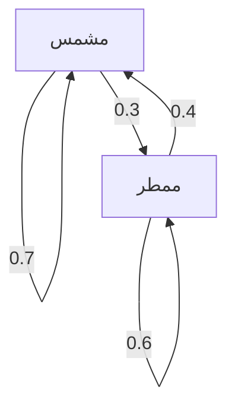

## مقدمة

العالم الذي نعيش فيه مليء بعدم اليقين. هناك العديد من الظواهر التي يصعب التنبؤ بها، مثل طقس الغد، وتقلبات أسعار الأسهم، وانتقالات الصفحات على الإنترنت. أداة قوية لنمذجة مثل هذه الظواهر غير المؤكدة رياضياً هي **سلسلة ماركوف** .

الميزة الأكبر لسلسلة ماركوف هي أنها تمتلك **خاصية ماركوف** ، والتي تعني أن "الحالة المستقبلية تعتمد فقط على الحالة الحالية، وليس على التاريخ الماضي". في هذا المقال، سنشرح بالتفصيل أساسيات هذا النموذج الرياضي الرائع، وطرق الحساب المحددة، وتطبيقاته في العالم الحقيقي.

## ما هي خاصية ماركوف؟

في عملية تصادفية، لنفترض أن الحالة في وقت معين $t$ يتم تمثيلها بواسطة $X_t$. عند النظر في نموذج زمني منفصل، يتم تعريف خاصية ماركوف بواسطة الصيغة الرياضية التالية:

$$
P(X_{n+1} = x_{n+1} \mid X_n = x_n, X_{n-1} = x_{n-1}, \dots, X_0 = x_0) = P(X_{n+1} = x_{n+1} \mid X_n = x_n)
$$

تشير هذه الصيغة إلى أنه يمكن حساب احتمالية التواجد في الحالة $x_{n+1}$ في الوقت $n+1$ طالما أن الحالة $x_n$ في الوقت $n$ معروفة، وأن المعلومات المتعلقة بالحالات السابقة ( $x_{n-1}, \dots, x_0$ ) غير ضرورية. هذا هو معنى عبارة "المستقبل يتحدد فقط من خلال الحاضر".

## مصفوفة احتمالية الانتقال

الأساسي لوصف سلسلة ماركوف هو **مصفوفة احتمالية الانتقال** . إذا كان فضاء الحالة محدوداً وكان احتمال الانتقال من الحالة $i$ إلى الحالة $j$ هو $p_{ij}$، فإن المصفوفة $P$ تُمثَّل على النحو التالي:

$$
P = \begin{pmatrix}
p_{11} & p_{12} & \cdots & p_{1k} \\
p_{21} & p_{22} & \cdots & p_{2k} \\
\vdots & \vdots & \ddots & \vdots \\
p_{k1} & p_{k2} & \cdots & p_{kk}
\end{pmatrix}
$$

هنا، مجموع كل صف هو دائماً $1$.

$$
\sum_{j=1}^{k} p_{ij} = 1 \quad \text{(لجميع } i \text{)}
$$

### مثال محدد: نموذج توقعات الطقس

كمثال بسيط، دعونا نلقي نظرة على الطقس في مدينة معينة. لنفترض أن هناك حالتين فقط: "مشمس" و "ممطر".
- إذا كان الجو مشمساً اليوم، فإن احتمال أن يكون مشمساً غداً هو 0.7، وممطر هو 0.3.
- إذا كان الجو ممطراً اليوم، فإن احتمال أن يكون مشمساً غداً هو 0.4، وممطر هو 0.6.

تمثيل هذا النموذج مع مصفوفة احتمالية الانتقال $P$ يعطي ما يلي:

$$
P = \begin{pmatrix}
0.7 & 0.3 \\
0.4 & 0.6
\end{pmatrix}
$$

دعونا نتصور انتقال الحالة هذا باستخدام رسم Mermaid البياني.

## التوزيع الثابت: السلوك طويل المدى

إذا لوحظت سلسلة ماركوف لفترة طويلة ( $n \to \infty$ )، فماذا يحدث للتوزيع الاحتمالي للحالات؟ في العديد من سلاسل ماركوف، فإنها تتقارب إلى توزيع احتمالي محدد بغض النظر عن الحالة الأولية. يسمى هذا **التوزيع الثابت** .

بافتراض أن متجه الاحتمال هو $\pi$، فإن التوزيع الثابت يلبي المعادلة التالية:

$$
\pi P = \pi
$$

كشرط، مطلوب أن يكون $\sum \pi_i = 1$.

دعونا نحسب التوزيع الثابت $\pi = (\pi_{\text{مشمس}}, \pi_{\text{ممطر}})$ لمثال الطقس السابق.

$$
\begin{pmatrix} \pi_{\text{مشمس}} & \pi_{\text{ممطر}} \end{pmatrix} \begin{pmatrix} 0.7 & 0.3 \\ 0.4 & 0.6 \end{pmatrix} = \begin{pmatrix} \pi_{\text{مشمس}} & \pi_{\text{ممطر}} \end{pmatrix}
$$

حل نظام المعادلات يعطي ما يلي:

1. $0.7\pi_{\text{مشمس}} + 0.4\pi_{\text{ممطر}} = \pi_{\text{مشمس}}$
2. $0.3\pi_{\text{مشمس}} + 0.6\pi_{\text{ممطر}} = \pi_{\text{ممطر}}$
3. $\pi_{\text{مشمس}} + \pi_{\text{ممطر}} = 1$

بحل هذا نحصل على $\pi_{\text{مشمس}} = \frac{4}{7} \approx 0.57$ و $\pi_{\text{ممطر}} = \frac{3}{7} \approx 0.43$. بعبارة أخرى، على المدى الطويل، هناك احتمال بنسبة 57% تقريباً أن يكون الجو مشمساً واحتمال 43% أن يكون ممطراً.

## تطبيقات سلاسل ماركوف

لا تقتصر سلاسل ماركوف على عالم الرياضيات؛ بل يتم تطبيقها على أنظمة العالم الحقيقي المختلفة.

### 1. خوارزمية PageRank من جوجل
من خلال التعامل مع صفحات الويب على الإنترنت كحالات وفعل تتبع الروابط كتحولات احتمالية، يتم حساب أهمية الصفحات. يمكن القول أن PageRank يبحث عن توزيع ثابت في مساحة الحالة الضخمة للإنترنت.

### 2. معالجة اللغة الطبيعية وتوليد النصوص
من خلال نمذجة تسلسل الكلمات في الجملة بسلسلة ماركوف، من الممكن التنبؤ بالكلمة التي من المحتمل أن تأتي بعد ذلك وتوليد جمل طبيعية (نماذج N-gram). هذه هي الفكرة الأساسية لنماذج لغة الذكاء الاصطناعي الحديثة.

### 3. الاقتصاد والهندسة المالية
تُستخدم نمذجة تقلبات أسعار الأسهم وهجرة المستهلكين للعلامات التجارية (احتمال أن يتحول شخص يشتري منتجاً معيناً إلى منتج آخر) في التنبؤ بالسوق واستراتيجيات التسويق.

## خاتمة

تستند سلاسل ماركوف إلى افتراض بسيط ولكنه قوي وهو أن "التنبؤات المستقبلية ممكنة طالما أن المعلومات الحالية متاحة". نظراً لهذه **الخاصية لماركوف** ، يمكن صياغة الظواهر التي تبدو معقدة كمصفوفة احتمالية انتقال، ويمكن استنتاج الاتجاهات طويلة الأجل (التوزيعات الثابتة) رياضياً.

مع تطبيقات واسعة النطاق تتراوح من استرجاع المعلومات إلى الذكاء الاصطناعي والتنبؤ الاقتصادي، بالإضافة إلى جمالها النظري، فإن سلسلة ماركوف هي بلا شك واحدة من العدسات المهمة جداً لفك تشفير عالم غير مؤكد.
