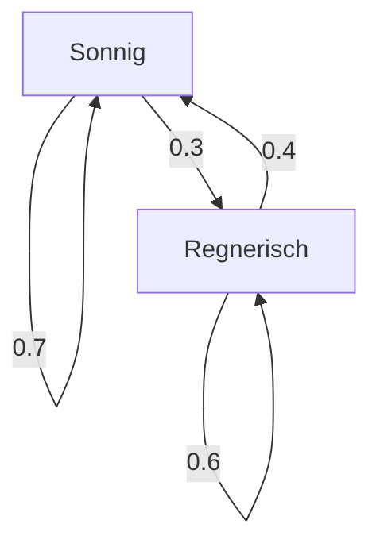

## Einführung

Die Welt, in der wir leben, ist voller Ungewissheit. Es gibt viele schwer vorhersehbare Phänomene, wie das Wetter von morgen, Aktienkursschwankungen und Seitenübergänge im Internet. Ein leistungsfähiges Werkzeug zur mathematischen Modellierung solcher unsicheren Phänomene ist die **Markow-Kette** .

Das Hauptmerkmal einer Markow-Kette ist die **Markow-Eigenschaft** , was bedeutet, dass "der zukünftige Zustand nur vom aktuellen Zustand abhängt, nicht von der Vorgeschichte". In diesem Artikel werden wir die Grundlagen dieses faszinierenden mathematischen Modells, spezifische Berechnungsmethoden und seine Anwendungen in der realen Welt im Detail erläutern.

## Was ist die Markow-Eigenschaft?

Bei einem stochastischen Prozess sei angenommen, dass der Zustand zu einem bestimmten Zeitpunkt $t$ durch $X_t$ dargestellt wird. Bei Betrachtung eines zeitdiskreten Modells wird die Markow-Eigenschaft durch die folgende mathematische Formel definiert:

$$
P(X_{n+1} = x_{n+1} \mid X_n = x_n, X_{n-1} = x_{n-1}, \dots, X_0 = x_0) = P(X_{n+1} = x_{n+1} \mid X_n = x_n)
$$

Diese Formel gibt an, dass die Wahrscheinlichkeit, sich zum Zeitpunkt $n+1$ im Zustand $x_{n+1}$ zu befinden, berechnet werden kann, solange der Zustand $x_n$ zum Zeitpunkt $n$ bekannt ist, und dass Informationen über vorherige Zustände ( $x_{n-1}, \dots, x_0$ ) unnötig sind. Dies ist die Bedeutung des Satzes "die Zukunft wird nur durch die Gegenwart bestimmt".

## Übergangswahrscheinlichkeitsmatrix

Unerlässlich für die Beschreibung einer Markow-Kette ist die **Übergangswahrscheinlichkeitsmatrix** . Wenn der Zustandsraum endlich ist und die Wahrscheinlichkeit des Übergangs von einem Zustand $i$ in einen Zustand $j$ gleich $p_{ij}$ ist, wird die Matrix $P$ wie folgt dargestellt:

$$
P = \begin{pmatrix}
p_{11} & p_{12} & \cdots & p_{1k} \\
p_{21} & p_{22} & \cdots & p_{2k} \\
\vdots & \vdots & \ddots & \vdots \\
p_{k1} & p_{k2} & \cdots & p_{kk}
\end{pmatrix}
$$

Hierbei ist die Summe jeder Zeile immer $1$.

$$
\sum_{j=1}^{k} p_{ij} = 1 \quad \text{(für alle } i \text{)}
$$

### Konkretes Beispiel: Wettervorhersagemodell

Betrachten wir als einfaches Beispiel das Wetter in einer bestimmten Stadt. Nehmen wir an, es gibt nur zwei Zustände: "Sonnig" und "Regnerisch".
- Wenn es heute sonnig ist, beträgt die Wahrscheinlichkeit, dass es morgen sonnig wird, 0,7 und dass es regnerisch wird, 0,3.
- Wenn es heute regnerisch ist, beträgt die Wahrscheinlichkeit, dass es morgen sonnig wird, 0,4 und dass es regnerisch wird, 0,6.

Die Darstellung dieses Modells mit die Übergangswahrscheinlichkeitsmatrix $P$ ergibt folgendes:

$$
P = \begin{pmatrix}
0.7 & 0.3 \\
0.4 & 0.6
\end{pmatrix}
$$

Visualisieren wir diesen Zustandsübergang mit einem Mermaid-Diagramm.

## Stationäre Verteilung: Langzeitverhalten

Wenn eine Markow-Kette über einen langen Zeitraum ( $n \to \infty$ ) beobachtet wird, was passiert dann mit der Wahrscheinlichkeitsverteilung der Zustände? Bei vielen Markow-Ketten konvergiert sie unabhängig vom Anfangszustand gegen eine bestimmte Wahrscheinlichkeitsverteilung. Dies wird als **stationäre Verteilung** bezeichnet.

Angenommen, der Wahrscheinlichkeitsvektor ist $\pi$, dann erfüllt die stationäre Verteilung die folgende Gleichung:

$$
\pi P = \pi
$$

Als Bedingung ist erforderlich, dass $\sum \pi_i = 1$ gilt.

Berechnen wir die stationäre Verteilung $\pi = (\pi_{\text{Sonnig}}, \pi_{\text{Regnerisch}})$ für das vorherige Wetterbeispiel.

$$
\begin{pmatrix} \pi_{\text{Sonnig}} & \pi_{\text{Regnerisch}} \end{pmatrix} \begin{pmatrix} 0.7 & 0.3 \\ 0.4 & 0.6 \end{pmatrix} = \begin{pmatrix} \pi_{\text{Sonnig}} & \pi_{\text{Regnerisch}} \end{pmatrix}
$$

Das Lösen des Gleichungssystems ergibt Folgendes:

1. $0.7\pi_{\text{Sonnig}} + 0.4\pi_{\text{Regnerisch}} = \pi_{\text{Sonnig}}$
2. $0.3\pi_{\text{Sonnig}} + 0.6\pi_{\text{Regnerisch}} = \pi_{\text{Regnerisch}}$
3. $\pi_{\text{Sonnig}} + \pi_{\text{Regnerisch}} = 1$

Das Auflösen ergibt $\pi_{\text{Sonnig}} = \frac{4}{7} \approx 0.57$ und $\pi_{\text{Regnerisch}} = \frac{3}{7} \approx 0.43$. Mit anderen Worten, langfristig besteht eine Wahrscheinlichkeit von etwa 57%, dass es sonnig ist, und eine Wahrscheinlichkeit von 43%, dass es regnet.

## Anwendungen von Markow-Ketten

Markow-Ketten sind nicht auf die Welt der Mathematik beschränkt; sie werden in verschiedenen realen Systemen angewendet.

### 1. PageRank-Algorithmus von Google
Durch die Behandlung von Webseiten im Internet als Zustände und den Vorgang des Verfolgens von Links als Wahrscheinlichkeitsübergänge wird die Wichtigkeit von Seiten berechnet. Man kann sagen, dass PageRank eine stationäre Verteilung im riesigen Zustandsraum des Internets sucht.

### 2. Verarbeitung natürlicher Sprache und Texterstellung
Durch die Modellierung der Wortfolge in einem Satz mit einer Markow-Kette ist es möglich, das Wort vorherzusagen, das wahrscheinlich als nächstes kommt, und natürliche Sätze zu erzeugen (N-Gramm-Modelle). Dies ist die Grundidee moderner KI-Sprachmodelle.

### 3. Wirtschaft und Financial Engineering
Die Modellierung von Aktienkursschwankungen und der Markenmigration von Verbrauchern (die Wahrscheinlichkeit, dass jemand, der ein bestimmtes Produkt kauft, zu einem anderen Produkt wechselt) wird für Marktprognosen und Marketingstrategien verwendet.

## Fazit

Markow-Ketten basieren auf der einfachen, aber mächtigen Annahme, dass "Zukunftsvorhersagen möglich sind, solange aktuelle Informationen verfügbar sind". Aufgrund dieser **Markow-Eigenschaft** können komplex erscheinende Phänomene als Übergangswahrscheinlichkeitsmatrix formuliert und langfristige Trends (stationäre Verteilungen) mathematisch abgeleitet werden.

Mit breiten Anwendungen, die vom Information Retrieval über KI bis hin zu Wirtschaftsprognosen reichen, ist die Markow-Kette neben ihrer theoretischen Schönheit zweifellos eine der wichtigsten Linsen zur Entschlüsselung einer unsicheren Welt.
