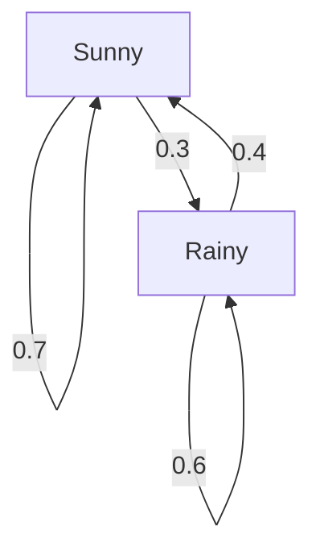

## Introduction

The world we live in is full of uncertainty. There are many phenomena that are difficult to predict, such as tomorrow's weather, stock price fluctuations, and page transitions on the Internet. A powerful tool for mathematically modeling such uncertain phenomena is the **Markov chain** .

The greatest feature of a Markov chain is that it has the **Markov property** , which means "the future state depends only on the current state, not on past history". In this article, we will explain in detail the basics of this fascinating mathematical model, specific calculation methods, and its applications in the real world.

## What is the Markov Property?

In a stochastic process, let the state at a certain time $t$ be represented by $X_t$. When considering a discrete-time model, the Markov property is defined by the following mathematical formula:

$$
P(X_{n+1} = x_{n+1} \mid X_n = x_n, X_{n-1} = x_{n-1}, \dots, X_0 = x_0) = P(X_{n+1} = x_{n+1} \mid X_n = x_n)
$$

This formula indicates that the probability of being in state $x_{n+1}$ at time $n+1$ can be calculated as long as the state $x_n$ at time $n$ is known, and information about previous states ( $x_{n-1}, \dots, x_0$ ) is unnecessary. This is the meaning of the phrase "the future is determined only by the present".

## Transition Probability Matrix

Essential for describing a Markov chain is the **Transition Probability Matrix** . If the state space is finite and the probability of transitioning from a state $i$ to a state $j$ is $p_{ij}$, the matrix $P$ is represented as follows:

$$
P = \begin{pmatrix}
p_{11} & p_{12} & \cdots & p_{1k} \\
p_{21} & p_{22} & \cdots & p_{2k} \\
\vdots & \vdots & \ddots & \vdots \\
p_{k1} & p_{k2} & \cdots & p_{kk}
\end{pmatrix}
$$

Here, the sum of each row is always $1$.

$$
\sum_{j=1}^{k} p_{ij} = 1 \quad \text{(for all } i \text{)}
$$

### Specific Example: Weather Forecast Model

As a simple example, let's consider the weather in a certain city. Assume there are only two states: "Sunny" and "Rainy".
- If it is sunny today, the probability of being sunny tomorrow is 0.7, and rainy is 0.3.
- If it is rainy today, the probability of being sunny tomorrow is 0.4, and rainy is 0.6.

Representing this model with the transition probability matrix $P$ yields the following:

$$
P = \begin{pmatrix}
0.7 & 0.3 \\
0.4 & 0.6
\end{pmatrix}
$$

Let's visualize this state transition with a Mermaid graph.

## Stationary Distribution: Long-term Behavior

If a Markov chain is observed for a long period ( $n \to \infty$ ), what happens to the probability distribution of the states? In many Markov chains, it converges to a specific probability distribution regardless of the initial state. This is called the **stationary distribution** .

Letting the probability vector be $\pi$, the stationary distribution satisfies the following equation:

$$
\pi P = \pi
$$

As a condition, $\sum \pi_i = 1$ is required.

Let's calculate the stationary distribution $\pi = (\pi_{\text{Sunny}}, \pi_{\text{Rainy}})$ for the weather example earlier.

$$
\begin{pmatrix} \pi_{\text{Sunny}} & \pi_{\text{Rainy}} \end{pmatrix} \begin{pmatrix} 0.7 & 0.3 \\ 0.4 & 0.6 \end{pmatrix} = \begin{pmatrix} \pi_{\text{Sunny}} & \pi_{\text{Rainy}} \end{pmatrix}
$$

Solving the system of equations yields the following:

1. $0.7\pi_{\text{Sunny}} + 0.4\pi_{\text{Rainy}} = \pi_{\text{Sunny}}$
2. $0.3\pi_{\text{Sunny}} + 0.6\pi_{\text{Rainy}} = \pi_{\text{Rainy}}$
3. $\pi_{\text{Sunny}} + \pi_{\text{Rainy}} = 1$

Solving this gives $\pi_{\text{Sunny}} = \frac{4}{7} \approx 0.57$ and $\pi_{\text{Rainy}} = \frac{3}{7} \approx 0.43$. In other words, in the long run, there is about a 57% chance of it being sunny and a 43% chance of it being rainy.

## Applications of Markov Chains

Markov chains are not limited to the world of mathematics; they are applied to various real-world systems.

### 1. Google's PageRank Algorithm
By treating web pages on the Internet as states and the act of following links as probability transitions, the importance of pages is calculated. It can be said that PageRank seeks a stationary distribution in the huge state space of the Internet.

### 2. Natural Language Processing and Text Generation
By modeling the sequence of words in a sentence with a Markov chain, it is possible to predict the word that is likely to come next and generate natural sentences (N-gram models). This is the foundational idea of modern AI language models.

### 3. Economics and Financial Engineering
Modeling stock price fluctuations and consumer brand migration (the probability that someone buying a certain product switches to another product) is utilized in market forecasting and marketing strategies.

## Conclusion

Markov chains are based on the simple yet powerful assumption that "future predictions are possible as long as current information is available". Due to this **Markov property** , phenomena that appear complex can be formulated as a transition probability matrix, and long-term trends (stationary distributions) can be mathematically derived.

With broad applications ranging from information retrieval to AI and economic forecasting, in addition to its theoretical beauty, the Markov chain is undoubtedly one of the very important lenses for deciphering an uncertain world.
