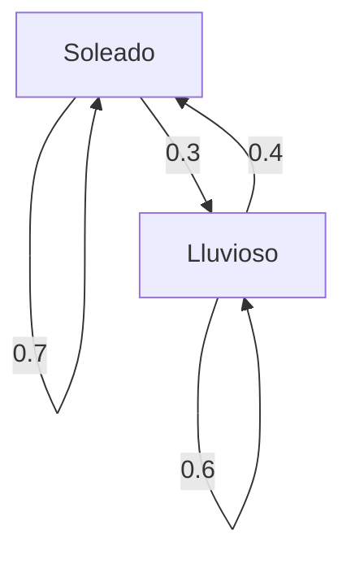

## Introducción

El mundo en el que vivimos está lleno de incertidumbre. Hay muchos fenómenos que son difíciles de predecir, como el clima de mañana, las fluctuaciones de los precios de las acciones y las transiciones de páginas en Internet. Una herramienta poderosa para modelar matemáticamente dichos fenómenos inciertos es la **cadena de Markov** .

La principal característica de una cadena de Markov es que posee la **propiedad de Markov** , lo que significa que "el estado futuro depende solo del estado actual y no de la historia pasada". En este artículo, explicaremos en detalle los fundamentos de este fascinante modelo matemático, métodos de cálculo específicos y sus aplicaciones en el mundo real.

## ¿Qué es la Propiedad de Markov?

En un proceso estocástico, supongamos que el estado en un momento determinado $t$ se representa como $X_t$. Al considerar un modelo de tiempo discreto, la propiedad de Markov se define mediante la siguiente fórmula matemática:

$$
P(X_{n+1} = x_{n+1} \mid X_n = x_n, X_{n-1} = x_{n-1}, \dots, X_0 = x_0) = P(X_{n+1} = x_{n+1} \mid X_n = x_n)
$$

Esta fórmula indica que la probabilidad de estar en el estado $x_{n+1}$ en el tiempo $n+1$ se puede calcular siempre que se conozca el estado $x_n$ en el tiempo $n$, y la información sobre los estados anteriores ( $x_{n-1}, \dots, x_0$ ) es innecesaria. Este es el significado de la frase "el futuro está determinado solo por el presente".

## Matriz de Probabilidades de Transición

Fundamental para describir una cadena de Markov es la **Matriz de Probabilidades de Transición** . Si el espacio de estados es finito y la probabilidad de pasar de un estado $i$ a un estado $j$ es $p_{ij}$, la matriz $P$ se representa de la siguiente manera:

$$
P = \begin{pmatrix}
p_{11} & p_{12} & \cdots & p_{1k} \\
p_{21} & p_{22} & \cdots & p_{2k} \\
\vdots & \vdots & \ddots & \vdots \\
p_{k1} & p_{k2} & \cdots & p_{kk}
\end{pmatrix}
$$

Aquí, la suma de cada fila es siempre $1$.

$$
\sum_{j=1}^{k} p_{ij} = 1 \quad \text{(para todo } i \text{)}
$$

### Ejemplo Específico: Modelo de Pronóstico del Clima

Como ejemplo simple, consideremos el clima en una ciudad determinada. Supongamos que solo hay dos estados: "Soleado" y "Lluvioso".
- Si hoy está soleado, la probabilidad de que mañana esté soleado es de 0.7 y de que llueva es de 0.3.
- Si hoy llueve, la probabilidad de que mañana esté soleado es de 0.4 y de que llueva es de 0.6.

La representación de este modelo con la matriz de probabilidades de transición $P$ da lo siguiente:

$$
P = \begin{pmatrix}
0.7 & 0.3 \\
0.4 & 0.6
\end{pmatrix}
$$

Visualicemos esta transición de estado con un gráfico de Mermaid.

## Distribución Estacionaria: Comportamiento a Largo Plazo

Si una cadena de Markov se observa durante un largo período ( $n \to \infty$ ), ¿qué sucede con la distribución de probabilidad de los estados? En muchas cadenas de Markov, converge a una distribución de probabilidad específica independientemente del estado inicial. Esto se llama la **distribución estacionaria** .

Suponiendo que el vector de probabilidad es $\pi$, la distribución estacionaria satisface la siguiente ecuación:

$$
\pi P = \pi
$$

Como condición, se requiere que $\sum \pi_i = 1$.

Calculemos la distribución estacionaria $\pi = (\pi_{\text{Soleado}}, \pi_{\text{Lluvioso}})$ para el ejemplo del clima anterior.

$$
\begin{pmatrix} \pi_{\text{Soleado}} & \pi_{\text{Lluvioso}} \end{pmatrix} \begin{pmatrix} 0.7 & 0.3 \\ 0.4 & 0.6 \end{pmatrix} = \begin{pmatrix} \pi_{\text{Soleado}} & \pi_{\text{Lluvioso}} \end{pmatrix}
$$

La resolución del sistema de ecuaciones da lo siguiente:

1. $0.7\pi_{\text{Soleado}} + 0.4\pi_{\text{Lluvioso}} = \pi_{\text{Soleado}}$
2. $0.3\pi_{\text{Soleado}} + 0.6\pi_{\text{Lluvioso}} = \pi_{\text{Lluvioso}}$
3. $\pi_{\text{Soleado}} + \pi_{\text{Lluvioso}} = 1$

Resolviendo esto obtenemos $\pi_{\text{Soleado}} = \frac{4}{7} \approx 0.57$ y $\pi_{\text{Lluvioso}} = \frac{3}{7} \approx 0.43$. En otras palabras, a largo plazo, hay aproximadamente un 57% de probabilidad de que esté soleado y un 43% de probabilidad de que llueva.

## Aplicaciones de las [Cadenas de Markov](https://kenji.blog/p/markov-chain/)

Las cadenas de Markov no se limitan al mundo de las matemáticas; se aplican a varios sistemas del mundo real.

### 1. Algoritmo PageRank de Google
Al tratar las páginas web en Internet como estados y el acto de seguir enlaces como transiciones de probabilidad, se calcula la importancia de las páginas. Se puede decir que PageRank busca una distribución estacionaria en el enorme espacio de estados de Internet.

### 2. Procesamiento del Lenguaje Natural y Generación de Texto
Al modelar la secuencia de palabras en una oración con una cadena de Markov, es posible predecir la palabra que es probable que siga y generar oraciones naturales (modelos de N-gramas). Esta es la idea fundamental de los modelos de lenguaje de inteligencia artificial modernos.

### 3. Economía e Ingeniería Financiera
La modelización de las fluctuaciones de los precios de las acciones y la migración de las marcas por parte de los consumidores (la probabilidad de que alguien que compra un determinado producto cambie a otro producto) se utiliza en las previsiones del mercado y las estrategias de marketing.

## Conclusión

Las cadenas de Markov se basan en la suposición simple pero poderosa de que "las predicciones futuras son posibles siempre que la información actual esté disponible". Debido a esta **propiedad de Markov** , los fenómenos que parecen complejos se pueden formular como una matriz de probabilidad de transición, y las tendencias a largo plazo (distribuciones estacionarias) se pueden derivar matemáticamente.

Con amplas aplicaciones que van desde la recuperación de información hasta la inteligencia artificial y las previsiones económicas, además de su belleza teórica, la cadena de Markov es, sin duda, una de las lentes más importantes para descifrar un mundo incierto.
