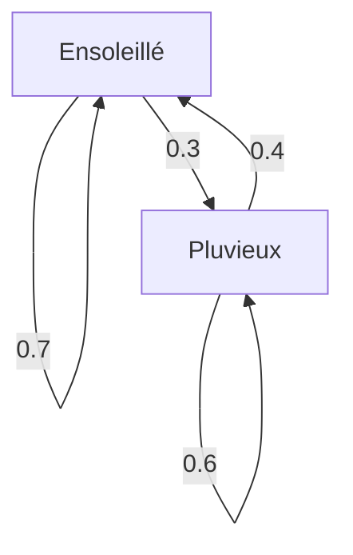

## Introduction

Le monde dans lequel nous vivons est rempli d'incertitudes. Il existe de nombreux phénomènes difficiles à prédire, tels que la météo de demain, les fluctuations des cours de la bourse et les transitions de pages sur Internet. Un outil puissant pour modéliser mathématiquement de tels phénomènes incertains est la **chaîne de Markov** .

La principale caractéristique d'une chaîne de Markov est qu'elle possède la **propriété de Markov** , ce qui signifie que "l'état futur ne dépend que de l'état actuel et non de l'historique passé". Dans cet article, nous expliquerons en détail les bases de ce modèle mathématique fascinant, les méthodes de calcul spécifiques et ses applications dans le monde réel.

## Qu'est-ce que la propriété de Markov ?

Dans un processus stochastique, supposons que l'état à un certain moment $t$ soit représenté par $X_t$. Lors de l'examen d'un modèle à temps discret, la propriété de Markov est définie par la formule mathématique suivante :

$$
P(X_{n+1} = x_{n+1} \mid X_n = x_n, X_{n-1} = x_{n-1}, \dots, X_0 = x_0) = P(X_{n+1} = x_{n+1} \mid X_n = x_n)
$$

Cette formule indique que la probabilité d'être dans l'état $x_{n+1}$ au temps $n+1$ peut être calculée tant que l'état $x_n$ au temps $n$ est connu, et que les informations sur les états précédents ( $x_{n-1}, \dots, x_0$ ) sont inutiles. C'est le sens de l'expression "l'avenir n'est déterminé que par le présent".

## Matrice de probabilité de transition

La **matrice de probabilité de transition** est essentielle pour décrire une chaîne de Markov. Si l'espace d'états est fini et que la probabilité de passer d'un état $i$ à un état $j$ est $p_{ij}$, la matrice $P$ est représentée comme suit :

$$
P = \begin{pmatrix}
p_{11} & p_{12} & \cdots & p_{1k} \\
p_{21} & p_{22} & \cdots & p_{2k} \\
\vdots & \vdots & \ddots & \vdots \\
p_{k1} & p_{k2} & \cdots & p_{kk}
\end{pmatrix}
$$

Ici, la somme de chaque ligne est toujours égale à $1$.

$$
\sum_{j=1}^{k} p_{ij} = 1 \quad \text{(pour tout } i \text{)}
$$

### Exemple spécifique : Modèle de prévision météorologique

Comme exemple simple, considérons la météo dans une certaine ville. Supposons qu'il n'y ait que deux états : "Ensoleillé" et "Pluvieux".
- S'il fait beau aujourd'hui, la probabilité qu'il fasse beau demain est de 0,7 et qu'il pleuve est de 0,3.
- S'il pleut aujourd'hui, la probabilité qu'il fasse beau demain est de 0,4 et qu'il pleuve est de 0,6.

La représentation de ce modèle avec la matrice de probabilité de transition $P$ donne ce qui suit :

$$
P = \begin{pmatrix}
0.7 & 0.3 \\
0.4 & 0.6
\end{pmatrix}
$$

Visualisons cette transition d'état avec un graphique Mermaid.

## Distribution stationnaire : Comportement à long terme

Si une chaîne de Markov est observée sur une longue période ( $n \to \infty$ ), qu'advient-il de la distribution de probabilité des états ? Dans de nombreuses chaînes de Markov, elle converge vers une distribution de probabilité spécifique, quel que soit l'état initial. C'est ce qu'on appelle la **distribution stationnaire** .

En supposant que le vecteur de probabilité soit $\pi$, la distribution stationnaire satisfait l'équation suivante :

$$
\pi P = \pi
$$

Comme condition, il est requis que $\sum \pi_i = 1$.

Calculons la distribution stationnaire $\pi = (\pi_{\text{Ensoleillé}}, \pi_{\text{Pluvieux}})$ pour l'exemple météorologique précédent.

$$
\begin{pmatrix} \pi_{\text{Ensoleillé}} & \pi_{\text{Pluvieux}} \end{pmatrix} \begin{pmatrix} 0.7 & 0.3 \\ 0.4 & 0.6 \end{pmatrix} = \begin{pmatrix} \pi_{\text{Ensoleillé}} & \pi_{\text{Pluvieux}} \end{pmatrix}
$$

La résolution du système d'équations donne ce qui suit :

1. $0.7\pi_{\text{Ensoleillé}} + 0.4\pi_{\text{Pluvieux}} = \pi_{\text{Ensoleillé}}$
2. $0.3\pi_{\text{Ensoleillé}} + 0.6\pi_{\text{Pluvieux}} = \pi_{\text{Pluvieux}}$
3. $\pi_{\text{Ensoleillé}} + \pi_{\text{Pluvieux}} = 1$

La résolution de ce système donne $\pi_{\text{Ensoleillé}} = \frac{4}{7} \approx 0.57$ et $\pi_{\text{Pluvieux}} = \frac{3}{7} \approx 0.43$. En d'autres termes, à long terme, il y a environ 57 % de chances qu'il fasse beau et 43 % de chances qu'il pleuve.

## Applications des chaînes de Markov

Les chaînes de Markov ne se limitent pas au monde des mathématiques ; elles sont appliquées à divers systèmes du monde réel.

### 1. Algorithme PageRank de Google
En traitant les pages Web sur Internet comme des états et le fait de suivre des liens comme des transitions de probabilité, l'importance des pages est calculée. On peut dire que PageRank recherche une distribution stationnaire dans l'immense espace d'états d'Internet.

### 2. Traitement du langage naturel et génération de texte
En modélisant la séquence des mots dans une phrase avec une chaîne de Markov, il est possible de prédire le mot qui a le plus de chances de suivre et de générer des phrases naturelles (modèles N-grammes). C'est l'idée fondamentale des modèles linguistiques modernes d'IA.

### 3. Économie et ingénierie financière
La modélisation des fluctuations des cours des actions et de la migration des consommateurs entre les marques (la probabilité qu'une personne achetant un certain produit passe à un autre produit) est utilisée dans les prévisions de marché et les stratégies de marketing.

## Conclusion

Les chaînes de Markov reposent sur l'hypothèse simple mais puissante selon laquelle "les prévisions futures sont possibles tant que les informations actuelles sont disponibles". Grâce à cette **propriété de Markov** , les phénomènes qui semblent complexes peuvent être formulés sous la forme d'une matrice de probabilités de transition, et les tendances à long terme (distributions stationnaires) peuvent être dérivées mathématiquement.

Avec de vastes applications allant de la recherche d'informations à l'IA et aux prévisions économiques, en plus de sa beauté théorique, la chaîne de Markov est sans aucun doute l'une des lentilles très importantes pour déchiffrer un monde incertain.
