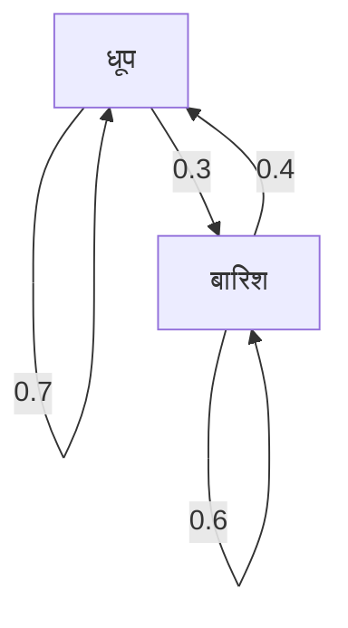

## परिचय

हम जिस दुनिया में रहते हैं वह अनिश्चितता से भरी है। ऐसी कई घटनाएँ हैं जिनकी भविष्यवाणी करना मुश्किल है, जैसे कि कल का मौसम, शेयर बाजार में उतार-चढ़ाव और इंटरनेट पर पृष्ठ संक्रमण। ऐसी अनिश्चित घटनाओं को गणितीय रूप से मॉडल करने के लिए एक शक्तिशाली उपकरण **[मार्कोव चेन](https://kenji.blog/hi/p/markov-chain/)** है।

[मार्कोव चेन](https://kenji.blog/hi/p/markov-chain/) की सबसे बड़ी विशेषता यह है कि इसमें **मार्कोव गुण** होता है, जिसका अर्थ है "भविष्य की स्थिति केवल वर्तमान स्थिति पर निर्भर करती है, पिछले इतिहास पर नहीं"। इस लेख में, हम इस आकर्षक गणितीय मॉडल के मूल सिद्धांतों, विशिष्ट गणना विधियों और वास्तविक दुनिया में इसके अनुप्रयोगों के बारे में विस्तार से बताएंगे।

## मार्कोव गुण क्या है?

एक स्टोकेस्टिक प्रक्रिया में, मान लें कि एक निश्चित समय $t$ पर स्थिति $X_t$ द्वारा दर्शाई गई है। असतत-समय मॉडल पर विचार करते समय, मार्कोव गुण को निम्नलिखित गणितीय सूत्र द्वारा परिभाषित किया जाता है:

$$
P(X_{n+1} = x_{n+1} \mid X_n = x_n, X_{n-1} = x_{n-1}, \dots, X_0 = x_0) = P(X_{n+1} = x_{n+1} \mid X_n = x_n)
$$

यह सूत्र इंगित करता है कि समय $n+1$ पर स्थिति $x_{n+1}$ में होने की संभावना की गणना तब तक की जा सकती है जब तक समय $n$ पर स्थिति $x_n$ ज्ञात हो, और पिछली स्थितियों ( $x_{n-1}, \dots, x_0$ ) के बारे में जानकारी अनावश्यक है। "भविष्य केवल वर्तमान द्वारा निर्धारित होता है" वाक्यांश का यही अर्थ है।

## संक्रमण संभाव्यता मैट्रिक्स

[मार्कोव चेन](https://kenji.blog/hi/p/markov-chain/) का वर्णन करने के लिए **संक्रमण संभाव्यता मैट्रिक्स** आवश्यक है। यदि राज्य स्थान परिमित है और एक राज्य $i$ से एक राज्य $j$ में संक्रमण की संभावना $p_{ij}$ है, तो मैट्रिक्स $P$ को निम्नानुसार दर्शाया जाता है:

$$
P = \begin{pmatrix}
p_{11} & p_{12} & \cdots & p_{1k} \\
p_{21} & p_{22} & \cdots & p_{2k} \\
\vdots & \vdots & \ddots & \vdots \\
p_{k1} & p_{k2} & \cdots & p_{kk}
\end{pmatrix}
$$

यहाँ, प्रत्येक पंक्ति का योग हमेशा $1$ होता है।

$$
\sum_{j=1}^{k} p_{ij} = 1 \quad \text{(सभी } i \text{ के लिए)}
$$

### विशिष्ट उदाहरण: मौसम पूर्वानुमान मॉडल

एक सरल उदाहरण के रूप में, आइए एक निश्चित शहर के मौसम पर विचार करें। मान लें कि केवल दो स्थितियां हैं: "धूप" और "बारिश"।
- यदि आज धूप है, तो कल धूप होने की संभावना 0.7 है, और बारिश होने की 0.3 है।
- यदि आज बारिश है, तो कल धूप होने की संभावना 0.4 है, और बारिश होने की 0.6 है।

इस मॉडल को संक्रमण संभाव्यता मैट्रिक्स $P$ के साथ दर्शाने पर निम्नलिखित प्राप्त होता है:

$$
P = \begin{pmatrix}
0.7 & 0.3 \\
0.4 & 0.6
\end{pmatrix}
$$

आइए इस राज्य संक्रमण को एक मरमेड ग्राफ के साथ देखें।

## स्थिर वितरण: दीर्घकालिक व्यवहार

यदि लंबी अवधि ( $n \to \infty$ ) के लिए [मार्कोव चेन](https://kenji.blog/hi/p/markov-chain/) देखी जाती है, तो राज्यों के संभाव्यता वितरण का क्या होता है? कई [मार्कोव चेन](https://kenji.blog/hi/p/markov-chain/) में, यह प्रारंभिक स्थिति की परवाह किए बिना एक विशिष्ट संभाव्यता वितरण में परिवर्तित हो जाता है। इसे **स्थिर वितरण** कहा जाता है।

यह मानते हुए कि संभाव्यता वेक्टर $\pi$ है, स्थिर वितरण निम्नलिखित समीकरण को संतुष्ट करता है:

$$
\pi P = \pi
$$

एक शर्त के रूप में, $\sum \pi_i = 1$ आवश्यक है।

आइए पहले के मौसम उदाहरण के लिए स्थिर वितरण $\pi = (\pi_{\text{धूप}}, \pi_{\text{बारिश}})$ की गणना करें।

$$
\begin{pmatrix} \pi_{\text{धूप}} & \pi_{\text{बारिश}} \end{pmatrix} \begin{pmatrix} 0.7 & 0.3 \\ 0.4 & 0.6 \end{pmatrix} = \begin{pmatrix} \pi_{\text{धूप}} & \pi_{\text{बारिश}} \end{pmatrix}
$$

समीकरणों की प्रणाली को हल करने पर निम्नलिखित प्राप्त होता है:

1. $0.7\pi_{\text{धूप}} + 0.4\pi_{\text{बारिश}} = \pi_{\text{धूप}}$
2. $0.3\pi_{\text{धूप}} + 0.6\pi_{\text{बारिश}} = \pi_{\text{बारिश}}$
3. $\pi_{\text{धूप}} + \pi_{\text{बारिश}} = 1$

इसे हल करने पर $\pi_{\text{धूप}} = \frac{4}{7} \approx 0.57$ और $\pi_{\text{बारिश}} = \frac{3}{7} \approx 0.43$ प्राप्त होता है। दूसरे शब्दों में, लंबी अवधि में, इसके धूप होने की लगभग 57% संभावना है और इसके बारिश होने की 43% संभावना है।

## [मार्कोव चेन](https://kenji.blog/hi/p/markov-chain/) के अनुप्रयोग

[मार्कोव चेन](https://kenji.blog/hi/p/markov-chain/) गणित की दुनिया तक सीमित नहीं हैं; वे विभिन्न वास्तविक दुनिया प्रणालियों में लागू होते हैं।

### 1. Google का PageRank एल्गोरिदम
इंटरनेट पर वेब पेजों को राज्यों के रूप में और लिंक का पालन करने के कार्य को संभाव्यता संक्रमण के रूप में मानकर, पृष्ठों के महत्व की गणना की जाती है। यह कहा जा सकता है कि PageRank इंटरनेट के विशाल राज्य स्थान में एक स्थिर वितरण चाहता है।

### 2. प्राकृतिक भाषा प्रसंस्करण और पाठ निर्माण
[मार्कोव चेन](https://kenji.blog/hi/p/markov-chain/) के साथ एक वाक्य में शब्दों के अनुक्रम को मॉडल करके, उस शब्द की भविष्यवाणी करना संभव है जो आगे आने की संभावना है और प्राकृतिक वाक्य (N-ग्राम मॉडल) उत्पन्न कर सकता है। यह आधुनिक AI भाषा मॉडल का मूलभूत विचार है।

### 3. अर्थशास्त्र और वित्तीय इंजीनियरिंग
शेयर बाजार में उतार-चढ़ाव और उपभोक्ता ब्रांड प्रवास (यह संभावना कि कोई निश्चित उत्पाद खरीदने वाला व्यक्ति किसी अन्य उत्पाद पर स्विच करता है) को मॉडल करने का उपयोग बाजार पूर्वानुमान और विपणन रणनीतियों में किया जाता है।

## निष्कर्ष

[मार्कोव चेन](https://kenji.blog/hi/p/markov-chain/) सरल लेकिन शक्तिशाली धारणा पर आधारित हैं कि "भविष्य की भविष्यवाणियां तब तक संभव हैं जब तक वर्तमान जानकारी उपलब्ध है"। इस **मार्कोव गुण** के कारण, जटिल प्रतीत होने वाली घटनाओं को एक संक्रमण संभाव्यता मैट्रिक्स के रूप में तैयार किया जा सकता है, और दीर्घकालिक प्रवृत्तियों (स्थिर वितरण) को गणितीय रूप से प्राप्त किया जा सकता है।

सूचना पुनर्प्राप्ति से लेकर AI और आर्थिक पूर्वानुमान तक व्यापक अनुप्रयोगों के साथ, इसकी सैद्धांतिक सुंदरता के अलावा, [मार्कोव चेन](https://kenji.blog/hi/p/markov-chain/) निस्संदेह एक अनिश्चित दुनिया को समझने के लिए बहुत महत्वपूर्ण लेंसों में से एक है।
