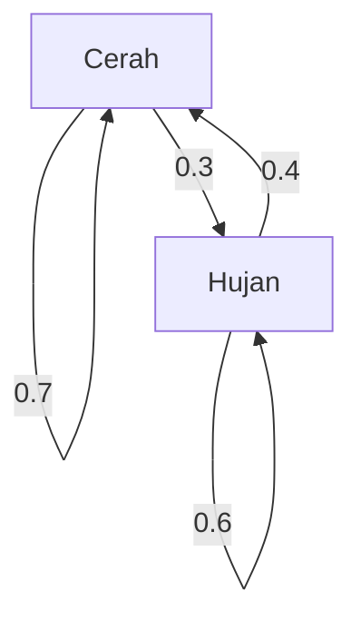

## Pengantar

Dunia tempat kita hidup penuh dengan ketidakpastian. Ada banyak fenomena yang sulit diprediksi, seperti cuaca besok, fluktuasi harga saham, dan transisi halaman di Internet. Alat yang ampuh untuk memodelkan fenomena yang tidak pasti tersebut secara matematis adalah **rantai Markov** .

Fitur terbesar dari rantai Markov adalah memiliki **sifat Markov** , yang berarti "keadaan masa depan hanya bergantung pada keadaan saat ini, bukan pada sejarah masa lalu". Pada artikel ini, kami akan menjelaskan secara detail dasar-dasar model matematika yang menarik ini, metode perhitungan spesifik, dan aplikasinya di dunia nyata.

## Apa itu Sifat Markov?

Dalam proses stokastik, misalkan keadaan pada waktu tertentu $t$ diwakili oleh $X_t$. Saat mempertimbangkan model waktu diskrit, sifat Markov didefinisikan oleh rumus matematika berikut:

$$
P(X_{n+1} = x_{n+1} \mid X_n = x_n, X_{n-1} = x_{n-1}, \dots, X_0 = x_0) = P(X_{n+1} = x_{n+1} \mid X_n = x_n)
$$

Rumus ini menunjukkan bahwa probabilitas berada dalam keadaan $x_{n+1}$ pada waktu $n+1$ dapat dihitung selama keadaan $x_n$ pada waktu $n$ diketahui, dan informasi tentang keadaan sebelumnya ( $x_{n-1}, \dots, x_0$ ) tidak diperlukan. Inilah makna dari kalimat "masa depan hanya ditentukan oleh masa kini".

## Matriks Probabilitas Transisi

Penting untuk menggambarkan rantai Markov adalah **Matriks Probabilitas Transisi** . Jika ruang keadaan berhingga dan probabilitas transisi dari keadaan $i$ ke keadaan $j$ adalah $p_{ij}$, matriks $P$ direpresentasikan sebagai berikut:

$$
P = \begin{pmatrix}
p_{11} & p_{12} & \cdots & p_{1k} \\
p_{21} & p_{22} & \cdots & p_{2k} \\
\vdots & \vdots & \ddots & \vdots \\
p_{k1} & p_{k2} & \cdots & p_{kk}
\end{pmatrix}
$$

Di sini, jumlah setiap baris selalu $1$.

$$
\sum_{j=1}^{k} p_{ij} = 1 \quad \text{(untuk semua } i \text{)}
$$

### Contoh Spesifik: Model Prakiraan Cuaca

Sebagai contoh sederhana, mari kita perhatikan cuaca di kota tertentu. Asumsikan hanya ada dua keadaan: "Cerah" dan "Hujan".
- Jika hari ini cerah, peluang besok cerah adalah 0.7, dan hujan 0.3.
- Jika hari ini hujan, peluang besok cerah adalah 0.4, dan hujan 0.6.

Mewakili model ini dengan matriks probabilitas transisi $P$ menghasilkan yang berikut:

$$
P = \begin{pmatrix}
0.7 & 0.3 \\
0.4 & 0.6
\end{pmatrix}
$$

Mari kita visualisasikan transisi keadaan ini dengan grafik Mermaid.

## Distribusi Stasioner: Perilaku Jangka Panjang

Jika rantai Markov diamati dalam jangka waktu yang lama ( $n \to \infty$ ), apa yang terjadi pada distribusi probabilitas dari keadaan-keadaan tersebut? Pada banyak rantai Markov, rantai tersebut menyatu pada distribusi probabilitas tertentu terlepas dari keadaan awalnya. Ini disebut **distribusi stasioner** .

Diasumsikan bahwa vektor probabilitasnya adalah $\pi$, distribusi stasioner memenuhi persamaan berikut:

$$
\pi P = \pi
$$

Sebagai syarat, disyaratkan bahwa $\sum \pi_i = 1$.

Mari kita hitung distribusi stasioner $\pi = (\pi_{\text{Cerah}}, \pi_{\text{Hujan}})$ untuk contoh cuaca sebelumnya.

$$
\begin{pmatrix} \pi_{\text{Cerah}} & \pi_{\text{Hujan}} \end{pmatrix} \begin{pmatrix} 0.7 & 0.3 \\ 0.4 & 0.6 \end{pmatrix} = \begin{pmatrix} \pi_{\text{Cerah}} & \pi_{\text{Hujan}} \end{pmatrix}
$$

Pemecahan sistem persamaan menghasilkan hal berikut:

1. $0.7\pi_{\text{Cerah}} + 0.4\pi_{\text{Hujan}} = \pi_{\text{Cerah}}$
2. $0.3\pi_{\text{Cerah}} + 0.6\pi_{\text{Hujan}} = \pi_{\text{Hujan}}$
3. $\pi_{\text{Cerah}} + \pi_{\text{Hujan}} = 1$

Pemecahan ini memberikan $\pi_{\text{Cerah}} = \frac{4}{7} \approx 0.57$ dan $\pi_{\text{Hujan}} = \frac{3}{7} \approx 0.43$. Dengan kata lain, dalam jangka panjang, ada sekitar 57% kemungkinan cuaca cerah dan 43% kemungkinan hujan.

## Aplikasi Rantai Markov

Rantai Markov tidak terbatas pada dunia matematika; rantai Markov diterapkan pada berbagai sistem dunia nyata.

### 1. Algoritma PageRank Google
Dengan memperlakukan halaman web di Internet sebagai keadaan dan tindakan mengikuti tautan sebagai transisi probabilitas, pentingnya halaman dihitung. Dapat dikatakan bahwa PageRank mencari distribusi stasioner di ruang keadaan Internet yang luas.

### 2. Pemrosesan Bahasa Alami dan Pembuatan Teks
Dengan memodelkan urutan kata dalam sebuah kalimat dengan rantai Markov, dimungkinkan untuk memprediksi kata yang kemungkinan besar muncul selanjutnya dan menghasilkan kalimat alami (model N-gram). Ini adalah ide dasar dari model bahasa AI modern.

### 3. Ekonomi dan Rekayasa Keuangan
Pemodelan fluktuasi harga saham dan migrasi merek konsumen (kemungkinan bahwa seseorang yang membeli produk tertentu beralih ke produk lain) digunakan dalam perkiraan pasar dan strategi pemasaran.

## Kesimpulan

Rantai Markov didasarkan pada asumsi sederhana namun kuat bahwa "prediksi masa depan dimungkinkan selama informasi saat ini tersedia". Karena **sifat Markov** ini, fenomena yang tampaknya kompleks dapat dirumuskan sebagai matriks probabilitas transisi, dan tren jangka panjang (distribusi stasioner) dapat diturunkan secara matematis.

Dengan aplikasi luas mulai dari pencarian informasi hingga AI dan prakiraan ekonomi, di samping keindahan teoretisnya, rantai Markov tidak diragukan lagi adalah salah satu lensa yang sangat penting untuk menguraikan dunia yang tidak pasti.
