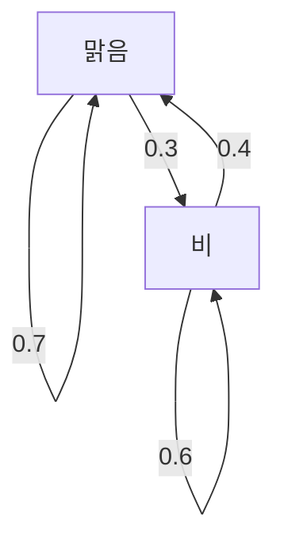

## 시작하며

우리가 사는 세계는 불확실성으로 가득 차 있습니다. 내일의 날씨, 주가의 변동, 인터넷상의 페이지 이동 등 예측하기 어려운 현상은 수없이 존재합니다. 이러한 불확실한 현상을 수학적으로 모델링하는 강력한 도구가 **[마르코프 체인](https://kenji.blog/ko/p/markov-chain/)** (Markov chain)입니다.

[마르코프 체인](https://kenji.blog/ko/p/markov-chain/)의 가장 큰 특징은 "미래의 상태는 과거의 이력에 의존하지 않고 현재의 상태에 의해서만 결정된다"는 **마르코프 성질** (Markov property)을 가지고 있다는 것입니다. 본 기사에서는 이 매력적인 수학적 모델의 기초부터 구체적인 계산 방법, 그리고 실제 사회에서의 응용까지 자세히 해설합니다.

## 마르코프 성질이란 무엇인가?

확률 과정에서 특정 시간 $t$ 에서의 상태가 $X_t$ 로 표현된다고 가정합시다. 이산 시간 모델을 생각할 때, 마르코프 성질은 다음과 같은 수식으로 정의됩니다.

$$
P(X_{n+1} = x_{n+1} \mid X_n = x_n, X_{n-1} = x_{n-1}, \dots, X_0 = x_0) = P(X_{n+1} = x_{n+1} \mid X_n = x_n)
$$

이 식은 시간 $n+1$ 에 상태 $x_{n+1}$ 이 될 확률은 시간 $n$ 에서의 상태 $x_n$ 만 알고 있으면 계산 가능하며, 그 이전 상태 ( $x_{n-1}, \dots, x_0$ ) 의 정보는 필요하지 않음을 나타냅니다. 이것이 "미래는 현재만으로 결정된다"는 말의 의미입니다.

## 전이 확률 행렬

[마르코프 체인](https://kenji.blog/ko/p/markov-chain/)을 기술하는 데 빼놓을 수 없는 것이 **전이 확률 행렬** (Transition Probability Matrix)입니다. 상태 공간이 유한한 경우, 특정 상태 $i$ 에서 상태 $j$ 로 전이할 확률을 $p_{ij}$ 라고 하면 행렬 $P$ 는 다음과 같이 표현됩니다.

$$
P = \begin{pmatrix}
p_{11} & p_{12} & \cdots & p_{1k} \\
p_{21} & p_{22} & \cdots & p_{2k} \\
\vdots & \vdots & \ddots & \vdots \\
p_{k1} & p_{k2} & \cdots & p_{kk}
\end{pmatrix}
$$

여기서 각 행의 합은 반드시 $1$ 이 됩니다.

$$
\sum_{j=1}^{k} p_{ij} = 1 \quad \text{(모든 } i \text{ 에 대하여)}
$$

### 구체적인 예: 일기 예보 모델

간단한 예로 어느 도시의 날씨를 생각해 보겠습니다. 상태는 "맑음"과 "비" 두 가지뿐이라고 가정합니다.
- 오늘이 맑은 경우, 내일도 맑을 확률은 0.7, 비가 올 확률은 0.3
- 오늘이 비인 경우, 내일 맑을 확률은 0.4, 비가 올 확률은 0.6

이 모델을 전이 확률 행렬 $P$ 로 나타내면 다음과 같습니다.

$$
P = \begin{pmatrix}
0.7 & 0.3 \\
0.4 & 0.6
\end{pmatrix}
$$

이 상태 전이를 Mermaid 그래프로 시각화해 보겠습니다.

## 정상 분포: 장기적인 거동

[마르코프 체인](https://kenji.blog/ko/p/markov-chain/)을 장기간 ( $n \to \infty$ ) 관측했을 때, 상태의 확률 분포는 어떻게 될까요? 많은 [마르코프 체인](https://kenji.blog/ko/p/markov-chain/)에서는 초기 상태에 관계없이 특정 확률 분포로 수렴합니다. 이를 **정상 분포** (Stationary distribution)라고 부릅니다.

확률 벡터를 $\pi$ 라고 했을 때, 정상 분포는 다음 방정식을 만족합니다.

$$
\pi P = \pi
$$

조건으로서 $\sum \pi_i = 1$ 이 필요합니다.

앞서 살펴본 날씨의 예에서 정상 분포 $\pi = (\pi_{\text{맑음}}, \pi_{\text{비}})$ 를 계산해 보겠습니다.

$$
\begin{pmatrix} \pi_{\text{맑음}} & \pi_{\text{비}} \end{pmatrix} \begin{pmatrix} 0.7 & 0.3 \\ 0.4 & 0.6 \end{pmatrix} = \begin{pmatrix} \pi_{\text{맑음}} & \pi_{\text{비}} \end{pmatrix}
$$

연립방정식을 풀면 다음과 같습니다.

1. $0.7\pi_{\text{맑음}} + 0.4\pi_{\text{비}} = \pi_{\text{맑음}}$
2. $0.3\pi_{\text{맑음}} + 0.6\pi_{\text{비}} = \pi_{\text{비}}$
3. $\pi_{\text{맑음}} + \pi_{\text{비}} = 1$

이를 풀면 $\pi_{\text{맑음}} = \frac{4}{7} \approx 0.57$ , $\pi_{\text{비}} = \frac{3}{7} \approx 0.43$ 이 됩니다. 즉, 장기적으로는 약 57%의 확률로 맑고, 43%의 확률로 비가 온다는 것을 알 수 있습니다.

## [마르코프 체인](https://kenji.blog/ko/p/markov-chain/)의 응용

[마르코프 체인](https://kenji.blog/ko/p/markov-chain/)은 수학의 세계에 머물지 않고 다양한 실세계 시스템에 응용되고 있습니다.

### 1. Google의 PageRank 알고리즘
인터넷상의 웹 페이지를 상태로 하고, 링크를 따라가는 행동을 확률 전이로 간주하여 페이지의 중요도를 계산합니다. PageRank는 인터넷이라는 거대한 상태 공간에서의 정상 분포를 구하고 있다고 할 수 있습니다.

### 2. 자연어 처리 및 텍스트 생성
문장 중 단어의 배열을 [마르코프 체인](https://kenji.blog/ko/p/markov-chain/)으로 모델링함으로써 어떤 단어 다음에 오기 쉬운 단어를 예측하고 자연스러운 문장을 생성할 수 있습니다 (N-gram 모델). 이것은 현대 AI 언어 모델의 기초가 되는 사고방식입니다.

### 3. 경제학과 금융 공학
주가의 변동이나 소비자의 브랜드 이동(특정 상품을 사던 사람이 다른 상품으로 갈아탈 확률) 등을 모델링하여 시장 예측 및 마케팅 전략에 활용되고 있습니다.

## 요약

[마르코프 체인](https://kenji.blog/ko/p/markov-chain/)은 "현재의 정보만 있으면 미래의 예측이 가능하다"는 단순하면서도 강력한 가정에 기초하고 있습니다. 이 **마르코프 성질** 로 인해 복잡해 보이는 현상을 전이 확률 행렬로 정식화하고, 장기적인 경향(정상 분포)을 수학적으로 도출할 수 있습니다.

이론적인 아름다움뿐만 아니라 정보 검색에서 AI, 경제 예측에 이르기까지 폭넓은 응용을 가진 [마르코프 체인](https://kenji.blog/ko/p/markov-chain/)은 불확실한 세계를 해독하기 위한 매우 중요한 렌즈 중 하나라고 할 수 있습니다.
