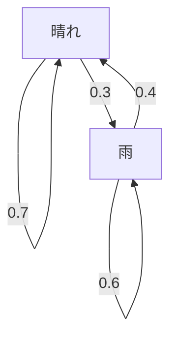

## はじめに

私たちの生きる世界には、不確実性が満ち溢れています。明日の天気、株価の変動、インターネット上のページ遷移など、予測が難しい現象は数多く存在します。このような不確実な現象を数学的にモデル化する強力なツールが **[マルコフ連鎖](https://kenji.blog/p/markov-chain/)** （Markov chain）です。

[マルコフ連鎖](https://kenji.blog/p/markov-chain/)の最大の特徴は、「未来の状態は、過去の履歴に依存せず、現在の状態のみによって決まる」という **マルコフ性** （Markov property）を持っていることです。本記事では、この魅力的な数学的モデルの基礎から、具体的な計算手法、そして実社会での応用までを詳しく解説します。

## マルコフ性とは何か？

確率過程において、ある時刻 $t$ における状態が $X_t$ で表されるとします。離散時間モデルを考える場合、マルコフ性は以下の数式で定義されます。

$$
P(X_{n+1} = x_{n+1} \mid X_n = x_n, X_{n-1} = x_{n-1}, \dots, X_0 = x_0) = P(X_{n+1} = x_{n+1} \mid X_n = x_n)
$$

この式は、時間 $n+1$ で状態 $x_{n+1}$ になる確率は、時間 $n$ での状態 $x_n$ さえ分かっていれば計算可能であり、それ以前の状態（ $x_{n-1}, \dots, x_0$ ）の情報は不要であることを示しています。これが「未来は現在だけで決まる」という言葉の意味です。

## 推移確率行列（状態遷移行列）

[マルコフ連鎖](https://kenji.blog/p/markov-chain/)を記述する上で欠かせないのが **推移確率行列** （Transition Probability Matrix）です。状態空間が有限である場合、ある状態 $i$ から状態 $j$ へ遷移する確率を $p_{ij}$ とすると、行列 $P$ は次のように表されます。

$$
P = \begin{pmatrix}
p_{11} & p_{12} & \cdots & p_{1k} \\
p_{21} & p_{22} & \cdots & p_{2k} \\
\vdots & \vdots & \ddots & \vdots \\
p_{k1} & p_{k2} & \cdots & p_{kk}
\end{pmatrix}
$$

ここで、各行の和は必ず $1$ になります。

$$
\sum_{j=1}^{k} p_{ij} = 1 \quad \text{(すべての } i \text{ について)}
$$

### 具体例：天気予報モデル

簡単な例として、ある街の天気を考えます。状態は「晴れ」と「雨」の2つのみとします。
- 今日が晴れの場合、明日も晴れる確率は 0.7、雨になる確率は 0.3
- 今日が雨の場合、明日晴れる確率は 0.4、雨になる確率は 0.6

このモデルを推移確率行列 $P$ で表すと以下のようになります。

$$
P = \begin{pmatrix}
0.7 & 0.3 \\
0.4 & 0.6
\end{pmatrix}
$$

この状態遷移を Mermaid [グラフ](https://kenji.blog/p/tree-graph-data-structures-search-dfs-bfs-dijkstra/)で視覚化してみましょう。

## 定常分布：長期的な振る舞い

[マルコフ連鎖](https://kenji.blog/p/markov-chain/)を長期間（ $n \to \infty$ ）観測した場合、状態の確率分布はどうなるでしょうか？多くの[マルコフ連鎖](https://kenji.blog/p/markov-chain/)では、初期状態にかかわらず特定の確率分布に収束します。これを **定常分布** （Stationary distribution）と呼びます。

確率ベクトルを $\pi$ としたとき、定常分布は次の方程式を満たします。

$$
\pi P = \pi
$$

条件として、 $\sum \pi_i = 1$ が必要です。

先ほどの天気の例で定常分布 $\pi = (\pi_{\text{晴れ}}, \pi_{\text{雨}})$ を計算してみます。

$$
\begin{pmatrix} \pi_{\text{晴れ}} & \pi_{\text{雨}} \end{pmatrix} \begin{pmatrix} 0.7 & 0.3 \\ 0.4 & 0.6 \end{pmatrix} = \begin{pmatrix} \pi_{\text{晴れ}} & \pi_{\text{雨}} \end{pmatrix}
$$

連立方程式を解くと以下のようになります。

1. $0.7\pi_{\text{晴れ}} + 0.4\pi_{\text{雨}} = \pi_{\text{晴れ}}$
2. $0.3\pi_{\text{晴れ}} + 0.6\pi_{\text{雨}} = \pi_{\text{雨}}$
3. $\pi_{\text{晴れ}} + \pi_{\text{雨}} = 1$

これを解くと、 $\pi_{\text{晴れ}} = \frac{4}{7} \approx 0.57$ 、 $\pi_{\text{雨}} = \frac{3}{7} \approx 0.43$ となります。つまり、長期的には約 57% の確率で晴れ、 43% の確率で雨になることが分かります。

## [マルコフ連鎖](https://kenji.blog/p/markov-chain/)の応用

[マルコフ連鎖](https://kenji.blog/p/markov-chain/)は、数学の世界に留まらず、さまざまな実世界のシステムに応用されています。

### 1. GoogleのPageRankアルゴリズム
インターネット上のウェブページを状態とし、リンクをたどる行動を確率遷移とみなすことで、ページの重要度を計算します。PageRankは、インターネットという巨大な状態空間における定常分布を求めていると言えます。

### 2. 自然言語処理とテキスト生成
文章中の単語の並びを[マルコフ連鎖](https://kenji.blog/p/markov-chain/)でモデル化することで、ある単語の次に来やすい単語を予測し、自然な文章を生成することができます（Nグラムモデル）。これは現代のAI言語モデルの基礎となる考え方です。

### 3. 経済学と金融工学
株価の変動や、消費者のブランド移行（ある商品を勝っていた人が別の商品に乗り換える確率）などをモデル化し、市場予測やマーケティング戦略に活用されています。

## まとめ

[マルコフ連鎖](https://kenji.blog/p/markov-chain/)は、「現在の情報さえあれば未来の予測が可能である」というシンプルながら強力な仮定に基づいています。この **マルコフ性** により、複雑に見える現象を推移確率行列として定式化し、長期的な傾向（定常分布）を数学的に導き出すことができます。

理論的な美しさだけでなく、情報検索からAI、経済予測まで幅広い応用を持つ[マルコフ連鎖](https://kenji.blog/p/markov-chain/)は、不確実な世界を読み解くための非常に重要なレンズの一つと言えるでしょう。
