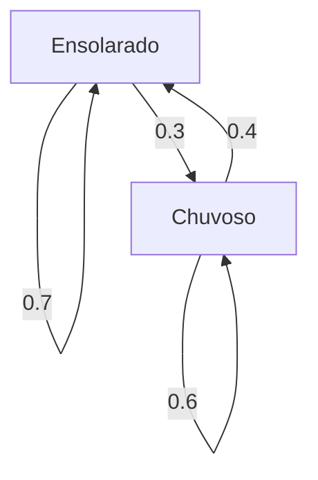

## Introdução

O mundo em que vivemos é cheio de incertezas. Existem muitos fenômenos que são difíceis de prever, como o clima de amanhã, as flutuações dos preços das ações e as transições de páginas na Internet. Uma ferramenta poderosa para modelar matematicamente tais fenômenos incertos é a **cadeia de Markov** .

A principal característica de uma cadeia de Markov é que ela possui a **propriedade de Markov** , o que significa que "o estado futuro depende apenas do estado atual, não da história passada". Neste artigo, explicaremos em detalhes os fundamentos deste fascinante modelo matemático, métodos de cálculo específicos e suas aplicações no mundo real.

## O que é a Propriedade de Markov?

Em um processo estocástico, suponha que o estado em um determinado momento $t$ seja representado por $X_t$. Ao considerar um modelo de tempo discreto, a propriedade de Markov é definida pela seguinte fórmula matemática:

$$
P(X_{n+1} = x_{n+1} \mid X_n = x_n, X_{n-1} = x_{n-1}, \dots, X_0 = x_0) = P(X_{n+1} = x_{n+1} \mid X_n = x_n)
$$

Esta fórmula indica que a probabilidade de estar no estado $x_{n+1}$ no tempo $n+1$ pode ser calculada desde que o estado $x_n$ no tempo $n$ seja conhecido, e informações sobre os estados anteriores ( $x_{n-1}, \dots, x_0$ ) são desnecessárias. Este é o significado da frase "o futuro é determinado apenas pelo presente".

## Matriz de Probabilidades de Transição

Essencial para descrever uma cadeia de Markov é a **Matriz de Probabilidades de Transição** . Se o espaço de estados é finito e a probabilidade de transição de um estado $i$ para um estado $j$ é $p_{ij}$, a matriz $P$ é representada da seguinte forma:

$$
P = \begin{pmatrix}
p_{11} & p_{12} & \cdots & p_{1k} \\
p_{21} & p_{22} & \cdots & p_{2k} \\
\vdots & \vdots & \ddots & \vdots \\
p_{k1} & p_{k2} & \cdots & p_{kk}
\end{pmatrix}
$$

Aqui, a soma de cada linha é sempre $1$.

$$
\sum_{j=1}^{k} p_{ij} = 1 \quad \text{(para todo } i \text{)}
$$

### Exemplo Específico: Modelo de Previsão do Tempo

Como um exemplo simples, vamos considerar o clima em uma determinada cidade. Suponha que existam apenas dois estados: "Ensolarado" e "Chuvoso".
- Se hoje está ensolarado, a probabilidade de amanhã ser ensolarado é de 0.7, e de chover é de 0.3.
- Se hoje chove, a probabilidade de amanhã ser ensolarado é de 0.4, e de chover é de 0.6.

Representar este modelo com a matriz de probabilidades de transição $P$ resulta no seguinte:

$$
P = \begin{pmatrix}
0.7 & 0.3 \\
0.4 & 0.6
\end{pmatrix}
$$

Vamos visualizar esta transição de estado com um gráfico Mermaid.

## Distribuição Estacionária: Comportamento a Longo Prazo

Se uma cadeia de Markov é observada por um longo período ( $n \to \infty$ ), o que acontece com a distribuição de probabilidade dos estados? Em muitas cadeias de Markov, ela converge para uma distribuição de probabilidade específica, independentemente do estado inicial. Isso é chamado de **distribuição estacionária** .

Supondo que o vetor de probabilidade seja $\pi$, a distribuição estacionária satisfaz a seguinte equação:

$$
\pi P = \pi
$$

Como condição, é necessário que $\sum \pi_i = 1$.

Vamos calcular a distribuição estacionária $\pi = (\pi_{\text{Ensolarado}}, \pi_{\text{Chuvoso}})$ para o exemplo do clima anterior.

$$
\begin{pmatrix} \pi_{\text{Ensolarado}} & \pi_{\text{Chuvoso}} \end{pmatrix} \begin{pmatrix} 0.7 & 0.3 \\ 0.4 & 0.6 \end{pmatrix} = \begin{pmatrix} \pi_{\text{Ensolarado}} & \pi_{\text{Chuvoso}} \end{pmatrix}
$$

A resolução do sistema de equações fornece o seguinte:

1. $0.7\pi_{\text{Ensolarado}} + 0.4\pi_{\text{Chuvoso}} = \pi_{\text{Ensolarado}}$
2. $0.3\pi_{\text{Ensolarado}} + 0.6\pi_{\text{Chuvoso}} = \pi_{\text{Chuvoso}}$
3. $\pi_{\text{Ensolarado}} + \pi_{\text{Chuvoso}} = 1$

Resolvendo isso, obtemos $\pi_{\text{Ensolarado}} = \frac{4}{7} \approx 0.57$ e $\pi_{\text{Chuvoso}} = \frac{3}{7} \approx 0.43$. Em outras palavras, a longo prazo, há cerca de 57% de chance de ser ensolarado e 43% de chance de chover.

## Aplicações das [Cadeias de Markov](https://kenji.blog/p/markov-chain/)

As cadeias de Markov não se limitam ao mundo da matemática; elas são aplicadas a vários sistemas do mundo real.

### 1. Algoritmo PageRank do Google
Tratando páginas da web na Internet como estados e o ato de seguir links como transições de probabilidade, a importância das páginas é calculada. Pode-se dizer que o PageRank busca uma distribuição estacionária no enorme espaço de estados da Internet.

### 2. Processamento de Linguagem Natural e Geração de Texto
Ao modelar a sequência de palavras em uma frase com uma cadeia de Markov, é possível prever a palavra com probabilidade de vir a seguir e gerar frases naturais (modelos de N-gramas). Esta é a ideia fundamental dos modelos de linguagem de IA modernos.

### 3. Economia e Engenharia Financeira
A modelagem de flutuações de preços de ações e da migração de marcas pelos consumidores (a probabilidade de que alguém que compra um determinado produto mude para outro produto) é utilizada em previsões de mercado e estratégias de marketing.

## Conclusão

As cadeias de Markov baseiam-se na suposição simples, mas poderosa, de que "previsões futuras são possíveis, desde que as informações atuais estejam disponíveis". Devido a esta **propriedade de Markov** , fenômenos que parecem complexos podem ser formulados como uma matriz de probabilidade de transição, e as tendências de longo prazo (distribuições estacionárias) podem ser derivadas matematicamente.

Com amplas aplicações que vão desde a recuperação de informações até IA e previsões econômicas, além de sua beleza teórica, a cadeia de Markov é, sem dúvida, uma das lentes muito importantes para decifrar um mundo incerto.
