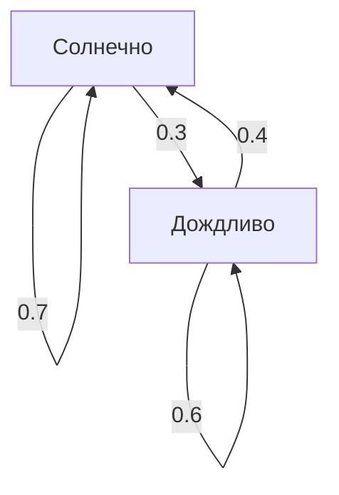

## Введение

Мир, в котором мы живем, полон неопределенности. Существует множество явлений, которые трудно предсказать, таких как завтрашняя погода, колебания цен на акции и переходы по страницам в Интернете. Мощным инструментом для математического моделирования таких неопределенных явлений является **цепь Маркова** .

Главной особенностью цепи Маркова является то, что она обладает **марковским свойством** , что означает: "будущее состояние зависит только от текущего состояния, а не от прошлой истории". В этой статье мы подробно объясним основы этой увлекательной математической модели, конкретные методы вычислений и ее применение в реальном мире.

## Что такое марковское свойство?

Предположим, что в случайном процессе состояние в определенный момент времени $t$ обозначается как $X_t$. При рассмотрении модели с дискретным временем марковское свойство определяется следующей математической формулой:

$$
P(X_{n+1} = x_{n+1} \mid X_n = x_n, X_{n-1} = x_{n-1}, \dots, X_0 = x_0) = P(X_{n+1} = x_{n+1} \mid X_n = x_n)
$$

Эта формула показывает, что вероятность нахождения в состоянии $x_{n+1}$ в момент времени $n+1$ может быть вычислена при условии, что известно состояние $x_n$ в момент времени $n$, а информация о предыдущих состояниях ( $x_{n-1}, \dots, x_0$ ) не нужна. Именно в этом и заключается смысл фразы "будущее определяется только настоящим".

## Матрица вероятностей переходов

Для описания цепи Маркова необходима **Матрица вероятностей переходов** . Если пространство состояний конечно и вероятность перехода из состояния $i$ в состояние $j$ равна $p_{ij}$, то матрица $P$ представляется следующим образом:

$$
P = \begin{pmatrix}
p_{11} & p_{12} & \cdots & p_{1k} \\
p_{21} & p_{22} & \cdots & p_{2k} \\
\vdots & \vdots & \ddots & \vdots \\
p_{k1} & p_{k2} & \cdots & p_{kk}
\end{pmatrix}
$$

Здесь сумма каждой строки всегда равна $1$.

$$
\sum_{j=1}^{k} p_{ij} = 1 \quad \text{(для всех } i \text{)}
$$

### Конкретный пример: Модель прогноза погоды

В качестве простого примера рассмотрим погоду в определенном городе. Предположим, что существует только два состояния: "Солнечно" и "Дождливо".
- Если сегодня солнечно, вероятность того, что завтра будет солнечно, составляет 0.7, а дождливо — 0.3.
- Если сегодня дождливо, вероятность того, что завтра будет солнечно, составляет 0.4, а дождливо — 0.6.

Представление этой модели с помощью матрицы вероятностей переходов $P$ дает следующее:

$$
P = \begin{pmatrix}
0.7 & 0.3 \\
0.4 & 0.6
\end{pmatrix}
$$

Давайте визуализируем этот переход состояний с помощью графа Mermaid.

## Стационарное распределение: Долгосрочное поведение

Если наблюдать за цепью Маркова в течение длительного периода ( $n \to \infty$ ), что произойдет с распределением вероятностей состояний? Во многих цепях Маркова оно сходится к определенному распределению вероятностей независимо от начального состояния. Это называется **стационарным распределением** .

Если предположить, что вектор вероятностей равен $\pi$, стационарное распределение удовлетворяет следующему уравнению:

$$
\pi P = \pi
$$

В качестве условия требуется, чтобы $\sum \pi_i = 1$.

Давайте вычислим стационарное распределение $\pi = (\pi_{\text{Солнечно}}, \pi_{\text{Дождливо}})$ для предыдущего примера с погодой.

$$
\begin{pmatrix} \pi_{\text{Солнечно}} & \pi_{\text{Дождливо}} \end{pmatrix} \begin{pmatrix} 0.7 & 0.3 \\ 0.4 & 0.6 \end{pmatrix} = \begin{pmatrix} \pi_{\text{Солнечно}} & \pi_{\text{Дождливо}} \end{pmatrix}
$$

Решение системы уравнений дает следующее:

1. $0.7\pi_{\text{Солнечно}} + 0.4\pi_{\text{Дождливо}} = \pi_{\text{Солнечно}}$
2. $0.3\pi_{\text{Солнечно}} + 0.6\pi_{\text{Дождливо}} = \pi_{\text{Дождливо}}$
3. $\pi_{\text{Солнечно}} + \pi_{\text{Дождливо}} = 1$

Решив это, получаем $\pi_{\text{Солнечно}} = \frac{4}{7} \approx 0.57$ и $\pi_{\text{Дождливо}} = \frac{3}{7} \approx 0.43$. Другими словами, в долгосрочной перспективе вероятность того, что будет солнечно, составляет около 57%, а вероятность дождя — 43%.

## Применение цепей Маркова

[Цепи Маркова](https://kenji.blog/ru/p/markov-chain/) не ограничиваются миром математики; они применяются в различных системах реального мира.

### 1. Алгоритм PageRank от Google
Обрабатывая веб-страницы в Интернете как состояния, а процесс перехода по ссылкам как вероятностные переходы, вычисляется важность страниц. Можно сказать, что PageRank ищет стационарное распределение в огромном пространстве состояний Интернета.

### 2. Обработка естественного языка и генерация текста
Моделируя последовательность слов в предложении с помощью цепи Маркова, можно предсказать слово, которое, вероятно, будет следующим, и генерировать естественные предложения (N-граммные модели). Это основополагающая идея современных языковых моделей ИИ.

### 3. Экономика и финансовая инженерия
Моделирование колебаний цен на акции и миграции потребителей между брендами (вероятность того, что покупатель определенного продукта переключится на другой продукт) используется в прогнозировании рынка и маркетинговых стратегиях.

## Заключение

[Цепи Маркова](https://kenji.blog/ru/p/markov-chain/) основаны на простом, но мощном предположении о том, что "прогнозирование будущего возможно при наличии информации о настоящем". Благодаря этому **марковскому свойству** явления, кажущиеся сложными, могут быть сформулированы в виде матрицы вероятностей переходов, а долгосрочные тенденции (стационарные распределения) могут быть выведены математически.

Обладая широким спектром применений, от информационного поиска до ИИ и экономического прогнозирования, в дополнение к своей теоретической красоте, цепь Маркова, несомненно, является одной из очень важных линз для расшифровки неопределенного мира.
