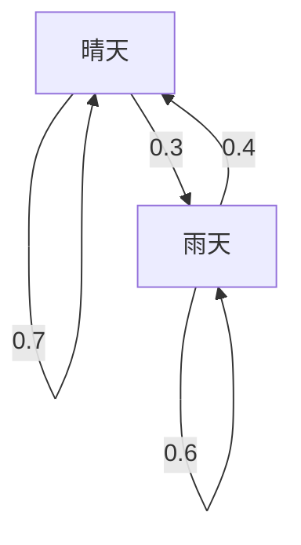

## 引言

我们生活的世界充满了不确定性。明天的天气、股票价格的波动、互联网上的页面跳转等，存在许多难以预测的现象。用于在数学上对这些不确定现象进行建模的强大工具就是 **[马尔可夫链](https://kenji.blog/zh-cn/p/markov-chain/)** （Markov chain）。

[马尔可夫链](https://kenji.blog/zh-cn/p/markov-chain/)最大的特点在于它具有 **马尔可夫性** （Markov property），即“未来的状态不依赖于过去的完整历史，而仅由当前状态决定”。在本文中，我们将详细解释这一迷人数理模型的基础知识、具体的计算方法，以及其在现实社会中的应用。

## 什么是马尔可夫性？

在随机过程中，假设某一时刻 $t$ 的状态表示为 $X_t$。在考虑离散时间模型时，马尔可夫性由以下数学公式定义：

$$
P(X_{n+1} = x_{n+1} \mid X_n = x_n, X_{n-1} = x_{n-1}, \dots, X_0 = x_0) = P(X_{n+1} = x_{n+1} \mid X_n = x_n)
$$

该公式表明，只要已知时间 $n$ 的状态 $x_n$，就可以计算出时间 $n+1$ 变为状态 $x_{n+1}$ 的概率，而不需要之前状态（ $x_{n-1}, \dots, x_0$ ）的信息。这就是“未来仅取决于现在”这句话的含义。

## 转移概率矩阵

描述[马尔可夫链](https://kenji.blog/zh-cn/p/markov-chain/)不可或缺的是 **转移概率矩阵** （Transition Probability Matrix）。当状态空间有限时，假设从状态 $i$ 转移到状态 $j$ 的概率为 $p_{ij}$，则矩阵 $P$ 表示如下：

$$
P = \begin{pmatrix}
p_{11} & p_{12} & \cdots & p_{1k} \\
p_{21} & p_{22} & \cdots & p_{2k} \\
\vdots & \vdots & \ddots & \vdots \\
p_{k1} & p_{k2} & \cdots & p_{kk}
\end{pmatrix}
$$

在这里，每一行的和必定为 $1$。

$$
\sum_{j=1}^{k} p_{ij} = 1 \quad \text{(对于所有的 } i \text{)}
$$

### 具体例子：天气预报模型

作为一个简单的例子，我们来考虑某个城市的天气。假设只有“晴天”和“雨天”两个状态。
- 如果今天是晴天，明天是晴天的概率为 0.7，雨天的概率为 0.3
- 如果今天是雨天，明天是晴天的概率为 0.4，雨天的概率为 0.6

用转移概率矩阵 $P$ 表示这个模型如下：

$$
P = \begin{pmatrix}
0.7 & 0.3 \\
0.4 & 0.6
\end{pmatrix}
$$

让我们用 Mermaid 图表将这种状态转移可视化。

## 平稳分布：长期行为

如果长期观察（ $n \to \infty$ ）一个[马尔可夫链](https://kenji.blog/zh-cn/p/markov-chain/)，状态的概率分布会变成什么样呢？在许多[马尔可夫链](https://kenji.blog/zh-cn/p/markov-chain/)中，无论初始状态如何，都会收敛到一个特定的概率分布。这被称为 **平稳分布** （Stationary distribution）。

假设概率向量为 $\pi$，平稳分布满足以下方程：

$$
\pi P = \pi
$$

作为条件，需要满足 $\sum \pi_i = 1$。

让我们计算之前天气例子的平稳分布 $\pi = (\pi_{\text{晴天}}, \pi_{\text{雨天}})$。

$$
\begin{pmatrix} \pi_{\text{晴天}} & \pi_{\text{雨天}} \end{pmatrix} \begin{pmatrix} 0.7 & 0.3 \\ 0.4 & 0.6 \end{pmatrix} = \begin{pmatrix} \pi_{\text{晴天}} & \pi_{\text{雨天}} \end{pmatrix}
$$

解联立方程组可得：

1. $0.7\pi_{\text{晴天}} + 0.4\pi_{\text{雨天}} = \pi_{\text{晴天}}$
2. $0.3\pi_{\text{晴天}} + 0.6\pi_{\text{雨天}} = \pi_{\text{雨天}}$
3. $\pi_{\text{晴天}} + \pi_{\text{雨天}} = 1$

解得 $\pi_{\text{晴天}} = \frac{4}{7} \approx 0.57$ ， $\pi_{\text{雨天}} = \frac{3}{7} \approx 0.43$。也就是说，从长期来看，大约有 57% 的概率是晴天，43% 的概率是雨天。

## [马尔可夫链](https://kenji.blog/zh-cn/p/markov-chain/)的应用

[马尔可夫链](https://kenji.blog/zh-cn/p/markov-chain/)不仅停留在数学世界，还被应用于各种现实世界系统中。

### 1. Google 的 PageRank 算法
通过将互联网上的网页视为状态，将点击链接的行为视为概率转移，从而计算网页的重要性。可以说 PageRank 是在计算互联网这个巨大状态空间中的平稳分布。

### 2. 自然语言处理与文本生成
通过使用[马尔可夫链](https://kenji.blog/zh-cn/p/markov-chain/)对句子中单词的序列进行建模，可以预测下一个可能出现的单词，并生成自然的句子（N元语法模型）。这是现代 AI 语言模型的基础思想。

### 3. 经济学与金融工程
对股票价格波动和消费者品牌转移（购买某产品的顾客转向其他产品的概率）进行建模，并被应用于市场预测和营销策略。

## 总结

[马尔可夫链](https://kenji.blog/zh-cn/p/markov-chain/)基于一个简单而强大的假设：“只要有当前的信息，就可以预测未来”。凭借这种 **马尔可夫性** ，我们可以将看似复杂的现象公式化为转移概率矩阵，并在数学上推导出长期趋势（平稳分布）。

[马尔可夫链](https://kenji.blog/zh-cn/p/markov-chain/)不仅具有理论上的美感，在从信息检索到 AI 以及经济预测等领域也有着广泛的应用，可以说是解读不确定世界的非常重要的透镜之一。
