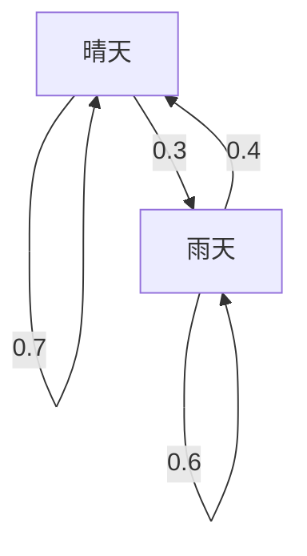

## 引言

我們生活的世界充滿了不確定性。明天的天氣、股票價格的波動、網際網路上的頁面跳轉等，存在許多難以預測的現象。用於在數學上對這些不確定現象進行建模的強大工具就是 **馬可夫鏈** （Markov chain）。

馬可夫鏈最大的特點在於它具有 **馬可夫性** （Markov property），即「未來的狀態不依賴於過去的完整歷史，而僅由當前狀態決定」。在本文中，我們將詳細解釋這一迷人數理模型的基礎知識、具體的計算方法，以及其在現實社會中的應用。

## 什麼是馬可夫性？

在隨機過程中，假設某一時刻 $t$ 的狀態表示為 $X_t$。在考慮離散時間模型時，馬可夫性由以下數學公式定義：

$$
P(X_{n+1} = x_{n+1} \mid X_n = x_n, X_{n-1} = x_{n-1}, \dots, X_0 = x_0) = P(X_{n+1} = x_{n+1} \mid X_n = x_n)
$$

該公式表明，只要已知時間 $n$ 的狀態 $x_n$，就可以計算出時間 $n+1$ 變為狀態 $x_{n+1}$ 的機率，而不需要之前狀態（ $x_{n-1}, \dots, x_0$ ）的資訊。這就是「未來僅取決於現在」這句話的含義。

## 轉移機率矩陣

描述馬可夫鏈不可或缺的是 **轉移機率矩陣** （Transition Probability Matrix）。當狀態空間有限時，假設從狀態 $i$ 轉移到狀態 $j$ 的機率為 $p_{ij}$，則矩陣 $P$ 表示如下：

$$
P = \begin{pmatrix}
p_{11} & p_{12} & \cdots & p_{1k} \\
p_{21} & p_{22} & \cdots & p_{2k} \\
\vdots & \vdots & \ddots & \vdots \\
p_{k1} & p_{k2} & \cdots & p_{kk}
\end{pmatrix}
$$

在這裡，每一行的和必定為 $1$。

$$
\sum_{j=1}^{k} p_{ij} = 1 \quad \text{(對於所有的 } i \text{)}
$$

### 具體例子：天氣預報模型

作為一個簡單的例子，我們來考慮某個城市的天氣。假設只有「晴天」和「雨天」兩個狀態。
- 如果今天是晴天，明天是晴天的機率為 0.7，雨天的機率為 0.3
- 如果今天是雨天，明天是晴天的機率為 0.4，雨天的機率為 0.6

用轉移機率矩陣 $P$ 表示這個模型如下：

$$
P = \begin{pmatrix}
0.7 & 0.3 \\
0.4 & 0.6
\end{pmatrix}
$$

讓我們用 Mermaid 圖表將這種狀態轉移視覺化。

## 平穩分佈：長期行為

如果長期觀察（ $n \to \infty$ ）一個馬可夫鏈，狀態的機率分佈會變成什麼樣呢？在許多馬可夫鏈中，無論初始狀態如何，都會收斂到一個特定的機率分佈。這被稱為 **平穩分佈** （Stationary distribution）。

假設機率向量為 $\pi$，平穩分佈滿足以下方程式：

$$
\pi P = \pi
$$

作為條件，需要滿足 $\sum \pi_i = 1$。

讓我們計算之前天氣例子的平穩分佈 $\pi = (\pi_{\text{晴天}}, \pi_{\text{雨天}})$。

$$
\begin{pmatrix} \pi_{\text{晴天}} & \pi_{\text{雨天}} \end{pmatrix} \begin{pmatrix} 0.7 & 0.3 \\ 0.4 & 0.6 \end{pmatrix} = \begin{pmatrix} \pi_{\text{晴天}} & \pi_{\text{雨天}} \end{pmatrix}
$$

解聯立方程式可得：

1. $0.7\pi_{\text{晴天}} + 0.4\pi_{\text{雨天}} = \pi_{\text{晴天}}$
2. $0.3\pi_{\text{晴天}} + 0.6\pi_{\text{雨天}} = \pi_{\text{雨天}}$
3. $\pi_{\text{晴天}} + \pi_{\text{雨天}} = 1$

解得 $\pi_{\text{晴天}} = \frac{4}{7} \approx 0.57$ ， $\pi_{\text{雨天}} = \frac{3}{7} \approx 0.43$。也就是說，從長期來看，大約有 57% 的機率是晴天，43% 的機率是雨天。

## 馬可夫鏈的應用

馬可夫鏈不僅停留在數學世界，還被應用於各種現實世界系統中。

### 1. Google 的 PageRank 演算法
通過將網際網路上的網頁視為狀態，將點擊連結的行為視為機率轉移，從而計算網頁的重要性。可以說 PageRank 是在計算網際網路這個巨大狀態空間中的平穩分佈。

### 2. 自然語言處理與文本生成
通過使用馬可夫鏈對句子中單詞的序列進行建模，可以預測下一個可能出現的單詞，並生成自然的句子（N元語法模型）。這是現代 AI 語言模型的基礎思想。

### 3. 經濟學與金融工程
對股票價格波動和消費者品牌轉移（購買某產品的顧客轉向其他產品的機率）進行建模，並被應用於市場預測和行銷策略。

## 總結

馬可夫鏈基於一個簡單而強大的假設：「只要有當前的資訊，就可以預測未來」。憑藉這種 **馬可夫性** ，我們可以將看似複雜的現象公式化為轉移機率矩陣，並在數學上推導出長期趨勢（平穩分佈）。

馬可夫鏈不僅具有理論上的美感，在從資訊檢索到 AI 以及經濟預測等領域也有著廣泛的應用，可以說是解讀不確定世界的非常重要的透鏡之一。
