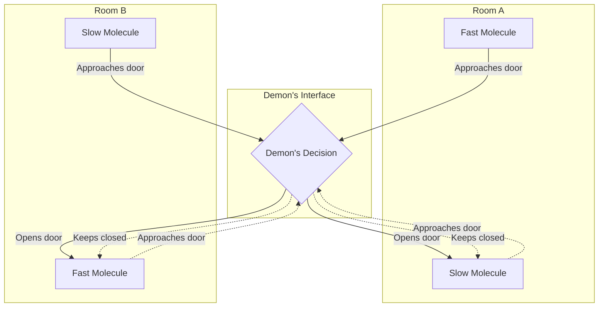
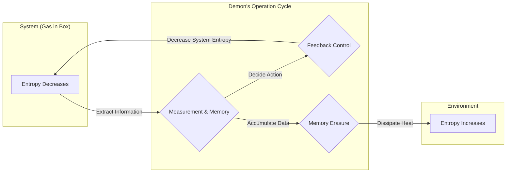

## مقدمة

من أشهر التجارب الفكرية وأكثرها إثارة للجدل في تاريخ الفيزياء هو **[شيطان ماكسويل](https://kenji.blog/ar/p/maxwells-demon/)** (Maxwell's demon). هذا "الشيطان" الذي اقترحه الفيزيائي في القرن التاسع عشر جيمس كلارك ماكسويل (James Clerk Maxwell) عام 1867 أثار حيرة علماء الفيزياء في جميع أنحاء العالم لسنوات عديدة. والسبب هو أن وجود هذا الشيطان يبدو وكأنه يتعارض بشكل مباشر مع **القانون الثاني للديناميكا الحرارية**، وهو أحد أكثر القوانين ثباتًا في الفيزياء والذي يحكم الاتجاه غير العكوس للكون.

إذا كان هذا الشيطان موجودًا حقًا، فسوف نتمكن من استخراج طاقة حرارية لا حصر لها من الهواء وتحويلها إلى شغل لتكوين "آلة الحركة الدائمة من النوع الثاني". وهذا سيعني حل مشكلة الطاقة إلى الأبد، ولكنه يعني في نفس الوقت انهيار أسس قوانين الفيزياء كما نعرفها.

في هذه المقالة، سنشرح بالتفصيل مفارقة [شيطان ماكسويل](https://kenji.blog/ar/p/maxwells-demon/)، وكيف تم حلها بعد حوالي قرن من الزمان باستخدام مفهوم "المعلومات" الذي يبدو للوهلة الأولى غير مرتبط بالفيزياء، مع استخدام الكثير من المعادلات الرياضية والرسوم التوضيحية.

## القانون الثاني للديناميكا الحرارية وقانون زيادة الإنتروبي

لفهم خطر [شيطان ماكسويل](https://kenji.blog/ar/p/maxwells-demon/) بشكل صحيح، دعونا نراجع أولاً أساسيات **القانون الثاني للديناميكا الحرارية** (قانون زيادة الإنتروبي).

ينص القانون الثاني للديناميكا الحرارية على القاعدة المطلقة في الطبيعة: "الإنتروبي (درجة الفوضى) في نظام معزول تزداد دائمًا أو تظل ثابتة". ويُعبّر عن ذلك رياضيًا كالتالي:

$$
\Delta S \ge 0
$$

حيث $S$ هو الإنتروبي و $\Delta S$ هو مقدار التغير في الإنتروبي. تُفسّر الإنتروبي كقياس لـ "العشوائية" أو "الفوضى" في النظام.

قام لودفيغ بولتزمان بربط الإنتروبي بعدد الحالات المجهرية (Microstates) $W$ وصاغ مبدأ بولتزمان الشهير:

$$
S = k_B \ln W
$$

حيث $k_B$ هو ثابت بولتزمان ($1.38 \times 10^{-23} \ \mathrm{J/K}$). وتوضح هذه المعادلة أنه كلما ازداد عدد الحالات المجهرية المحتملة (أي زادت العشوائية)، زادت قيمة الإنتروبي.

كمثال بسيط، فكر في إضافة الحليب البارد إلى قهوة ساخنة في كوب واحد. بمرور الوقت، سيمتزجان بشكل طبيعي ليصبحا قهوة بحليب فاترة. في هذه العملية، يصبح النظام أكثر عشوائية ويزداد الإنتروبي. ومع ذلك، فإن العكس، أي أن تنفصل القهوة بالحليب الفاترة من تلقاء نفسها إلى قهوة ساخنة وحليب بارد، لن يحدث أبدًا. وهكذا، للأحداث الطبيعية اتجاه لا رجعة فيه يُعبر عنه بزيادة الإنتروبي.

## التجربة الفكرية ل[شيطان ماكسويل](https://kenji.blog/ar/p/maxwells-demon/)

في مواجهة هذا القانون الأساسي للفيزياء، اقترح ماكسويل التجربة الفكرية البارعة التالية:

1. يوجد وعاء معزول حرارياً يحتوي على غاز، ومقسّم من المنتصف إلى غرفتين (A و B).
2. في البداية، كلتا الغرفتين في نفس درجة الحرارة، أي أن متوسط الطاقة الحركية لجزيئات الغاز متساوٍ.
3. يوجد ثقب صغير جدًا في الجدار، مزود بـ "باب" يمكن فتحه وإغلاقه دون احتكاك.
4. يقف أمام هذا الباب كائن ذكي قادر على ملاحظة حركة جزيئات الغاز الفردية، وهو **الشيطان**.
5. يفتح الشيطان الباب بسرعة فقط عندما يتجه جزيء سريع (عالي الطاقة) من A إلى B، أو عندما يتجه جزيء بطيء (منخفض الطاقة) من B إلى A. وفي غير ذلك من الحالات، يبقي الباب مغلقًا.

يوضح الرسم التالي عملية عمل الشيطان الماهرة.

ماذا سيحدث مع مرور الوقت؟

بسبب فتح الشيطان وإغلاقه الانتقائي للباب، ستتجمع الجزيئات السريعة فقط في الغرفة B، وتتجمع الجزيئات البطيئة فقط في الغرفة A. وبما أن درجة حرارة الغاز تتناسب طرديًا مع متوسط الطاقة الحركية للجزيئات، فسترتفع درجة حرارة الغرفة B وتنخفض درجة حرارة الغرفة A كنتيجة لذلك.

هذا يعني أنه، دون إضافة أي عمل ميكانيكي (طاقة) من الخارج، تم خلق فرق في درجات الحرارة داخل نظام كان يتمتع بدرجة حرارة موحدة. وإذا كان هناك فرق في درجات الحرارة، فيمكننا استخدام محرك حراري لاستخراج شغل مفيد منه.

بمعنى آخر، لقد انخفض الإنتروبي الكلي في نظام معزول.

$$
\Delta S < 0
$$

كان ماكسويل نفسه يسعى من خلال هذه التجربة الفكرية إلى إظهار أن القانون الثاني للديناميكا الحرارية ليس قانونًا ميكانيكيًا مطلقًا، بل هو فقط "قانون احتمالي يصح فقط عند التعامل إحصائيًا مع عدد كبير من الجزيئات". ولكن، إذا تمكنا من إنشاء كائن كالشيطان اصطناعيًا، فستكتمل "آلة الحركة الدائمة من النوع الثاني". لقد وجه [شيطان ماكسويل](https://kenji.blog/ar/p/maxwells-demon/) تناقضًا واضحًا للقانون الثاني للديناميكا الحرارية.

## محرك زيلارد: الحصول على المعلومات وتحويلها لشغل

لقد أغرقت هذه المفارقة الشيطانية الفيزيائيين في حيرة عميقة لقرن من الزمان. فالشيطان ببساطة يفتح ويغلق الباب (نظريًا، إذا كان الباب بلا كتلة فلا يحتاج إلى طاقة) بناءً على "المعلومات"، ولم يكن واضحًا أبدًا أين يزداد الإنتروبي في النظام.

الخطوة الأولى لحل هذه المعضلة اتخذها الفيزيائي ليو زيلارد (Leo Szilard) عام 1929. ابتكر زيلارد تجربة فكرية مبسطة للغاية تستخلص جوهر [شيطان ماكسويل](https://kenji.blog/ar/p/maxwells-demon/)، سُميت بـ **محرك زيلارد** (Szilard Engine).

يتكون محرك زيلارد من أسطوانة تحتوي على جزيء غاز واحد فقط، وفاصل (مكبس) يمكن إدخاله في المنتصف. الخطوات هي كالتالي:

1. نُدخل فاصلًا في منتصف أسطوانة تحتوي على جزيء غاز واحد.
2. يكتسب الشيطان جزءًا واحدًا (1 بت) من **المعلومات** حول ما إذا كان الجزيء موجودًا في النصف الأيمن أم الأيسر من الفاصل.
3. إذا كان الجزيء في النصف الأيسر، يحرك الشيطان الفاصل إلى اليمين للسماح للجزيء بالقيام بعمل التمدد. وإذا كان في اليمين، يحركه إلى اليسار.
4. من خلال حركة المكبس، يمتص الجزيء الحرارة من الحمام الحراري المحيط، ويحولها إلى شغل ميكانيكي $W$.

في هذه الحالة، يُحسب الشغل $W$ الذي يقوم به الجزيء ليتمدد بدرجة حرارة ثابتة من معادلة الحالة للغاز المثالي كالتالي:

$$
W = \int_{V/2}^{V} p \, dV = \int_{V/2}^{V} \frac{k_B T}{V} \, dV = k_B T \ln 2
$$

أدرك زيلارد أن عملية قيام الشيطان بـ "رصد" حالة النظام و "تذكرها" تخفي علاقة عميقة بين الإنتروبي والمعلومات. واعتبر أن اكتساب المعلومات بحد ذاته يؤدي إلى زيادة الإنتروبي.

## دمج إنتروبي شانون مع الديناميكا الحرارية

في عام 1948، أسس كلود شانون (Claude Shannon) نظرية المعلومات، وعرّف **إنتروبي المعلومات** (Shannon entropy) لتمثيل عدم اليقين في المعلومات. يتم حساب الإنتروبي $H$ لمصدر معلومات يتبع توزيع احتمالي $P(x)$ كالتالي:

$$
H = - \sum_{x} P(x) \log_2 P(x) \quad \mathrm{(bits)}
$$

بشكل مذهل، اتخذت معادلة إنتروبي المعلومات لشانون نفس شكل معادلة الإنتروبي الديناميكي الحراري لبولتزمان، باستثناء ثابت التناسب. منذ هذه اللحظة، بدأ الدمج الحقيقي بين "المعلومات" و"الديناميكا الحرارية".

## مبدأ لانداور: المعلومات فيزيائية

دفع رولف لانداور (Rolf Landauer) عام 1961 والأبحاث اللاحقة لـ تشارلز بينيت (Charles Bennett) بتبصرات زيلارد ونظرية معلومات شانون إلى الأمام، وحلوا المفارقة بالكامل في النهاية.

أكد لانداور بشدة أن "المعلومات فيزيائية". تخزين المعلومات ونقلها ومعالجتها لا يحدث في فضاء تجريدي، بل يعتمد دائمًا على كيانات مادية (أجهزة)، ويخضع لقوانين الفيزياء.

ينص المبدأ بالغ الأهمية الذي اكتشفه لانداور، وهو **مبدأ لانداور** (Landauer's Principle)، على أنه "عند **محو** المعلومات، تُطلق حرارة بالضرورة إلى البيئة، ويزداد إنتروبي البيئة".

الحد الأدنى للطاقة اللازمة لمحو بت واحد من المعلومات بالكامل (الحرارة المنبعثة) $Q$ تُعطى بالصيغة التالية:

$$
Q \ge k_B T \ln 2
$$

وما يصاحب ذلك من زيادة في إنتروبي البيئة $\Delta S_{erase}$ هو:

$$
\Delta S_{erase} \ge k_B \ln 2
$$

من الممكن نظريًا "كتابة" أو "حساب" المعلومات دون استهلاك أي طاقة. ومع ذلك، لا بد من دفع ثمن ديناميكي حراري عند القيام بعملية غير عكسية مثل "النسيان" أو "محو" المعلومات.

## موت [شيطان ماكسويل](https://kenji.blog/ar/p/maxwells-demon/) ونهاية المفارقة

في عام 1982، باستخدام مبدأ لانداور، أصدر تشارلز بينيت الضربة القاضية لمفارقة [شيطان ماكسويل](https://kenji.blog/ar/p/maxwells-demon/) أخيرًا.

منطق بينيت كان كالتالي:

1. يلاحظ الشيطان سرعة وموقع جزيئات الغاز ويسجلها في دماغه (أو في ذاكرته الفيزيائية).
2. بناءً على المعلومات المسجلة، يفتح ويغلق الباب. هذه العمليات السابقة يمكن أن تتم نظريًا دون زيادة الإنتروبي إذا كانت قابلة للعكس.
3. لكن سعة ذاكرة الشيطان محدودة. ومن أجل الاستمرار في فرز الجزيئات إلى الأبد، يجب عليه في مرحلة ما **محو** الذكريات القديمة وإعادة تعيين الذاكرة.
4. وفقًا لمبدأ لانداور، في اللحظة التي يمحو فيها الشيطان بتًا واحدًا من المعلومات، تُنبعث حتمًا حرارة بمقدار $k_B T \ln 2$ أو أكثر إلى البيئة، ويزداد إنتروبي البيئة.

بعبارة أخرى، حتى لو قلّل الشيطان من الإنتروبي داخل الصندوق من خلال فرز الجزيئات، فإنه عندما يقوم بمحو ذاكرته للحفاظ على تشغيل النظام، تحدث زيادة في الإنتروبي في البيئة الخارجية تفوق هذا النقصان.

إذا نظرنا إلى النظام بأكمله، فإن إجمالي التغير في الإنتروبي سيكون دائمًا صفرًا أو أكبر.

$$
\Delta S_{total} = \Delta S_{gas} + \Delta S_{memory\_erasure} \ge 0
$$

كلما زاد ذكاء الشيطان لتقليل الفوضى داخل الصندوق، تراكمت الفوضى المعروفة باسم المعلومات في دماغ الشيطان. وفي اللحظة التي يحاول فيها تنظيم (محو) دماغه، تتبدد هذه الفوضى كحرارة في الكون.

## الديناميكا الحرارية للمعلومات وتطوراتها المستقبلية

أوضحت مفارقة [شيطان ماكسويل](https://kenji.blog/ar/p/maxwells-demon/) أن المفهوم المجرد "المعلومات" والمفاهيم الفيزيائية "الطاقة" و"الإنتروبي" هي في النهاية متكافئة ومترابطة ارتباطًا وثيقًا.

ويتطور هذا الاكتشاف العظيم حاليًا بوتيرة متسارعة كواجهة فيزيائية جديدة تُعرف باسم **الديناميكا الحرارية للمعلومات** (Information Thermodynamics) أو **الميكانيكا الإحصائية لعدم التوازن** (Nonequilibrium Statistical Mechanics).

في السنوات الأخيرة، يتم دراسة كيف تعمل الآلات الجزيئية البيولوجية العاملة داخل الخلايا (مثل بوليميراز الحمض النووي وكينيسين) بكفاءة لتحويل الطاقة باستخدام المعلومات لخلق حركة أحادية الاتجاه تمامًا مثل [شيطان ماكسويل](https://kenji.blog/ar/p/maxwells-demon/). فأساسيات ظواهر الحياة مرتبطة ارتباطًا وثيقًا بقوانين الديناميكا الحرارية للمعلومات.

بالإضافة إلى ذلك، يُعتبر حد لانداور (وهو حد الطاقة المطلق لمعالجة المعلومات) الأساس النظري الأكثر أهمية عند النظر في تقليل استهلاك الطاقة للحواسيب المستقبلية. لاختراق الجدار الفيزيائي المتمثل في توليد الحرارة الأساسية المصاحب لمحو المعلومات، تجري أبحاث على "الحوسبة العكسية" (Reversible Computing) التي لا تمحو المعلومات.

## الخاتمة

أصبح الشيطان الصغير الذي أطلقه ماكسويل في القرن التاسع عشر من أجمل التجارب الفكرية وأعمقها في علم الفيزياء. فقد بدأ كتحدٍ جريء سعى إلى تحطيم القانون الثاني للديناميكا الحرارية، وأسفر في نهاية المطاف عن اختراق غير متوقع أوضح "الواقع الفيزيائي للمعلومات".

"أن تعرف" و"أن تنسى".

في قلب معالجة المعلومات التي نقوم بها يوميًا، تراقبنا دائمًا الديناميكا الحرارية التي تمثل القانون الأساسي للكون. فـ **المعلومات** و **الطاقة** وجهان لعملة واحدة. وهذا الرابط العميق سيستمر في إحداث ثورات جديدة في مختلف المجالات في المستقبل. وحتى بعد وفاته، لا يزال [شيطان ماكسويل](https://kenji.blog/ar/p/maxwells-demon/) يفتح لنا أبوابًا جديدة للمعرفة.
