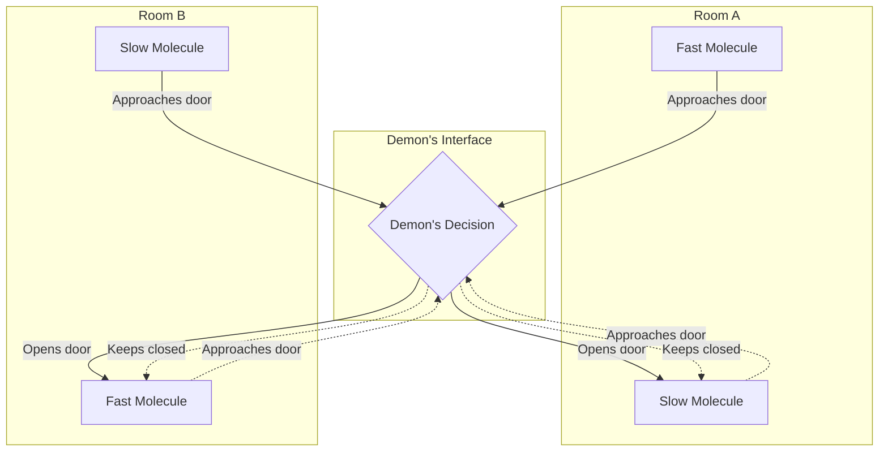
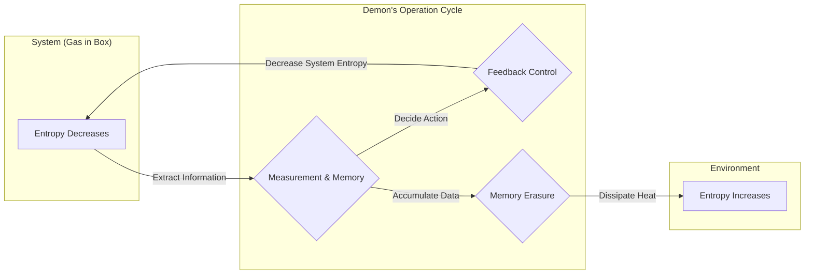

## Einleitung

In der Geschichte der Physik ist **[Maxwells Dämon](https://kenji.blog/de/p/maxwells-demon/)** (Maxwell's demon) eines der berühmtesten und meistdiskutierten Gedankenexperimente. Dieser „Dämon“, der 1867 vom Physiker James Clerk Maxwell vorgeschlagen wurde, hat Physiker auf der ganzen Welt viele Jahre lang geplagt. Denn die Existenz dieses Dämons schien eines der stärksten Gesetze der Physik direkt zu brechen: den **Zweiten Hauptsatz der Thermodynamik**, der die Irreversibilität des Universums definiert.

Wenn dieser Dämon in der Realität existieren würde, könnten wir unendlich viel Wärmeenergie aus der Luft extrahieren und in Arbeit umwandeln, wodurch wir ein „Perpetuum mobile zweiter Art“ erschaffen würden. Dies würde bedeuten, dass unsere Energieprobleme für immer gelöst wären, aber gleichzeitig würden die Prämissen der uns bekannten physikalischen Gesetze zusammenbrechen.

In diesem Artikel werden wir ausführlich mit Formeln und Diagrammen erläutern, welches Paradoxon [Maxwells Dämon](https://kenji.blog/de/p/maxwells-demon/) aufzeigte und wie dieses Paradoxon nach etwa einem Jahrhundert durch das scheinbar nicht mit der Physik verwandte Konzept der „Information“ gelöst wurde.

## Der Zweite Hauptsatz der Thermodynamik und das Gesetz der Entropiezunahme

Um die Bedrohung durch [Maxwells Dämon](https://kenji.blog/de/p/maxwells-demon/) richtig zu verstehen, betrachten wir zunächst die Grundlagen des **Zweiten Hauptsatzes der Thermodynamik** (Gesetz der Entropiezunahme).

Der Zweite Hauptsatz der Thermodynamik ist eine absolute Regel der Natur: „Die Entropie (das Maß für Unordnung) in einem isolierten System nimmt immer zu oder bleibt konstant.“ In einer Formel ausgedrückt sieht dies wie folgt aus:

$$
\Delta S \ge 0
$$

Hierbei ist $S$ die Entropie und $\Delta S$ die Änderung der Entropie. Die Entropie wird als Maß für die „Unordnung“ eines Systems interpretiert.

Ludwig Boltzmann verband die Entropie mit der Anzahl der mikroskopischen Zustände (Möglichkeiten) $W$ und formulierte das berühmte Boltzmann-Prinzip:

$$
S = k_B \ln W
$$

Hierbei ist $k_B$ die Boltzmann-Konstante ($1.38 \times 10^{-23} \ \mathrm{J/K}$). Diese Gleichung zeigt, dass die Entropie umso größer ist, je größer die Anzahl der möglichen mikroskopischen Zustände ist (d. h. je unordentlicher das System ist).

Als alltägliches Beispiel betrachten wir heißen Kaffee und kalte Milch, die in dieselbe Tasse gegossen werden. Im Laufe der Zeit mischen sich beide auf natürliche Weise und ergeben lauwarmen Milchkaffee. Dabei wird das System unordentlicher, und die Entropie nimmt zu. Das Gegenteil jedoch, dass lauwarmer Milchkaffee sich spontan wieder in heißen Kaffee und kalte Milch trennt, passiert absolut nie. Es gibt eine irreversible Richtung in den Phänomenen der Natur, und dies drückt sich in Form der Zunahme der Entropie aus.

## Das Gedankenexperiment von [Maxwells Dämon](https://kenji.blog/de/p/maxwells-demon/)

Angesichts dieses fundamentalen Gesetzes der Physik schlug Maxwell folgendes raffiniertes Gedankenexperiment vor:

1. Ein Gas befindet sich in einem isolierten Behälter, der in der Mitte durch eine Wand in zwei Räume (A und B) unterteilt ist.
2. Zunächst haben beide Räume die gleiche Temperatur, was bedeutet, dass die durchschnittliche kinetische Energie der Gasmoleküle gleich ist.
3. In der Wand gibt es ein winziges Loch mit einer „Tür“, die reibungsfrei geöffnet und geschlossen werden kann.
4. Vor dieser Tür steht eine intelligente Entität, die die Bewegungen einzelner Gasmoleküle beobachten kann. Das ist der **Dämon**.
5. Der Dämon öffnet die Tür schnell nur dann, wenn sich ein schnelles (energiereiches) Molekül von A nach B bewegt, oder wenn sich ein langsames (energiearmes) Molekül von B nach A bewegt. Zu allen anderen Zeiten hält er die Tür geschlossen.

Dieser kluge Arbeitsprozess des Dämons wird im folgenden Diagramm veranschaulicht:

Was passiert im Laufe der Zeit?

Durch das selektive Öffnen und Schließen der Tür durch den Dämon sammeln sich im Raum B allmählich nur die schnellen Moleküle, und im Raum A nur die langsamen Moleküle. Da die Gastemperatur proportional zur durchschnittlichen kinetischen Energie der Moleküle ist, steigt die Temperatur im Raum B, während sie im Raum A sinkt.

Das bedeutet, dass in einem System mit einheitlicher Temperatur ein Temperaturunterschied entstanden ist, ohne dass von außen mechanische Arbeit (Energie) zugeführt wurde. Wenn ein Temperaturunterschied besteht, kann man mithilfe einer Wärmekraftmaschine nützliche Arbeit daraus gewinnen.

Letztendlich bedeutet dies, dass die Entropie des gesamten isolierten Systems abgenommen hat!

$$
\Delta S < 0
$$

Maxwell selbst wollte durch dieses Gedankenexperiment zeigen, dass der Zweite Hauptsatz der Thermodynamik kein absolutes mechanisches Gesetz ist, sondern nur „ein probabilistisches Gesetz, das nur bei der statistischen Betrachtung einer großen Anzahl von Molekülen gilt“. Aber wenn wir ein solches Dämonen-ähnliches Wesen künstlich erschaffen könnten, wäre ein „Perpetuum mobile zweiter Art“ perfekt. [Maxwells Dämon](https://kenji.blog/de/p/maxwells-demon/) stellte einen klaren Widerspruch zum Zweiten Hauptsatz der Thermodynamik dar.

## Szilárds Maschine: Informationsbeschaffung und Arbeitsumwandlung

Das Paradoxon des Dämons hielt die Physiker ein ganzes Jahrhundert lang in tiefer Verzweiflung gefangen. Denn der Dämon bedient lediglich eine Tür (die theoretisch ohne Masse ist und somit keine Energie zum Öffnen/Schließen benötigt) auf der Grundlage von Informationen, und es war überhaupt nicht klar, wo im System die Entropie zunehmen sollte.

Den ersten Schritt zur Lösung dieses Rätsels tat der Physiker Leó Szilárd im Jahr 1929. Szilárd konzipierte ein extrem vereinfachtes Gedankenexperiment, **Szilárds Maschine**, das das Wesen von [Maxwells Dämon](https://kenji.blog/de/p/maxwells-demon/) auf den Punkt brachte.

Szilárds Maschine besteht aus einem Zylinder, der nur ein einziges Gasmolekül enthält, und einer Trennwand (Kolben), die in die Mitte eingeschoben werden kann. Das Verfahren ist wie folgt:

1. Eine Trennwand wird in die Mitte des Zylinders eingeführt, der ein einziges Gasmolekül enthält.
2. Der Dämon beschafft sich die 1-Bit-**Information**, ob sich das Molekül in der rechten oder der linken Hälfte der Trennwand befindet.
3. Befindet sich das Molekül auf der linken Seite, bewegt sich die Trennwand nach rechts und lässt das Molekül Expansionsarbeit verrichten. Befindet es sich rechts, bewegt sich die Trennwand nach links.
4. Durch die Bewegung des Kolbens absorbiert das Molekül Wärme aus dem umgebenden Wärmebad und wandelt sie in mechanische Arbeit $W$ um.

Die Arbeit $W$, die das Molekül durch isotherme Expansion an die Umgebung leistet, berechnet sich aus der idealen Gasgleichung wie folgt:

$$
W = \int_{V/2}^{V} p \, dV = \int_{V/2}^{V} \frac{k_B T}{V} \, dV = k_B T \ln 2
$$

Szilárd durchschaute, dass in dem Prozess, bei dem der Dämon den Systemzustand „beobachtet“ und „speichert“, eine tiefe Beziehung zwischen Entropie und Information verborgen liegt. Er glaubte, dass allein der Akt des Erlangens von Informationen die Entropie erhöht.

## Die Verschmelzung von Shannon-Entropie und Thermodynamik

Im Jahr 1948 begründete Claude Shannon die Informationstheorie und definierte die **Informationsentropie** (Shannon-Entropie), die die Unsicherheit von Informationen darstellt. Die Entropie $H$ einer Informationsquelle, die einer Wahrscheinlichkeitsverteilung $P(x)$ folgt, wird ausgedrückt als:

$$
H = - \sum_{x} P(x) \log_2 P(x) \quad \mathrm{(bits)}
$$

Erstaunlicherweise hatte die Formel für Shannons Informationsentropie genau dieselbe Form wie die Formel für Boltzmanns thermodynamische Entropie (abgesehen von der Konstante). Zu diesem Zeitpunkt begann die vollständige Verschmelzung von „Information“ und „Thermodynamik“.

## Das Landauer-Prinzip: Information ist physikalisch

Rolf Landauer (1961) und später Charles Bennett führten die Erkenntnisse von Szilárd und die Informationstheorie von Shannon noch weiter und brachten das Paradoxon schließlich zur endgültigen Lösung.

Landauer vertrat nachdrücklich die Ansicht: „Information ist physikalisch.“ Die Speicherung, Übertragung und Manipulation von Informationen findet nicht in einem abstrakten Raum statt, sondern ist immer auf physische Entitäten (Hardware) angewiesen und unterliegt physikalischen Gesetzen.

Ein äußerst wichtiges Prinzip, das Landauer entdeckte, ist das **Landauer-Prinzip**: „Beim **Löschen** von Informationen wird unweigerlich Wärme an die Umgebung abgegeben, und die Entropie der Umgebung nimmt zu.“

Die minimale Energie (abgegebene Wärme) $Q$, die erforderlich ist, um 1 Bit Information vollständig zu löschen, wird durch folgende Formel gegeben:

$$
Q \ge k_B T \ln 2
$$

Die damit einhergehende Zunahme der Umgebungsentropie $\Delta S_{erase}$ ist:

$$
\Delta S_{erase} \ge k_B \ln 2
$$

Das „Schreiben“ oder „Berechnen“ von Informationen kann im Prinzip durchgeführt werden, ohne Energie zu verbrauchen. Bei irreversiblen Operationen wie dem „Vergessen“ oder „Löschen“ von Informationen muss jedoch ein thermodynamischer Preis bezahlt werden.

## Der Tod von [Maxwells Dämon](https://kenji.blog/de/p/maxwells-demon/) und das Ende des Paradoxons

Im Jahr 1982 lieferte Charles Bennett mithilfe des Landauer-Prinzips schließlich den ultimativen Schlag gegen das Paradoxon von [Maxwells Dämon](https://kenji.blog/de/p/maxwells-demon/).

Bennetts Logik lautet wie folgt:

1. Der Dämon beobachtet die Geschwindigkeit und Position der Gasmoleküle und zeichnet sie in seinem eigenen Gehirn (oder einem physischen Speicher) auf.
2. Basierend auf den aufgezeichneten Informationen öffnet und schließt er die Tür. Bis zu diesem Punkt können diese Prozesse im Prinzip (wenn sie reversibel sind) ohne eine Erhöhung der Entropie durchgeführt werden.
3. Aber die Speicherkapazität des Dämons ist begrenzt. Um die Moleküle ewig weiter zu sortieren, muss der Dämon irgendwann alte Erinnerungen **löschen** und den Speicher zurücksetzen.
4. Nach dem Landauer-Prinzip wird in dem Moment, in dem der Dämon 1 Bit Information löscht, notwendigerweise Wärme von $k_B T \ln 2$ oder mehr an die Umgebung abgegeben, was die Entropie der Umgebung erhöht.

Mit anderen Worten: Selbst wenn der Dämon die Moleküle so sortiert, dass die Entropie in der Kiste abnimmt, kommt es in dem Moment, in dem der Dämon seinen Speicher löscht, um das System am Laufen zu halten, notwendigerweise zu einer Zunahme der Entropie in der Außenwelt, die diese Abnahme übersteigt.

Betrachtet man das Gesamtsystem, ist die Änderung der Gesamtentropie immer null oder größer.

$$
\Delta S_{total} = \Delta S_{gas} + \Delta S_{memory\_erasure} \ge 0
$$

Je klüger der Dämon handelt, um die Unordnung in der Kiste zu reduzieren, desto mehr Unordnung namens Information sammelt sich im Kopf des Dämons an. Und in dem Moment, in dem er versucht, das Chaos in seinem Kopf zu beseitigen (zu löschen), verwandelt sich diese Unordnung in Wärme und wird im Universum verstreut.

## Informationsthermodynamik und Entwicklungen für die Zukunft

Das Paradoxon von [Maxwells Dämon](https://kenji.blog/de/p/maxwells-demon/) offenbarte, dass das abstrakte Konzept der „Information“ und die physikalischen Konzepte von „Energie“ und „Entropie“ letztlich äquivalent und eng miteinander verbunden sind.

Diese großartige Entdeckung entwickelt sich derzeit rasant zu einer neuen Grenze in der Physik, der **Informationsthermodynamik** und der **Nichtgleichgewichtsstatistik**.

In den letzten Jahren wurde erforscht, wie biomolekulare Maschinen (wie DNA-Polymerase oder Kinesin), die in Zellen von Lebewesen arbeiten, ähnlich wie [Maxwells Dämon](https://kenji.blog/de/p/maxwells-demon/) Informationen nutzen, um Energie effizient umzuwandeln und gerichtete Bewegungen zu erzeugen. Die Gesetze der Informationsthermodynamik sind auch tief in den Grundlagen der Lebensphänomene verwurzelt.

Zusätzlich bildet das Landauer-Limit, das die ultimative energetische Grenze für die Informationsverarbeitung darstellt, die wichtigste theoretische Basis, wenn es darum geht, in Zukunft noch stromsparendere Computer zu entwickeln. Um die physikalische Wand der grundlegenden Wärmeerzeugung beim Löschen von Informationen zu durchbrechen, wird auch intensiv an „Reversiblem Computing“ (bei dem keine Informationen gelöscht werden) geforscht.

## Schlusswort

Der kleine Dämon, den Maxwell im 19. Jahrhundert erschaffen hat, wurde zu einem der schönsten und tiefgreifendsten Gedankenexperimente in der Physik. Was als gewagte Herausforderung an den Zweiten Hauptsatz der Thermodynamik begann, führte letztendlich zu dem unerwarteten Durchbruch, die „physikalische Realität von Information“ aufzudecken.

Das „Wissen“ und das „Vergessen“.

Hinter der Informationsverarbeitung, die wir tagtäglich durchführen, behält die Thermodynamik als grundlegendes Gesetz des Universums immer alles im Blick. **Information** und **Energie** sind zwei Seiten derselben Medaille. Diese tiefe Verbindung wird auch in Zukunft noch viele Revolutionen in verschiedenen Bereichen auslösen. [Maxwells Dämon](https://kenji.blog/de/p/maxwells-demon/) öffnet uns auch nach seinem Tod weiterhin die Türen zu neuen Erkenntnissen.
