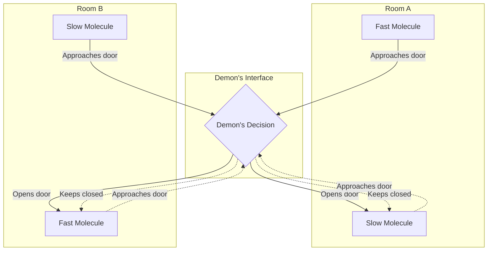
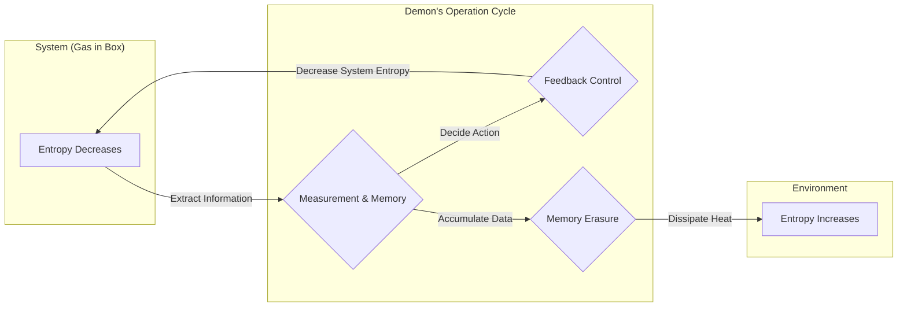

## Introduction

In the history of physics, one of the most famous and most debated thought experiments is **[Maxwell's Demon](https://kenji.blog/p/maxwells-demon/)**. This "demon," proposed in 1867 by the 19th-century physicist James Clerk Maxwell, has greatly troubled physicists around the world for many years. This is because the existence of this demon seemed to directly break the **Second Law of Thermodynamics**, one of the most robust laws in physics that dictates the irreversibility of the universe.

If this demon truly existed, we would be able to extract infinite heat energy from the air and convert it into work, creating a "perpetual motion machine of the second kind." That would mean the eternal solution to our energy problems, but at the same time, it would mean the collapse of the premises of the physical laws as we know them.

In this article, we will explain in detail what kind of paradox Maxwell's demon presented, and how, after about a century, it was solved by a concept that seems unrelated to physics at first glance: "information," using plenty of formulas and diagrams.

## The Second Law of Thermodynamics and the Law of Increasing Entropy

To correctly understand the threat of Maxwell's demon, let's first look back at the basics of the **Second Law of Thermodynamics** (the law of increasing entropy).

The Second Law of Thermodynamics is an absolute rule of the natural world stating that "the entropy (degree of randomness) in an isolated system always increases or remains constant." Expressed as a formula, it is as follows:

$$
\Delta S \ge 0
$$

Here, $S$ represents entropy, and $\Delta S$ represents the amount of change in entropy. Entropy is interpreted as a measure to gauge the "randomness" or "disorder" of a system.

Ludwig Boltzmann linked entropy to the number of microscopic states (number of cases) $W$, and formulated the famous Boltzmann's principle:

$$
S = k_B \ln W
$$

Here, $k_B$ is the Boltzmann constant ($1.38 \times 10^{-23} \ \mathrm{J/K}$). This formula indicates that the greater the number of possible microscopic states (the more random it is), the larger the entropy becomes.

As a familiar example, consider pouring hot coffee and cold milk into the same cup. Over time, they naturally mix together, becoming lukewarm café au lait. In this process, the system becomes more disordered, and entropy increases. However, the reverse—that is, the lukewarm café au lait spontaneously separating into hot coffee and cold milk—will absolutely never happen. In this way, natural phenomena have an irreversible directionality, which is expressed in the form of increasing entropy.

## The Thought Experiment of [Maxwell's Demon](https://kenji.blog/p/maxwells-demon/)

Against this law, which forms the foundation of physics, Maxwell proposed the following ingenious thought experiment.

1. A gas is contained in an insulated vessel, which is divided into two rooms (A and B) by a wall in the center.
2. Initially, both rooms are at the same temperature, meaning the average kinetic energy of the gas molecules is equal.
3. There is a very small hole in the wall, equipped with a "door" that can be opened and closed without friction.
4. In front of this door, there is an intelligent being that can observe the movement of individual gas molecules; this is the **demon**.
5. The demon quickly opens the door only when a fast-moving (high energy) molecule is heading from A to B, or when a slow-moving (low energy) molecule is heading from B to A. Otherwise, it keeps the door closed.

The demon's ingenious work process is shown in the diagram below.

What exactly will happen as time passes?

Due to the demon's selective opening and closing of the door, only fast molecules will gather in Room B, and only slow molecules will gather in Room A. Since the temperature of a gas is proportional to the average kinetic energy of its molecules, the result is that the temperature of Room B rises, and the temperature of Room A falls.

This means that a temperature difference has been created in a system that was at a uniform temperature, without adding any mechanical work (energy) from the outside. If there is a temperature difference, useful work can be extracted from it using a heat engine.

In other words, the total entropy in an isolated system has decreased.

$$
\Delta S < 0
$$

Through this thought experiment, Maxwell himself tried to show that the Second Law of Thermodynamics is not an absolute mechanical law, but a "probabilistic law that holds only when treating a large number of molecules statistically." However, if a being like this demon could be artificially created, a "perpetual motion machine of the second kind" would be completed. Maxwell's demon presented a clear contradiction to the Second Law of Thermodynamics.

## Szilard's Engine: Information Acquisition and Work Conversion

This demon's paradox plunged physicists into deep distress for a whole century. The demon was simply performing an operation of opening and closing a door based on information (theoretically requiring no energy if it were a massless door), and it was completely unknown where in the system the entropy was increasing.

The first step toward solving this difficult problem was taken by the physicist Leo Szilard in 1929. Szilard devised an extremely simplified thought experiment, **Szilard's Engine**, which extracted the essence of Maxwell's demon.

Szilard's engine consists of a cylinder containing a single gas molecule and a partition (piston) that can be inserted in the center. The procedure is as follows:

1. A partition is inserted into the center of a cylinder containing one molecule of gas.
2. The demon acquires 1 bit of **information** regarding whether the molecule is on the right or left side of the partition.
3. If the molecule is on the left side, the partition is moved to the right to let the molecule perform expansion work. If it is on the right side, it is moved to the left.
4. By moving the piston, the molecule absorbs heat from the surrounding heat bath and converts it into mechanical work $W$.

At this time, the work $W$ done by the molecule on the outside due to isothermal expansion is calculated from the ideal gas equation of state as follows:

$$
W = \int_{V/2}^{V} p \, dV = \int_{V/2}^{V} \frac{k_B T}{V} \, dV = k_B T \ln 2
$$

Szilard saw that a profound relationship between entropy and information lies in the very process of the demon "observing" the state of the system and "remembering" it. He considered that acquiring information itself increases entropy.

## Fusion of Shannon Entropy and Thermodynamics

In 1948, Claude Shannon founded information theory and defined **Information Entropy** (Shannon entropy) to express the uncertainty of information. The entropy $H$ of an information source following a probability distribution $P(x)$ is expressed as follows:

$$
H = - \sum_{x} P(x) \log_2 P(x) \quad \mathrm{(bits)}
$$

Surprisingly, the formula for Shannon's information entropy took the exact same form as the formula for Boltzmann's thermodynamic entropy, except for a constant coefficient. From this point on, the fusion of "information" and "thermodynamics" began in earnest.

## Landauer's Principle: Information is Physical

It was the research of Rolf Landauer in 1961, and later Charles Bennett, that pushed Szilard's insight and Shannon's information theory further, ultimately leading to the complete resolution of the paradox.

Landauer strongly argued that "information is physical." The storage, transmission, and manipulation of information do not occur in an abstract space, but inevitably depend on physical entities (hardware) and are subject to the laws of physics.

The extremely important principle discovered by Landauer, namely **Landauer's Principle**, is that "when information is **erased**, heat is invariably dissipated into the environment, and the entropy of the environment increases."

The minimum energy (dissipated heat) $Q$ required to completely erase 1 bit of information is given by the following formula:

$$
Q \ge k_B T \ln 2
$$

The accompanying increase in the entropy of the environment $\Delta S_{erase}$ is as follows:

$$
\Delta S_{erase} \ge k_B \ln 2
$$

"Writing" or "computing" information can, in principle, be done without consuming energy. However, in the irreversible operation of "forgetting" or "erasing" information, a thermodynamic price must invariably be paid.

## The Death of [Maxwell's Demon](https://kenji.blog/p/maxwells-demon/) and the End of the Paradox

In 1982, Charles Bennett used Landauer's principle to finally lay Maxwell's demon's paradox to rest.

Bennett's logic is as follows:

1. The demon observes the velocity and position of gas molecules and records them in its brain (or physical memory).
2. Based on the recorded information, it opens and closes the door. The operations up to this point, if reversible, can theoretically be performed without increasing entropy.
3. However, the demon's memory capacity has limits. To continue sorting molecules forever, it must eventually **erase** old memories somewhere and reset the memory.
4. According to Landauer's principle, the moment the demon erases 1 bit of information, heat of $k_B T \ln 2$ or more is inevitably dissipated into the environment, and the entropy of the environment increases.

In other words, even if the entropy inside the box decreased due to the demon sorting the molecules, when the demon erases its own memory to keep the system running continuously, an even greater increase in entropy inevitably occurs in the external environment.

Looking at the system as a whole, the total change in entropy is always zero or greater.

$$
\Delta S_{total} = \Delta S_{gas} + \Delta S_{memory\_erasure} \ge 0
$$

The more cleverly the demon behaves to reduce the disorder inside the box, the more disorder in the name of information accumulates inside the demon's head. And the moment it tries to organize (erase) the inside of its head, that disorder turns into heat and is scattered into the universe.

## Information Thermodynamics and Expansion into the Future

The paradox of Maxwell's demon clarified that the abstract concept of "information" and the physical concepts of "energy" and "entropy" are ultimately equivalent and closely linked.

This grand discovery is currently developing rapidly as a new frontier of physics known as **Information Thermodynamics** and **Nonequilibrium Statistical Mechanics**.

In recent years, researchers have been studying the mechanisms by which biomolecular machines such as DNA polymerase and kinesin, which operate inside the cells of living organisms, use information to efficiently convert energy and produce unidirectional movement, much like Maxwell's demon. The laws of information thermodynamics are deeply involved in the very foundations of biological phenomena.

Furthermore, the Landauer limit, which is the ultimate energy limit for information processing, has become the most important theoretical foundation for considering the power saving of computers in the future. In order to break through the physical barrier of fundamental heat generation associated with information erasure, research into "reversible computing," which does not erase information, is also progressing.

## Conclusion

The little demon unleashed by Maxwell in the 19th century became one of the most beautiful and profound thought experiments in physics. It began as a bold challenge attempting to destroy the Second Law of Thermodynamics, and as a result, brought about an unexpected breakthrough by clarifying the "physical reality of information."

To "know" and to "forget."

Behind the information processing we do on a daily basis, thermodynamics, a fundamental law of the universe, is always keeping a watchful eye. **Information** and **energy** are two sides of the same coin. This profound connection will surely continue to spark new revolutions in various fields. Even after its death, Maxwell's demon continues to open new doors of knowledge for us.
