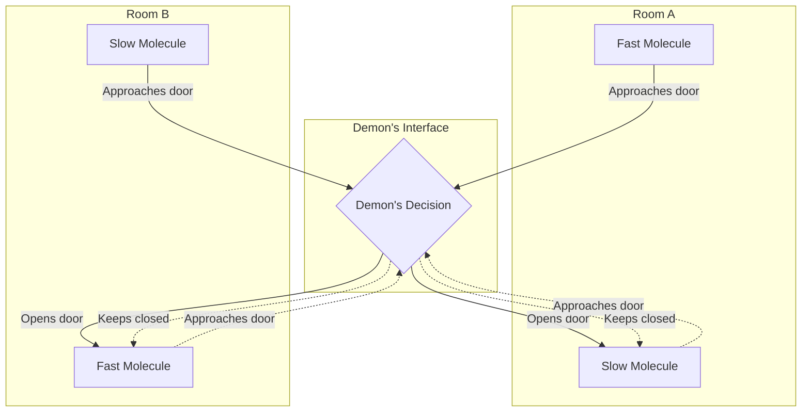
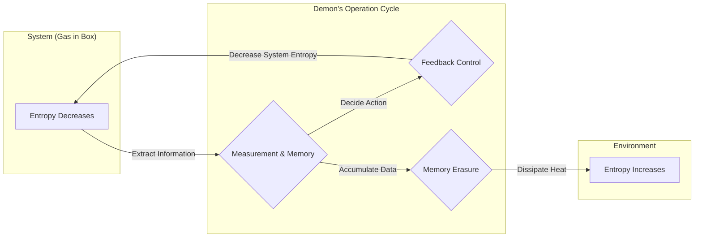

## Introducción

En la historia de la física, uno de los experimentos mentales más famosos y que más debates ha generado es el del **Demonio de Maxwell**. Este "demonio", propuesto por el físico del siglo XIX James Clerk Maxwell en 1867, ha desconcertado profundamente a los físicos de todo el mundo durante muchos años. ¿La razón? La existencia de este demonio parecía violar frontalmente una de las leyes más sólidas de la física, la **Segunda Ley de la Termodinámica**, que dictamina la irreversibilidad del universo.

Si este demonio existiera realmente, seríamos capaces de extraer energía térmica infinita del aire y convertirla en trabajo, creando así una "máquina de movimiento perpetuo de segunda especie". Esto significaría que los problemas de energía se resolverían para siempre, pero al mismo tiempo significaría el colapso de las premisas de las leyes físicas tal como las conocemos.

En este artículo, explicaremos en detalle, utilizando abundantes fórmulas y diagramas, qué tipo de paradoja presentaba el demonio de Maxwell, y cómo, después de aproximadamente un siglo, fue resuelta por el concepto de "información", un concepto que a primera vista parece no tener relación con la física.

## La Segunda Ley de la Termodinámica y la Ley del Aumento de la Entropía

Para comprender correctamente la amenaza que supone el demonio de Maxwell, repasemos primero los fundamentos de la **Segunda Ley de la Termodinámica** (la ley del aumento de la entropía).

La Segunda Ley de la Termodinámica es una regla absoluta del mundo natural que establece: "La entropía (el grado de desorden) en un sistema aislado siempre aumenta o se mantiene constante". Expresado matemáticamente, esto es:

$$
\Delta S \ge 0
$$

Aquí, $S$ representa la entropía y $\Delta S$ representa el cambio en la entropía. La entropía se interpreta como una medida del "desorden" o "caos" de un sistema.

Ludwig Boltzmann relacionó la entropía con el número de estados microscópicos (el número de casos posibles) $W$, y formuló el famoso principio de Boltzmann:

$$
S = k_B \ln W
$$

Aquí, $k_B$ es la constante de Boltzmann ($1.38 \times 10^{-23} \ \mathrm{J/K}$). Esta fórmula indica que cuantos más estados microscópicos posibles haya (mayor desorden), mayor será la entropía.

Como ejemplo cotidiano, imaginemos poner café caliente y leche fría en la misma taza. Con el tiempo, se mezclarán naturalmente y se convertirán en un café con leche tibio. En este proceso, el sistema se vuelve más desordenado y la entropía aumenta. Sin embargo, lo contrario, es decir, que el café con leche tibio se separe espontáneamente en café caliente y leche fría, nunca sucederá. De esta manera, los fenómenos del mundo natural tienen una direccionalidad irreversible, que se expresa en forma de aumento de la entropía.

## El experimento mental del demonio de Maxwell

Frente a esta ley que forma la base de la física, Maxwell propuso el siguiente ingenioso experimento mental.

1. Un gas está contenido en un recipiente aislado térmicamente, dividido en dos habitaciones (A y B) por una pared central.
2. Inicialmente, ambas habitaciones están a la misma temperatura, es decir, la energía cinética promedio de las moléculas de gas es igual.
3. En la pared hay un agujero minúsculo con una "puerta" que se puede abrir y cerrar sin fricción.
4. Frente a esta puerta hay un ser inteligente capaz de observar el movimiento de las moléculas de gas individuales; este es el **demonio**.
5. El demonio abre rápidamente la puerta solo cuando una molécula que se mueve rápido (alta energía) va de A hacia B, o cuando una molécula que se mueve lento (baja energía) va de B hacia A. El resto del tiempo mantiene la puerta cerrada.

El ingenioso proceso de trabajo de este demonio se muestra en el siguiente diagrama.

¿Qué pasará a medida que pase el tiempo?

Debido a la apertura y cierre selectivos de la puerta por parte del demonio, las moléculas rápidas se acumularán en la habitación B, y las moléculas lentas se acumularán en la habitación A. Como la temperatura del gas es proporcional a la energía cinética promedio de las moléculas, como resultado, la temperatura de la habitación B aumentará y la temperatura de la habitación A disminuirá.

Esto significa que se ha creado una diferencia de temperatura dentro de un sistema que tenía una temperatura uniforme, sin aplicar ningún trabajo mecánico (energía) desde el exterior. Si hay una diferencia de temperatura, se puede utilizar un motor térmico para extraer trabajo útil de ella.

En otras palabras, la entropía general ha disminuido en un sistema aislado.

$$
\Delta S < 0
$$

Maxwell mismo intentó demostrar a través de este experimento mental que la segunda ley de la termodinámica no es una ley mecánica absoluta, sino simplemente "una ley probabilística que solo se cumple cuando se trata estadísticamente un gran número de moléculas". Sin embargo, si pudiéramos crear artificialmente un ser como este demonio, completaríamos una "máquina de movimiento perpetuo de segunda especie". El demonio de Maxwell planteó una clara contradicción con la segunda ley de la termodinámica.

## El motor de Szilard: Obtención de información y conversión de trabajo

Esta paradoja del demonio sumió a los físicos en profundas dudas durante todo un siglo. Esto se debía a que el demonio simplemente operaba la apertura y el cierre de una puerta basándose en la información (en teoría, no se necesita energía para operar una puerta de masa cero), y no estaba claro en qué parte del sistema estaba aumentando la entropía.

El primer paso hacia la solución de este difícil problema lo dio en 1929 el físico Leo Szilard. Szilard ideó el **motor de Szilard**, un experimento mental extremadamente simplificado que extraía la esencia del demonio de Maxwell.

El motor de Szilard consta de un cilindro que contiene una sola molécula de gas, y una partición (pistón) que se puede insertar en el centro. El procedimiento es el siguiente:

1. Se inserta una partición en el centro del cilindro que contiene 1 molécula de gas.
2. El demonio obtiene 1 bit de **información**: si la molécula se encuentra en el lado derecho o izquierdo de la partición.
3. Si la molécula está en el lado izquierdo, el demonio mueve la partición hacia la derecha, permitiendo que la molécula realice un trabajo de expansión. Si está en el lado derecho, la mueve hacia la izquierda.
4. Con el movimiento del pistón, la molécula absorbe calor del baño térmico circundante y lo convierte en trabajo mecánico $W$.

En este momento, el trabajo $W$ realizado por la molécula sobre el exterior mediante la expansión isotérmica se calcula a partir de la ecuación de estado de los gases ideales de la siguiente manera:

$$
W = \int_{V/2}^{V} p \, dV = \int_{V/2}^{V} \frac{k_B T}{V} \, dV = k_B T \ln 2
$$

Szilard intuyó que en el proceso mismo de que el demonio "observe" el estado del sistema y lo "recuerde", se esconde una profunda relación entre la entropía y la información. Pensaba que la obtención de información en sí misma aumentaba la entropía.

## Fusión de la Entropía de Shannon y la Termodinámica

En 1948, Claude Shannon fundó la teoría de la información y definió la **entropía de la información** (entropía de Shannon) que representa la incertidumbre de la información. La entropía $H$ de una fuente de información que sigue una distribución de probabilidad $P(x)$ se expresa de la siguiente manera:

$$
H = - \sum_{x} P(x) \log_2 P(x) \quad \mathrm{(bits)}
$$

Sorprendentemente, la fórmula de la entropía de la información de Shannon tenía exactamente la misma forma que la fórmula de la entropía termodinámica de Boltzmann, salvo por un coeficiente constante. A partir de este momento, comenzó formalmente la fusión entre la "información" y la "termodinámica".

## El Principio de Landauer: La información es física

Fueron las investigaciones de Rolf Landauer en 1961, y las posteriores de Charles Bennett, las que llevaron la intuición de Szilard y la teoría de la información de Shannon un paso más allá y finalmente llevaron la paradoja a una solución completa.

Landauer afirmó firmemente que "la información es física". El almacenamiento, la transmisión y la manipulación de la información no ocurren en un espacio abstracto, sino que siempre dependen de entidades físicas (hardware) y están sujetos a las leyes de la física.

El principio crucial descubierto por Landauer, es decir, el **Principio de Landauer**, establece que "cuando se **borra** información, siempre se libera calor al entorno, aumentando la entropía del mismo".

La energía mínima (calor liberado) $Q$ necesaria para borrar completamente 1 bit de información viene dada por la siguiente fórmula:

$$
Q \ge k_B T \ln 2
$$

El consiguiente aumento de la entropía del entorno $\Delta S_{erase}$ es:

$$
\Delta S_{erase} \ge k_B \ln 2
$$

"Escribir" o "calcular" información puede realizarse, en principio, sin consumir energía. Sin embargo, en la operación irreversible de "olvidar" o "borrar" información, siempre hay que pagar un precio termodinámico.

## La muerte del demonio de Maxwell y el fin de la paradoja

En 1982, Charles Bennett utilizó el principio de Landauer para finalmente darle la puntilla a la paradoja del demonio de Maxwell.

La lógica de Bennett es la siguiente:

1. El demonio observa la velocidad y la posición de las moléculas de gas y las registra en su propio cerebro (o memoria física).
2. Basándose en la información registrada, abre y cierra la puerta. Hasta aquí, si las operaciones son reversibles, en principio pueden realizarse sin aumentar la entropía.
3. Sin embargo, la capacidad de memoria del demonio es limitada. Para poder seguir clasificando moléculas eternamente, en algún momento debe **borrar** sus viejos recuerdos y resetear su memoria.
4. Según el principio de Landauer, en el instante en que el demonio borra 1 bit de información, inevitablemente se libera al entorno un calor de al menos $k_B T \ln 2$, aumentando la entropía del entorno.

Es decir, aunque el demonio disminuya la entropía dentro de la caja al clasificar las moléculas, cuando el demonio borra su propia memoria para mantener el sistema en funcionamiento continuo, siempre se produce un aumento de entropía mayor en el entorno exterior.

Si miramos el sistema en su conjunto, el cambio total en la entropía siempre es mayor o igual a cero.

$$
\Delta S_{total} = \Delta S_{gas} + \Delta S_{memory\_erasure} \ge 0
$$

Cuanto más inteligentemente actúe el demonio reduciendo el desorden dentro de la caja, más desorden, bajo el nombre de información, se acumulará en la cabeza del demonio. Y en el momento en que intenta ordenar (borrar) el interior de su cabeza, ese desorden se convierte en calor y se dispersa por el universo.

## Termodinámica de la información y el desarrollo hacia el futuro

La paradoja del demonio de Maxwell reveló que un concepto abstracto como la "información" y conceptos físicos como la "energía" y la "entropía" son en última instancia equivalentes y están estrechamente vinculados.

Este monumental descubrimiento se está desarrollando rápidamente hoy en día como las nuevas fronteras de la física llamadas **Termodinámica de la Información** y **Mecánica Estadística de No Equilibrio**.

En los últimos años, se está estudiando cómo máquinas moleculares biológicas que funcionan dentro de las células, como la ADN polimerasa y la kinesina, utilizan la información al igual que el demonio de Maxwell para convertir la energía de manera eficiente y crear movimientos unidireccionales. Las leyes de la termodinámica de la información están profundamente involucradas incluso en la base de los fenómenos vitales.

Además, el límite de Landauer, que es el límite de energía definitivo para el procesamiento de información, se ha convertido en la base teórica más importante al pensar en la reducción del consumo de energía de las futuras computadoras. Para romper la barrera física de la generación fundamental de calor asociada al borrado de información, también se están llevando a cabo investigaciones sobre "computación reversible" que no borre información.

## Conclusión

El pequeño demonio que Maxwell liberó en el siglo XIX se convirtió en el experimento mental más hermoso y profundo de la física. Comenzó como un desafío audaz que intentaba destruir la Segunda Ley de la Termodinámica y, como resultado, trajo un avance inesperado al revelar la "realidad física de la información".

El acto de "saber" y el acto de "olvidar".

Detrás del procesamiento de información que realizamos todos los días, la termodinámica, la ley fundamental del universo, siempre está vigilando. La **información** y la **energía** son las dos caras de la misma moneda. Este profundo vínculo seguramente seguirá provocando nuevas revoluciones en varios campos en el futuro. Incluso después de muerto, el demonio de Maxwell sigue abriéndonos nuevas puertas del conocimiento.
